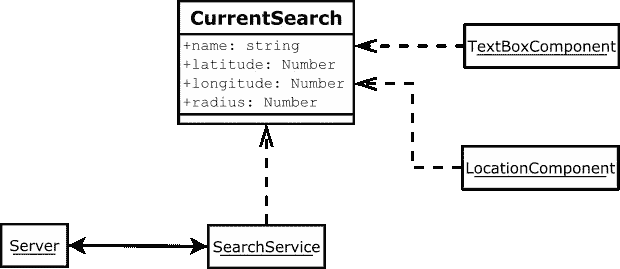
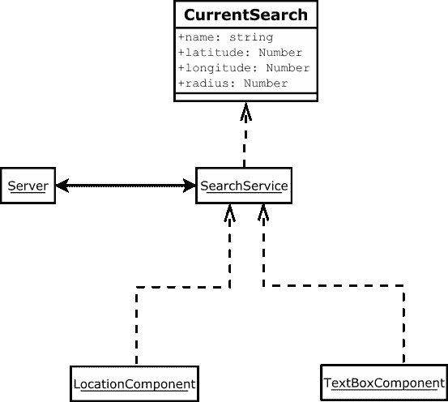
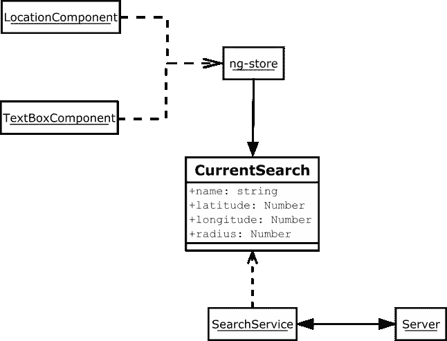
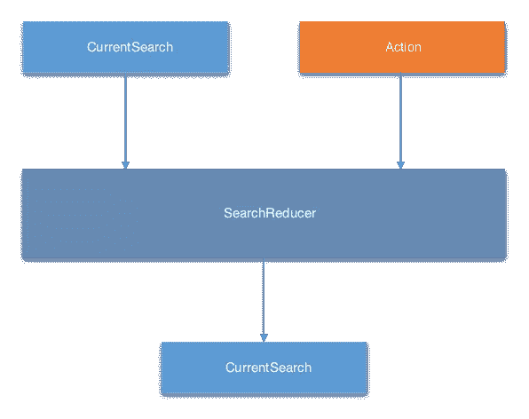

# 使用 ngrx/store 管理 Angular 2 应用中的状态

> 原文：<https://www.sitepoint.com/managing-state-angular-2-ngrx/>

*用 ngrx/store 管理 Angular 2 应用中的状态由[塞巴斯蒂安·塞茨](https://www.sitepoint.com/community/users/m3g4p0p)、[马克·布朗](https://www.sitepoint.com/author/mbrown)和[维尔丹·软迪奇](https://www.sitepoint.com/author/vildansoftic)进行同行评审。感谢 SitePoint 的所有同行评审员使 SitePoint 的内容尽可能做到最好！*


我们为 web 应用程序构建的组件通常包含状态。连接组件可能导致共享可变状态:这很难管理，并导致不一致。如果我们在一个地方改变状态，让消息来做剩下的事情，会怎么样？ [ngrx/store](https://github.com/ngrx/store) 是使用 RxJS 的 Angular 的 Redux 实现，它将这个强大的模式带入 Angular 世界。

在本文中，我将介绍共享可变状态的问题，并展示如何使用 ngrx/store 库将单向数据流架构引入 Angular 2 应用程序来解决这个问题。同时，我们将构建一个[示例应用程序](https://sitepoint-editors.github.io/one-source-of-truth-for-angular/)，允许用户使用 YouTube API 搜索视频。

> **注意:**你可以在[这个 GitHub repo](https://github.com/sitepoint-editors/one-source-of-truth-for-angular) 中找到这篇文章附带的代码。

## 并发的问题是

构建相互通信的组件是一个典型的涉及状态的任务。我们经常需要更新不同角度的组件与同一状态的交互:当不止一个组件访问并修改该状态时，我们称之为**共享可变状态**。

为了理解为什么共享的可变状态代表一个问题，考虑一台被两个不同的用户使用的计算机。有一天，第一个用户将操作系统更新到最新版本。一天后，第二个用户打开计算机，感到困惑，因为用户界面没有明显的原因就改变了。发生这种情况是因为两个用户可以修改同一个对象(在这个例子中是计算机),而不需要彼此交谈。

## 实践中的共享可变状态

共享状态的一个常见例子是我们正在执行的动作的属性集。如果我们正在执行一个数据库搜索，我们称这个特性集为**当前搜索**。从现在开始，我将把这样的集合称为**搜索对象**。

想象一下这样一个页面，它允许您按名称搜索某样东西，还提供了按地理位置限制搜索的可能性。该页面将至少有两个不同的组件，可以修改当前的搜索属性。最有可能的是，有一个服务负责执行实际的搜索。

规则是:

*   如果名称字段为空，则清除搜索结果
*   如果只定义了一个名称，则按名称执行搜索
*   如果定义了名称和位置，则按名称和位置执行搜索
*   为了按位置搜索，必须提供坐标(经度/纬度)和半径

## 可用的方法

处理**共享可变状态**问题的一种方法是在组件和服务之间来回转发搜索对象，允许每个组件修改它。

这将需要更加冗长和复杂的测试，非常耗时并且容易出错:对于每个测试，您都需要模拟对象，只改变一些属性来测试特定的行为。所有这些测试和模拟也需要维护。



此外，与状态交互的每个组件都需要承载这样做的逻辑。这损害了组件的可重用性，违反了 [DRY 原则](https://en.wikipedia.org/wiki/Don%27t_repeat_yourself)。

另一种方法是将搜索对象封装到服务中，并公开一个基本的 API 来修改搜索值。尽管如此，该服务将负责三件不同的事情:

*   执行搜索
*   保持状态一致
*   应用参数规则

与[单一责任原则](https://en.wikipedia.org/wiki/Single_responsibility_principle)相去甚远，服务现在已经变成了应用程序本身，不能轻易重用。

即使将服务分割成更小的服务，仍然会导致不同的服务或组件修改相同的数据。



此外，组件正在使用服务，因此没有服务就不能使用它们。

另一种不同且常用的模式是将所有逻辑放入应用层，但我们最终仍会有大量负责保证状态一致性的代码。

我的观点是，应用层是真正与众不同的特征，应该只应用规则。其他任务，即消息传递、存储和事件，可以由基础设施来处理。

## Redux 方法

这种方法基于脸书近年来开发的 [Flux 应用架构](https://facebook.github.io/flux/docs/overview.html)模型，以及 [Elm 架构](http://guide.elm-lang.org/architecture/)。

在一些实现中，AngularJS 开发人员也可以使用这种模式。在本教程中，我们将使用 [ngrx/store](https://github.com/ngrx/store) ，因为它是`ngrx`包的一部分，而`ngrx`包是[反应式扩展](https://github.com/Reactive-Extensions/RxJS)的官方 Angular 2 包装器。此外，它使用*可观察值*实现 Redux 模式，从而与 Angular 2 架构保持一致。

它是如何工作的？

1.  组件发出动作
2.  动作被分派到状态存储
3.  reducer 函数基于这些动作派生出新的状态
4.  订户被通知新的状态

因此，我们可以分担责任，因为 ngrx/store 负责状态一致性，而 RxJS 负责消息总线。



*   我们的组件不知道服务或应用程序逻辑:它们只是发出动作。
*   我们的服务没有状态:它只是基于来自外部的搜索对象执行搜索。
*   我们的应用程序组件只是监听状态变化并决定做什么。
*   新条目 reducer 实际上会对动作做出反应，在必要时修改状态。
*   突变的一个切入点。

## 示例:YouTube 搜索组件

我们将编写一个小应用程序来使用 YouTube API 搜索视频。你可以看到下面运行的[最终演示](https://sitepoint-editors.github.io/one-source-of-truth-for-angular/):

[https://sitepoint-editors.github.io/one-source-of-truth-for-angular](https://sitepoint-editors.github.io/one-source-of-truth-for-angular)

### 克隆 starter repo

克隆存储库的 [start-here](https://github.com/sitepoint-editors/one-source-of-truth-for-angular/releases/tag/tutorial-start) 版本。在`app/`文件夹中，我们将找到我们将要工作的实际应用程序文件:

```
project
├── app
│   ├── app.module.ts
│   ├── app.component.ts
│   └── main.ts
├── index.html
├── LICENSE
├── package.json
├── README.md
├── systemjs.config.js
├── tsconfig.json
└── typings.json 
```

现在，在`app`文件夹下，我们创建两个名为`models`和`components`的文件夹。我们需要定义的第一件事是要使用的模型。

### 定义模型

假设需要一个搜索查询，我们需要决定如何表示它。这将允许通过**名称**和**位置**进行搜索。

```
/** app/models/search-query.model.ts **/
export interface CurrentSearch {
    name: string;
    location?: {
        latitude: number,
        longitude: number
    },
    radius: number
} 
```

因为位置是一个选项，所以它被定义为搜索对象的可选属性。

还需要搜索结果的表示。这将包括视频的 **id** 、**标题**和**缩略图**，因为这将在 UI 中显示。

```
/** app/models/search-result.model.ts*/
export interface SearchResult {
    id: string;
    title: string;
    thumbnailUrl: string;
} 
```

### 搜索框组件

第一个搜索参数是“按名称”，因此必须创建一个组件，该组件将:

*   显示文本输入
*   每次修改文本时调度一个操作

让我们用组件的定义在`app/components`下创建一个新文件:

```
/** app/components/search-box.component.ts **/
@Component({
    selector: 'search-box',
    template: ` <input type="text" class="form-control" placeholder="Search" autofocus> `
}) 
```

该组件还需要半秒钟的动作去抖，以避免在快速键入时触发多个动作:

```
export class SearchBox implements OnInit {

    static StoreEvents = {
        text: 'SearchBox:TEXT_CHANGED'
    };

    @Input()
    store: Store<any>;

    constructor(private el: ElementRef) {}

    ngOnInit(): void {
        Observable.fromEvent(this.el.nativeElement, 'keyup')
            .map((e: any) => e.target.value)
            .debounceTime(500)
            .subscribe((text: string) =>
                this.store.dispatch({
                    type: SearchBox.StoreEvents.text,
                    payload: {
                        text: text
                    }
                })
            );
    }

} 
```

这可以分解如下:为了从 DOM 事件中获得一个`Observable`,助手函数`Observable.fromEvent(HTMLNode, string)`用于将输入转换成字符串流，然后由 RxJS 工具包处理。

注意作为输入的`store`的定义。它代表我们的调度员来传递动作。组件不知道消费者、搜索过程或服务；它只是处理输入字符串并分派它。

注意 dispatcher 是如何使用的:它的签名是`dispatch(action: Action): void`，其中`Action`是一个带有强制`type`字段(一个字符串)和可选`payload`的对象。由于动作的类型是`string`，我更喜欢将它们定义为组件中的常量，并使用适当的名称空间，这样该动作的任何消费者都可以导入并匹配它们。

### 接近选择器组件

提供的第二种类型的搜索控制是“按地理位置”，由此提供纬度和经度坐标。因此，我们需要一种能够:

*   显示复选框以打开本地化
*   每次修改本地化时调度一个操作
*   显示半径的范围输入
*   每次半径改变时调度一个动作

逻辑还是一样的:显示一个输入，触发一个动作。

```
/** app/components/proximity-selector.component.ts **/
@Component({
    selector: 'proximity-selector',
    template: ` <div class="input-group">
        <label for="useLocation">Use current location</label>
        <input type="checkbox"
            [disabled]="disabled"
            (change)="onLocation($event)">
    </div>
    <div class="input-group">
        <label for="locationRadius">Radius</label>
        <input type="range" min="1" max="100" value="50"
            [disabled]="!active"
            (change)="onRadius($event)">
    </div> `
}) 
```

它非常类似于前面的搜索框组件。尽管如此，模板是不同的，因为现在必须显示两个不同的输入。此外，如果位置关闭，我们希望半径被禁用。

实现如下:

```
/** app/components/proximity-selector.component.ts **/
export class ProximitySelector {

    static StoreEvents = {
        position: 'ProximitySelector:POSITION',
        radius: 'ProximitySelector:RADIUS',
        off: 'ProximitySelector:OFF'
    };

    @Input()
    store: Store<any>;

    active = false;

    // put here the event handlers

} 
```

现在，这两个事件处理程序需要实现。首先将处理复选框:

```
/** app/components/proximity-selector.component.ts **/
export class ProximitySelector {
    // ...

    onLocation($event: any) {
        this.active = $event.target.checked;
        if (this.active) {
            navigator.geolocation.getCurrentPosition((position: any) => {
                this.store.dispatch({
                    type: ProximitySelector.StoreEvents.position,
                    payload: {
                        position: {
                            latitude: position.coords.latitude,
                            longitude: position.coords.longitude
                        }
                    }
                });
            });
        } else {
            this.store.dispatch({
                type: ProximitySelector.StoreEvents.off,
                payload: {}
            });
        }
    }
} 
```

第一个必要步骤是检测定位是打开还是关闭:

*   如果打开，当前位置将被调度
*   如果关闭，将发送相应的消息

这一次使用了回调，因为数据不像数字流，而是单个事件。

最后，添加了半径的处理程序，不管位置的状态如何，都只是分派新值，因为我们有了`disabled`属性。

```
/** app/components/proximity-selector.component.ts **/
export class ProximitySelector {
    // ...

    onRadius($event: any) {
        const radius = parseInt($event.target.value, 10);
        this.store.dispatch({
            type: ProximitySelector.StoreEvents.radius,
            payload: {
                radius: radius
            }
        });
    }
} 
```

### 该减速器

与调度员一起，这是新系统的核心。缩减器是处理动作和当前状态以产生新状态的功能。

reducers 的一个重要属性是它们是可组合的，允许我们在保持状态原子性的同时将逻辑分割到不同的函数中。正因为如此，它们需要是纯函数:换句话说，它们没有副作用。

这给了我们另一个重要的推论:测试一个纯函数是微不足道的，因为给定相同的输入会产生相同的输出。

我们需要的缩减器将处理组件中定义的动作，为应用程序返回一个新的状态。这里有一个图解说明:



减速器应该在一个新文件中创建，在`app/reducers/`下:

```
/** app/components/search.reducer.ts **/
export const SearchReducer: ActionReducer<CurrentSearch> = (state: CurrentSearch, action: Action) => {
    switch (action.type) {

        // put here the next case statements

        // first define the default behavior
        default:
            return state;
    }
}; 
```

我们必须处理的第一个动作是无动作:如果动作不影响状态，reducer 会不加修改地返回它。这对于避免破坏模型非常重要。

接下来，我们处理文本更改操作:

```
/** app/components/search.reducer.ts **/
    switch (action.type) {
        case SearchBox.StoreEvents.text:
            return Object.assign({}, state, {
                name: action.payload.text
            });
        // ...
   } 
```

如果动作是由`SearchBox`组件公开的，我们知道有效载荷包含新的文本。所以我们只需要修改`state`对象的`text`字段。

根据[最佳实践](http://redux.js.org/docs/Troubleshooting.html#never-mutate-reducer-arguments)，我们不改变状态，而是创建一个新的状态并返回它。

最后，处理与本地化相关的操作:

*   对于`ProximitySelector.StoreEvents.position`,我们需要更新位置值
*   对于`ProximitySelector.StoreEvents.radius`,我们只需要更新半径值
*   如果消息是`ProximitySelector.StoreEvents.off`，我们只需将位置和半径设置为`null`

```
/** app/components/search.reducer.ts **/
    switch (action.type) {
        case ProximitySelector.StoreEvents.position:
            return Object.assign({}, state, {
                location: {
                    latitude: action.payload.position.latitude,
                    longitude: action.payload.position.longitude
                }
            });
        case ProximitySelector.StoreEvents.radius:
            return Object.assign({}, state, {
                radius: action.payload.radius
            });
        case ProximitySelector.StoreEvents.off:
            return Object.assign({}, state, {
                location: null
            });
        // ...
    } 
```

### 将它们连接在一起

此时，我们有两个组件调度动作和一个 reducer 来处理消息。下一步是连接所有元件并进行测试。

首先，让我们将新组件导入应用程序模块`app/app.module.ts`:

```
/** app/app.module.ts **/
import {ProximitySelector} from "./components/proximity-selector.component";
import {SearchBox} from "./components/search-box.component";
import {SearchReducer} from "./reducers/search.reducer";

// the rest of app component 
```

接下来，我们修改模块的元数据，将`SearchBox`和`ProximitySelector`作为指令包含进来:

```
/** app/app.module.ts **/
@NgModule({
    // ... other dependencies
    declarations: [ AppComponent, SearchBox, ProximitySelector ],
    // ...
}) 
```

然后，我们需要提供一个存储，负责调度动作，并根据状态和动作运行 reducers。这可以使用`StoreModule`模块的`provideStore`功能创建。我们传递一个带有商店名称和处理它的 reducer 的对象。

```
/** app/app.module.ts **/
// before the @Component definition
const storeManager = provideStore({ currentSearch: SearchReducer }); 
```

现在，我们将商店经理放在提供商列表中:

```
/** app/app.module.ts **/
@NgModule({
    imports:      [ BrowserModule, HttpModule, StoreModule, storeManager ],
    // ...
}) 
```

最后，但非常重要的是，我们需要将组件放入我们的模板中，将`store`作为输入传递给它们:

```
/** app/app.component.ts **/
@Component({
    // ...same as before
    template: ` <h1>{{title}}</h1>
    <div class="row">
        <search-box [store]="store"></search-box>
        <proximity-selector [store]="store"></proximity-selector>
    </div>
    <p>{{ state | json }}</p> `
}) 
```

需要更新该类以符合新模板:

```
/** app/app.component.ts **/
export class AppComponent implements OnInit {

    private state: CurrentSearch;
    private currentSearch: Observable<CurrentSearch>;

    constructor(
        private store: Store<CurrentSearch>
    ) {
        this.currentSearch = this.store.select<CurrentSearch>('currentSearch');
    }

    ngOnInit() {
        this.currentSearch.subscribe((state: CurrentSearch) => {
            this.state = state;
        });
    }
} 
```

在这里，我们定义了一个私有属性，它表示要公开的状态(对于 UI)。store 服务被注入到我们的构造函数中，并用于获取一个`currentSearch`的实例。`OnInit`接口用于获得 init 阶段的钩子，允许组件使用 store 的实例订阅状态更新。

## 下一步是什么？

现在可以实现一个简单的服务，它接受一个`CurrentSearch`并调用后端 API(例如，可以是 [YouTube](https://developers.google.com/youtube/v3/) ，就像在[真实例子](https://sitepoint-editors.github.io/one-source-of-truth-for-angular/)中一样。您可以更改服务，而无需更改任何组件或应用程序的实现。

此外，`ngrx`并不局限于商店:像`effects`和`selectors`这样的工具可以用来处理更复杂的场景，比如处理异步 HTTP 请求。

## 结论

在本教程中，我们已经看到了如何使用 [ngrx/store](https://github.com/ngrx/store) 和 [RxJs](https://github.com/Reactive-Extensions/RxJS) 在 Angular 2 中实现一个类似 Redux 的流。

底线是，由于突变是许多问题的根源，将它们放在一个单一的、受控的地方将有助于我们编写更易维护的代码。我们的组件变得与逻辑分离，应用程序不知道它们行为的细节。

值得一提的是，我们使用了一种不同于官方 [ngrx 文档](https://gist.github.com/btroncone/a6e4347326749f938510#utilizing-container-components)中所示的模式，因为组件直接分派动作，而没有使用事件和额外的一层*智能组件*。关于最佳实践的讨论仍在继续。

你试过 ngrx 了吗，还是更喜欢 Redux？我很想听听你们的想法！

## 分享这篇文章