# 营销自动化:促进增长的最佳人工智能工具

> 原文：<https://www.sitepoint.com/marketing-automation-ai-tools-boost-growth/>

最好的人工智能营销自动化工具是那些让营销人员能够轻松创建和优化内容、增加销售额、分析数据、改善营销工作以及宣传你的业务的工具。

让我们来看看一些先进的人工智能(AI)工具和平台，它们可以帮助您的企业充分发挥潜力。

## 1.贾维斯（m.）

对于营销人员来说，撰写引人入胜的营销文案绝非易事。最好的内容营销者有一套用语言帮助他们说服顾客购买他们的商品和服务的方法。

使用先进的人工智能营销工具，如 [Jarvis AI](https://blogstalgia.com/jarvis-ai-review/) ，您可以为广告、电子邮件、登录页面、社交媒体帖子、电子商务产品描述和博客帖子生成高转化率的文案，而无需花费数小时为每个单词烦恼或花费大量金钱聘请专业文案。

这个人工智能工具使用机器学习技术和由埃隆·马斯克(Elon Musk)共同创立的人工智能研究实验室 [OpenAI](https://openai.com/about/) 创建的 GPT-3 模型来生成类似人类的文本。

它包括流行的营销框架模板，如 AIDA 和 PAS。你所需要做的就是添加你的公司或产品名称、产品描述和语气来生成你的营销信息。

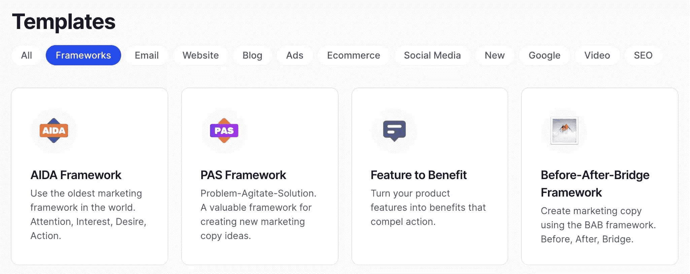

下面是一个用 PAS 框架为一个虚构的电动汽车公司制作的营销文案的例子。

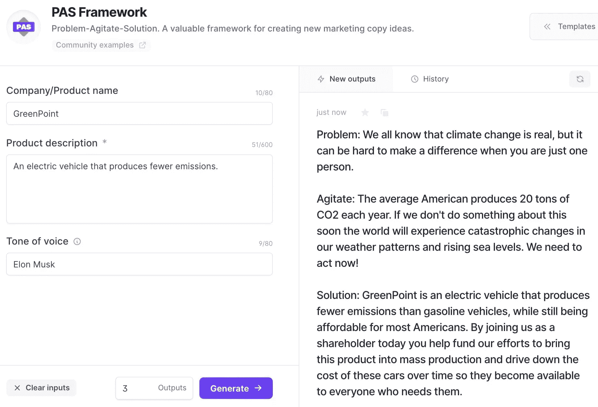

### 贾维斯特征

对于那些处理电子商务商店的营销人员来说，该工具还可以生成产品描述、功能要点列表以及 SEO 产品页面标题和元描述。

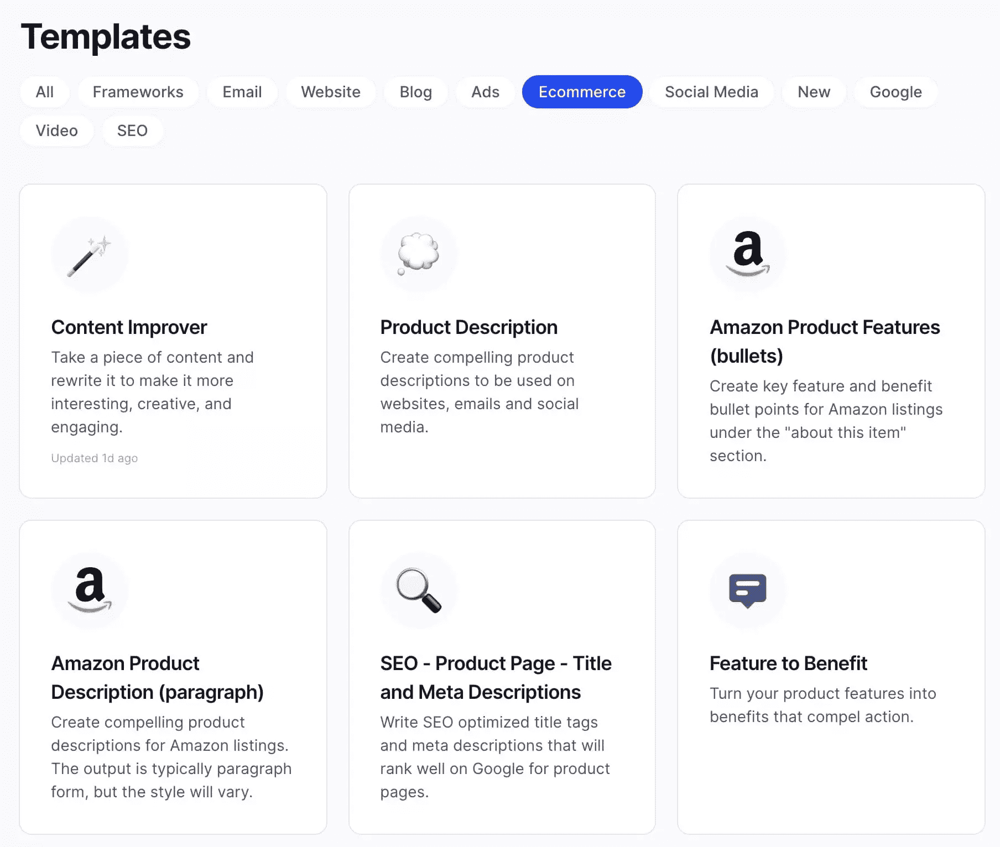

谈到[电子邮件营销自动化](https://www.sitepoint.com/automated-email-marketing-getting-started/)，许多营销人员使用 ConvertKit 和 Mailchimp 等电子邮件服务提供商(esp)向潜在客户发送一系列自动化电子邮件。有了 Jarvis，你基本上可以在不需要任何文案知识的情况下生成电子邮件的内容。

这个人工智能软件还可以帮助自动化你的内容营销策略的一部分，根据 Statista 的一项调查，这是最有效的数字营销技术。

例如，你可以使用 Jarvis 的长格式编辑器，给它一些命令，比如“写关于最好的 HTML 和 CSS 书籍的博文标题”或者“为一篇关于学习 HTML 和 CSS 的文章写一个介绍段落”，它就会为你生成这些命令。

关于如何用 AI 写长篇博文的更深入的指导，你可以探索这个 [Jarvis 教程](https://blogstalgia.com/write-blog-posts-with-jarvis/)。

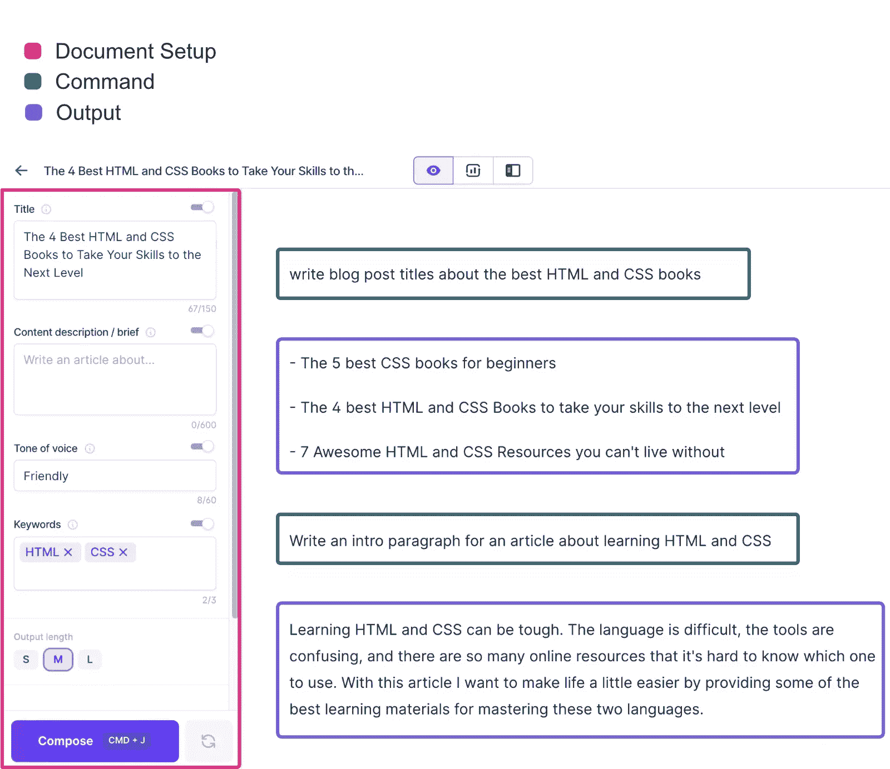

### 贾维斯食谱

Jarvis 有一套预制的工作流，称为“Recipes ”,其中包含多个命令，可以帮助您加快内容创建过程。

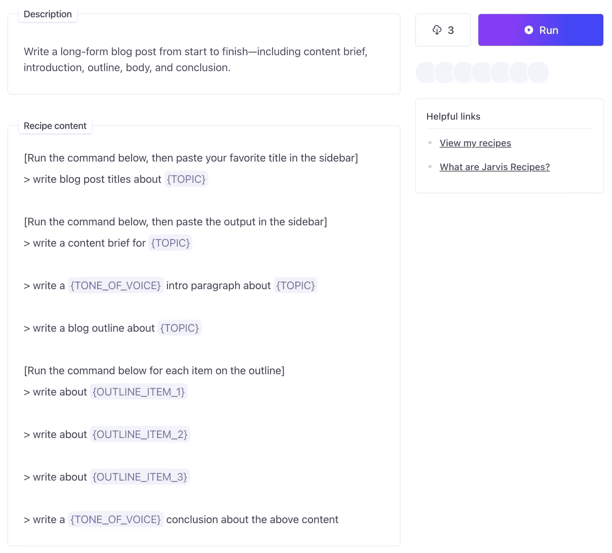

例如，你可以按照命令运行[写博客](https://community.jarvis.ai/recipes/321f6174-b233-47cd-8a21-29aee00e016f)、[重写内容](https://community.jarvis.ai/recipes/b131075f-6d57-48c0-84c8-c46a9cc9aa78)和[制作推广邮件](https://community.jarvis.ai/recipes/d00b62b9-a529-4285-ac9a-a291998c7866)的食谱。

对于那些做 Pinterest 和社交媒体营销的人来说，你可以为你的 Instagram 帖子、脸书帖子和 Pinterest Pins 创建描述。

## 2.冲浪运动员

毫无疑问，SEO 是数字营销不可或缺的一部分。它有能力[增加你的网站流量](https://www.sitepoint.com/increase-web-traffic-using-automation/)、转化率和[品牌知名度](https://www.sitepoint.com/creating-a-brand-identity-20-questions/)。

像 [Surfer](https://surferseo.com/) 这样的人工智能工具，可以让你利用自然语言处理(NLP)进行更精准的 SEO 分析。

自从推出 [BERT](https://ai.googleblog.com/2018/11/open-sourcing-bert-state-of-art-pre.html) 算法更新以来，谷歌一直更加关注识别用户意图和关键词使用的上下文，而不是简单地查看每个单独的关键词。

Surfer 通过 Google NLP API 将此添加到他们的平台中。因此，你可以很容易地检查谷歌认为哪些单词、短语和情感是重要的。

有了这个人工智能软件平台，你可以根据关键词或你的领域来规划内容。

### 基于关键词的内容规划

当添加您的主要关键字或博客利基时，Surfer 将使用谷歌数据和 Surfer 的 NLP 算法生成几个主题集群。下面是为关键字“vanilla javascript”生成的一些主题集群的示例。

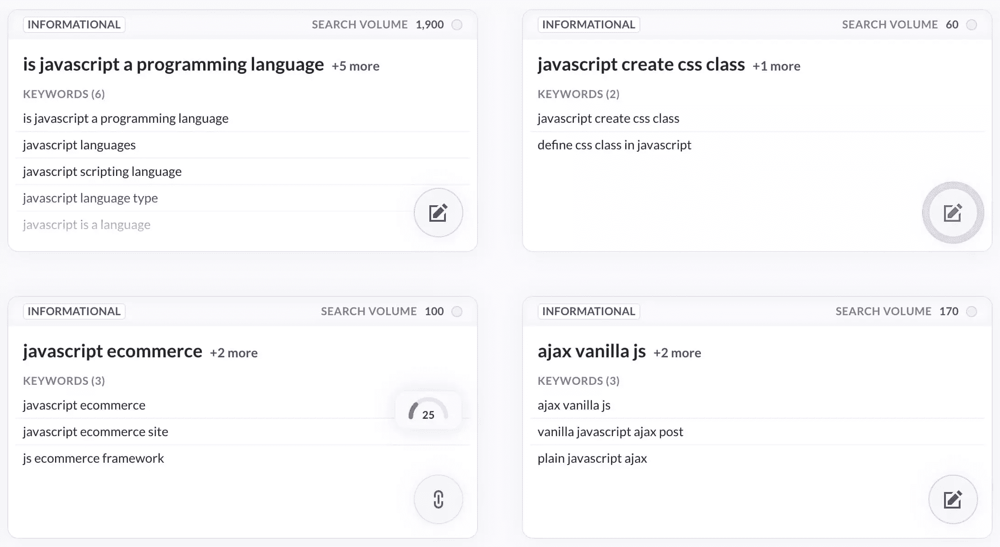

每个主题集群将包括一些相关的目标关键词以及它们的搜索量和预计的总流量。这些框可以用来创建新的博客文章。

### 基于领域的内容规划

当涉及到使用你的域名来规划内容时，Surfer 会向你显示一个你排名但没有在你的文章中使用的关键词列表，以及你对每个关键词的排名，它们带来的流量和每月的搜索量。

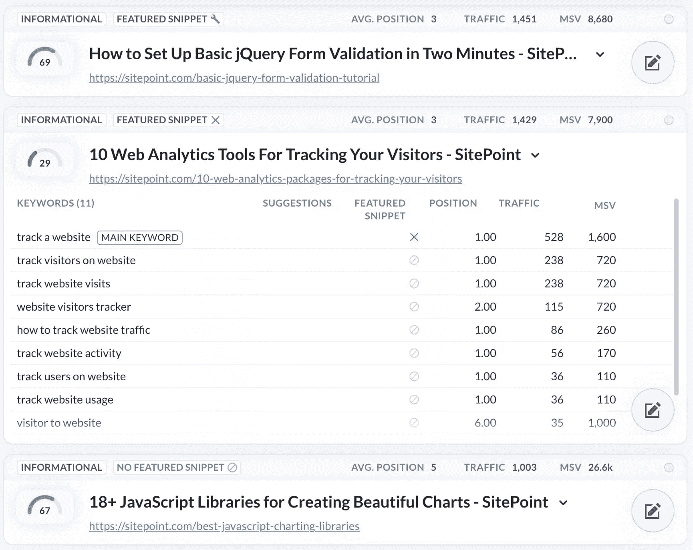

### 冲浪内容编辑器

Surfer 的主要功能之一是它的内容编辑器，它包括你的内容在搜索引擎优化方面的实时更新。

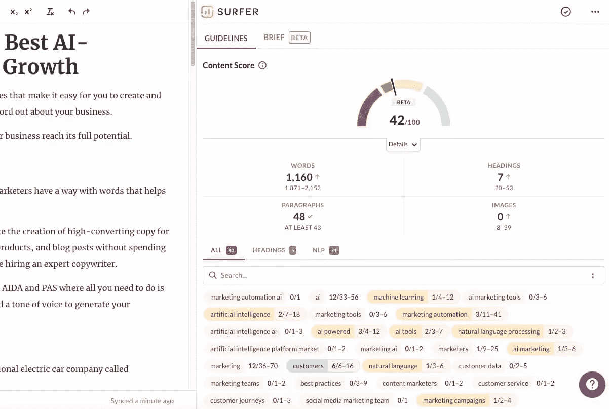

在内容编辑器中，您将能够看到:

*   要包含的 NLP 短语以及使用它们的频率
*   你的博客文章应该有多长
*   你应该使用多少标题、图片和段落

如果你决定使用像 Jarvis 这样的人工智能工具，这两者也集成在一起，所以你可以在 Jarvis 的长格式编辑器中看到你的内容得分，而不是必须将你的文章粘贴回 Surfer 中。

对于拥有大型营销团队的组织，您可以使用文档共享功能来简化协作。

## 3.聊天机器人

如今，人们希望能够以自己的方式与企业沟通，无论是通过短信、社交网络还是其他数字渠道，他们希望这种情况能尽快发生。

自动化这一过程的一个很好的方法是使用聊天机器人让你的业务更容易访问。

在 Statista 进行的一项调查中， [40%的客户](https://www.statista.com/statistics/1042604/united-stated-share-internet-users-who-used-chatbots-industry/)提到他们已经使用人工智能聊天机器人与零售业进行互动。在另一项调查中， [78%的组织](https://www.statista.com/statistics/1025267/ai-chatbots-usage-in-customer-service-organizations/)表示他们在简单的场景中使用聊天机器人进行自助服务。

像[聊天机器人](https://chatbot.com/)这样的人工智能工具可以帮助营销人员提供个性化的客户服务，回答关于产品的问题，生成和细分线索，并收集客户的联系信息。

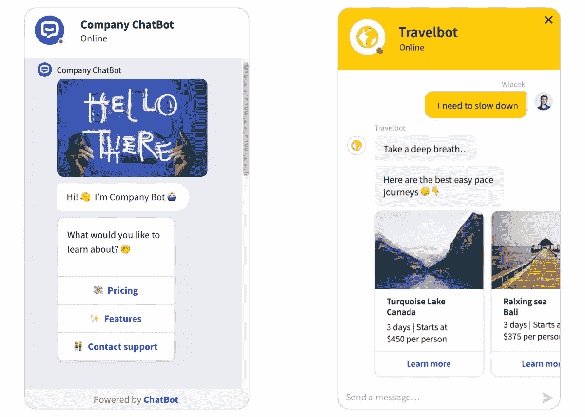

它使用自然语言处理来解释人类语音，并提供量身定制的响应，使用机器学习来分析用户输入并不断提高性能。

您可以使用无代码拖放构建器轻松构建您的对话工作流。

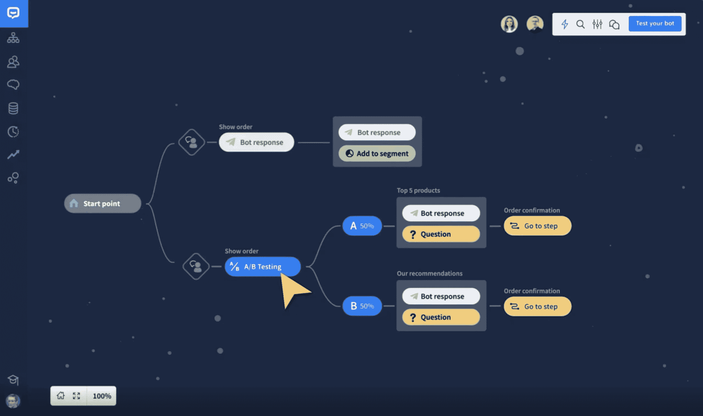

他们还有多种模板、机器人响应格式和动作来帮助您创建引人入胜的客户体验。

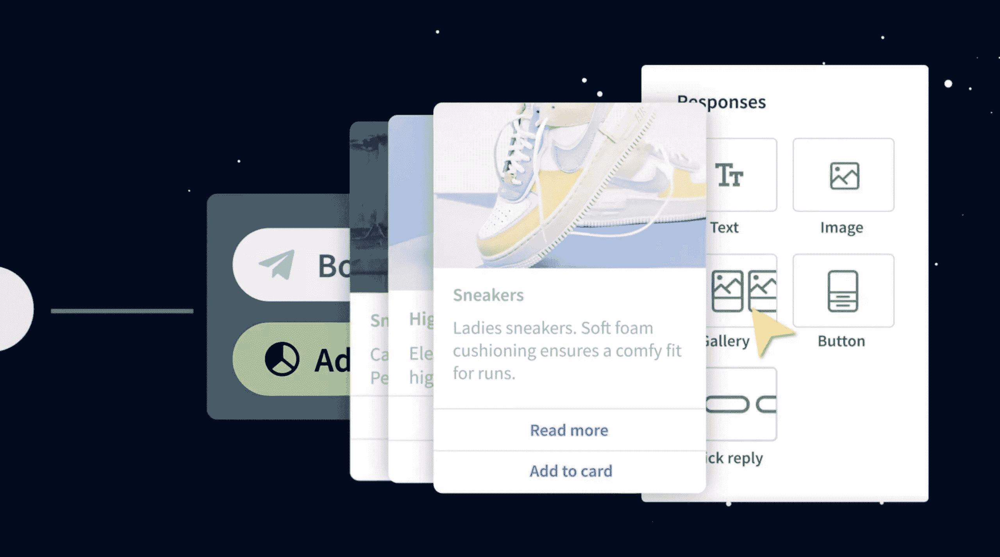

这个人工智能工具可以放在你的网站上，或者与 LiveChat、Facebook Messenger 和 Slack 连接。

## 4.蜡笔

随着每个人和他们的狗开始创业，想要脱颖而出真的很难。

但并非一切都是坏消息。由于有如此多的竞争对手，所以比以往任何时候都更容易看到什么对他们有效，并将其应用到您自己的业务中。这样，你就不必浪费时间去创造和推广那些可能卖得不好的产品或服务，或者花时间在那些你的观众不喜欢的社交平台上。

像[蜡笔](https://www.crayon.co/)这样的人工智能工具可以帮助你做到这一点。

蜡笔是一个竞争情报工具，可以让你跟踪你的竞争对手在他们的网站上做的一切。

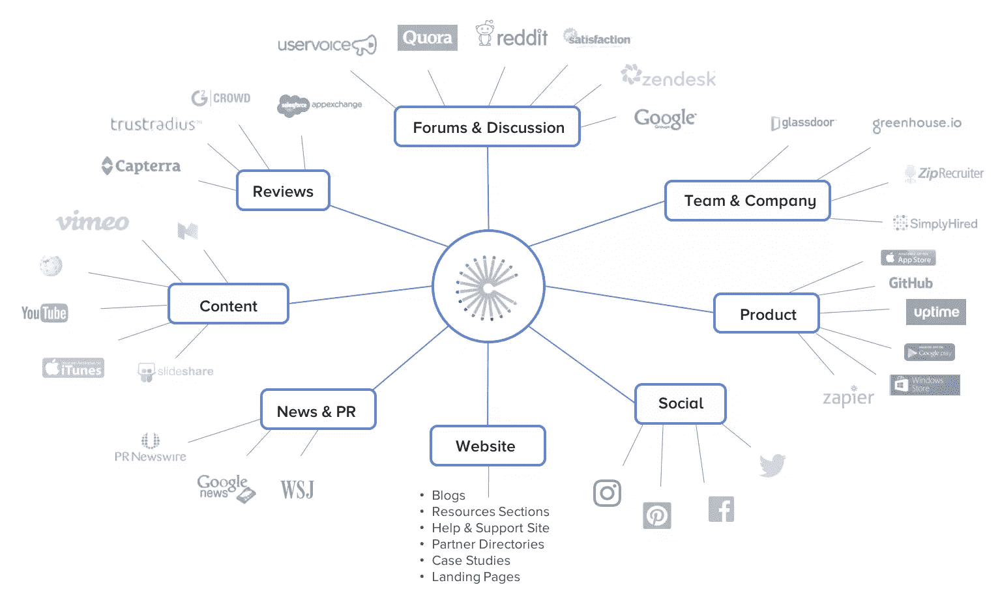

例如，您可以看到产品和价格变化、员工评论、发起的营销活动、发布的视频内容等等。

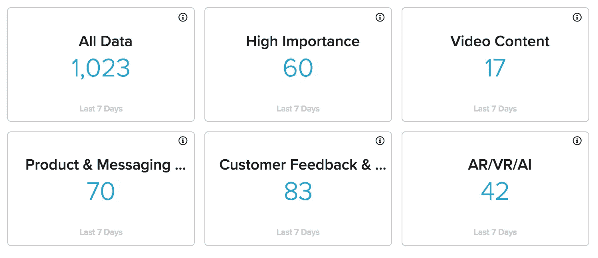

作为营销人员，您可以在一个中央平台上将自动化智能与您企业的研究和知识相结合，以进行协作和分析。

## 5.Rasa.io

如果你从事电子邮件营销已经有一段时间了，你可能已经在细分你的列表来创建[有针对性的电子邮件活动](https://www.sitepoint.com/how-to-use-analytics-to-create-targeted-email-campaigns/)。

然而，您可以通过 [Rasa.io](https://rasa.io/) 将个性化更进一步。

这种营销自动化工具使用人工智能来获取您的简讯中每个订户的先前行为，以确定哪篇文章与每个读者最相关。

不同于每个人都收到同一份时事通讯，你的每个订户都会得到一份根据他们独特兴趣定制的个性化版本。可以把它想象成通过分析顾客行为来划分一个“群体”。

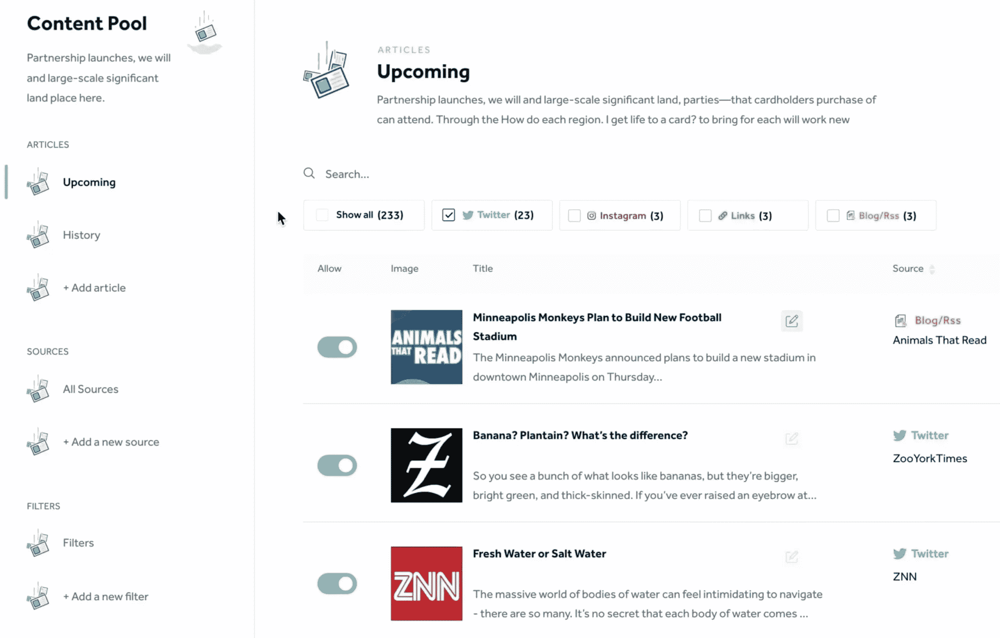

例如，如果你有一个健康网站，你可能会给每个对食谱感兴趣的人发送相同的电子邮件，给每个对锻炼感兴趣的人发送相同的电子邮件。

有了智能简讯技术，你可以根据每个人的兴趣向他们发送独特的食谱内容。这可能是 keto 晚餐食谱，keto 甜点食谱，或旧石器食谱。

## 6.约特波

人们更容易信任和购买别人推荐的东西，这并不奇怪。研究表明，大约 70%的网上购物者在做出购买决定前通常会阅读一到六条顾客评论。

[Yotpo](https://www.yotpo.com/) 是一款用户生成的营销自动化软件，它使用 AI 和机器学习技术来分析你的客户评论，以帮助你找到改进的空间，做出更明智的商业决策。

它确定了客户提到的关于你的产品的关键话题以及他们对你的产品的总体看法。Yotpo 从过去的评论中提取相关信息，并将其呈现给潜在客户，以提高销售额。

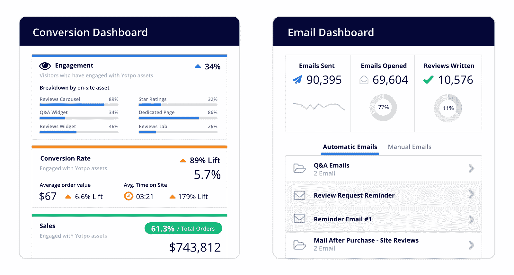

它还允许您轻松收集客户评论和评级，显示客户照片和视频，通过短信与客户联系，以及管理客户数据。

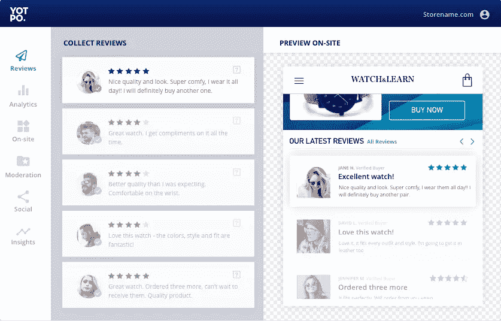

社交证明不仅是最有效的营销方式之一，也是最廉价的方式之一。基本上，你让你的[客户为你做营销](https://blog.lifterlms.com/student-marketing/)。

## 7.弗雷斯

人们在写内容时最常见的 SEO 错误之一是过于关注关键词，以至于忘记了优化他们的大纲。

Frase 是一种人工智能营销工具，可以让关键字研究和创建 SEO 友好的博客文章变得轻而易举。

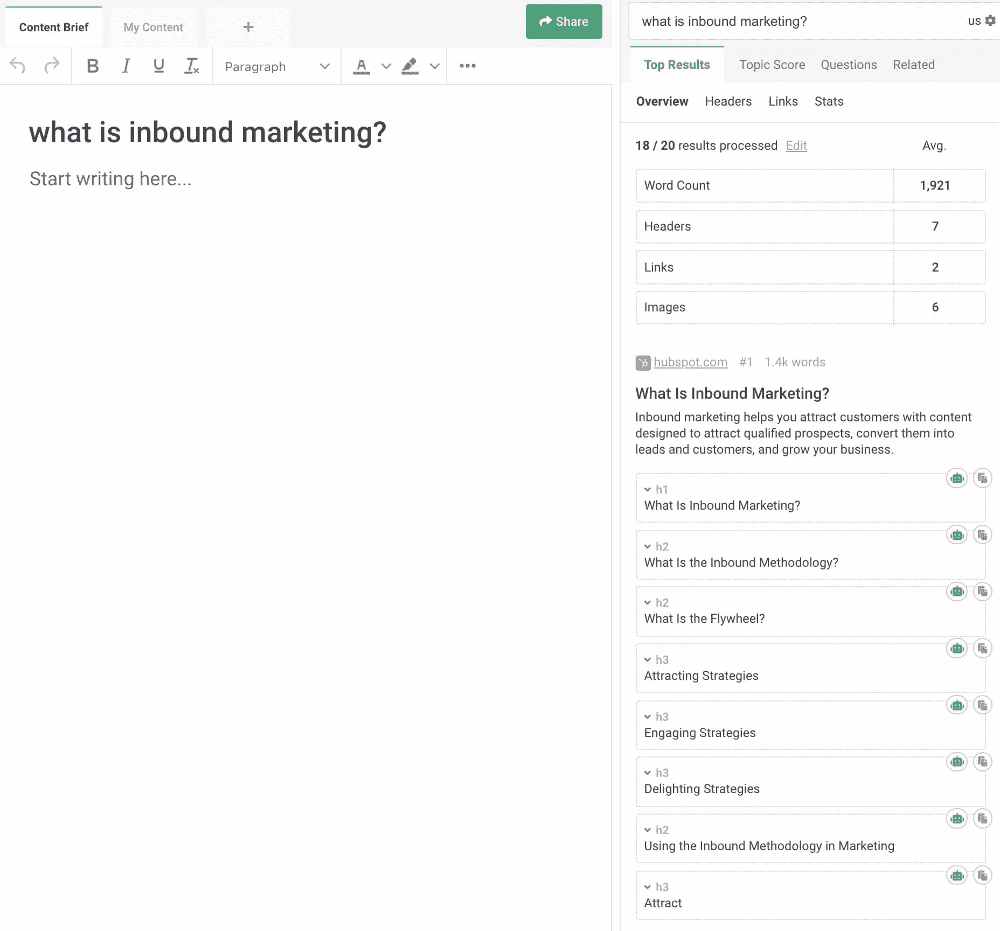

当计划搜索优化的博客文章大纲时，营销人员通常使用谷歌自动完成功能，并查看谷歌的“人们也问”和“相关搜索”部分。

这一过程可能很耗时，而且不如使用人工智能工具来提取其他相关短语和问题来得有效。弗雷斯不仅从谷歌，还从 Quora 和 Reddit 上得到这些问题。

例如，Frase 使用 AI 自动分析热门搜索结果，并为您的主要关键字生成智能大纲。

Frase 还利用 NLP 技术来确定您的博客帖子需要解决的每个主题，以便在谷歌搜索引擎结果页(SERPs)中排名更高。

## 8.Phrasee

有可能你的收件箱里有数百封未读邮件——如果你是一个优秀的人，甚至可能有数千封。

无论邮件内容有多好，如果主题不够吸引人，它也不会被打开。不出所料，[研究](https://www.statista.com/statistics/452690/subject-line-personalization-influence-email-open-rate-industry/)显示，电子邮件中的主题个性化可以显著提高打开率。

Phrasee 是可以帮助营销人员解决这个问题的人工智能营销工具之一。

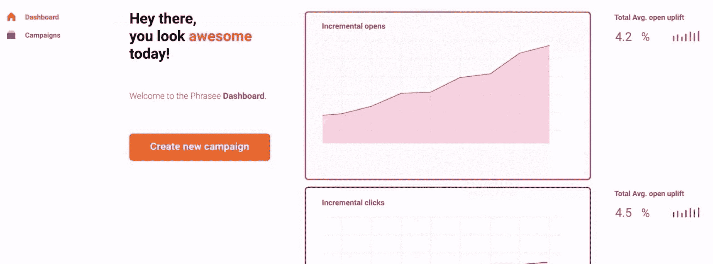

Phrasee 软件使用人工智能技术为你的电子邮件通讯创建最有效的主题行。其基于人工智能的自然语言生成系统使用数据驱动的见解来创建数百万份符合您品牌基调的原始副本。

然而，这项技术不仅仅适用于电子邮件。你也可以将它用于社交媒体活动、脸书广告和 Instagram 广告。

它通过优化您在整个客户旅程和数字品牌渠道中使用的语言来帮助增强您的客户体验，Phrasee 称之为“品牌语言优化”。

## 9.内脏感觉

如果你在半夜发了一封邮件，很有可能在第二天早上收件人准备阅读邮件的时候，邮件就被藏在收件人的收件箱里了。

因此，在错误的时间发送电子邮件会显著降低你的打开率，这并不奇怪。

[第七感](https://www.theseventhsense.com/)是一款营销自动化工具，可以分析营销自动化平台中每个人的历史参与模式。它被设计成只与 HubSpot 和 Marketo 一起工作。

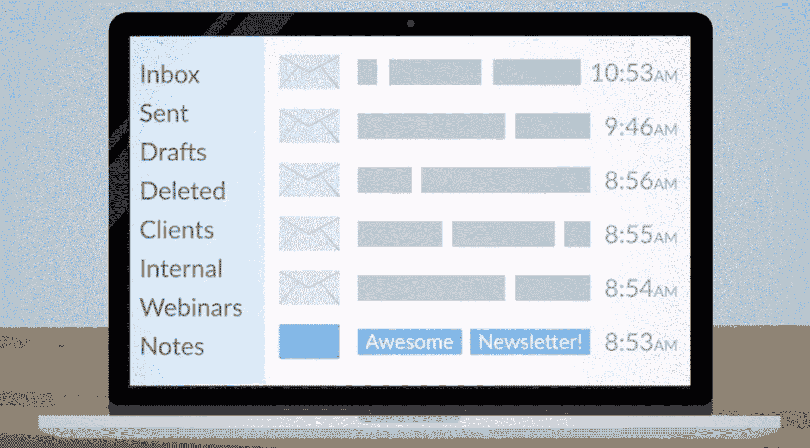

然后，它使用这些客户数据来建立一个预测分析模型，以预测您列表中的每个订户何时最有可能使用您的电子邮件。

## 营销人工智能常见问题

既然你已经探索了一些人工智能营销工具来使你的营销更有效，让我们来回答一些关于人工智能的常见问题。

### 1.什么是人工智能？

人工智能是一种强调创造像人类一样工作和反应的智能机器的技术。人工智能有许多应用，包括图像处理，语音识别，规划和调度，回答问题的能力和数据分析。

### 2.什么是人工智能驱动的营销自动化？

人工智能营销自动化是任何软件应用程序，允许营销人员使用人工智能自动化重复和耗时的活动。

### 3.AI 在营销中是如何使用的？

当谈到人工智能和营销最佳实践时，一些组织使用它来提供更快的客户支持、SEO 研究、提高电子邮件点击率、编写更具吸引力的营销文案以及更快地撰写博客文章。

### 4.AI 和机器学习有什么区别？

人工智能是许多不同技术的保护伞。机器学习是这些技术中的一种，它允许机器识别数据中的模式。

## 用人工智能增强营销自动化

我们探索了市场上一些最好的人工智能营销自动化工具。将人工智能作为您增长战略的一部分有许多好处，这九个工具应该能够为您提供一个良好的开端。

如果你有兴趣了解更多关于人工智能和营销的知识，营销最佳实践，这些人工智能工具如何帮助增强你的营销活动，或者你可以用人工智能做的其他事情，请随时查看下面的任何资源:

*   [用人工智能解决 UX 设计问题](https://www.sitepoint.com/artificial-intelligence-in-ux-design/)
*   [抓 AI 文案](https://blogstalgia.com/category/ai-writing/)
*   [冲浪 SEO 学院](https://surferseo.com/academy/?_ga=2.204418194.342001917.1631582321-816025401.1631582321)
*   [建造一个人工智能聊天机器人](https://www.chatbot.com/help/build-your-chatbot/how-to-build-your-chatbot/)
*   [用 PHP 机器学习分析推文情感](https://www.sitepoint.com/how-to-analyze-tweet-sentiments-with-php-machine-learning/)
*   [在非营利组织中使用人工智能](https://givewp.com/how-ai-can-make-your-nonprofit-more-efficient/)
*   最佳人工智能编程语言

## 分享这篇文章