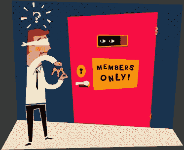
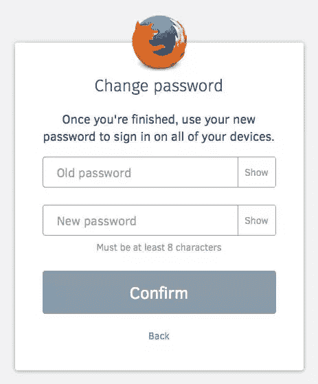
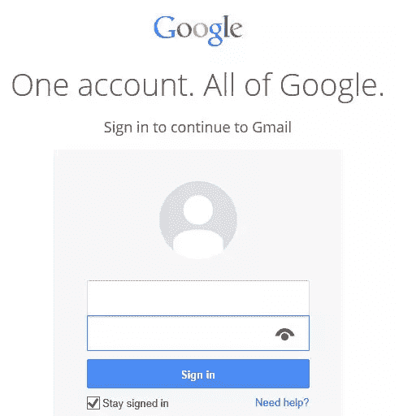
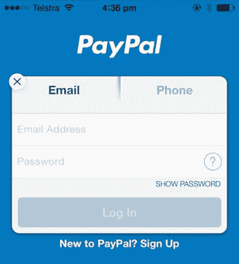

# 屏蔽密码:帮助还是阻碍？

> 原文：<https://www.sitepoint.com/masking-passwords-help-or-hindrance/>

有时候细节决定一切。

在网上表格中输入你的电话号码，然后被告知“不允许有空格”,这令人愤怒。这只是整体用户体验的很小一部分，但它可以完全改变从无缝到笨重的感觉。

密码屏蔽是另一个这样的细节。密码屏蔽是将用户输入的密码字符隐藏在项目符号(●)、星号(*)或类似伪装字符后面的常见做法。

屏蔽背后的想法是防止附近的观察者“越过用户的肩膀”读取密码，从而被窃取。但是有几个明显的缺点可能超过这个主要优点。

## 密码屏蔽的问题

### 屏蔽密码也会对用户隐藏密码

在我们试图最大化安全性的过程中，我们经常严重损害可用性。如果安全性驱使人们不去使用它，那么构建一个安全的系统就没有多大意义！

密码屏蔽就是其中一个例子，安全性的副产品是较差的用户体验。通过屏蔽密码来防止犯罪分子不仅在房间里，而且就在你身后不超过几米的地方，我们正在损害每一个合法用户。这意味着用户不能:

*   查看他们是否输入了正确的内容；或者
*   如果他们得到一个错误，很容易纠正他们的密码。

反过来，这将意味着更长、更令人沮丧的用户体验。这些困难可能导致用户选择安全性低得多但更容易输入的密码，从而带来更大的安全风险。

### “越过肩膀”攻击并不像我们想象的那样普遍

世界著名的安全专家 Bruce Schneier 在他的文章[中很好地阐述了密码屏蔽的利与弊](https://www.schneier.com/blog/archives/2009/07/the_pros_and_co.html):

> 我相信肩部冲浪并不像它所说的那样是个问题。第一，许多人私下使用他们的电脑，没有人监视他们。第二，个人手持设备离身体很近，使得肩部冲浪更加困难。第三，很难快速准确地记住在屏幕上闪现一秒钟左右的随机非字母数字字符串。
> 
> 这并不是说肩部冲浪没有威胁。确实是。正如许多读者指出的那样，密码屏蔽是它不再是一个威胁的原因之一。对于那些电脑使用不熟练的人来说，威胁更大:打字速度慢的人和很可能选择错误密码的人。但我认为风险被夸大了。

### 密码仍然容易受到键盘记录和恶意软件的攻击

不幸的是，视觉掩蔽给人的安全感比实际上更多。虽然看不到，但它仍然可以很容易地被安装在用户设备上的恶意软件窃取，或者被犯罪分子使用[键盘记录技术](https://en.wikipedia.org/wiki/Keystroke_logging)(不需要安装在设备上，甚至不需要在视觉上接近)。

### 一些移动操作系统的设计消除了屏蔽的一些好处

在某些手机上输入密码时，每个字符会在密码栏中显示几秒钟，或者直到输入下一个字符，以先到者为准。这意味着面具只是部分适用，破坏安全。

## 平衡安全性和可用性

好消息是，有一种方法可以在改善用户体验的同时保持屏蔽的安全优势:**默认屏蔽密码，但为用户提供关闭屏蔽的能力**。

这种方法:

*   默认情况下提供最大的安全性，包括防止“越过肩膀”攻击；
*   让用户控制他们自己的交互(控制是可用性的重要基石)；
*   意味着界面最初是用户熟悉的，而不是公开展示密码的潜在冲击(Jack Holmes 的一项研究发现，如果密码被默认暴露，60%的用户会对网站产生怀疑)；
*   允许用户在键入时或键入后查看密码；和
*   可以使用任何设备或操作系统。

最佳实现将使用“显示”和“隐藏”这两个词，而不是可能不直观的图标。因为用户正在启动一个动作，理想情况下“显示”和“隐藏”将是按钮(而不是标签改变的复选框)。

### “显示密码”切换:验证结果

前面提到的由[杰克·霍尔姆斯](http://passwordmasking.com/)和[其他人](https://storify.com/lukew/yahoo-display-password-test)进行的研究证明了“显示密码”方法对用户有效。Jack 研究中的用户引用包括:

> 它在那里的事实给了我检查我输入的东西的机会。它在我无力做简单的事情时帮助了我。

和

> 它保护我免受别人的监视。它给我一种感觉，有某种形式的保护到位。

与我共事过的维多利亚州司法和法规部进行的未发表的研究也证实了“显示密码”的方法。

因此，我认为是时候开始将此作为一种惯例。你怎么想呢?

## 分享这篇文章