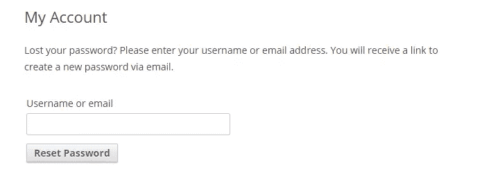
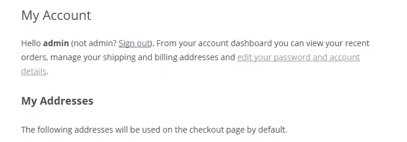

# 掌握 WooCommerce 操作和过滤器

> 原文：<https://www.sitepoint.com/mastering-woocommerce-actions-and-filters/>

使用 WooCommerce 和 WordPress 来创建电子商务网站的情况越来越多。如果你像我一样是一名 Web 开发人员，了解 WooCommerce 模板系统的来龙去脉，以及它的操作和过滤器是一项非常好的技能。想象一下，如果你知道关于 WooCommerce 的所有知识，或者至少能够在很少的帮助下实现任何东西，仅仅是你和 WooCommerce 文档，你的老板会多么高兴。

如果这一切对你来说听起来不错，请继续阅读，我们将探索 WordPress 和 WooCommerce 一起工作能做些什么。这篇文章的风格(希望以后会有更多)将包括向你提出一个问题，然后用 WordPress 和 WooCommerce 的动作和过滤器提出一个解决方案。

### 帐户创建和更新的有用操作

在你的电子商务网站上使用 CRM 是很常见的。WooCommerce 让我们在结账过程中或通过“我的账户”页面检测新客户或用户的注册变得简单。

下面的例子应该让你知道当有人通过 WooCommerce 注册时，如何在 Salesforce 上创建一个帐户。请注意，未显示 Salesforce API 代码；我只是概述一下过程。

```
<?php
// Create Customer's Salesforce Account
add_action( 'woocommerce_created_customer', 'create_salesforce_account', 10, 3 );
function create_salesforce_account( $customer_id, $new_customer_data, $password_generated ) {

	// Get the New Customer's data
	$username   = $new_customer_data['user_login'];
	$password   = $new_customer_data['user_pass'];
	$email      = $new_customer_data['user_email'];
	$role       = $new_customer_data['role'];

	// Getting the rest of the info for this customer
	$user = get_user_by( 'id', $customer_id );

	// Continue and send the information to Salesforce now
}
```

继续我们前面的示例，当客户编辑帐单或送货地址时，您很自然地希望更新 Salesforce 上的客户信息。`woocommerce_customer_save_address`在任一地址被编辑后立即运行，并给出用户 ID 和哪个地址被编辑。注意，您也可以通过`$_POST`获得任何表单字段。

```
<?php
// Update Salesforce account with new shipping information
add_action( 'woocommerce_customer_save_address', 'update_salesforce_account', 10, 2 );
function update_salesforce_account( $user_id, $load_address ) {

	// Let's use a Switch statement to know which address we are updating
	switch ( $load_address ) {
		case 'billing':
			// Send billing info to Salesforce
			break;

		case 'shipping':
			// Send shipping info to Salesforce
			break;
	}
}
```

### 覆盖前端标题、消息和描述

如果您知道使用哪种过滤器，就可以很容易地更改部分标题、消息和描述。这些过滤器允许您自定义向客户显示的内容，甚至包括所有细节。你注意到我说的是过滤器而不是动作吗？这是因为 WooCommerce 不像 WordPress 那样使用动作来覆盖这些类型的值。


仅当您的商店启用了优惠券，并且当您在结账页面时，它要求您输入优惠券代码时，才会显示。比如:有优惠券？单击此处输入您的代码。


`woocommerce_checkout_login_message`当购物车检测到您未登录时，显示在结账页面上，并为您提供登录选项。比如:回头客？点击此处登录。



`woocommerce_lost_password_message`显示在“我的帐户”页面下，指示您输入用户名或电子邮件以重置密码。比如:密码丢了？请输入您的用户名或电子邮件地址。您将通过电子邮件收到一个创建新密码的链接。


`woocommerce_my_account_my_address_title`显示在“我的帐户”页面上，默认情况下，它有两个标题。当你设置只运送到账单地址时，它会从“我的地址”稍微修改为“我的地址”,所以只需要其中一个地址。例如:我的地址或我的地址。



`woocommerce_my_account_my_address_description`显示在地址标题的正下方，简要说明地址的用途。例如:默认情况下，结帐页面将使用以下地址。


`woocommerce_my_account_my_downloads_title`显示在“我的帐户”页面上，并设置下载部分的标题。例如:可用下载。


`woocommerce_my_account_my_orders_title`显示在“我的帐户”页面上，并设置订单部分的标题。比如:近期订单。

当然，除了名字之外，它们的用法几乎完全相同。这里有一些如何改变它们的例子。

```
<?php
add_filter( 'woocommerce_checkout_coupon_message',              'override_checkout_coupon_message', 10, 1 );
function override_checkout_coupon_message( $message ) {
    return __( 'Have a coupon for our store?', 'spyr' ) . ' <a href="#" class="showcoupon">' . __( 'Click here to enter it', 'spyr' ) . '</a>';
}

add_filter( 'woocommerce_checkout_login_message',               'override_checkout_login_message',  10, 1 );
function override_checkout_login_message( $message ) {
    return __('Already have an account with us?', 'spyr' );
}

add_filter( 'woocommerce_lost_password_message',                'override_lost_password_message',   10, 1 );
function override_lost_password_message( $message ) {
    return  __( 'Lost your password? Please enter your username or email address.', 'spyr' );
}

add_filter( 'woocommerce_my_account_my_address_title',          'override_my_address_title',        10, 1 );
function override_my_address_title( $title ) {
    return __( 'Your Address', 'spyr' );
}
add_filter( 'woocommerce_my_account_my_address_description',    'override_my_address_description',  10, 1 );
function override_my_address_description( $description ) {
    return __( 'The following addresses will be used on the checkout.', 'spyr' );
}
add_filter( 'woocommerce_my_account_my_downloads_title',        'override_my_downloads_title',      10, 1 );
function override_my_downloads_title( $title ) {
    return __( 'Your Downloads', 'spyr' );
}
add_filter( 'woocommerce_my_account_my_orders_title',           'override_my_orders_title',         10, 1 );
function override_my_orders_title( $title ) {
    return __( 'Your Most Recent Orders', 'spyr' );
}
```

暂时就这样了。我们才刚刚开始探索 WooCommerce 的内幕，随着一系列文章的深入，我们将构建更复杂的模块，这些模块将严重依赖于使用 WooCommerce 和 WordPress 的 hooks 系统来生成我们想要做的任何事情。

在下一篇文章中，我们将研究一个真实世界的案例，在这个案例中，您可能希望提供一个免费的产品，购买任何符合特定标准的商品以及其他感兴趣的商品。

## 分享这篇文章