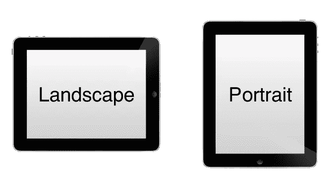
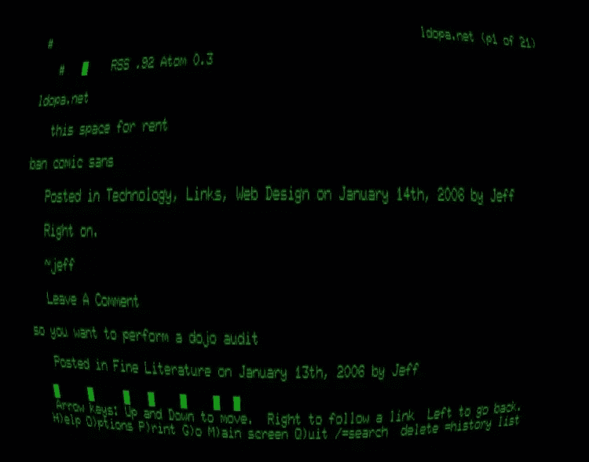

# 媒体查询:查看不同的媒体功能

> 原文：<https://www.sitepoint.com/media-queries-look-different-media-features/>

如果你从事过响应式设计，你可能用过媒体查询。媒体查询是使用 CSS 创建响应性网站的一种干净简单的方式。它们的工作原理是当用户的屏幕达到一定大小时，允许你改变页面的样式。这里有一个简单的例子:

```
@media (max-width: 700px) {
    p {
        color: red;
    }
}
```

[现场演示](https://uploads.sitepoint.com/wp-content/uploads/2014/07/1406167344mq-1.html "Demo 1")

当屏幕宽度为 700 像素或更小时，此媒体查询会导致段落文本变为红色。如果你想在屏幕大于 700 像素时将文本变成红色，你可以使用“最小宽度”来代替。您还可以设置两个单独的查询，如“最大宽度”*和*“最小宽度”。这看起来是这样的:

```
@media (max-width: 700px) and (min-width: 500px) {
    p {
        color: red;
    }
}
```

[现场演示](https://uploads.sitepoint.com/wp-content/uploads/2014/07/1406167345mq-2.html "Demo 2")

厉害！只有当屏幕宽度介于 500 像素和 700 像素之间(包括 500 像素和 700 像素)时，文本才会显示为红色。

如果屏幕宽度小于 500px *或大于 700 px*时，您希望应用一些样式，该怎么办？您可以使用逗号分隔查询，如下所示:

```
@media (max-width: 500px), (min-width: 700px) {
    p {
        color: red;
    }
}
```

[现场演示](https://uploads.sitepoint.com/wp-content/uploads/2014/07/1406167345mq-3.html "Demo 3")

请注意，在演示中，如果窗口的宽度介于 500 像素和 700 像素之间(不含)，文本将不会是红色的。

媒体查询也可以用许多不同的方式编写。

直接在 HTML 中:

```
<link rel="stylesheet" media="(max-width: 700px)" href="example.css" />
```

除了我们上面使用的方法，你可以在 CSS 中使用`@import`来编写它们:

```
/* @import */
@import url(example.css) (max-width: 700px);

/* @media */
@media (max-width: 700px) {
    /* CSS goes here... */
}
```

*编者按:`@import`不推荐使用但是我们只是在演示这样一个事实，即媒体查询可以用它来定义。*

到目前为止，相当简单的东西，你可能已经知道很多，如果不是全部的话。但是让我们再深入一点。

在大多数情况下，媒体查询用于根据屏幕宽度改变样式。虽然 width 是最常见的应用程序，但是还有一系列其他类型的查询，包括各种媒体功能。

## 宽度和高度

我们可以像在前面的例子中使用宽度一样使用高度。例如，使用与前面相同的方法，当浏览器的高度为 600 像素或更小时，我们可以将背景颜色更改为黄色:

```
@media (max-height: 600px) {
    body {
        background: yellow;
    }
}
```

[现场演示](https://uploads.sitepoint.com/wp-content/uploads/2014/07/1406167340mq-4.html)

我们也可以用`device-`作为高度和宽度的前缀。如果我们这样做，它将使用整个屏幕的宽度和高度作为一个值，而不是浏览器窗口或视窗的宽度和高度:

```
@media (max-device-height: 600px) {
    body {
        background: red;
    }
}
```

## 方向



设备的方向可用于创建自定义布局。这对于将菜单和按钮定位在用户的拇指容易触及的位置可能是有用的。例如，要设置应用于横向模式布局的特定样式，可以使用以下方法:

```
@media screen and (orientation: landscape) {
    menu {
        float: left;
    }
}
```

这个例子将`float: left`应用于任何处于横向模式的设备。你可以用肖像模式做同样的事情:

```
@media screen and (orientation: portrait) {
    menu {
        float: right;
    }
}
```

要了解更多关于`orientation`媒体功能及其使用方法，请查看[这篇文章](https://www.sitepoint.com/how-to-use-orientation-on-your-mobile-sites/ "Using Orientation on Your Mobile Sites")。

## 颜色

彩色媒体功能有多种不同的使用方式。第一种方法是使用`(color)`检查设备是否颜色兼容。如果我们只想锁定非彩色设备，我们可以使用如下所示的内容:

```
@media not (color) {
    body {
        background: black;
        color: white;
    }
}
```

上面的代码使用了`not`关键字，它可以用于所有不同的媒体特性。我们使用的代码可能有助于让你的文本在黑白设备上易于阅读。

我们可以对颜色做的另一件事是用每个颜色分量的最小(或最大)数量的[位来确定目标设备。假设您想删除一个背景图像，如果设备有 4 位或更低的颜色。这看起来是这样的:](http://en.wikipedia.org/wiki/Color_depth "Wikipedia")

```
@media (max-color: 4) {
    body {
        background-image: none;
    }
}
```

我们还可以根据设备是否使用[索引颜色](http://en.wikipedia.org/wiki/Indexed_color "Wikipedia")来应用样式。要对此类设备应用样式，您可以这样做:

```
@media all and (color-index) {
    body {
        background-image: url(wood-texture.jpg);
    }
}
```

在本例中，我们使用`all`关键字来选择所有设备，这是媒体查询的默认设置。

假设您希望在用户的索引颜色设备的颜色少于 256 色时显示警告。看起来大概是这样的:

```
@media (max-color-index: 255) {
    .alert {
        display: block;
    }
}
```

## 黑白的

此功能适用于灰度设备。要将特定样式应用于所有单色设备，我们可以使用`(monochrome)`值。我们也可以用这个值来赋予每像素一定位数的设备风格。例如，如果您想删除所有设备上每像素 8 位的图像，我们可以使用以下代码:

```
@media (max-monochrome: 8) {
    img {
        display: none;
    }
}
```

我们可以用`monochrome`值做的一件很棒的事情是为彩色打印和黑白打印设置不同的样式。我们通过将`print`放在我们通常使用的`monochrome`的前面或后面来做到这一点。下面是我们的 CSS 可能的样子:

```
/* Black and White Print */
@media (monochrome) and print {
    body {
        color: black;
    }
}

/* Color Print */
@media not (monochrome) and print {
    body {
        color: #09f;
    }
}
```

## 长宽比

[长宽比](http://en.wikipedia.org/wiki/Display_aspect_ratio "Wikipedia")自从智能手机和平板电脑诞生以来，长宽比发生了很大的变化。旧显示器通常具有 4:3 和 5:3 的宽高比，但现在有了新的高清视频标准，我们可以看到 16:9 和 16:10 的显示器。

使用长宽比有两种方法；可以使用浏览器的比例(使用`aspect-ratio`)，也可以使用设备的比例(使用`device-aspect-ratio`)。

如果浏览器是方形或横向的，下面的示例将使背景变为黄色:

```
@media (min-aspect-ratio: 1/1) {
    body {
        background: yellow;
    }
}
```

[现场演示](https://uploads.sitepoint.com/wp-content/uploads/2014/07/1406167342mq-5.html "Demo 5")

如果您想隐藏宽屏显示器上的一些内容，该怎么办？您可以使用类似这样的内容:

```
@media screen and (device-aspect-ratio: 16/9), screen and (device-aspect-ratio: 16/10) {
    p {
        display: none;
    }
}
```

[现场演示](https://uploads.sitepoint.com/wp-content/uploads/2014/07/1406167343mq-6.html "Demo 6")

在该示例中，如果显示器具有标准的 16:9 或 19:10 纵横比，则不会显示段落元素。

## 格子

`grid`媒体功能是指类似终端的设备。这可以是如图所示的终端应用程序，也可以是使用单一字体的老式手机显示屏。



如果用户在启用网格的设备上，此示例将删除所有图像:

```
@media (grid) {
    img {
        display: none;
    }
}
```

需要记住的一点是“em”单位。为网格设备创建显示时，“em”单位会改变其含义。该单位将改为网格中一个单元的确切大小。

## 解决

`resolution`媒体功能可用于为具有特定 dpi(每英寸点数)或 dpcm(每厘米点数)的输出设备提供样式。例如，如果您想为分辨率小于 150dpi 的屏幕设置不同的字体，您的代码可能如下所示:

```
@media (max-resolution: 150dpi) {
    body {
        font-family: 'comic sans', cursive;
    }
}
```

使用`resolution`功能时要考虑的一件事是打印。对于打印机，dpi 和 dpcm 对应于加网分辨率。

## 扫描

扫描是指电视设备使用的扫描过程。该值可以设置为`progressive`或`interlace`。查询可以这样设置:

```
@media tv and (scan: interlace) {
    video {
        display: none;
    }
}
```

同样，这种方法只适用于电视设备。

## 媒体类型

媒体类型指的是不同类型的显示，它们可以作为样式的目标。以下是当前类型的列表:

*   `braille`–用于盲文显示器。([例 1](http://en.wikipedia.org/wiki/Refreshable_braille_display "Refreshable Braille Displays") | ( [例 2](http://en.wikipedia.org/wiki/Braille_e-book "Braille e-book") )
*   `embossed`–用于被称为浮雕展示的未来创意。([专利](http://www.google.com/patents/US2390663 "Embossed display") | [实验](https://www.youtube.com/watch?v=-NhQwsaqP_M "Embossed display"))
*   `handheld`–用于手机、pda 和其他小型设备。
*   `print`–用于打印机。
*   `projection`–用于小型和大型投影仪。
*   `screen`–最常见的类型。适用于所有屏蔽设备。
*   `speech`–用于语音生成设备。([例子](http://en.wikipedia.org/wiki/Speech-generating_device "Speech-generating devices"))。
*   `tty`–供聋人使用的电信设备。([例子](http://en.wikipedia.org/wiki/Telecommunications_device_for_the_deaf "Telecommunications devices for the deaf"))。
*   `tv`–用于电视机。

有传言说`3d-glasses`媒体类型变得有效，尽管它还没有在任何 W3C 规范中定义。然而，在 W3C 规范中[提到了这一点。如果`3d-glasses` *被定义了，它仍然可以工作，因为从 HTML4 开始，媒体类型是向后兼容的。*](https://www.w3.org/TR/css3-mediaqueries/#background "Background")

## 进一步阅读

以下是该领域更多研究的链接:

*   [初学者媒体查询](https://www.sitepoint.com/web-foundations/media-queries/)site point 上的文章
*   W3C 上的媒体查询第 3 级规范
*   W3C 上的媒体查询级别 4 规范

## 结论

以上概述了针对特定设备、窗口等的许多不同选项。如果你已经能够使用媒体询问的这些特征中的任何一个，我们很乐意在评论中听到你的经历。

如果你有兴趣了解更多关于响应式网页设计的知识，可以看看我们的新书，克里斯·沃德写的《快速启动响应式网页设计》。

## 分享这篇文章