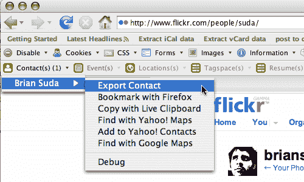
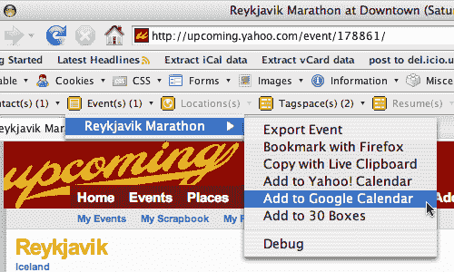

# 微格式:标记的更多含义

> 原文：<https://www.sitepoint.com/microformats-meaning-markup/>

你可能听说过“微格式”这个术语，并认为它是 Web 2.0 昙花一现运动的一部分。但是“微格式”不仅仅是一个花哨的名字或商标——它是更大图景的一部分。那么，什么是微格式呢？

官方的[microformats.org 网站](http://microformats.org/about/)这样定义微格式:

微格式首先是为人类设计的，其次才是为机器设计的，它是一组简单、开放的数据格式，建立在现有的广泛采用的标准之上

通过使用这些广泛采用的标准，发布者可以将附加语义编码到网页的 HTML 标记中。这赋予了页面超越 HTML 元素表面价值的意义，允许它们被消费、重新混合和混合。例如，通过向描述即将到来的事件的网页添加一些语义标记，事件日期等属性可以很容易地被其他服务和软件(如日历和个人组织者)提取和使用。

微格式就是表示编码在网页中的语义信息，允许以最初的发布者可能从未想到的方式利用这些信息。将更多语义信息直接放入 HTML 的想法并不新鲜 web 行业的人们已经讨论这个概念十多年了——但是，通过许多志愿者的努力，已经创建了足够多的文档、支持、代码库和工具来为微格式创造巨大的动力。这个想法终于变成了现实。

现在，如果你的眼睛发花了，任何关于语义、编码、数据格式甚至标准的进一步提及都会让你直接回到 YouTube，坚持住。我将证明使用微格式本身就是简单的。它可能只有在单个 HTML 元素中添加一个类名那么难。相信我——我将向您展示如何以最少的努力从微格式中获得最大的好处。

使用微格式发布的两种最常见的数据形式是与人和事件相关的数据，我将在本文中讨论这两种形式。

##### 铺设牛道

借用 microformats 网站上的一个比喻来说明，可以说微格式试图铺平牛的道路。你每天都能看到牛道:图书馆外、公园里和大学周围。人们总是在铺好的道路上切角，开辟自己的道路，通常还会把沿途的草地弄平——从而像许多牛一样，为后面的人指明道路。与其试图强迫人们遵循既定的路径，为什么不重新调整铺设的路径，以遵循牛的路径？

通过这种方式，微格式允许人们使用 cow 路径，或者更确切地说，利用已经发布的信息的更多价值和意义。微格式之所以成功，是因为它们不强迫你改变习惯:你不需要改变你发布的内容，只需要稍微修改你的 HTML。

##### 用微格式描述概要文件

你的用户资料在网上有多少份？几乎每个你注册过的网站都有一个关于你的页面，上面有你的名字、昵称、电子邮件、网址和其他基本联系信息。通过使用微格式，我们可以让这些信息变得更加有用。想象一下，能够将您的用户配置文件从网站导入到其他应用程序中，而无需复制和粘贴文本。你的个人资料可以在网上汇总，创建一个互联网范围的个人资料，省去你用相同的数据注册多次的麻烦。只需轻轻一点，您的朋友就可以轻松地将您添加到他们的联系人列表中，并在您的详细信息发生变化时毫不费力地保持更新。

不要再想象了！hCard 是专为这类角色设计的微格式，模仿了广泛采用的 vCard 标准。您可能不知道，十多年来，您的地址簿应用程序可能一直在导入和导出 vCard，而您的手机也一直在愉快地传递 vCard 中的联系信息。如果某些东西已经运行良好，那么重新发明轮子就没有意义了——hCard 微格式在这里有好处，因为任何可以读取 vCard 的东西都可以很容易地读取 hCard，只需要一点必要的额外帮助。

hCard 微格式用于标记人、地点和组织。hCard 唯一需要的属性是名称；其他都是可选的。这是很重要的一点，因为另一个微格式原则是*而不是*改变人们已经发布的方式。如果你没有公布电话、电子邮件或地址信息，那么 hCard 不会强迫你这样做。

让我们来看一个非常简单的例子，一个朋友和同事列表的普通博客:

```
<li>
  <a href="http://suda.co.uk">Brian Suda</a>
</li>
```

我们在 HTML 中创建 hCard 的第一步是将所有数据包装在一个名为`"vcard"`的类中:

```
<li class="vcard">
  <a href="http://suda.co.uk">Brian Suda</a>
</li>
```

```
"vcard" acts like a container, saying all the data inside this <li> element is data to be considered for this vCard.
```

现在，我肯定有些人会抗议，“嘿，你在滥用 class 属性——这只是针对 CSS 的！”这不是真的。根据 HTML4 规范，class 属性是用户代理的通用属性。微格式是 class 属性的一种完全可以接受的用法；class 属性只适用于 CSS。

我们示例中的下一步是在`<li>`中标记 name 属性:

```
<li class="vcard">
  <a href="http://suda.co.uk" class="fn">Brian Suda</a>
</li>
```

我们已经向`<a>`元素添加了一个类值`"fn"`。`"fn"`对应于 vCard 值`FN`，代表“格式化名称”，在许多应用中用作显示名称。

在我们的例子中，我们可以添加一些进一步的语义。我们有一个名字，但我们现在也有一个网址。所以我们也可以向`<a>`元素添加一个`"url"`类:

```
<li class="vcard">
<a href="http://suda.co.uk" class="url fn">Brian Suda</a>
</li>
```

现在，我可以听到你问，“你能在一个类属性中有多个值吗？”答案是:“当然！”class 属性非常灵活，您可以添加任意数量的空格分隔的值——CSS 类或其他。这对于 HTML 和微格式来说是完全有效的标记。

所以你有它。不费吹灰之力，我们就在 blogroll 中添加了 hCard 微格式。如果任何支持微格式的软件打开我们的网页，它将能够毫不含糊地提取联系人的全名和相关 URL。

更多关于 hCards 的信息可以在[microformats.org 网站](http://microformats.org/wiki/hcard)找到。该网站描述了所有可以用来给人、地点或组织添加语义的属性。这些属性包括地址、电话号码、电子邮件、网站和组织角色。作为一个出版商，你可以学习这些属性并手工编辑你的 HTML，或者使用一个有用的 microformats creator 插件为你添加它们。不需要学习太多的属性，而且这些属性是不言自明的。还有一个[小抄](http://microformats.org/wiki/hcard-cheatsheet)帮你。

##### 使用微格式描述事件

仅次于与人和地点相关的信息，网上发布的最常见的信息是关于事件的。人们正在发布各种各样与时间相关的信息，甚至没有意识到这一点。为了给这些数据添加更多的语义，microformats.org 的志愿者们创建了 [hCalendar 微格式](http://microformats.org/wiki/hcalendar)。与 hCard 非常相似，hCalendar 基于现有的广泛采用的格式 iCalendar。

让我们看一个可能的博客帖子的例子:

```
<p>
Hey everyone,
next week is my birthday party,
we should all meet up at my house for pizza.
</p>
```

你可能想不到，但在那篇简单的英语散文中隐藏着许多事件信息。人类是聪明的——我们可以从字里行间读出意思，并判断出上面代表了特定类型的事件，以及感知事件发生的时间和地点。另一方面，计算机是愚蠢的——它们没有办法知道这是一个事件；只是一段随意的文字。添加一些 hCalendar 标记将允许计算机挑选出那些重要的信息。让我们看看添加一些 hCalendar 标记是什么样子的:

```
<p class="vevent">
Hey everyone, 
next week is my birthday party, 
we should all meet up at my house for pizza.
</p>
```

第一步是添加一个`"vevent"`类——这个添加告诉解析器这个`<p>`元素中的所有内容都是被认为与该事件相关的数据。在前面的 hCard 例子中，我使用了一个`<li>`元素。微格式并不强迫您使用任何特定的 HTML 元素，但是根据您使用的元素，可以隐含额外的语义。

接下来，我们需要添加描述该事件的摘要:

```
<p class="vevent">
Hey everyone, 
next week is my 
<span class="summary">birthday party</span>, 
we should all meet-up at my house for pizza.
</p>
```

通过将文本“生日聚会”包装在一个`<span>`元素中并添加一个类`"summary"`，我们说这段文本是这个事件的摘要。我们可以继续以类似的方式标记位置；我们将把位置信息包装在一个`<span>`元素中，并给它一个类`"location"`:

```
<p class="vevent">
Hey everyone, 
next week is my 
<span class="summary">birthday party</span>, 
we should all meet-up at 
<span class="location">my house</span> 
for pizza.
</p>
```

最后，沟通任何事件最重要的部分是指定它何时发生！这是微格式的一个方面，说明了为什么它们首先为人类设计，其次为机器设计。作为人类，我们很容易理解“下周”的含义，但计算机没有这么大的能力——我们需要给出更精确的信息，以便描述“下周”的实际含义。

ISO 日期-时间标准——格式为 YYYY-MM-DD:四位数的年份、两位数的月份和两位数的日期——在计算机世界中被广泛使用，但它并不是人类最容易读懂的。此外，这种形式的 ISO 日期确实解决了美国和欧洲日期不明确的问题，但书写起来并不总是很自然。所以我在机器可读的数据和人类可读的表示之间找到了一个折中的办法:

```
<p class="vevent">
Hey everyone, 
<abbr title="2008-05-29" class="dtstart">
next week</abbr> is my 
<span class="summary">birthday party</span>,
 we should all meet-up at 
<span class="location">my house</span> 
for pizza.
</p>
```

通过使用`<abbr>`元素并添加一个`"dtstart"`类，我们说这个数据是这个事件的日期时间开始，但是计算机不知道“下周”是什么意思。相反，因为这是一个`<abbr>`元素，解析器可以从 title 属性中寻找`"dtstart"`含义的答案。在那里它找到了 ISO 日期。如果你想知道为什么我选择了`<abbr>`元素，你可以在这里找到更多关于它的信息[。](http://microformats.org/wiki/abbr)

一旦信息被编码到文本中，就可以很容易地提取并导出到各种日历应用程序中:本地发送到计算机或电话，或远程 web 托管的日历，或与朋友共享，甚至在尚未存在的 mashups 中分发！

##### 那么，我如何开始使用微格式呢？

有几种工具可以帮助您创建微格式并有效地提取它们。

hCard creator 是一个基于网络的表单，你可以填写它——它会动态生成你需要粘贴到网页上的 HTML。同样，还有一个 [hCalendar 创造者](http://microformats.org/code/hcalendar/creator)。还有用于 [Dreamweaver](http://www.webstandards.org/action/dwtf/microformats/) 、 [Textpattern](http://textpattern.org/plugins/525/pnh_mf) 、 [WordPress](http://microformats.org/wiki/implementations#WordPress) 的库和插件，以及微格式 [hCard](http://microformats.org/wiki/hcard-implementations) 和 [hCalendar](http://microformats.org/wiki/hcalendar-implementations) 网页上更多的库和插件。

但是如果不能提取微格式，发布微格式又有什么用呢？有很多工具可以帮助您提取和操作微格式数据。

Firefox 有一个名为 [Operator](http://addons.mozilla.org/en-US/firefox/addon/4106) 的插件，它可以检测当前浏览的网页中的微格式内容，并提供相关的选项和工具。例如，如果检测到 hCard 内容，操作员将列出联系人姓名并显示“导出联系人”选项。这个插件在下面的截图中使用。运算符非常方便，因为它不仅提取数据，还提醒您页面上存在数据。

Technorati 为 [hCard](http://technorati.com/contacts/) 和 [hCalendar](http://technorati.com/events/) 托管微格式 web 服务。如果您提交包含 hCard 或 hCalendar 信息的网页的 URL，此 web 服务将返回 vCard 或 iCalendar 的等效内容。 [Technorati](http://kitchen.technorati.com/) 目前也在测试一个微格式搜索引擎。如果你的站点被列在 Technorati 索引中，他们会将你的 HTML 中的所有微格式编入索引。然后这些数据就可以搜索了。最终，你可以定制一个 iCalendar 订阅，只订阅你所在城市的活动，关键词是“爵士乐”、“科技”或“飞盘”互联网成为你的数据库。这是迈向语义搜索的第一步，这是这么多年来许多人的愿景。

有一些为各种编程语言编写的库，可以帮助您为 web 应用程序从 HTML 中提取微格式数据:

*   [红宝石的 MoFo】](http://mofo.rubyforge.org/)
*   【JavaScript 的相扑
*   [XSLT 中的 X2V](http://hg.microformats.org/)
*   [PHP 中的 hKit](http://allinthehead.com/hkit/)
*   [Text::Perl 的微格式](http://code.google.com/p/ufperl/)

有人可能正在为你最喜欢的语言开发一个！

##### 谁在用 hCard 和 hCalendar？

有几个组织已经开始使用微格式编码他们的数据:有些您可能听说过，有些您可能没有听说过。

雅虎！是微格式的大力支持者，将微格式融入到它的许多属性中。其中包括雅虎！美国的照片分享网站 [Flickr](http://www.flickr.com) ，它的活动网站[即将推出](http://upcoming.yahoo.com)，以及它的科技和本地网站。

如图 1 所示，Flickr 使用微格式用 hCard 标记用户资料页面。现在可以从 Flickr 个人资料页面直接提取用户资料到你的地址簿中。如果你使用 Firefox 的 Operator 插件，你会发现你可以将联系信息导出到各种不同的地址簿客户端，包括本地的和网络上的。



如图 2 所示，即将到来的使用 hCalendar 微格式来标记事件。这使得使用“即将到来的”更加容易，因为即使在您浏览活动页面时，您也可以将其直接导入到日历应用程序中。



雅虎！技术和本地网站使用 hCard 微格式来标记本地公司。现在，当你在雅虎上搜索一家比萨饼店时！local，它返回所有带有 hCards 的结果，这样您就可以提取电话号码以便于拨号。

更令人惊讶的微格式支持者之一是柬埔寨黄页。这家公司用 hCards 标记了它的整个电话目录——只需在它的内容管理工具中编辑一个模板，就可以在网上立即创建数百万个语义数据实例。

为了一窥微格式在便携式社交网络中的潜力，让我们考虑一下 Dopplr。目前处于私人测试阶段，这是一项为经常旅行的人提供的在线服务。有一天，当它发布时，你将能够创建一个新帐户，并通过提交一个包含用 hCard 微格式标记的内容的 URL 来导入你的朋友列表。Dopplr 将解析页面，提取人物，并搜索其数据库来找到你的朋友。Dopplr 也可以导入 hCalendar 数据。如果你计划去参加一个活动，你可以提交一个带有 hCalendar 数据的 URLDopplr 将解析它，并在您的旅行计划中删除这些日期，这样您的朋友就可以随时了解您的最新行踪。

甚至在最近，微软也加入了关于如何用 hCards 在 SharePoint 中标记联系人的简短教程。

##### 微格式的未来会怎样？

微格式的未来看起来很光明！这是显而易见的方式，主要组织，如雅虎！已经认识到微格式的潜力，并以各种方式实现了它们。同样，浏览器供应商也表示有兴趣直接在浏览器中添加功能，以检测语义标记并对其采取行动。

想象一下，你手机或 PDA 上的浏览器自动检测到一个页面上有多个 hCards。它会添加一个菜单项来拨打电话号码，或者，如果进行了相应的配置，它会将电话号码直接导入到您的地址簿中。如果有邮政地址，浏览器会自动调出谷歌地图，并在地图上显示位置。

然而，所有这些数据的自由移动并不会随着联系人而停止——这同样适用于事件和其他结构化数据。如果浏览器找到 hCalendar 数据，它可以将日历信息导入本地日历应用程序，设置提醒，并在地图上找到活动位置。最棒的是微格式对最终用户是不可见的。普通人不需要理解微格式，甚至不需要知道它们在使用中。实质上，微格式免费促进了这一功能。

RSS 阅读器现在非常流行。在地址簿中构建类似的功能不是很有意义吗？现在，我能保持我的地址簿更新的唯一方法是不断地从朋友的电子邮件和网站上复制数据。这是一项枯燥、重复、耗时的任务。另一方面，使用 RSS 拉式地址簿，我的朋友可以简单地用微格式在线发布他们的数据，地址簿应用程序会轮询他们的网站，搜索任何更新。我的朋友和联系人不需要向他们的整个地址簿发送垃圾邮件来提醒每个人这些变化；他们只需更新 HTML，下次这个新的地址簿应用程序检查站点时，它会自动更新本地条目以反映这些变化。我会“订阅”我的联系人的网页来更新地址簿。许多日历应用程序已经对事件数据这样做了，那么为什么不对人也这样做呢？

这些只是几个简单的例子，说明如果出版商在他们的 HTML 中编码更多的语义信息会有什么样的可能。同样，在上述所有例子中，最终用户不需要知道或关心他们的数据使用微格式——只要它能工作就行。

微格式社区强大而充满活力。它也非常开放，因此任何人都可以通过向[微格式 Wiki](http://microformats.org/wiki/Main_Page) 添加示例、实现和文档来帮助它变得更好。当然，您可以做出贡献的最明显的方式是将微格式添加到您自己的网站上，并提倡使用微格式。使用微格式，您可以将网站内容从纯文本转换成有意义的信息包，这些信息包可以以您可能从未想到的方式重新混合和使用！

## 分享这篇文章