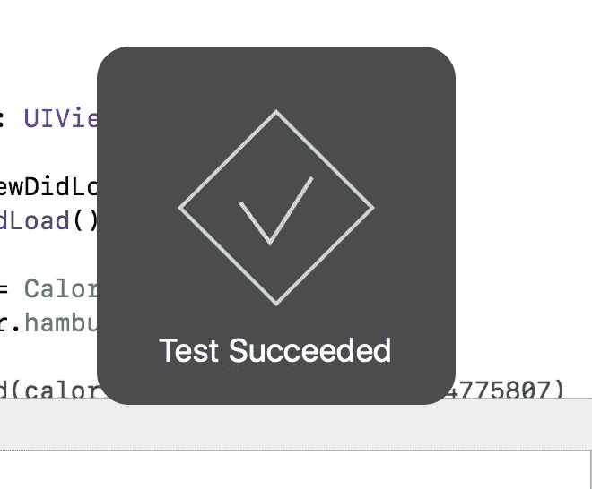
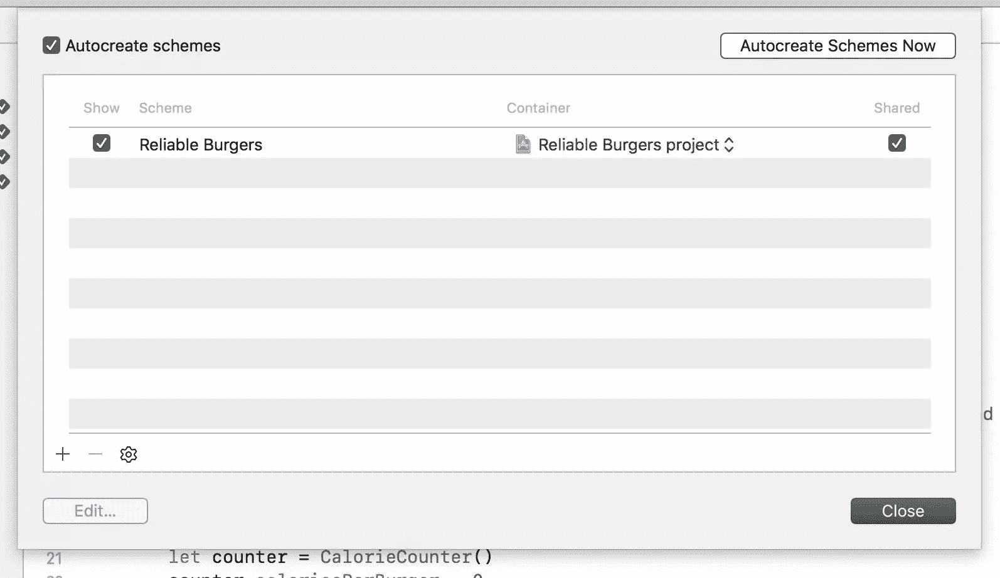
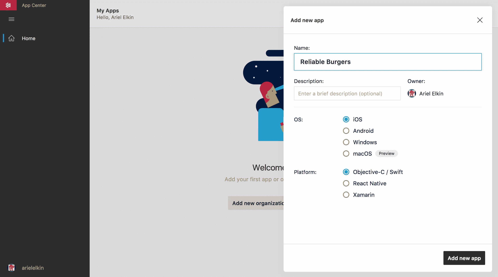
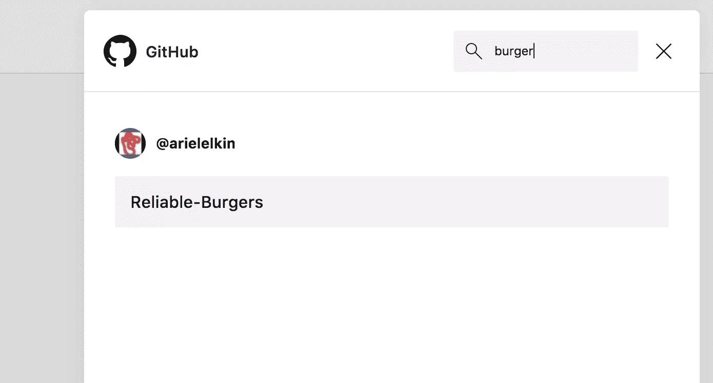
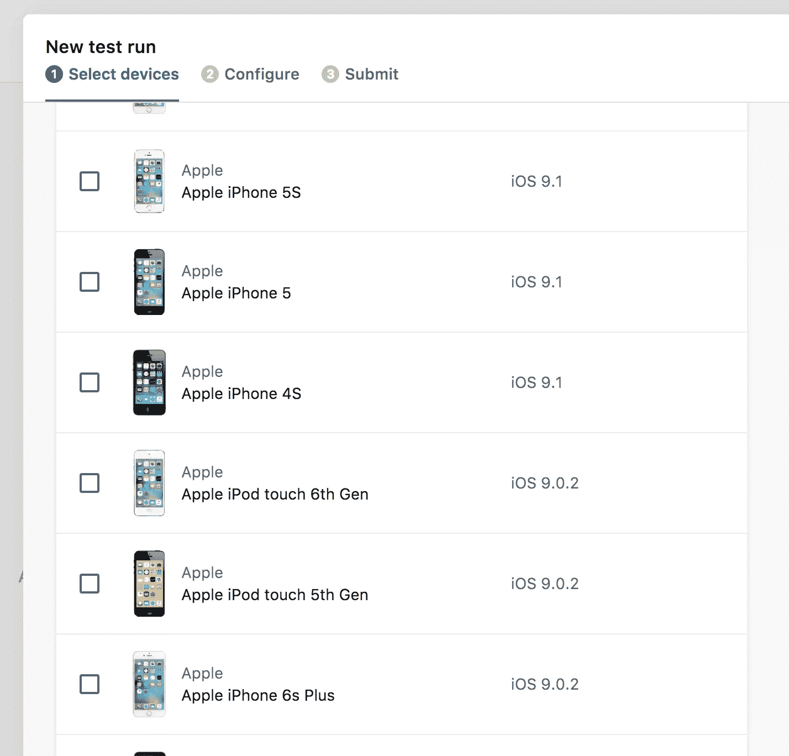
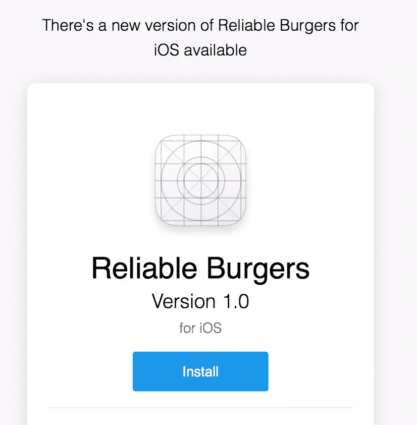

# 如何使用 App Center 构建、测试和交付 iOS 应用

> 原文：<https://www.sitepoint.com/microsoft-app-center-building-testing-and-delivering-ios-apps/>

*本文是与[微软](https://www.visualstudio.com/app-center/)合作创作的。感谢您对使 SitePoint 成为可能的合作伙伴的支持。*

通常，每个本机操作系统和平台都有自己的构建工具、测试工具和部署工具。这通常意味着您需要为您正在工作的每个平台建立单独的持续集成(CI)和持续交付(CD)管道，从而使您的工作加倍或加倍。

微软的 Visual Studio App Center 是处理移动开发领域碎片化的最佳方式之一:它无缝地将您所有的持续集成和持续交付需求集中在一个地方，*支持您可能需要的任何平台和框架，包括 iOS、Android、Windows、macOS、Xamarin 和 React Native* 。

本教程将向您展示如何使用 App Center 构建、测试和交付一个非常简单的原生 Swift iOS 应用。

注意:你需要 Xcode 8+。如果您按照本教程将 App Center SDK 集成到现有应用中，您的应用必须面向 iOS 8.0+并且不能使用任何其他崩溃报告库。此外，本教程将假设您有很好的 Git 工作知识。

**再次注意:**如果你已经熟悉持续集成或者单元测试，你可以跳到**总结测试**部分。如果没有，就跟着做。

我将创建一个非常简单的应用程序和一些测试来展示持续集成的价值，方法是展示即使是看似简单的东西也应该进行错误测试的许多方式，以及在 App Center 中实现这一点的容易程度。我还将介绍 App Center 的持续交付特性，并展示将您的 iOS 版本发送给内部和外部测试人员是多么容易。

## 可靠的汉堡

我们当地的汉堡店要求我们为他们开发一个带有简单的每日卡路里计数器的应用程序，它还可以告诉用户在不超过每日卡路里摄入量的情况下，他们可以吃多少汉堡。让我们假设一个队友正在处理 UI，我们只是要处理应用程序的后端逻辑。


客户被称为可靠的汉堡，因为他们可以提供最高质量的食物。这是一个大胆的说法，但它得到了他们收到的所有五星级餐厅评论的支持。但是因为他们不是简单地做出或接受“大胆声明”的类型，他们希望从我们这里得到独立的验证，我们的代码也将产生预期的结果。

为此，他们雇佣了一个内部和外部测试人员的大型团队，一旦他们提交到代码库，就接收代码的最新变更。

这就是 App Center 中的持续集成和持续交付功能可以发挥作用的地方。

### 设置项目

1.  打开 Xcode
2.  创建一个新项目，使用 **iOS 单视图应用**模板
3.  命名为**可靠的汉堡**
4.  确保勾选**包括单元测试**

### 编写代码

打开 *ViewController.swift* ，在`class ViewController: UIViewController {`上方粘贴以下代码:

```
class CalorieCounter {

    let maxDailyCalories = 2200

    let caloriesPerBurger = 550

    private var totalCaloriesConsumedToday = 0

    func add(caloriesToAdd: Int) {
        totalCaloriesConsumedToday += caloriesToAdd
    }

    var hamburgersICanStillEatToday: Int {
        return maxDailyCalories - totalCaloriesConsumedToday / caloriesPerBurger
    }
} 
```

每当用户消费食物时，他们将使用`add`方法输入相应的卡路里量，这将更新`totalCaloriesConsumedToday`。`hamburgersICanStillEatToday`计算用户当天还能吃多少个可靠的汉堡(我们只是用用户当天还能消耗的卡路里除以一个可靠汉堡的卡路里数(550))。

就这样，看起来我们满足了所有要求！让我们提交、推动、发送给测试人员，这一天就结束了。

## 使用应用中心构建和测试进行持续集成

### 抓虫子

打开 Reddit 后不到 10 分钟，您就收到了来自测试人员的这些消息:

> 应用程序说我仍然可以吃 2000 多个可靠的汉堡，所以我买了并吃了 20 个，现在我感觉不太好！

很明显我们的代码需要修改。但是，除了应用补丁，我们还应该编写测试来确保这些错误不会再次出现。

### 你不能吃 2200 个汉堡

我们可以这样重现错误:

```
let counter = CalorieCounter()
print(counter.hamburgersICanStillEatToday) // 2200 
```

`hamburgersICanStillEatToday`怎么可能返回一个超过 2000 的数字？让我们仔细看看我们正在进行的操作:

```
var hamburgersICanStillEatToday: Int {
    return maxDailyCalories - totalCaloriesConsumedToday / caloriesPerBurger
} 
```

假设`totalCaloriesConsumedToday`为 0，`caloriesPerBurger`为 550。操作是:`2200 - 0 / 550`。糟糕的结果是由于我们忽略了一个基本的数学规则:除法在减法之前进行。Swift 严格遵循这些规则，所以它从 0 除以 550 开始，得到 0，然后从 2200 中减去 0。因此当`totalCaloriesConsumedToday`为 0 时`hamburgersICanStillEatToday`为 2200！

在我们编写修复程序之前，让我们确保不再告诉用户他们可以吃 2200 个汉堡！假设一个人每天应该消耗大约 2200 卡路里，一个汉堡大约是 550 卡路里，`hamburgersICanStillEatToday` **应该永远不会返回一个大于 4 的数字**(我们用 2200 除以 550 得到的数字，让我们的用户(和我们的客户)满意)。

打开*Reliable _ BurgersTests . swift*(位于 Xcode 中的 Reliable BurgersTests 文件夹内)，在`class Reliable_BurgersTests: XCTestCase {`下添加以下几行

```
func testHamburgersICanStillEatTodayReturnsWithinRange() {
    let counter = CalorieCounter()
    XCTAssert(counter.hamburgersICanStillEatToday <= 4, "we should NOT recommend eating more than four hamburgers a day!")
    XCTAssert(counter.hamburgersICanStillEatToday >= 0)
} 
```

这个测试方法将通过从头开始创建一个新的`CalorieCounter`并向其查询`hamburgersICanStillEatToday`来重现我们上面的用户遇到的场景。`XCTAssert`方法期望括号内的表达式为真。如果所有 XCTAsserts 都通过，则测试通过。如果一个或多个失败，测试失败。

让我们测试我们的应用程序！继续按⌘ + U(或长按屏幕左上方的运行按钮，并选择**测试**)


`testHamburgersICanStillEatTodayReturnsWithinRange`不出所料，失败了。

现在转到 *ViewController.swift* 并实现修复(只需在正确的位置添加括号):

```
var hamburgersICanStillEatToday: Int {
    return (maxDailyCalories - totalCaloriesConsumedToday) / caloriesPerBurger
} 
```

`hamburgersICanStillEatToday`现在应该通过测试了，让我们按⌘ + U 来验证一下。以下是输出结果:



### 结束测试

这两个测试确保我们之前发现的两个错误不会再次潜入我们的应用程序。我们现在必须确保在新代码被合并到代码库之前，以及在应用程序被发送给用户之前，这些测试都通过了。

App Center 将帮助我们轻松确保这一点！

### 共享 Xcode 方案

为了让 App Center 构建我们的 Xcode 项目，我们需要共享 Xcode 方案。

要共享一个方案，alt +点击 Xcode 的运行按钮，点击**管理方案**，确保勾选【T2 共享】框。



### 提交和推送代码

一旦我们的应用程序托管在 GitHub、Bitbucket 或 Visual Studio Team Services 上，App Center 就可以构建和测试它。持续集成总是与版本控制协同工作。

要继续，在上述服务之一中创建一个名为 Reliable Burgers 的新存储库(我将在本教程的剩余部分使用 GitHub)。然后，提交我们刚刚处理的整个目录:

```
/Reliable Burgers/
|-- Reliable Burgers.xcodeproj/
|-- Reliable Burgers/
|-- Reliable BurgersTests/ 
```

用力。

### 使用应用中心门户构建和测试

1.  访问 [appcenter.ms](https://appcenter.ms/) 并点击链接到**开始**(然后你可以注册一个新账户或登录 Github、微软、脸书或谷歌)

2.  一旦你进入，点击**添加新应用**，设置**可靠汉堡**作为名称，选择 iOS 作为操作系统，Objective-C/Swift 作为平台。

    

3.  在应用中心的左栏，点击 **Build** ，如果需要的话连接你的主机服务，并选择你的存储库。

    

4.  可靠的汉堡现在由应用程序中心处理！现在，让我们单击“配置构建”并查看选项:

    

5.  将**运行 XCTest 测试**打开。如果任何测试失败，我们希望构建失败！

6.  点击保存和构建。

构建通常需要几分钟，但是您可以点击它来查看构建过程的实时输出。

默认情况下，每次我们将代码推送到主分支时，都会在 App Center 上开始构建。我们可以将构建配置为在代码被推送到其他分支时开始。因此，我们有一个有效的持续集成管道，确保最新的提交不会中断构建或测试失败。

为了演示这一点，进入 *ViewController.swift* ，删除我们添加到`hamburgersICanStillEatToday`的括号:

```
var hamburgersICanStillEatToday: Int {
    return maxDailyCalories - totalCaloriesConsumedToday / caloriesPerBurger
} 
```

这可能看起来像是一次破坏练习，但另一方面，这模拟了一个(更可能的)场景，比如说，一个队友意外地提交了这些更改。

提交、推送，并在 App Center 中触发构建。呜呜，好像失败了:


如果你点击构建，并通过日志滚动，你会看到原因。果然不出所料:


### 在真实设备上测试

到目前为止，App Center 在虚拟机上构建并测试了我们的应用，但 App Center 也可以在真正的 iOS 设备上测试您的应用，使用不同版本的 iOS 来满足您的需求:



大多数应用程序都有复杂的用户界面工作流程。这是视图、视图控制器以及它们之间的片段的许多不同组合的结果。自动布局做了大量的工作，确保布局在不同的操作系统和设备之间保持一致。最终，UI 测试是确保你的应用程序的几十(或几百)个可能的 UI 工作流随着你的代码库的发展保持不变的最好方法。

App Center 的一个杀手锏是，它允许你在每次构建(或按需)时跨数百个设备配置运行自动化 UI 测试。这意味着它将在 iOS 设备和操作系统版本的大规模组合上运行您的测试。App Center Test 使用非根设备或越狱设备，允许您可靠地自动重现用户的环境。它甚至为您提供每次测试运行的截图和设备日志。

您可以在 XCUITest 或[其他框架](https://docs.microsoft.com/en-us/appcenter/test-cloud/supported-frameworks)中创建详细的 UI 测试，并在任意数量的设备上执行，或者您可以快速开始单设备启动测试:

1.  点击左侧栏中的**测试**
2.  点击**测试运行**
3.  选择**开始测试您的应用**

您还需要签署您的构建，并在 App Center 的构建配置中打开真实设备上的**测试**选项。

我强烈建议你仔细看看这个特性(你可以在一个新的标签页中打开相关文档，当你完成我们的教程后再回来看它！)

## 通过应用中心分发持续交付

让我们把这款应用送到用户手中吧！我现在将回顾向测试人员发送构建所需的步骤。

### 创建通讯组

我们首先定义一个**分发组**，然后将构建发送给它。这些小组非常有助于确保将正确的构建提供给正确的人。例如，您可以为内部测试人员创建一个组(比如 QA)，为外部测试人员创建另一个组(比如那些在公共或私有测试中的测试人员)。

在应用中心的左侧栏中，点击**分发**，然后点击**群组**。

点击右上角的**新组**。

这将是一组内部测试人员(例如，可靠汉堡店的所有利益相关者)，所以继续创建一个名为“内部”的组。(请注意**允许公共访问**开关，它允许您通过下载链接有效地让任何人都可以使用该应用程序，您可以对外部测试人员使用该功能)。

在**部分，您想邀请谁加入群组？**添加您的电子邮件地址。

选择**创建组**。

### 签署组建

接下来，我们需要*代码签名*应用程序。我们需要一个预置描述文件和一个. p12 证书。两者都确保只有您指定的人被允许分发应用程序。

1.  在苹果开发者门户网站登录你的苹果开发者账户
2.  进入证书、id 和配置文件部分
3.  进入预配概要文件部分。找到您需要的预置描述文件(带有. mobileprovision 文件扩展名)，选择它并点按“下载”。否则，您可以创建一个新的预置描述文件(如果您将它发送给测试人员，一个用于 *iOS 应用程序开发*，如果您将构建发送给商店，一个用于*应用程序商店*)。确保所有要接收应用程序的设备都已添加到此配置文件中！
4.  现在我们下载证书。进入证书部分。选择您的证书，点击**下载**。打开下载的文件(应该会在钥匙串访问中自动打开)并选择**添加**。然后，在钥匙串访问中，选择**我的证书**部分，右键单击刚刚添加的证书，然后选择**导出**。它将允许您将其保存为. p12 文件(设置一个密码并记下来，因为您将在下一步中用到它)。
5.  在 App Center 中，选择您的构建，并通过单击屏幕右上方的扳手图标选择**构建配置**。向下滚动到**标志**部分，上传您刚刚下载的两个文件。包括 p12 文件的密码。
6.  在上将 **Distribute Builds** 开关设置为**，并点击我们刚刚创建的组。**
7.  点击**保存&构建**

当应用程序完成构建时，您将收到一封电子邮件，通知您该构建可下载到您的设备:



App Center 还允许您单独下载 IPA 文件、符号和构建日志:


**如果遇到代码签名问题:**
在 Xcode 中归档并导出 app，使用[这个命令行工具](https://github.com/bitrise-tools/codesigndoc#one-liner)从生成的 ipa 中提取预置描述文件和证书。

## 那是一个包裹

在本教程中，我们注意到 Visual Studio App Center 如何顺利地帮助我们将所有持续集成和持续交付需求集中在一个地方，*因为以上所有步骤对于 Android、Windows、macOS、Xamarin 和 React 原生版本来说完全相同*。App Center 中的持续集成功能允许您不断构建应用程序，测试应用程序，并在应用程序投入生产之前发现错误，而持续交付功能允许您轻松自动地将应用程序发送给测试人员和应用程序商店。(首先，应用中心也可以处理你的应用的分析，我们将在下一个教程中介绍应用中心分析。

通过让你更快地迭代，这个伟大的工具将帮助你在未来的几年里构建和发布伟大的应用。


## 分享这篇文章