# 以太坊:介绍 Mist，一个人性化的 Geth 界面

> 原文：<https://www.sitepoint.com/mist-introduction/>

**这篇文章解释了如何安装和使用 [Geth](https://www.sitepoint.com/an-introduction-to-geth-and-running-ethereum-nodes/) 和 Mist，它们允许你挖掘或开发以太坊软件，并控制你自己的节点和你自己钱包的密钥，从而签署你自己的交易，而不是依赖第三方软件。**

为了与以太坊区块链通信，我们必须使用一个区块链*客户端*。客户端负责广播交易、挖掘、签署消息和与智能合约通信。

目前，以太坊最流行的客户端是 [Geth](https://www.sitepoint.com/an-introduction-to-geth-and-running-ethereum-nodes/) 和 Parity。它们都是命令行工具，带有用于区块链操作的终端控制台。

因为大多数人不习惯使用命令行工具，所以像 Mist 这样的客户端扩展被创造出来。它们将客户机的功能“包装”在一个用户友好的界面中，使不精通命令行使用的人也能加入网络。

## 雾是什么？

Mist 是一个在后台连接 Geth 的程序，也作为钱包的接口。

当 Geth 运行时，它通过下载所有数据与公共区块链同步。Mist 只是一个与 Geth 对话的人性化界面。换句话说，Geth 既是您的节点，也是您的钱包，但不是通过晦涩的命令(如`web3.fromWei(eth.getBalance(eth.coinbase)`)来获取帐户余额，Mist 将在 UI 中提供相同的信息，甚至无需您请求。

你可以从[这个链接](https://github.com/ethereum/mist/releases)下载 Mist。下载名为 Mist-installer 的版本，而不是以太坊-Wallet 的版本。

Mist-installer 和 Ethereum-wallet 的区别在于，Mist 本身是一个 web 和 Ethereum 浏览器，也是一个钱包界面。为了安全起见，以太坊钱包去掉了浏览器功能，只安装了一个 dapp 钱包界面。因此，它们是相同的，但后者的功能有限。

您选择的文件将取决于您的操作系统。macOS 用户会选择`.dmg`文件，Windows 用户会选择`.exe`文件，而 Linux 用户最常选择`.deb`文件。

下载后，运行安装程序，然后运行应用程序。如果您不确定它的安装位置，只需在操作系统的搜索栏中输入它的名称:

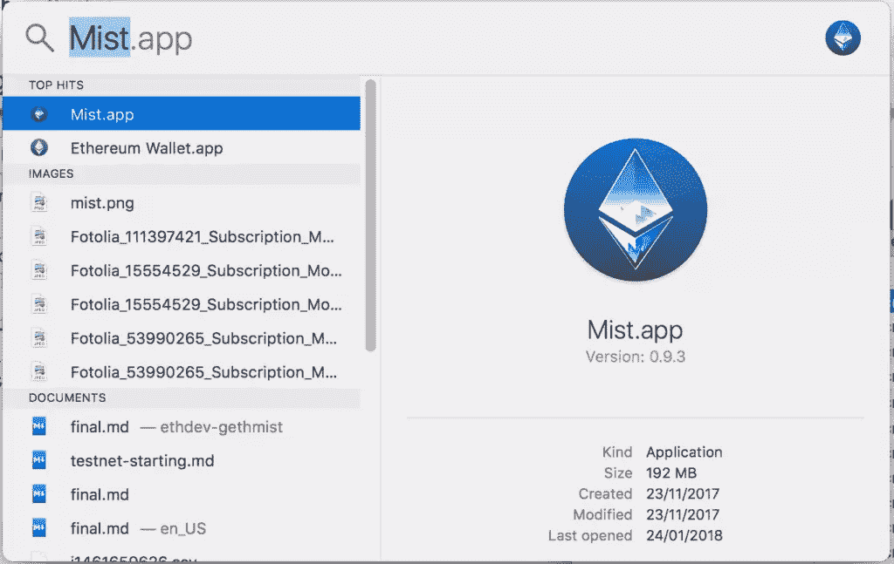

## 薄雾:第一轮

第一次运行后，Mist 检查是否在同一台机器上安装了最新的 Geth，然后检查与以太坊网络的联系。

然后，Mist 寻找对等点——它可以连接的节点，以便从它们那里下载区块链数据。

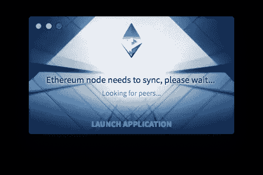

找到它们后，Mist 开始下载大量需要的数据。

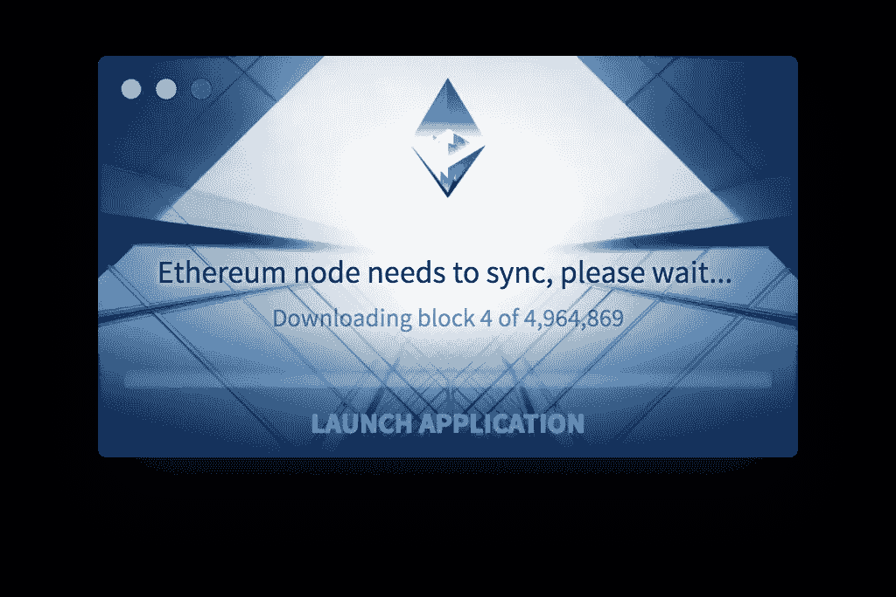

这可能需要几天时间，取决于计算机和互联网连接的速度。不需要一次完成:你可以关掉它，以后再来，或者把它放一夜。您也可以直接启动应用程序，并在实际使用应用程序时在后台等待同步。

同步完成后，Mist 会询问使用哪个网络:主网络还是测试网络。随便挑一个。除非您事先通过`personal.newAccount`命令在 Geth 中创建了一个地址(您可能没有创建，这没关系)，否则它还会要求您输入密码。这个密码可以额外保护你的钱包，但是不要忘记:它不能被改变，也不能被恢复。明智地选择。这个过程生成的 JSON 文件用这个密码加密，可以导入到各种钱包工具中，比如 MetaMask、MyEtherWallet 等。要获取 JSON 文件(出于备份目的),请转至`File -> Backup -> Accounts`, Mist 将打开包含生成地址的 JSON 文件的文件夹。

## 薄雾:地址

完成这些初始步骤后，将出现 Mist 应用程序的主屏幕。它只会在屏幕上显示您刚刚生成的主地址。这个地址被称为一个 coinbase 地址，如果你要在这台机器上挖掘这个地址，当它被挖掘时，这个地址就会被赋予 Ether。

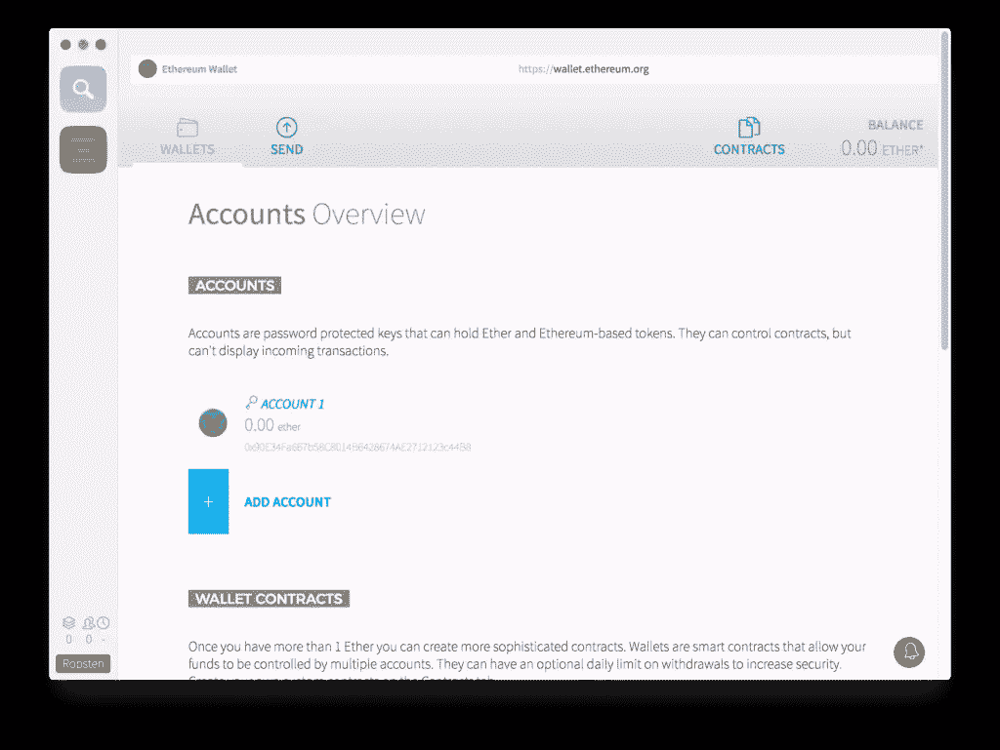

为了能够安全地使用 Ether 和 Mist 的功能，如果您还没有连接到测试网络，我们需要切换到测试网络。在开发菜单中，进入*网络- > Ropsten* 。

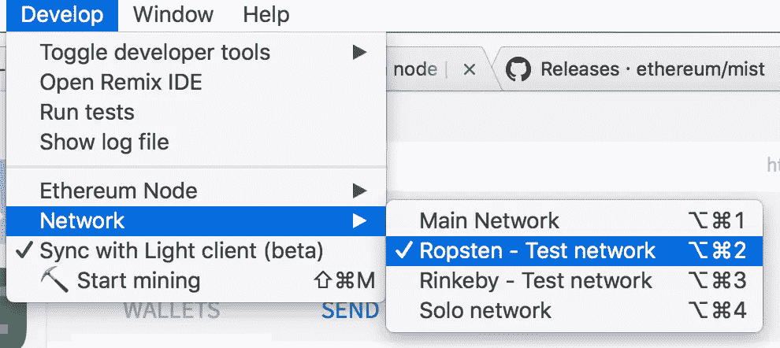

关于测试网的解释，请阅读本文。它的要点是，存在各种用于测试以太坊软件的公共测试网络，但是那些网络上的以太是没有价值的，所以做鲁莽的事情和粗心的开发是没有危险的。Ropsten 就是这样一个网络。

请随意使用*添加账户*功能添加更多地址。一个 Geth/Mist 可以支持无限数量的地址。下图显示了三个生成的地址。

如果我们点击其中任何一个，我们会看到一些细节。

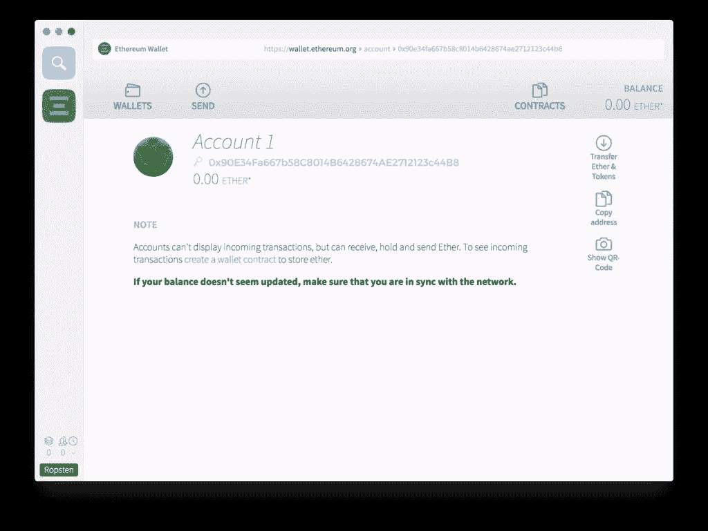

天平上方图标旁边的部分(以 0x90 开头的部分)是我们可以发送以太的地址。但是我们如何得到一些呢？如果你连接到 Ropsten 网络，你可以使用他们的水龙头网站:[faucet.ropsten.be:3001/](http://faucet.ropsten.be:3001/)

将此地址输入该站点的第一个字段，并请求一些乙醚。

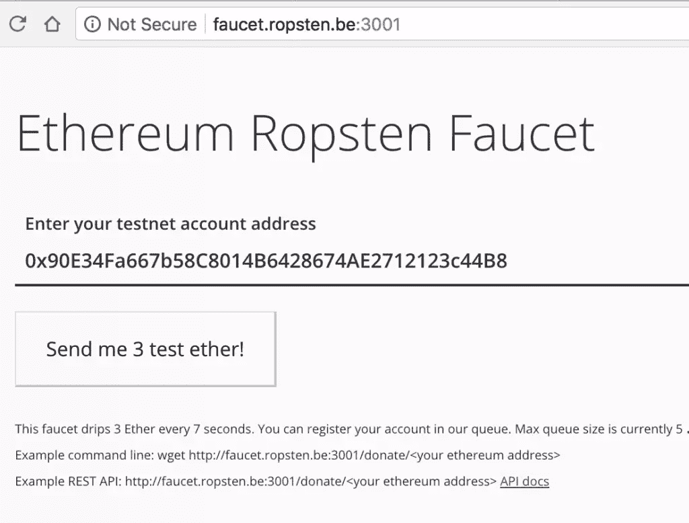

如果您的节点已同步，新的余额应该会立即显示出来。如果没有，关闭应用程序，然后重新打开；有时需要重置才能正确地重新同步。

## 发送和接收以太网

发送极其简单。在 Mist 中打开*发送*界面，在“收件人”中输入收件地址，并在“发件人”下选择发件人(使用你从水龙头发送以太到的地址)。

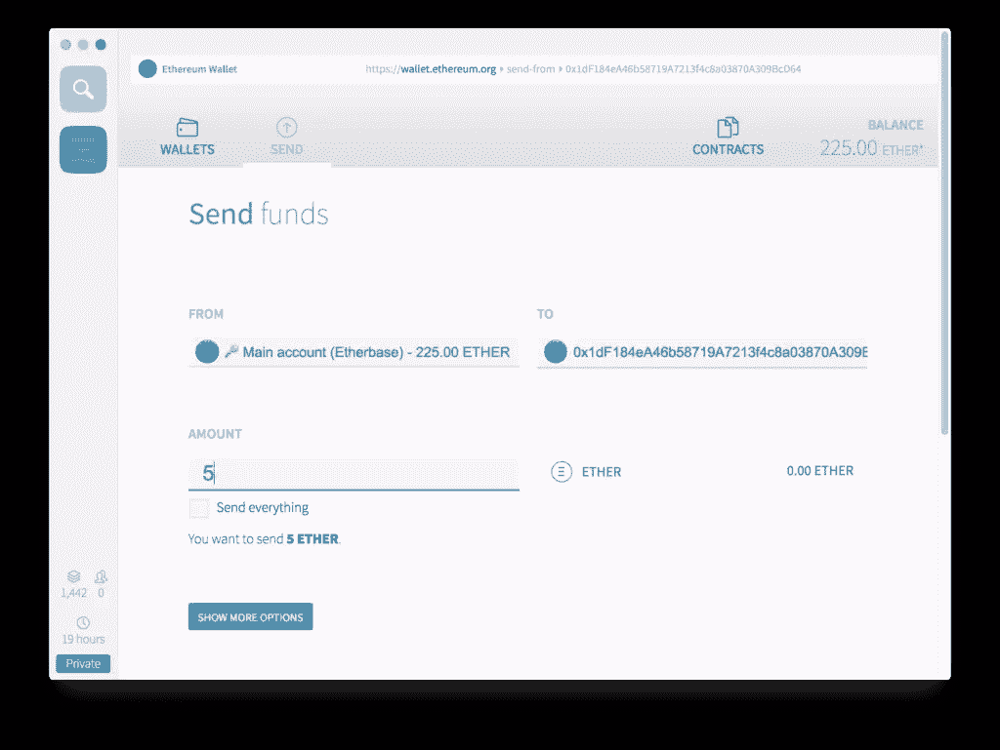

您可以在屏幕底部选择发送速度。越便宜越慢。按 send 发送以太网，并在询问时输入您之前决定的密码。

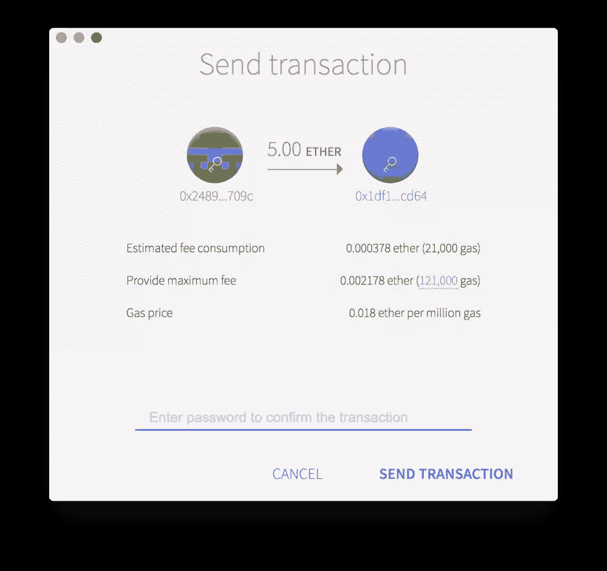

在这个例子中，我们从一个 225 Eth 的地址发送 5 Eth 到另一个 0 Eth 的地址。乙醚应该马上就到了。

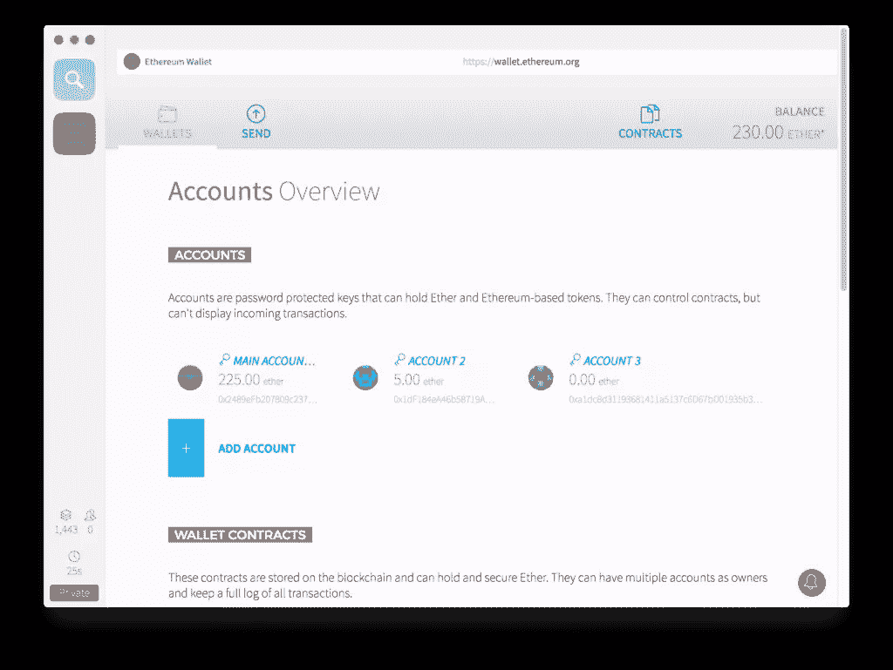

## 契约

Mist 支持将智能合约轻松且用户友好地部署到以太坊区块链。这是由 Mist 套件的两个组件实现的:

### 1.混音 IDE

Remix 是一个基于 web 的开发环境，用于部署智能合约。Remix 具有语法高亮、代码片段、契约编译和部署脚本生成以及许多其他有趣的功能。

你可以通过点击工具栏上的*开发*，然后点击“打开 remix IDE”来访问 Remix。您应该会看到一个类似如下的窗口:

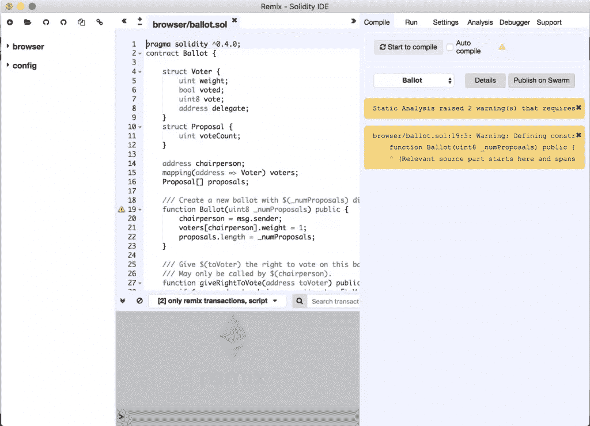

### 2.合同部署

在 Remix 中，你可以编写、编译和测试你的智能合约。完成后，你可以回到 Mist，从*钱包*页面打开*合同*标签。你应该得到一个这样的屏幕

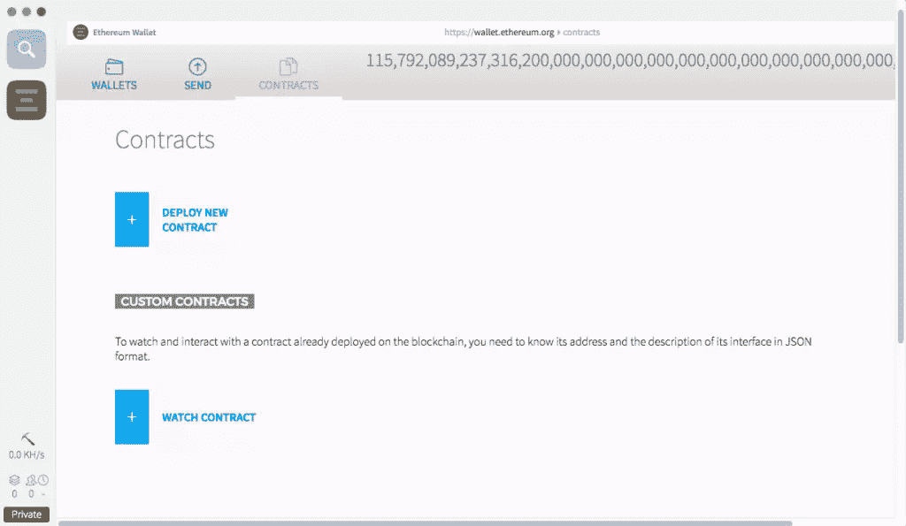

当您点击*部署新合同*时，将打开一组输入。在那里，您可以粘贴您的合同源代码或字节码，并将其部署到以太网。完成后，您可以与您的合同进行交互。

## 结论

Geth 和 Mist 是每个雄心勃勃的以太坊网络参与者的必备工具。如果您想尝试挖掘或开发以太坊软件(ico、令牌、dapps)，或者如果您只想控制自己的节点，从而控制自己的钱包密钥，从而签署自己的交易而不是依赖第三方软件，安装并了解 Geth 和 Mist 绝对是值得的。

## 分享这篇文章