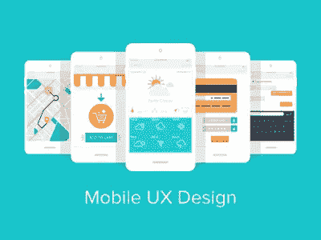
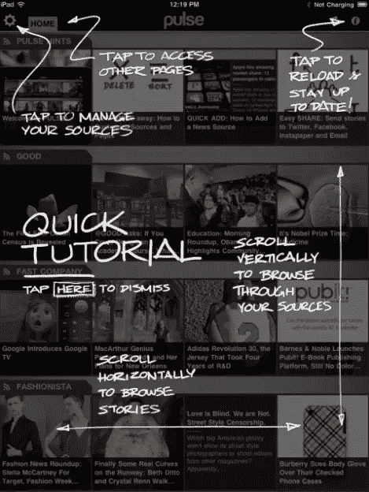
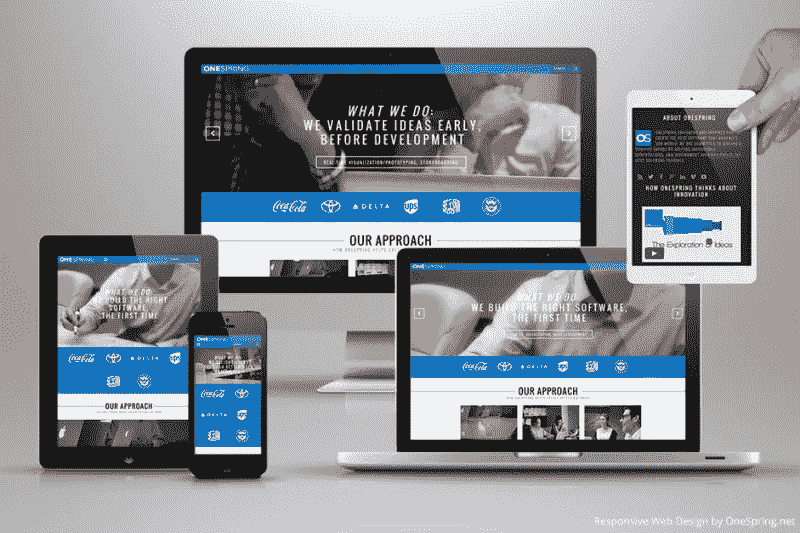
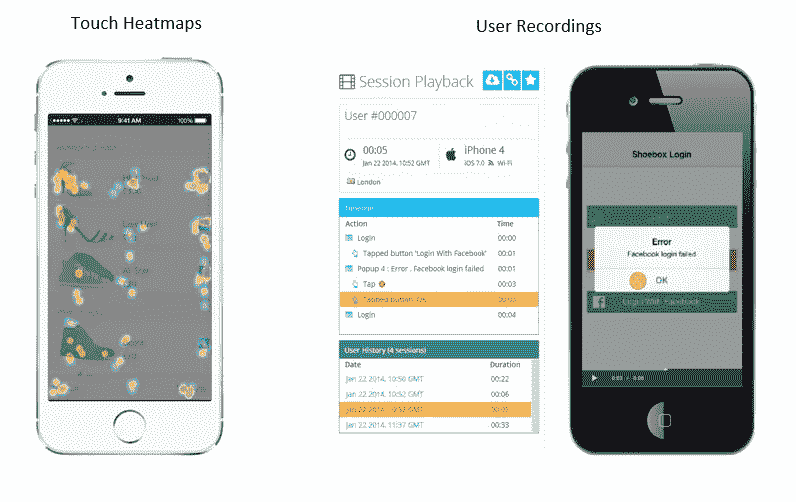

# 移动 UX 设计和所有可能出错的地方

> 原文：<https://www.sitepoint.com/mobile-ux-design-ways-go-wrong/>

作为一个应用程序开发者，拥有大量下载似乎是一种胜利——在某种程度上的确如此——但一旦你意识到下载并没有转化为活跃用户，这种胜利感和成就感就会慢慢消失。

当你意识到申请休眠没有多大价值时，最初的兴奋感就消失了。

好消息是这是可以避免的。有多种方法可以创建一个吸引用户并让他们回来的应用程序，但有必要确定具体是什么让一个应用程序在这样一个竞争激烈的市场中脱颖而出。

扎实的开发当然发挥了作用，但找到一个开发良好的应用程序并不困难。

那是什么？

如果你测试了足够多的顶级应用，你将开始解读其中的一个模式:奇妙的用户体验(UX)设计。最好的应用程序超越了基本的吸引力，将用户带入一种超自然的超视力状态。在这种状态下，每次点击都是直观的，不需要第二次猜测。

优秀的移动 UX 设计有很多因素，也有很多可能出错的地方。

我们将研究其中一些因素，并帮助你避免所有常见的 UX 陷阱，最明显的是未能留住用户和获得转化，因此你——更重要的是，你的用户——可以从你的应用中获得最大价值并保持参与度。

## 错误 1:跳过测试

你对你的应用程序了如指掌。你构思它，设计它，开发它，推出它，营销它。你天生就知道它的目的和如何操作它……但那只是你。

当其他人试图使用你的应用程序而这并不明显时会发生什么？

一个应用开发者可能犯的最容易也是最具破坏性的错误之一就是没有让其他人，不管是家人、朋友还是测试小组，先测试你的应用。他们拥有你永远不会再拥有的资源——新的眼睛。

让他们在最初的互动中分享他们的想法，以了解什么有效，他们在想什么。这是学习如何为你的用户优化而不是为你自己优化的宝贵一课。

当您准备好测试您的应用程序时，请考虑三个关键因素:网络环境、设备目标和测试类型(功能、性能、安全性和合规性)。)关于 app 测试的更多信息，可以在这里了解[。](https://www.appsee.com/ebooks/mobile-app-testing)

## 错误 2:假设用户知道如何浏览你的应用

最好从[入职体验](http://www.smashingmagazine.com/2014/11/20/refining-your-mobile-onboarding-experience-using-visual-analytics/)开始，在那里用户会形成他们对应用的第一印象。因为第一印象在像应用世界这样的竞争激烈的市场中非常重要，所以为初次见面优化 UX 至关重要。

你不能只是假设用户知道你的应用程序如何工作，因此必须为入门课程提供一些指南和教程。入职流程对于留住你的用户很重要，如果做得不好，用户很可能会退出你的应用，不再回来。

内嵌提示传统上用于新接触应用程序的人。每当用户到达一个新的探索点时，就会出现一些内联文本，解释正在发生的事情或需要采取什么行动才能前进。它足够谨慎，不会打断会议，但足够突出，以帮助在必要时。

同样受欢迎的还有教程，在教程中，应用程序上会出现一个屏幕覆盖图，引导你完成每个步骤，或者快速说明每个阶段发生的事情。

## 错误 3:混淆了移动 UX 和网络 UX

对一些人来说，这似乎是显而易见的，但并不是每个人都意识到移动体验将与网络体验大相径庭。用户以完全不同的方式与移动设备互动，设计师在创建应用时需要考虑这一点。

很明显 UI 对大 UX 有贡献。在设计应用程序时，应该考虑一些影响应用程序的 UI 约束。

一个重要的因素是屏幕尺寸。有鼠标导航和没有鼠标导航，屏幕空间都很小，用户需要用手指进行交互。成功的应用程序几乎总是使用最小化的用户界面设计，也就是说，只有使用所必需的东西才应该出现，并且无论如何都要避免屏幕上的混乱。

考虑如何使用图标来表示按钮，虚拟键盘应该如何在需要时出现在屏幕上，以及帮助和错误消息应该如何出现。

用户行为是另一个考虑因素。在设计你的 UX 应用时，要考虑到移动设备需要独特的手势——挤压、滑动和点击，而你的桌面用户可能有一部分不熟悉这些手势。

如果某个东西在桌面网站上通常是可点击的，请注意，类似设计的应用程序可能会产生类似的期望。

## 错误 4:忽视创建一个优化的结账流程

你最不希望你的应用程序出现问题的地方就是结账处。如果一个顾客或用户准备购买一件商品——无论是一件衣服还是在游戏中升级的奖励积分——体验必须是简单和无所畏惧的。

在购买点之前有太多的步骤是一个潜在的问题，还有不清晰的导航和流程，以及不够突出的行动号召按钮。

为了顺利进行，提供多种支付选项，例如连接到 PayPal 帐户的能力，并确保在这个最关键的步骤中避免任何技术问题，以防止用户没有支付就离开你的应用程序。

**错误 5:没有正确监控你的 UX**

到现在为止提到的一切，本质上都指向这一点，这一点不仅能帮你定位问题，还能解决问题。

分析解决方案，如[谷歌分析](http://www.google.com.au/analytics/mobile/ "Google Mobile App Analytics")和 [Flurry](http://www.flurry.com/solutions/analytics "Yahoo's FLURRY ANALYTICS") ，提供揭示基本信息的见解，如指标和数字。使用可视化应用分析工具，如 [Appsee](https://www.appsee.com/ "Appsee website") (披露:我是 Appsee 的社区经理)，可以帮助你衡量、了解和提高你的 UX。

所有这些工具都让你能够通过用户的眼睛来看你的应用，理解他们采取行动背后的原因，并识别哪些 UX 问题导致了你的应用被放弃。

像这样的见解有时很难从标准的分析服务中获得，如谷歌分析，它只关注关键指标和数字，而不是行为。

可视化移动分析工具使您能够回放来自实际应用程序用户会话的视频并分析触摸热图，可以帮助您识别问题区域

这可以帮助你找出你的应用程序的问题所在——也许用户在某个特定的屏幕上卡住了，或者你的应用程序加载时间太长了——并在没有任何猜测的情况下纠正它们。

如果你想让你的应用脱颖而出，交付一个优秀的移动 UX 设计应该是你的目标。避免所有这些常见的错误并实现上面列出的提示会给你一个可靠的方法来确定你的应用程序可能面临的困难，以及如何优化它的 UX 设计来留住你的用户。

## 分享这篇文章