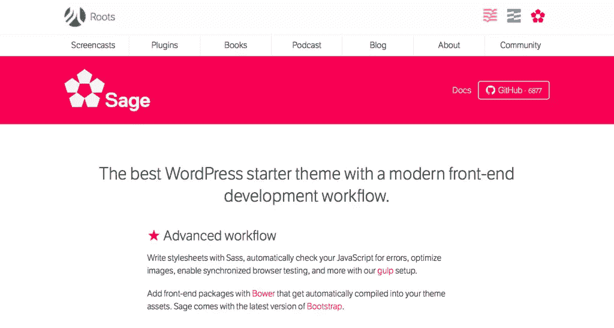

# 用 Sage 实现 WordPress 主题开发的现代化

> 原文：<https://www.sitepoint.com/modernizing-wordpress-theme-development-with-sage/>

几年前，我们发表了一篇关于 WordPress 的主题框架 [Roots 的文章。现在 Roots 已经变成了一家公司，他们把 Roots 主题框架变成了两套工具，即](/roots-a-html5-wordpress-theme-framework/)[圣人](https://roots.io/sage/)和[基岩](https://roots.io/bedrock/)。

在本文中，我将带您了解 Sage。它利用 HTML5 样板、gulp、Bower 和引导前端框架。首先，我将对我刚刚提到的每个工具进行简要概述，然后我们将完成框架的安装和定制。最后，我们将介绍基本的 Sage 工作流程。



## 工具

*   **HTML5 样板**——前端模板。
*   **Gulp**–一个构建系统，用于自动化任务，如前端资产的缩小和连接、优化图像、运行测试和许多其他任务。
*   **Bower**–前端资产的包管理器。它用于将 jQuery 或 Lodash 之类的 JavaScript 库引入到项目中。
*   **浏览器同步**–同步多个设备中的文件更改和交互。
*   **资产构建器**–用于收集你的主题中的资产，并将它们放在一起。
*   用于将 Sass 和来自 Bower 的较少依赖注入到主主题样式表中。
*   **Bootstrap**-一个前端框架，让我们可以轻松创建响应性网站。

## 装置

要安装 Sage，导航到你的 WordPress 主题目录，从你的终端执行下面的命令。不要忘记用你的主题名称替换`theme-name`:

```
git clone https://github.com/roots/sage.git theme-name 
```

注意，上面的命令使用了 [Git](http://git-scm.com/) 。如果你的机器上没有安装 Git，你可以从 [git repo](https://github.com/roots/sage) 下载 zip 文件，在你的 WordPress 主题目录下创建一个新文件夹，复制解压后的 zip 文件的内容。

完成后，您需要将以下内容添加到您的`wp-config.php`文件中:

```
define('WP_ENV', 'development'); 
```

这将 WordPress 设置为一个开发环境。

## 目录结构

目录结构与任何 WordPress 主题非常相似。在主题的根目录中，您仍然可以看到看起来很熟悉的文件:

*   `index.php`
*   `functions.php`，
*   `404.php`
*   `search.php`
*   `single.php`
*   `page.php`

唯一的区别是它有一个存储主题配置和实用程序的`lib`目录。注意，包括前端资产是从`assets.php`而不是`functions.php`完成的。注册窗口小部件、菜单和添加主题支持从`init.php`开始。从`titles.php`可以指定页面标题。

还有一个`assets`目录，其中包含了`.scss`文件，这些文件后来被编译成一个单独的`main.css`文件。这是在您使用 gulp 来连接和缩小`.scss`文件之后。`lang`目录包含一个`sage.pot`文件，主要用于翻译 Sage 中使用的文本。默认情况下，这里没有翻译，只有要翻译的文本。如果你需要在你的主题中支持另一种语言，那么你可以查看一下 [sage-translations](https://github.com/roots/sage-translations) repo，它包含不同语言的 sage 翻译。只需复制翻译并将其放在`sage.pot`文件中。如果您正在使用需要翻译的其他文本，那么您也可以将其添加到该文件中。

最后，有一个`templates`目录，你通常在 WordPress 主题中拥有的所有模板都存储在那里。唯一的区别是模板是基于 HTML5 样板的，所以它有一些默认的 ARIA 角色来提高主题的可访问性。

## 用户化

接下来，我们将研究如何定制 Sage 来满足您的需求。在你的新主题中打开`lib/init.php`文件。以下是您可以自定义的一些内容:

### Title Tag

`title-tag`允许你的主题修改网页中的[标题标签](https://codex.wordpress.org/Title_Tag)。这是添加到 WordPress 4.1 的一个特性，你可以通过添加或删除下面一行来切换这个功能:

```
add_theme_support('title-tag') 
```

### 导航菜单

默认情况下，Sage 会在导航菜单中添加一个主导航。这是您可以添加更多内容的地方。

```
register_nav_menus([
  'primary_navigation' => __('Primary Navigation', 'sage')
]); 
```

### 发布缩略图

[帖子缩略图](https://codex.wordpress.org/Post_Thumbnails)或更好地称为 WordPress 3.0 版的特色图片，是代表帖子、页面或任何自定义帖子类型的图片。您可以通过添加或删除以下内容来在您的主题上启用或禁用此功能:

```
add_theme_support('post-thumbnails') 
```

### 帖子格式

这些是默认情况下启用的帖子类型。您可以根据需要在数组中添加或删除项目。

```
add_theme_support('post-formats', ['aside', 'gallery', 'link', 'image', 'quote', 'video', 'audio']); 
```

### HTML5 Markup

这允许您添加对 HTML5 标记的支持。默认情况下，它允许出现在标题、评论表单和评论列表中。

```
add_theme_support('html5', ['caption', 'comment-form', 'comment-list']); 
```

### 编辑器样式表

这允许你为定制 WordPress 使用的 TinyMCE 编辑器指定样式表的路径。

```
add_editor_style(Assets\asset_path('styles/editor-style.css')); 
```

### 寄存器侧栏

最后，我们有在`widgets_init`上注册侧边栏的代码。默认情况下，Sage 有两个侧栏:主栏和页脚。

```
function widgets_init() {
  register_sidebar([
    'name'          => __('Primary', 'sage'),
    'id'            => 'sidebar-primary',
    'before_widget' => '<section class="widget %1$s %2$s">',
    'after_widget'  => '</section>',
    'before_title'  => '<h3>',
    'after_title'   => '</h3>'
  ]);

  register_sidebar([
    'name'          => __('Footer', 'sage'),
    'id'            => 'sidebar-footer',
    'before_widget' => '<section class="widget %1$s %2$s">',
    'after_widget'  => '</section>',
    'before_title'  => '<h3>',
    'after_title'   => '</h3>'
  ]);
}
add_action('widgets_init', __NAMESPACE__ . '\\widgets_init'); 
```

## 工作流程

现在让我们继续工作流程。在这一节中，你将学习如何使用我之前提到的工具，用 Sage 开发 WordPress 主题。

首先，让我们将工具安装到您的开发机器中。我们将要使用的大多数工具的主要依赖项是 Node.js。幸运的是，它可以通过安装程序轻松安装。继续并[下载适用于您平台的安装程序](https://nodejs.org/download/)，打开它并按照提供的说明进行操作。通常，在安装程序完成 Node.js 的安装之前，您只需点击“下一步”。一旦完成，您就可以从终端使用`npm install`命令安装其余的工具:

```
npm install gulp bower browser-sync asset-builder wiredep --save 
```

上面的命令将 gulp、Bower、Browsersync、Asset Builder 和 wiredep 安装到您的项目中。

### 使用凉亭

使用 Bower 时，你只需要记住`search`、`install`、`list`和`uninstall`命令。首先是`search`号的命令。如果您不确定要安装的软件包的名称，可以使用它。这个命令使用包的名称。虽然不一定要精确。例如，如果你想搜索“jQuery ”,你可以使用“Query ”,它会列出所有名称中包含该字符串的包。在这种情况下，也会列出 jQuery。

```
bower search query 
```

一旦您知道了包的名称，您就可以用`install`命令来安装它:

```
bower install jquery 
```

这会将 jQuery 安装到`bower_components`目录中。如果你不希望软件包安装在那里，你可以编辑 WordPress 主题根目录下的`.bowerrc`文件，并将`directory`更改为你想要安装的路径。

接下来是`list`命令。这以树的形式显示了您使用 Bower 安装的软件包列表。这意味着如果一个特定的包是另一个包的依赖项，那么你也会看到它。

最后，我们有`uninstall`命令。这允许您从项目中删除 Bower 包。例如，如果您不再需要 jQuery:

```
bower uninstall jquery 
```

### 使用吞咽

为了使用 gulp，我们首先需要安装 Sage 使用的 gulp 插件:

```
npm install gulp-autoprefixer gulp-changed gulp-imagemin gulp-less --save 
```

一旦完成，我们现在可以使用`gulp`命令来编译和优化您的项目资产。执行`gulp`命令显示如下输出:

```
[08:50:10] Using gulpfile ~/www/wordpress/wp-content/themes/my-theme/gulpfile.js
[08:50:10] Starting 'clean'...
[08:50:10] Finished 'clean' after 45 ms
[08:50:10] Starting 'default'...
[08:50:10] Starting 'build'...
[08:50:10] Starting 'wiredep'...
[08:50:11] Finished 'default' after 1.39 s
[08:50:12] Finished 'wiredep' after 1.57 s
[08:50:12] Starting 'styles'...
[08:50:22] Finished 'styles' after 10 s
[08:50:22] Starting 'jshint'...
[08:50:23] Finished 'jshint' after 638 ms
[08:50:23] Starting 'scripts'...
[08:50:29] Finished 'scripts' after 6.51 s
[08:50:29] Starting 'fonts'...
[08:50:29] Starting 'images'...
[08:50:29] Finished 'fonts' after 162 ms
[08:50:37] gulp-imagemin: Minified 2 images (saved 405.06 kB - 35.1%)
[08:50:37] Finished 'images' after 7.79 s
[08:50:37] Finished 'build' after 27 s 
```

在第一行，您可以看到它正在使用`gulpfile.js`文件。这个文件包含了所有由 Gulp 执行的指令。第一个任务是“清理”，这将删除`dist`目录中的所有文件。这是存储所有编译和优化文件的地方。接下来，调用“默认”任务。这基本上只是调用“构建”任务。然后“构建”任务调用样式、脚本、字体和图像任务。

此时，您可以打开`gulpfile.js`，这样我就可以带您完成每项任务。首先是“风格”。这依赖于“wiredep ”,它允许我们在`dist/styles`目录下的`main.css`文件中注入更少的和 Sass Bower 依赖项。一旦完成，它就会编译您的`assets/styles`目录中的 Sass 和 Less 文件。

```
gulp.task('styles', ['wiredep'], function() {
  var merged = merge();
  manifest.forEachDependency('css', function(dep) {
    var cssTasksInstance = cssTasks(dep.name);
    if (!enabled.failStyleTask) {
      cssTasksInstance.on('error', function(err) {
        console.error(err.message);
        this.emit('end');
      });
    }
    merged.add(gulp.src(dep.globs, {base: 'styles'})
      .pipe(cssTasksInstance));
  });
  return merged
    .pipe(writeToManifest('styles'));
}); 
```

如果你想添加页面特定的 CSS，你可以通过在`assets`目录下找到的`manifest.json`文件来完成。

这里有一个我添加了`other-page.css`的例子。然后，您可以通过在`files`属性中指定一个路径数组来指定将用作源文件的文件。在这种情况下，我只使用了`styles`目录中的`other-page.less`文件。

```
{
  "dependencies": {
    "main.js": {
      "files": [
        "scripts/main.js"
      ],
      "main": true
    },
    "main.css": {
      "files": [
        "styles/main.scss"
      ],
      "main": true
    },
    "editor-style.css": {
      "files": [
        "styles/editor-style.scss"
      ]
    },
    "other-page.css": {
      "files": [
        "styles/other-page.less"
      ]
    },
    "modernizr.js": {
      "bower": ["modernizr"]
    }
  },
  "config": {
    "devUrl": "http://example.dev"
  }
} 
```

接下来是“脚本”任务。这取决于检查 JavaScript 代码质量的“jshint”任务。例如，总是使用花括号，或者禁止在代码中使用`==`或`!=`,因为它们会导致与您试图比较的变量相等相关的错误。

```
gulp.task('scripts', ['jshint'], function() {
  var merged = merge();
  manifest.forEachDependency('js', function(dep) {
    merged.add(
      gulp.src(dep.globs, {base: 'scripts'})
        .pipe(jsTasks(dep.name))
    );
  });
  return merged
    .pipe(writeToManifest('scripts'));
}); 
```

您可以通过编辑位于主题根目录下的`.jshintrc`文件来自定义 JSHint。Sage 已经默认添加了一些选项，所以一定要查看[所有可用选项](http://jshint.com/docs/options/)的列表，并根据自己的需求定制 JSHint。

```
{
  "bitwise": true,
  "browser": true,
  "curly": true,
  "eqeqeq": true,
  "eqnull": true,
  "esnext": true,
  "immed": true,
  "jquery": true,
  "latedef": true,
  "newcap": true,
  "noarg": true,
  "node": true,
  "strict": false
} 
```

检查完代码质量后,“脚本”任务将 Bower 依赖项中的所有 JavaScript 文件与您的`scripts/main.js`文件连接在一起。最后，它将使用 uglify.js 缩小结果脚本。注意，您可以通过您的`manifest.json`文件定制默认行为。例如，如果您不希望所有的 Bower 依赖项与主脚本结合在一起。然后你可以移除你`main.js`中的`main`属性。然后添加一个`bower`属性，这将占用脚本所依赖的 Bower 组件的数组。在下面的例子中，我将 jQuery 设置为依赖项。

```
"main.js": {
  "files": [
    "scripts/main.js"
  ],
  "main": true, //remove this line
  "bower": ["jquery"]
}, 
```

接下来是“字体”任务。这样做的目的是获取`assets/fonts`目录中的所有字体以及 Bower 依赖项使用的任何字体。它把它们都放在`dist/fonts`目录中。这个任务使用了`gulp-flatten`，它简化了目录结构。这意味着您只能在`dist/fonts`目录中找到字体。这很好，因为当你链接你的字体时，你不再需要指定很多目录。

```
gulp.task('fonts', function() {
  return gulp.src(globs.fonts)
    .pipe(flatten())
    .pipe(gulp.dest(path.dist + 'fonts'))
    .pipe(browserSync.stream());
}); 
```

最后，我们有“图像”任务。这将使用无损压缩来压缩`assets/images`目录中的图像。这有效地减小了图像的尺寸，而图像质量没有任何可察觉的降低。然后，优化后的图像存储在`dist/images`目录中。

```
gulp.task('images', function() {
  return gulp.src(globs.images)
    .pipe(imagemin({
      progressive: true,
      interlaced: true,
      svgoPlugins: [{removeUnknownsAndDefaults: false}, {cleanupIDs: false}]
    }))
    .pipe(gulp.dest(path.dist + 'images'))
    .pipe(browserSync.stream());
}); 
```

除了`gulp`命令，还有`gulp watch`命令。你可以用它来加速你的开发过程。它和`gulp`命令做同样的事情，只不过它在你每次对一个资产做改变的时候都会这么做。但是在你可以使用它之前，你必须更新`assets/manifest.json`文件，以便`devUrl`和你的 WordPress 安装的 URL 是一样的。

```
"config": {
  "devUrl": "http://localhost/wordpress/"
} 
```

一旦完成，您现在可以执行`gulp watch`命令，对您的资产进行一些更改，并观察浏览器注入您刚才所做的更改。这通过为您在配置中指定的 devUrl 创建一个代理 URL 来实现。这包含将更改注入页面的脚本。

```
http://localhost:3000/wordpress/ 
```

如果您想要同时测试连接到家庭网络的另一台设备，您可以确定电脑的本地 IP 地址，并从设备上的浏览器访问该地址。该 URL 应该类似于以下内容:

```
http://192.168.xxx.xxx:3000/wordpress/ 
```

### 加快速度

当我测试 Sage 时，我注意到`gulp watch`需要大约 10 秒来完成所有的任务。这是不好的，因为你不能立即看到变化。出于这个原因，我们必须对`gulpfile.js`文件进行一些修改。首先是`enabled`这个变量。这用于在使用`gulp watch`命令时通过指定选项来启用或禁用特定任务。

```
var enabled = {
  // Enable static asset revisioning when `--production`
  rev: argv.production,
  // Disable source maps when `--production`
  maps: argv.maps,
  // Fail styles task on error when `--production`
  failStyleTask: argv.production,
  // minify only when `--minify` is specified
  minify: argv.minify
}; 
```

在上面的代码中，我已经设置了默认禁用源地图和缩小文件。因此，如果您想使用这些任务，您需要将它们指定为选项:

```
gulp watch --minify --maps 
```

现在我们必须改变`cssTasks`和`jsTasks`，这样它就可以利用我们对`enabled`变量所做的改变。首先是源地图，我们使用`gulpif`来检查源地图是否被启用，并且只在它被启用时调用生成源地图的函数。

```
.pipe(function() {
  return gulpif(enabled.maps, sourcemaps.init());
}) 
```

接下来是“缩小”任务。

```
.pipe(function(){
  return gulpif(enabled.minify, minifyCss({
    advanced: false,
    rebase: false
  }));
}) 
```

您的`cssTasks`现在应该如下所示:

```
var cssTasks = function(filename) {
  return lazypipe()
    .pipe(function() {
      return gulpif(!enabled.failStyleTask, plumber());
    })
    .pipe(function() {
      return gulpif(enabled.maps, sourcemaps.init());
    })
    .pipe(function() {
      return gulpif('*.less', less());
    })
    .pipe(function() {
      return gulpif('*.scss', sass({
        outputStyle: 'nested', // libsass doesn't support expanded yet
        precision: 10,
        includePaths: ['.'],
        errLogToConsole: !enabled.failStyleTask
      }));
    })
    .pipe(concat, filename)
    .pipe(autoprefixer, {
      browsers: [
        'last 2 versions',
        'ie 8',
        'ie 9',
        'android 2.3',
        'android 4',
        'opera 12'
      ]
    })
    .pipe(function(){
      return gulpif(enabled.minify, minifyCss({
        advanced: false,
        rebase: false
      }));
    })
    .pipe(function() {
      return gulpif(enabled.rev, rev());
    })
    .pipe(function() {
      return gulpif(enabled.maps, sourcemaps.write('.'));
    })();
}; 
```

接下来是`jsTask`，修改“丑化”任务，使其在执行缩小脚本的函数之前首先检查是否启用了缩小:

```
.pipe(function(){
  return gulpif(enabled.minify, uglify())
}) 
```

您的`jsTasks`现在应该如下所示:

```
var jsTasks = function(filename) {
  return lazypipe()
    .pipe(function() {
      return gulpif(enabled.maps, sourcemaps.init());
    })
    .pipe(concat, filename)
    .pipe(function(){
      return gulpif(enabled.minify, uglify())
    })
    .pipe(function() {
      return gulpif(enabled.rev, rev());
    })
    .pipe(function() {
      return gulpif(enabled.maps, sourcemaps.write('.'));
    })();
}; 
```

## 结论

就是这样！在本教程中，你已经学习了如何使用 Sage 来更新你开发 WordPress 主题的过程。你还学会了如何使用 Bower、gulp 和 Browsersync 这样的工具来加速你的开发。

## 分享这篇文章