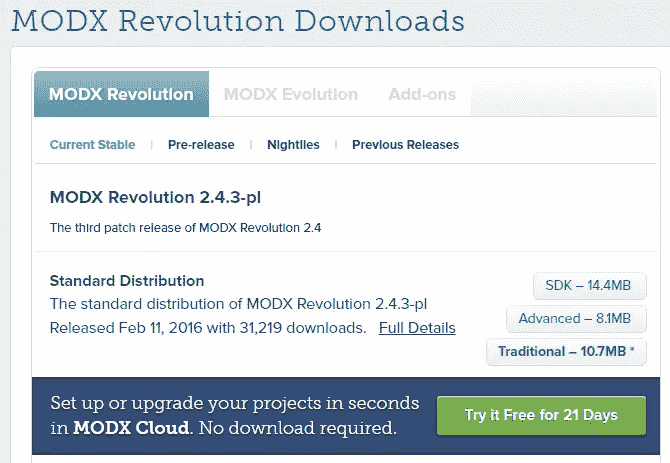
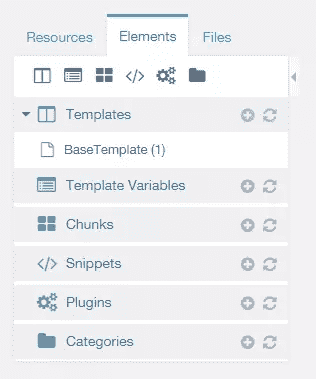
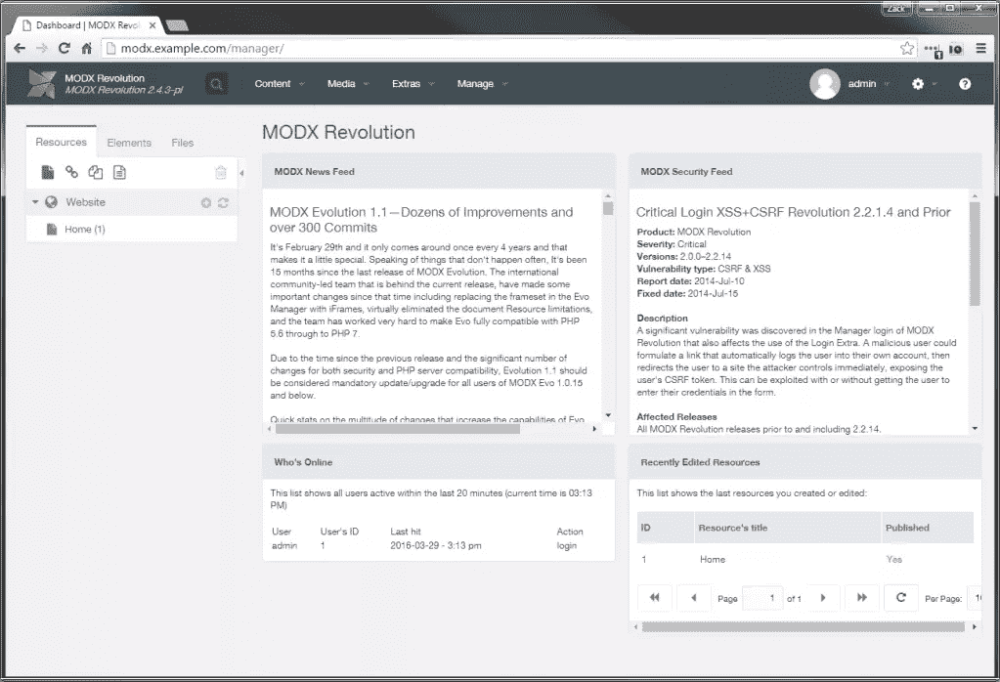
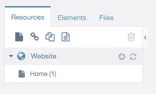

# MODX:你没用过的最好的 CMS？

> 原文：<https://www.sitepoint.com/modx-the-best-cms-youve-never-used/>

MODX 是一个内容管理系统，由 Ryan Thrash、Raymond Irving 和 Jason Coward 于 2005 年首次发布。他们创建它是为了给他们设计的自由，同时保留他们认为其他 CMS 不允许的强大的安全性。


2009 年，MODX 被发布为<q>进化</q>和<q>革命</q>。Evolution 是在原始代码基础上构建和维护的，而 Revolution 是完全重写的。本文以革命为背景。

在 MODX 管理器中，您可以访问内置的软件包库，其中包含了大多数开发人员执行常见任务所需的内容。创建你自己的插件和脚本是相当琐碎的，而且也有一些不错的付费额外服务。

访问 [MODX 主页](http://modx.com/)和[关于](http://modx.com/company/)页面，了解更多历史和特性信息。

## 我们见过吗？

如果你以前从未听说过 MODX，请意识到它是一个长期存在且非常强大的引擎，经常被与 Joomla 和 Drupal 之类的引擎相比较。有些人也将其与 WordPress 相提并论，但这不是苹果对苹果。WordPress 旨在让非技术人员开箱即用。事实上，MODX 被一些人描述为你从未用过的最好的 CMS。

总的来说，我会把 MODX 总结为一个供开发者构建的框架，而不是一个开箱即用的点击式网站构建器。对于没有 PHP 或 HTML 技能的人来说，MODX 不是 CMS 的最佳选择。没有<q>菜单生成器</q>或模块列表可以拖放到预定义的主题位置。

与其说 MODX 是 CMS，不如说它是 CMF(内容管理框架)。如果你愿意的话，你可以只使用 API 来控制端点和脚本，根本没有页面或 T2 帖子。

## 深入挖掘

像许多流行的框架一样，MODX 是用 PHP 构建的。可以在 Apache、IIS、Lighttpd、nginx 等流行的服务器上运行。它选择的数据库是 MySQL，它使用 [xPDO](http://xpdo.org/) 作为 [ORB](http://xpdo.org/about/#ORB) (对象关系桥)。xPDO 直接建立在 PDO 之上，并使用活动记录风格模式进行数据库访问。例如，它可以与教条或推进相提并论。

<q>管理器</q>是用 ExtJS、Smarty 模板和 MODX 自己的 API 构建的。编辑管理器本身及其仪表板、菜单和其他功能是 UI 中内置的一项功能。您可以很好地控制管理器中的所有内容，包括您希望客户访问的内容。

定制菜单和**非常**精细的 ACL(访问控制列表)完善了您的后端选项。安全性可能是 MODX 粉丝最喜欢的特性之一，尽管完全理解它需要一个相当长的学习曲线。

MODX 本身有一个 <abbr title="limited liability company">LLC</abbr> 做后盾，也就是 MODX，LLC。他们提供云托管和咨询服务等其他产品。MODX 不是 <q>SGP</q> (某家伙的项目)；它比其他一些突然出现的现代 CMS 更有持久力，由一个人创建，在业余时间管理。如果您为您的项目选择 MODX，您可以非常自信，它不会很快消失，并且有很好的支持。

## 教育和文件

MODX 是有据可查的，包括[视频](http://rtfm.modx.com/revolution/2.x/getting-started/video-quick-start-series/)、[书籍](http://modx.com/learn/modx-books/)，以及标准社区[论坛](http://forums.modx.com/)。顺便说一句，论坛是建立在 MODX 本身上的，使用免费提供的额外资源，你可以发现超过 10 年的主题仍然挥之不去。

总之，你会想看看[革命经理人之旅](http://modx.com/learn/screenshots/)，观看[视频快速入门系列](http://rtfm.modx.com/revolution/2.x/getting-started/video-quick-start-series/)，并浏览文档，如[概述](http://rtfm.modx.com/revolution/2.x/getting-started/an-overview-of-modx/)以充分了解。

MODX 也有一个相当活跃的 [Slack](https://modxcommunity.slack.com/messages/general) 频道，友好的人总是可以回答快速的问题和问题。

## 该装置

MODX 目前只能通过下载 ZIP 文件并解压到您的 web 文件夹来安装。



就更新而言，核心产品中没有自我更新。然而，有一个额外的为你做升级一样容易。所有的附加功能都可以通过管理器更新。

该项目在 [GitHub](https://github.com/modxcms/revolution) 上管理，它将总是包含项目的最新快照。你可以用这种方式安装，但是从主网站下载是首选和正常的方法。

## 为什么它很棒

MODX 有点像超级用户的 CMS。开箱即用，你可以得到一个空白的设计模板，以及数百种改变工作方式的设置。没有向导、拖放器、菜单构建器、小部件组织器、模板设置、奇怪的强制文件系统层次结构或神奇的功能。

几年前，我在寻找一个 CMS，作为将一些旧的手工编码网站转换成 CMS 的一种手段。我发现，如果不进行大量的调整和学习复杂的模板结构，这就很难做到。我安装 MODX 的时候，有这个 <q>BaseTemplate</q> 的链接；我把我的 HTML 粘贴在那里，它只是工作，没有大惊小怪没有混乱，因为他们说，没有任何东西打破。

事实上，如果你是一个典型的手工编码者，MODX 可能是最适合你的 CMS。创建手工编码网站的学习曲线非常短。

当你想为你的客户开发多语言、多站点、独立付费内容和定制管理器的网站时，你会体验到 MODX 的强大功能！

MODX 的一切都相当谦逊。对于你需要完成的任何给定任务，通常有多种方法来完成。

从简单到复杂，MODX 都能做到。它被用来构建 API 端点、论坛、博客、商业网站、宣传册页面和多媒体网站。它可以处理语言、高级安全权限和客户端登录管理器的定制。

## 组装网页

MODX 使用一堆碎片来组装一个网页。它使用所谓的模板、片段、组块、模板变量和自己的模板标签系统。这些都被称为<q>元素</q>:



通过使用标签，您可以从模板中获取任何系统数据，例如登录的用户数据、当前页面数据、元数据、系统范围的设置、模板变量、块、片段和占位符。

MODX 工作流程包括编码 HTML 模板，将可重用的 HTML 解析成<q>块</q>，将可重用的动态 PHP 内容解析成<q>片段</q>。您还可以设置该模板所需的任何自定义字段。接下来，您将创建一个<q>资源</q>，将它分配给模板，填充字段，然后就大功告成了！

**资源**是端点的基本定义；是在网址上找到的东西。你可以称资源为<q>页面</q>，但是它们的用途远不止这些。您可以将资源的实际内容类型设置为 HTML 之外的内容类型，例如 PDF 或二进制数据。然后，您可以将内容设置为从浏览器下载或直接显示。一个资源甚至可以指向一个文件，或者链接到一个外部页面，或者作为一个符号链接到网站上的其他内容。

一个**模板**是显示你的资源的框架。所有资源都被分配了一个模板。

一个**块**是可重用的 HTML 或 JS 或任何你需要的东西，不是 PHP。

**片段**可以包含 PHP。他们可以访问 MODX 核心及其所有对象。

片段可以调用组块，组块可以调用片段，模板可以调用任一个，资源也可以。实际上，他们是四骑士，可以很好地组装任何可以想到的内容，同时保持良好的关注点分离。

一个**插件**可以通过挂钩一个或多个事件来扩展内核。

一个**模板变量**是模板可能需要的任何定制数据，并且资源能够为其设置。例如，通常有一个自定义图像的电视，如页面横幅，但是每个资源可以为模板分配不同的图像来显示。它们就像 WordPress 中的<q>自定义字段</q>，但是更加强大。

您可以通过使用**类别**来组织这些元素。一定要利用类别，这样你的块和片段才不会失控和混乱！

就像你刚刚看到的一样，它们都被很好地藏在一棵简单的树上。

## 快速看了经理一眼

管理器是用 ExtJS 构建的。随之而来的是拖放、表单定制、动态表格、右键上下文菜单等有趣的功能。

您可以右键单击资源获得各种选项，包括<q>快速编辑</q>，这将允许您在弹出窗口中编辑资源，同时保持另一个资源在它下面打开。

媒体管理的一个便利特性是，您可以设置媒体源，然后由安全性控制。最终结果是，当客户登录时，他们将只能看到您为他们分配的文件夹，甚至分配只读访问权限。

系统设置基于<q>名称空间</q>。您甚至可以为自己创建一个名称空间，并在应用程序的其他地方使用任意设置。我做了一些愚蠢的事情，比如创建一个<q>公司</q>名称空间和设置，比如<q>主要公司电话</q>，这样我就可以通过网站使用同一个号码。如果数字改变了，也只是在一个地方改变了。我允许用户更改这些设置。

总的来说，管理器并不复杂，尽管有先进的功能。



## 内容



注意上图中的文字<q>网站</q>。这是一个 <q>**语境**</q> ，基本上是指浏览者在浏览你的网站时所处的语境。当登录到管理器时，您实际上是<q>管理器</q>上下文的一部分。不同的上下文可以有完全不同的资源树、用户权限、访问控制、语言——完全不同。默认情况下，树中隐藏了<q>管理器</q>上下文。

把一个环境想象成一个完全不同的网站；即使是高级站点也很少利用创建额外的上下文。上下文的一个常见用途是在主网站内为经过身份验证的用户创建一种仅<q>成员的</q>网站。你所要做的就是不允许公众(访客)访问上下文，等等。

我也看到过简单地使用上下文来组织类似的资源，比如一组静态文件，或者在提供非 HTML 内容类型时。想怎么用就怎么用！需要注意的是，如果用户登录到一个上下文，并不意味着他们可以访问所有的上下文。如果您想要一种适用于所有上下文的单点登录，那么它将需要额外的开发。

一个上下文可以用来(不需要安全)简单地分隔站点区域，比如留言板、博客或商店。有些人用它来替代不同语言的内容。这是 MODX 的一个相对<q>隐藏的</q>强大功能，很多人甚至从未注意到或利用过！

## 模板和标签

我提到过 MODX 有一个内置的模板标签系统。简单来说，它是这样工作的。

每个标签以双括号`[[ ... ]]`开始和结束。

一个字符用来表示你是否正在调用一个块或者一个资源域或者系统设置等等。它们是:

*   `[[*...]]`:星号表示检索资源字段。也就是为当前资源输入的特定数据，比如页面标题甚至主要内容。它还查找模板变量。
*   `[[++...]]`:这是查找一个系统设置，比如 <q>site_url</q> 或者一个自定义设置，比如 <q>company_phone1</q> ，如果你已经创建了一个。
*   这是一个占位符。
*   `[[~##]]`:根据资源的 ID 生成资源的 URL，比如`[[~32]]`。
*   `[[$...]]`:这从一个块中获取 HTML。
*   没有任何符号会调用代码片断。
*   `[[%...]]`:拉一个语言字符串。
*   `[[-...]]` : MODX 评论。
*   `[[!...]]`:感叹号告诉 MODX 不要缓存标签的输出；与前面的符号一起使用。如果您调用了`[[!$SomeChunk]]`，那么每次都会解析输出，而不是从缓存中取出。有时候缓存会咬你一口！在这里了解一下[。我有没有提到 MODX 内置了一个强大的缓存？](https://www.markhamstra.com/modx/2011/10/caching-guidelines-for-modx-revolution/)

## 标签参数

标签可以使用参数和过滤器来自定义它们的输出。例如，您可以向自动生成的 URL 添加一些参数，如下所示:

```
<a href="[[~17? &section=`food` &sort=`asc`]]">Here</a>
```

如您所见，使用参数的语法与普通 URL 查询字符串中的参数没有什么不同。问号表示参数列表的开始，每个参数都以`&`开始，并将值放在*反斜线*中。

上面的输出将是:

```
<a href="yourpage?section=food&sort=asc">Here</a>
```

以类似方式调用时，代码片段可以接收额外的数据:

```
[[!MyCustomSnippet? &input=`something tasty`]]
```

这里调用了一个名为`MyCustomSnippet`的代码片段，并给出了名为`input`的额外数据，其值为`something tasty`。在 PHP 中，您会自动创建一个名为`$input`的变量，您可以在代码片段中访问它。

标签可以相互嵌入。一个非常常见的标签是这样的:

```
<a href="[[~[[*id]]]]">Link to this page</a>
```

链接标签`[[~#]]`中嵌入了一个资源字段`[[*id]]`。内部标记在外部标记之前被解析。

在另一种情况下，您可能会调用一个 HTML 块，并向它传递一些从代码片段中提取的动态数据，它可能如下所示:

```
[[$AChunk? &data=`[[!GetTheData]]`]]
```

chunk 标签向 chunk 发送<q>数据</q>，但是使用一个代码片段来计算该数据实际上*是什么*。

因为上面的标签正在调用一个 chunk，它只是 HTML，它是如何读取<q>数据</q>值的呢？它们通过占位符标记自动可用，如下所示:

```
<h2>A title</h2>
<p>[[+data]]</p>
```

占位符最常用于这样的块中。

### 输出过滤器

标签不仅仅接受参数；他们也可以利用<q>输出滤波器</q>。过滤器对输出运行后处理代码。多个过滤器可以链接在一起。最简单的例子是改变字符串的大小写。

```
[[SomeSnippet:ucase]]
```

筛选器以冒号开头；它必须在参数之前。以下是几个链式过滤器:

```
[[SomeSnippet:ucase:replace=`this==that`? &param1=`Go big`]]
```

这里，代码片段的结果首先被转换成大写，然后它运行一个特殊的<q>替换</q>过滤器，将所有出现的<q>这个</q>更改为<q>那个</q>。在过滤器之后，列出了参数，通常以问号开始。

有相当多的默认过滤器，所以检查他们[在这里](http://rtfm.modx.com/revolution/2.x/making-sites-with-modx/customizing-content/input-and-output-filters-%28output-modifiers%29)。

比内置过滤器更酷的是，您可以使用任何代码片段作为过滤器。您所要做的就是像使用过滤器一样使用代码片段名称:

```
[[$CallingChunk:mySnippet]]
```

无论`CallingChunk`代码发送什么 HTML，你的`mySnippet`都可以用你自己的 PHP 访问和修改它。在您的 PHP 中，`$CallingChunk`的值可以通过一个`$input`变量获得，您只需对编辑后的值进行`return`。(详见[此处](http://rtfm.modx.com/revolution/2.x/making-sites-with-modx/customizing-content/input-and-output-filters-%28output-modifiers%29/custom-output-filter-examples)。)

过滤器可用于逻辑，具有完整的 <q>if then else</q> 流。

## 如果这还不够

有太多的事情没有涉及到:构建树、处理可重复的内容、访问数据库或创建自定义表。

您可以对内容进行分类，建立父/子关系，创建容器，发布/取消发布日期，出于安全目的对内容进行分组，创建插件来验证您的客户端可能输入的数据。

这个清单还在继续。您可以编辑您的内容类型和 MIME 数据、页面扩展(使用)。或者创建一个亚马逊 S3 桶作为媒体源。

您可以在默认的 raw text/HTML 中进行编辑，或者安装支持 TinyMCE、CodeMirror 或 ACE 的 extras。Markdown 有个编辑。甚至还有额外的跟踪修改或导出你的自定义代码用于其他 MODX 网站或与其他开发者分享。

元素具有类似于系统设置的属性，但只针对该元素，所以如果您创建了一个令人惊叹的 PHP 代码片段，您可以使用属性作为一种方式来创建默认设置，然后用户可以用他们自己的属性集来更改这些设置。

可以给模板变量分配类别，以便在编辑资源时可以将它们组合在一起。创建客户可以更改的自定义内容时非常方便。

## 骗局

Revolution 的代码库已经过时了，它没有使用一些现代的 PSR 标准，比如自动加载和名称空间，也没有使用 Composer 进行打包。

平台的第三次重写，被称为 MODX 3，将把核心移入现代。但是不要让这阻止你尝试 MODX:随着年龄的增长，智慧也随之而来，并且整个 MODX 平台是非常强大、成熟、安全和可扩展的。然而，你会看到开发人员批评旧的代码模式。

第二个问题是 ExtJS 的使用。这个框架非常好，但问题是 MODX 在使用它的旧版本时非常困难。当前管理器无法更新，否则会破坏许多第三方加载项。

管理器的未来版本可能根本不会使用 ExtJS，或者被锁定在任何库中。

除了这些问题，我在 MODX 上遇到的唯一问题来自服务器配置。这引起了关于谁是最好的对 MODX 友好的主机的讨论，比如 T2 的 MODX 论坛帖子 T3。

## 结论


我在这里已经介绍了很多，希望我已经激发了您尝试 MODX 的兴趣。

像任何工具一样，它有最适合的特定用例。我不建议非技术人员使用 MODX 来构建网站，但对于需要保护客户访问编辑内容的开发人员来说，MODX 是一个很好的选择。

如果你是一个开发者，想要自由地设计你想要的东西，MODX 是非常好的，有一个非常简单的学习曲线。

由于 SitePoint 从未真正覆盖过 MODX，我很好奇有谁尝试过。你喜欢它还是讨厌它？关于这件事你还有什么问题吗？你想看更多的报道吗？请在评论中告诉我。

## 分享这篇文章