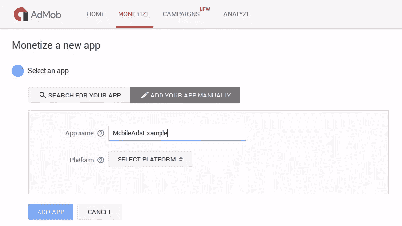
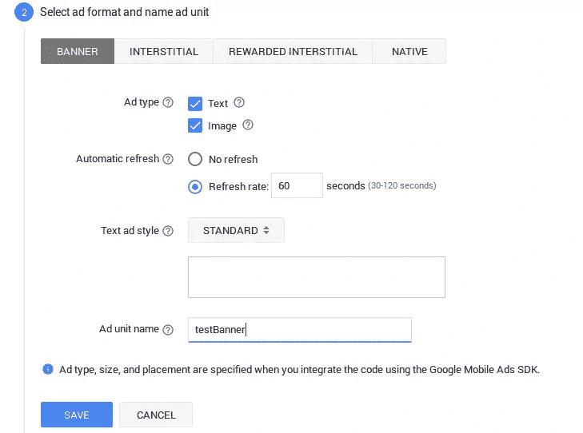
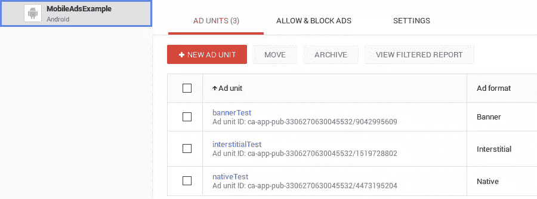
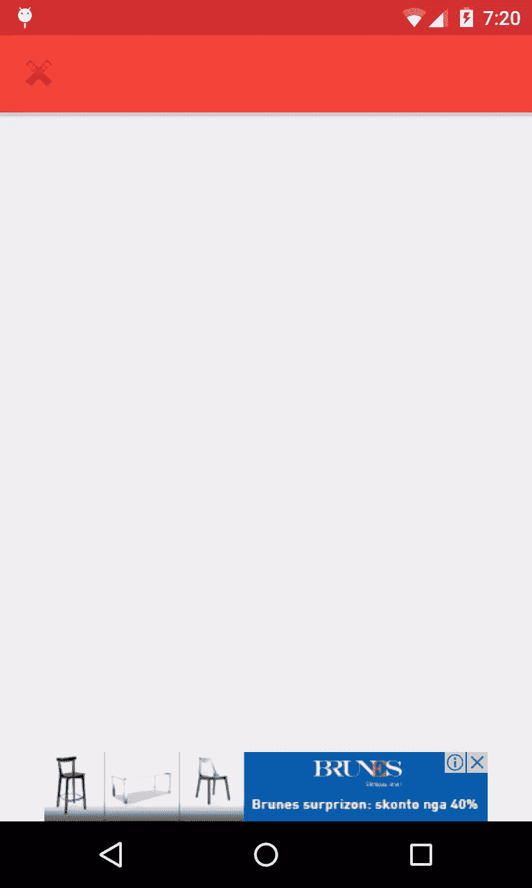
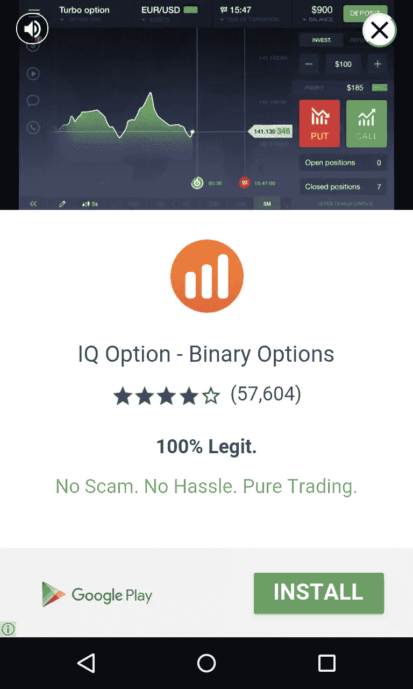

# 利用 Google AdMob SDK 实现应用货币化

> 原文：<https://www.sitepoint.com/monetizing-apps-with-the-google-admob-sdk/>

*这篇文章由[沃恩·安切塔](https://www.sitepoint.com/author/wancheta/)进行了同行评审。感谢 SitePoint 的所有同行评审员使 SitePoint 的内容尽可能做到最好！*

AdMob 是谷歌的一个移动广告平台，开发者可以通过应用内广告从应用中获得收入。AdMob 提供不同的广告集，如横幅广告、插播广告、视频广告或与原生 UI 组件集成的原生广告。AdMob 使用谷歌移动广告 SDK，这有助于通过谷歌的广告解决方案实现收入最大化和大规模。本文的重点是将 AdMob 与您的应用程序集成，但在此之前，最好先了解如何实施广告的最佳实践和政策。我推荐 AdMob YouTube 视频中的[横幅广告](https://youtu.be/yTnqcz6RJ-4)和[间隙广告](https://youtu.be/wrZiwrkQWBw)。

## AdMob 入门

首先[向 AdMob 服务注册](https://apps.admob.com/signup/)。

1.  打开 AdMob [主页](https://apps.admob.com/)。
2.  点击*货币化*选项卡。
3.  点击*货币化新应用*。



1.  选择广告形式横幅、插播广告、有奖插播广告或原生广告。
2.  填写*广告单元名称*输入。



1.  你可以选择将你的广告链接到 firebase。对于这个例子，我跳过了这一步。

您可以向您的应用程序添加不同的广告格式。对于我在本文中展示的示例应用程序，我创建了三种不同的广告格式，横幅广告、插播广告和原生广告。要向应用添加新的广告单元，请打开*货币化*选项卡，然后选择该应用。



## 配置

创建一个包含空活动的新 Android 项目，并将以下依赖项添加到 *build.gradle (Module: app)* 。

```
 dependencies {
        compile 'com.google.android.gms:play-services:9.4.0'
    } 
```

在 *res/values/strings.xml* 中添加 ads 单元 id。在我的例子中，id 如下所示。

```
<!--Ad unit ID-->
<string name="admob_banner_ad">ca-app-pub-3306270630045532/9042995609</string>
<string name="admob_interstitial_ad">ca-app-pub-3306270630045532/1519728802</string>
<string name="admob_native_ad">ca-app-pub-3306270630045532/4473195204</string> 
```

在 *AndroidManifest.xml* 中包含谷歌移动广告运行所需的权限。

```
<uses-permission android:name="android.permission.INTERNET"/>
<uses-permission android:name="android.permission.ACCESS_NETWORK_STATE"/> 
```

## 将广告集成到 Android 应用程序中

本教程的其余部分由三个例子组成，说明如何将您创建的广告集成到 Android 应用程序中。你可以将每个例子集成到一个独立的应用程序中，但是在这个项目的 [GitHub](https://github.com/sitepoint-editors/Mobile-Ads-Example) 库中，我将广告作为不同的片段添加，过程是相似的。

## 横幅广告

在这一节中，我将重点介绍添加横幅广告和事件处理。与整合其他广告类型的过程相比，在 Android 项目中添加横幅广告是最简单的选择。在布局文件中选择一个合适的位置，并添加以下代码片段，例如一个`Activity`的布局文件。

```
<com.google.android.gms.ads.AdView
    android:id="@+id/adView"
    android:layout_width="wrap_content"
    android:layout_height="wrap_content"
    android:layout_centerHorizontal="true"
    ads:adSize="SMART_BANNER"
    ads:adUnitId="@string/admob_banner_ad">
</com.google.android.gms.ads.AdView> 
```

我将广告尺寸指定为`SMART_BANNER`，它将横幅的宽度设置为与屏幕尺寸相匹配，但是 AdMob 有多种尺寸可供选择。阅读[文档](https://firebase.google.com/docs/admob/android/banner#banner_size)了解更多信息。确保在布局文件的容器`Layout`中添加用于广告的名称空间:

```
<?xml version="1.0" encoding="utf-8"?>
<RelativeLayout xmlns:ads="http://schemas.android.com/apk/res-auto">
  ...
  <com.google.android.gms.ads.AdView>
    ...
  </com.google.android.gms.ads.AdView>
</RelativeLayout> 
```

现在您已经将`AdView`添加到布局文件中，您必须将内容加载到其中。在将显示广告的`Activity`类中，创建以下全局实例。

```
private AdView adView; 
```

在 Activity `onCreate()`方法中添加以下代码片段。

```
// Initialize the Mobile Ads SDK.
MobileAds.initialize(this, getResources().getString(R.string.admob_banner_ad));
adView = (AdView) findViewById(R.id.adView);
AdRequest adRequest = new AdRequest.Builder()
        .build();
adView.loadAd(adRequest); 
```

在开发期间测试广告时，建议您将`AdRequest`指定为测试设备。对于本教程，我没有指定任何测试设备。

```
AdRequest adRequest = new AdRequest.Builder()
    .addTestDevice("DEVICE ID")
    .build(); 
```

管理广告的一个重要部分是`Activity`的生命周期方法，所以将下面的方法添加到`MainActivity`类中。

```
@Override
public void onPause() {
  super.onPause();
  if (adView != null) adView.pause();
}

@Override
public void onResume() {
  super.onResume();
  if (adView != null) adView.resume();
}

@Override
public void onDestroy() {
  super.onDestroy();
  if (adView != null) adView.destroy();
} 
```

运行 Android 项目，看看你的酷广告。



## 广告事件

管理广告的另一个重要部分是生命周期事件。广告事件列表包括`loading`、`opening`、`closing`、`failed to load`、`AdLeftApplication`等事件。您可以选择监听任何生命周期事件，在下面的代码中，我为`onCreate`中所有可能的事件设置了监听器。

```
adView.setAdListener(new AdListener() {
  @Override
  public void onAdClosed() {
      super.onAdClosed();
      //user returns to the app after tapping on an ad.
  }

  @Override
  public void onAdFailedToLoad(int i) {
      super.onAdFailedToLoad(i);
      //Ad request fails.
  }

  @Override
  public void onAdLeftApplication() {
      super.onAdLeftApplication();
      //User left the app.
  }

  @Override
  public void onAdOpened() {
      super.onAdOpened();
      //Ad displayed on the screen.
  }

  @Override
  public void onAdLoaded() {
      super.onAdLoaded();
      //Ad finishes loading.
  }
}); 
```

这些事件适用于横幅广告和插播广告。

## 插播广告

Interstitial 是覆盖 app 全界面的全屏广告。顾名思义，这种广告的全屏性质阻止了用户与应用程序界面的交互，因此在显示间隙广告时应该小心。展示它们的一个好方法是在应用程序的转换点，经常展示这种广告不是一个好主意。中间体没有加载它们的布局，您在 java 代码中加载它们。

在`MainActivity`中为中间添加创建一个全局实例。

```
private InterstitialAd interstitialAd; 
```

要显示插播广告，请调用以下函数。

```
private void loadInterstitialAd() {
  interstitialAd = new InterstitialAd(this);
  interstitialAd.setAdUnitId(getResources().getString(R.string.admob_interstitial_ad));
  AdRequest adRequest = new AdRequest.Builder()
          .build();
  interstitialAd.loadAd(adRequest);
  interstitialAd.setAdListener(new AdListener() {
      @Override
      public void onAdLoaded() {
          super.onAdLoaded();
          interstitialAd.show();
      }
  });
} 
```

请记住，插播广告占用大量带宽，需要时间来加载，因此在加载过程完成后显示它们非常重要。您可以使用我之前展示的生命周期事件和间隙来监听特定的广告事件。



## 原生广告

原生广告是定制广告以适应应用内容的好方法。原生广告是广告视图的 CSS 模板。AdMob 提供了两种不同的实现原生广告的方式，*原生广告快车*和*原生广告高级*。

原生 Ads Express 是基于预定义的视图和广告模板在 AdMob 面板中创建的 CSS 模板。对于想要完全控制广告展示的开发者，AdMob 提供了原生广告高级版。

在下面的原生广告的例子中，我将使用快递广告。在 Android 项目中添加原生广告的过程类似于横幅广告，因此下一节的主要重点是构建一个包含原生广告的`RecyclerView`。

构建一个`RecyclerView`需要一个`RecyclerView.Adapter`、一个`RecyclerView.ViewHolder`和一个`RecyclerView`项目的布局文件。这是一个好主意，让这个项目布局看起来像原生广告布局，使广告与应用程序的其余部分很好地集成。对于我的例子，下面的布局就可以了。创建*RES/layout/item _ layout . XML*并添加以下内容。

```
<LinearLayout xmlns:android="http://schemas.android.com/apk/res/android"
    android:layout_width="match_parent"
    android:layout_height="100dp"
    android:orientation="horizontal">

    <ImageView
        android:layout_width="80dp"
        android:layout_height="80dp"
        android:layout_marginBottom="8dp"
        android:layout_marginTop="15dp"
        android:src="@android:drawable/ic_menu_gallery" />

    <LinearLayout
        android:layout_width="match_parent"
        android:layout_height="match_parent"
        android:layout_marginTop="25dp"
        android:orientation="vertical">

        <TextView
            android:id="@+id/itemTitle"
            android:layout_width="match_parent"
            android:layout_height="wrap_content"
            android:layout_gravity="center_horizontal"
            android:layout_marginBottom="4dp"
            android:text="RecyclerView Item"
            android:textAppearance="?android:attr/textAppearanceLarge" />

        <TextView
            android:id="@+id/itemDescription"
            android:layout_width="match_parent"
            android:layout_height="wrap_content"
            android:layout_gravity="center_horizontal"
            android:text="RecyclerView Item Description"
            android:textAppearance="?android:attr/textAppearanceMedium" />
    </LinearLayout>
</LinearLayout> 
```

和 *res/layout/native_ad.xml*

```
<LinearLayout xmlns:android="http://schemas.android.com/apk/res/android"
    xmlns:ads="http://schemas.android.com/apk/res-auto"
    android:layout_width="match_parent"
    android:layout_height="wrap_content"
    android:orientation="vertical">

    <com.google.android.gms.ads.NativeExpressAdView
        android:id="@+id/nativeAdView"
        android:layout_width="wrap_content"
        android:layout_height="wrap_content"
        ads:adSize="340x100"
        ads:adUnitId="@string/admob_native_ad">

    </com.google.android.gms.ads.NativeExpressAdView>

</LinearLayout> 
```

在`MainActivity`布局文件中添加一个`RecyclerView`布局。

```
<android.support.v7.widget.RecyclerView
    xmlns:android="http://schemas.android.com/apk/res/android"
    android:id="@+id/recyclerview"
    android:layout_width="match_parent"
    android:layout_height="match_parent"/> 
```

### 设置`RecyclerView`适配器

为了让一个`RecyclerView`显示内容，它需要一个适配器和一个`ViewHolder`。创建一个名为`RV_Adapter`的新 java 类，并添加以下代码。

```
public class RV_Adapter extends RecyclerView.Adapter<ViewHolder> {

    private static final int ITEM = 0;
    private static final int NATIVE_AD = 1;
    int[] viewTypes;
    List<Data> list = Collections.emptyList();

    public RV_Adapter(List<Data> list, int[] viewTypes) {
        this.list = list;
        this.viewTypes = viewTypes;
    }

    @Override
    public ViewHolder onCreateViewHolder(ViewGroup parent, int viewType) {
        //Inflate the layout, initialize the View Holder
        View v;
        if (viewType == ITEM) {
            v = LayoutInflater.from(parent.getContext()).inflate(R.layout.item_layout, parent, false);
            ViewHolder holder = new ItemViewHolder(v);
            return holder;
        } else if (viewType == NATIVE_AD) {
            v = LayoutInflater.from(parent.getContext()).inflate(R.layout.native_ad, parent, false);
            ViewHolder holder = new AdViewHolder(v);
            return holder;
        }
        return null;
    }

    @Override
    public void onBindViewHolder(ViewHolder viewHolder, int position) {
        if (viewHolder.getItemViewType() == ITEM) {
            ItemViewHolder holder = (ItemViewHolder) viewHolder;
            //populate the RecyclerView
            //holder.title.setText(list.get(position).getTitle());
            //holder.description.setText(list.get(position).getDescription());
        } else if (viewHolder.getItemViewType() == NATIVE_AD) {
            AdViewHolder holder = (AdViewHolder) viewHolder;
            //Load the Ad
            AdRequest request = new AdRequest.Builder()
                    .build();
            holder.adView.loadAd(request);
        }
    }

    @Override
    public int getItemCount() {
        return list.size();
    }

    @Override
    public void onAttachedToRecyclerView(RecyclerView recyclerView) {
        super.onAttachedToRecyclerView(recyclerView);
    }

    @Override
    public int getItemViewType(int position) {
        return viewTypes[position];
    }
}

class ViewHolder extends RecyclerView.ViewHolder {
    public ViewHolder(View v) {
        super(v);
    }
}

class ItemViewHolder extends ViewHolder {

    TextView title;
    TextView description;

    ItemViewHolder(View itemView) {
        super(itemView);
        title = (TextView) itemView.findViewById(R.id.itemTitle);
        description = (TextView) itemView.findViewById(R.id.itemDescription);
    }
}

class AdViewHolder extends ViewHolder {
    NativeExpressAdView adView;

    public AdViewHolder(View v) {
        super(v);
        adView = (NativeExpressAdView) v.findViewById(R.id.nativeAdView);
    }
} 
```

这个类包含不同的`RecyclerView`项目的`RecyclerView.Adapter`和三个`ViewHolder`类。有很多代码和其他三个 java 类只在这个适配器中使用。您可以自由地在不同的文件中实现它们，但是要确保导入对这些类的正确引用。你在适配器`onBindViewHolder()`的`RecyclerView`中加载原生广告。绑定此广告类似于横幅广告。

`RecyclerView`由一列`Data`对象填充，因此在 Android 项目中创建以下类。

```
public class Data {

    private String title;
    private String description;

    public String getTitle() {
        return title;
    }

    public void setTitle(String title) {
        this.title = title;
    }

    public String getDescription() {
        return description;
    }

    public void setDescription(String description) {
        this.description = description;
    }
} 
```

### 显示广告列表

在`RecyclerView`中集成原生广告的最后一步是在`MainActivity`中创建以下函数。

```
private void initRecyclerView() {
  //Create dummy data for RecyclerView
  int listSize = 50;
  int ITEM = 0;
  int NATIVE_AD = 1;
  List<Data> data = new ArrayList<>();
  int[] viewTypes = new int[listSize];
  for (int i = 0; i < listSize; i++) {
      data.add(new Data());
      //insert native ads once in five items
      if (i > 1 && i % 5 == 0) {
          viewTypes[i] = NATIVE_AD;
      } else {
          viewTypes[i] = ITEM;
      }
  }
  RecyclerView recyclerView = (RecyclerView) findViewById(R.id.recyclerview);
  RV_Adapter adapter = new RV_Adapter(data, viewTypes);
  recyclerView.setAdapter(adapter);
  recyclerView.setLayoutManager(new LinearLayoutManager(this));
} 
```

该函数生成 50 个`Data`项目的列表，每 5 个项目插入一个原生广告。在真实的项目中，你不会如此频繁地插入广告，因为这会导致糟糕的用户体验。当`RecyclerView`适配器被初始化时，它的构造函数传递一个`Integer`数组来通知适配器什么时候显示广告。在`MainActivity` `onCreate()`方法中调用这个函数并运行项目。


## 把…作为目标

AdMob 的另一个很大的特点是可以锁定特定的用户，显示与特定条件相关的广告。定向的例子是显示与特定位置或用户性别相关的广告。要显示基于目标群体的广告，请在`AdRequest.Builder()`中指定目标规范。

下面是一个如何根据位置定位用户的示例:

```
AdRequest request = new AdRequest.Builder()
    .setLocation(userLocation)
    .build(); 
```

基于性别:

```
AdRequest request = new AdRequest.Builder()
    .setGender(AdRequest.GENDER_FEMALE)
    .build(); 
```

基于生日:

```
 AdRequest adRequest = new AdRequest.Builder()
    .setBirthday(userBirthdayDate)
    .build(); 
```

基于儿童导向的政策，以及谷歌是否应该将广告内容视为儿童导向。

```
AdRequest adRequest = new AdRequest.Builder()
    .tagForChildDirectedTreatment(true)
    .build(); 
```

## 让分币滚滚而来

这是将 AdMob 广告整合到 Android 应用中的基础。这个过程提供了一个简单的方法来增加任何应用程序的盈利潜力。如果你需要更多关于 AdMob 的帮助，请阅读谷歌支持页面，那里有很好的提示。如果您对本教程有任何问题或意见，请在下面告诉我。

## 分享这篇文章