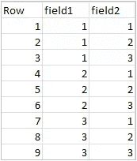

# MongoDB 索引，第 2 部分

> 原文：<https://www.sitepoint.com/mongodb-indexing-2/>

在本系列的第 1 部分中，我们介绍了 MongoDB 中的索引。我们看到了如何创建、使用和分析带有索引的查询，这为我们打下了良好的基础。在这一部分中，我们将了解一些更小但更重要的概念，比如子文档和嵌入字段的索引、覆盖的查询和索引方向。

当然，这部分假设你知道如何在 a 上创建一个索引，并使用`explain()`方法来分析它。如果您还不知道如何操作，我建议您在继续之前先回去阅读第一部分。

我们在上一篇文章中使用了一个名为`posts`的集合。对于我们这里的工作，让我们添加一个新的字段`location`到它，以存储发布的位置。该字段是子文档，存储用户的城市、州和国家，如下所示(子文档是具有文档结构的字段):

```
{
    "_id": ObjectId("5146bb52d852470060001f4"),
    "comments": {
        "0": "This is the first comment",
        "1": "This is the second comment"
    },
    "post_likes": 40,
    "post_tags": {
        "0": "MongoDB",
        "1": "Tutorial",
        "2": "Indexing"
    },
    "post_text": "Hello Readers!! This is my post text",
    "post_type": "private",
    "user_name": "Mark Anthony",
    "location": {
        "city": "Los Angeles",
        "state": "California",
        "country": "USA"
    }
}
```

## 子文档的索引

假设我们希望根据用户的居住地来搜索帖子。为此，我们需要在子文档`location`字段上创建一个索引，它反过来索引子字段。然后，我们将能够使用索引进行以下类型的查询:

```
<?php
// query to find posts from the city of Los Angeles
$cursor = $collection->find(
    array(
        "location" => "Los Angeles"
    ),
    array()
);

// query to find posts from the state of California
$cursor = $collection->find(
    array(
        "location" => "California"
    ),
    array()
);

// query to find posts from the United States
$cursor = $collection->find(
    array(
        "location" => "USA"
    ),
    array()
);
```

我们可以只使用`location`作为关键字来搜索子文档中的所有子字段(`city`、`state`和`country`)。该查询查看`location`的任何子字段是否符合我们的搜索标准。

应该注意的是，类似于数组上的索引，在内部为所有子字段创建单独的索引。在这种情况下，创建了三个索引`location.city`、`location.state`和`location.country`，因此应该小心使用这些索引，因为每个索引都占用内存空间。

## 嵌入字段的索引

有时会发生这样的情况，我们不需要在子文档的所有字段上建立索引。如果在我们的应用程序中，我们只想根据城市而不是州或国家来查找帖子，我们可以在嵌入字段`city`上创建索引。


我们现在可以在查询中使用这个索引来查找基于城市的帖子:

```
<?php
// query to find posts from the city of Los Angeles
$cursor = $collection->find(
    array(
        "location.city" => "Los Angeles"
    ),
    array()
);
```

## 索引方向(升序/降序)

在创建索引时，我们总是为键提供一个索引方向(1 或-1)。我在第 1 部分中简单地提到了这一点，但这实际上是一个重要的讨论点，我想再次提起。如果我们在索引中有一个键，方向 1 或-1 并不重要，但是当我们使用复合索引进行排序或范围查询时，它就会发挥作用。

假设我们有一个复合索引，键`field1`升序，键`field2`降序。在这种情况下，索引表可能如下所示:



按`field1`升序和`field2`升序排序的查询将按以下顺序遍历行:1、2、3、4、5、6、7、8、9。一个带有`field1`升序和`field2`降序的查询将遍历:3，2，1，6，5，4，9，8，7。搜索树中的这种无序跳转最终会对查询性能造成很大影响。

当然，为了便于理解，上面的索引结构被表示为一个表格。记住，MongoDB 在内部使用树结构；每个元素都存储为树的一个节点。彼此更接近的元素将在相同的分支下，因此容易接近。如果一个查询必须以排序的方式检索多个记录，那么与查询必须从一个节点跳到另一个远节点以获取元素的情况相比，将元素放在树中彼此靠近的位置以获得更快的检索，这在逻辑上是正确的。

如果你想按`field1:1,field2:1`排序，那么索引`{field1:1, field2:1}`会比`{field1:1, field2:-1}`或`{field1:-1, field2:1}`更快。

## 涵盖的查询

根据 MongoDB 的文档，覆盖查询是指:

*   查询中使用的所有字段都是查询中使用的索引的一部分，并且
*   结果中返回的所有字段都在同一个索引中

因为所有字段都包含在索引本身中，所以 MongoDB 可以匹配查询条件，并使用相同的索引返回结果字段，而无需查看文档内部。由于索引存储在 RAM 中或顺序地位于磁盘上，这样的访问要快得多。

假设我们在`post_type`和`user_name`字段上定义了一个复合索引。该索引包含以下查询:

```
<?php
// query to find posts with type public and get only user_name in result
$cursor = $collection->find(
    array(
        "post_type" => "public",
    ),
    array(
        "user_name" => 1,
        "_id" => 0
    )
);
```

我们已经从结果中明确排除了`_id`字段，以利用覆盖的查询。您可能已经知道，默认情况下，所有查询都返回`_id`字段。根据覆盖查询的第二个条件，结果中返回的所有字段都应该包含在索引中。我们在`post_type`和`user_name`的复合索引中没有`_id`，所以我们必须从结果中排除这个字段。

为了检查查询是否被覆盖，我们可以查看`explain()`方法的结果中的`indexOnly`字段。true 值表示我们的查询是一个覆盖查询。


重要的是要知道，在下列情况下，索引不能覆盖查询:

*   任何索引字段都是一个数组(如`post_tags`)，或者
*   任何索引字段都是子文档中的字段(如`location.city`)

因此，用`explain()`检查查询索引的使用情况总是一个好的做法。

## 删除索引

要检查数据库的当前索引大小，我们可以使用`totalIndexSize()`方法，该方法返回以字节为单位的索引大小。


我们只需要确保有足够的 RAM 来容纳索引以及 MongoDB 定期管理和使用的数据。

为了删除一个现有的索引，从而释放资源，我们使用了`dropIndex()`方法。


## 结论

这部分和这个系列就到此为止。我们已经讨论了很多重要的主题，帮助您快速掌握 MongoDB 中的索引。

随着应用程序的增长和数据的变化，分析索引以确保它们运行良好是一个持续的过程，因此如果您对本文有任何问题或评论，请在下面的评论中发表。

<small>图片 via[Fotolia](http://us.fotolia.com/?utm_source=sitepoint&utm_medium=website_link&utm=campaign=sitepoint "Royalty Free Stock Photos at Fotolia.com")</small>

## 分享这篇文章