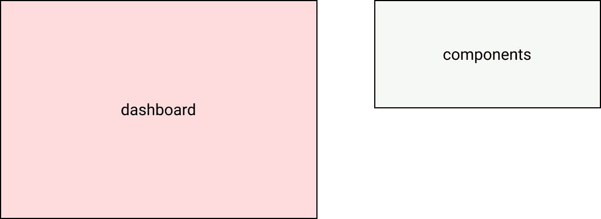
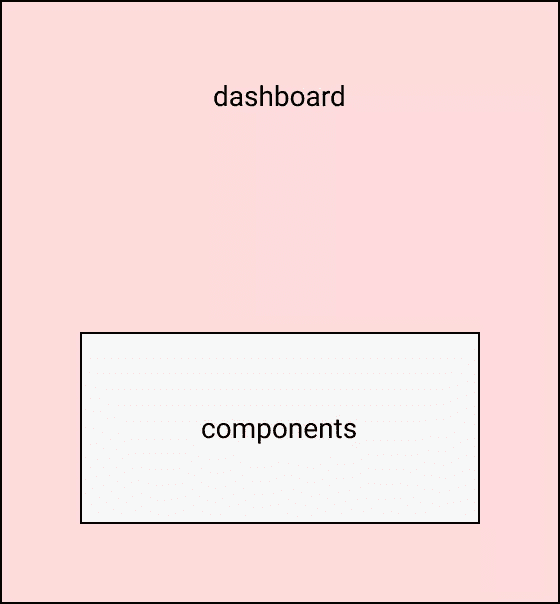
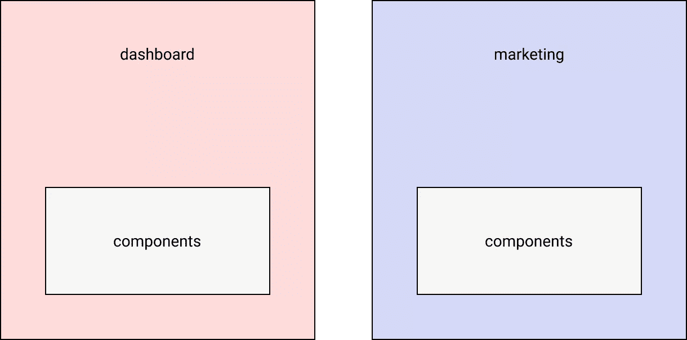
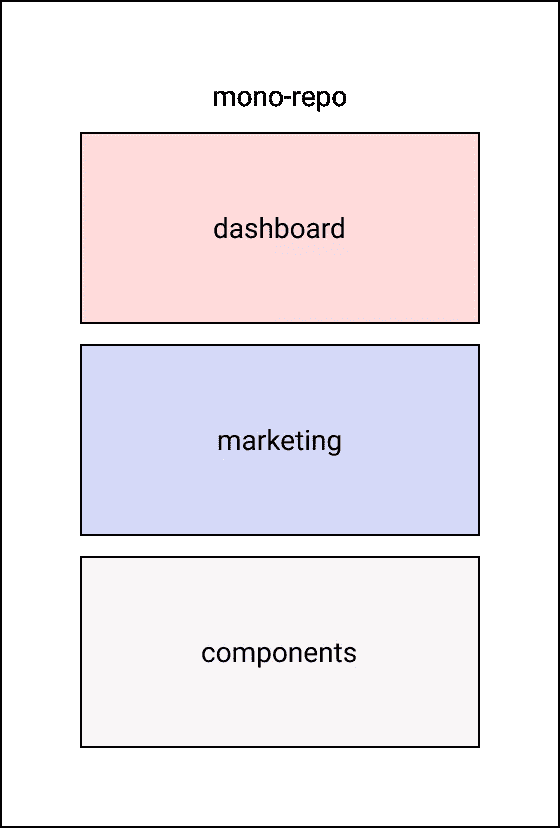
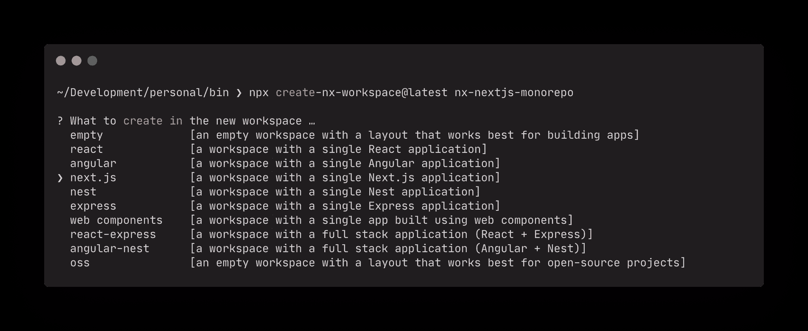
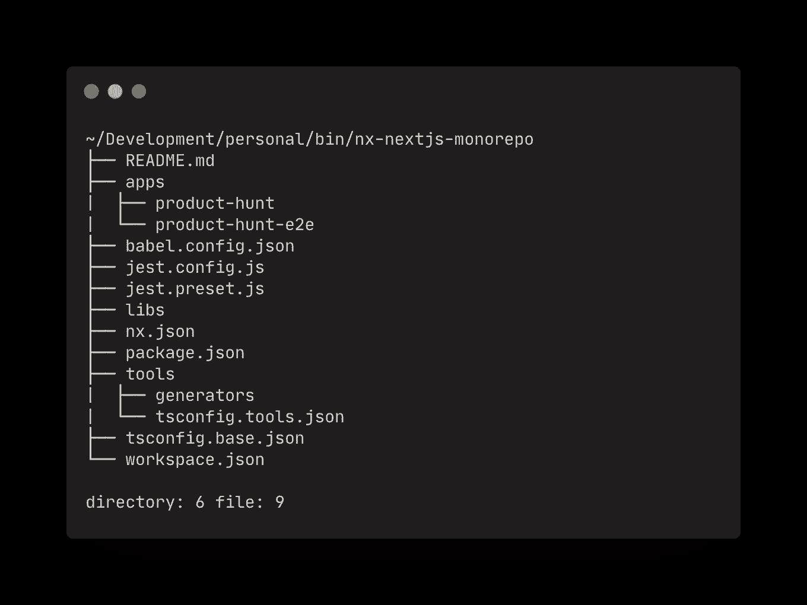
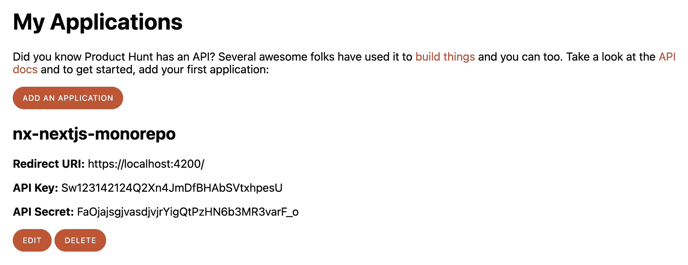
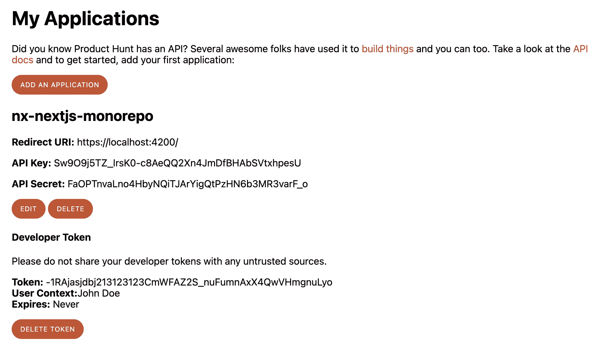
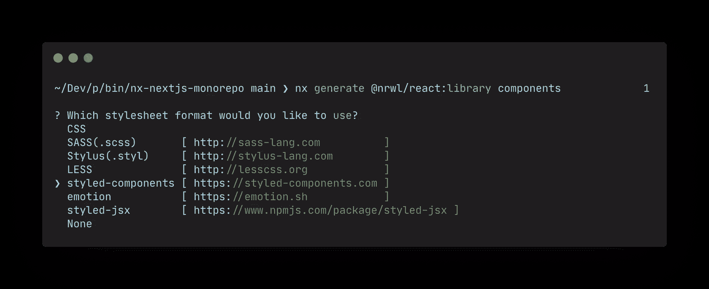
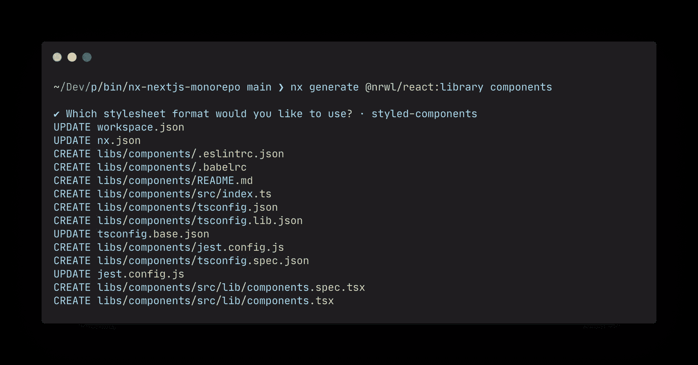

# 如何用 Nx，Next.js 和 TypeScript 构建 Monorepo

> 原文：<https://www.sitepoint.com/monorepo-nx-next-typescript/>

在本文中，我们将了解什么是 monorepo，以及 mono repo 如何帮助开发应用程序更快，并提供更好的开发体验。我们将讨论使用 [Nx](https://nx.dev/) 开发工具管理 monorepo 的优势，并学习如何使用这些工具构建 [Next.js](https://nextjs.org/) 应用程序。

*这篇文章的代码可以在 [GitHub](https://github.com/sitepoint-editors/nx-nextjs-monorepo) 上找到。你可以在这里找到我们正在构建的应用程序的工作演示[。](https://nx-nextjs-monorepo.vercel.app/)*

## 什么是单向回购，以及为什么我们应该考虑使用单向回购

monorepo 是一个包含多个项目或项目组件的应用程序、工具和配置的单一存储库。这是为每个项目或项目的一部分创建单独的存储库的替代方法。

考虑一个场景，我们正在使用一些前端库或框架构建一个仪表板应用程序。这个前端应用程序的代码可能存储在`dashboard`存储库中。这个存储库使用的 UI 组件可能存储在另一个名为`components`的存储库中。现在，每次我们更新`components`库时，我们都必须进入`dashboard`库并更新`components`依赖项。



为了缓解这个问题，我们可以将`components`回购与`dashboard`回购合并。



然而，可能有另一个营销站点的前端应用程序存储在`marketing`存储库中，并且依赖于`components`存储库。因此，我们将不得不复制`components`，并将其与`marketing`合并。然而，正因为如此，任何与`components`相关的更改都必须在两个地方进行，这并不理想。



上述问题可以通过使用 monorepo 来解决，其中`dashboard`、`components`和`marketing`组件驻留在一个单独的存储库中。



使用 monorepo 有多种优势:

*   包的更新要容易得多，因为所有的应用程序和库都在一个库中。因为所有的应用程序和包都在同一个存储库下，所以添加新代码或修改现有代码可以很容易地进行测试和发布。
*   代码的重构要容易得多，因为我们只需要在一个地方进行重构，而不是在多个存储库中复制相同的东西。
*   monorepo 允许对 CI/CD 管道进行一致的配置，这些管道可以由同一存储库中的所有应用程序和库重用。
*   由于 Nx 这样的工具，发布包也变得容易多了。

Nx CLI 将帮助我们生成新的 Next.js 应用程序和 React 组件库。它还将帮助我们运行带有热模块重载的开发 web 服务器。它还可以做一系列其他重要的事情，比如[林挺、格式化](https://nx.dev/latest/react/guides/eslint)和[生成代码](https://nx.dev/latest/react/generators/using-schematics)。像这样使用 CLI 的好处是，它将在我们的代码库中提供一种标准化的感觉。随着我们代码库的增长，管理和理解底层的复杂性变得非常困难。Nx CLI 通过提供自动生成代码的工具，消除了大部分复杂性。

## 所需软件

为了运行我们的应用程序，我们需要安装以下软件:

*   [npm](https://nodejs.org/en/download/)
*   [纱线](https://classic.yarnpkg.com/en/docs/install/)(可选)

这些技术将在应用程序中使用:

*   [Next.js](https://nextjs.org/) 用于构建我们的应用
*   [样式组件](https://styled-components.com/)用于向我们的应用添加样式

*注意:如果你想加快速度，你可以阅读更多关于[如何使用 nvm](https://www.sitepoint.com/quick-tip-multiple-versions-node-nvm/) 安装多个版本的 Node.js。*

我们还需要一个[产品搜索](https://www.producthunt.com/)账户。

## 安装和引导 Nx 工作空间

我们可以使用以下命令安装 [Nx CLI](https://www.npmjs.com/package/@nrwl/cli) :

```
npm install nx -g 
```

以上命令将全局安装 Nx CLI。这很有用，因为现在我们可以从任何目录使用这个 CLI 创建一个新的 Next.js 应用程序。

接下来，我们需要在要创建 monorepo 的目录中运行以下命令:

```
npx create-nx-workspace@latest nx-nextjs-monorepo 
```

上面的命令将创建一个 Nx 工作空间。所有的 Nx 应用程序都可以驻留在 Nx 工作区中。

您可能需要将`nx-nextjs-monorepo`替换为您的工作空间的名称。你可以给它起任何你喜欢的名字。工作空间的名称通常是组织、公司等的名称。

当我们运行上面的命令时，我们会得到一组步骤来创建我们想要用 Nx 创建的应用程序类型。

*   第一步:它将首先询问我们想要创建什么类型的应用程序。我们将从选项列表中选择 Next.js。

    

*   **第二步:**它会询问我们想要创建的应用程序的名称。我们可以叫它任何东西。在这种情况下，我们将其命名为“产品搜索”。

    

*   第三步:它会询问我们想要使用什么类型的样式表。我们将选择有风格的组件。

    

*   第四步:它会问我们是否要使用 [Nx Cloud](https://nx.app/) ，这是一个加速构建 Nx 应用的平台。在这种情况下，我们会选择否，但请检查一下。

    

Nx 现在将搭建所有文件和目录，并为我们生成以下结构。



目录包含了我们所有的应用程序。在我们的例子中，这个目录将包含我们正在构建的 Next.js 应用程序(名为`product-hunt`)。该目录还包含使用 [Cypress](https://www.cypress.io/) 搭建的端到端测试应用程序(名为`product-hunt-e2e`)。

`libs`目录包含所有的库，比如组件、实用函数等等。这些库可以被存在于`apps`目录中的任何应用程序使用。

`tools`目录包含所有定制脚本、代码模块等等，它们用于对我们的代码库进行某些修改。

*注意:关于目录结构的更多信息可以在[这里](https://nx.dev/latest/react/getting-started/nx-setup)找到。*

## 使用 Next.js 构建产品搜索首页

在这一步，我们将构建 Producthunt 的[首页。我们将从](https://www.producthunt.com/?ref=header_nav)[官方产品搜索 API](https://api.producthunt.com/v2/docs) 中获取数据。产品搜索 API 提供了一个 GraphQL 接口，该接口出现在 https://api.producthunt.com/v2/api/graphql 的[展会上。它可以通过 **access_token** 访问，该令牌可以从](https://api.producthunt.com/v2/api/graphql)[产品搜索 API 仪表板](https://api.producthunt.com/v2/oauth/applications)生成。

要创建一个新的应用程序，我们需要点击**添加一个应用程序**按钮。


接下来，我们可以为我们的应用程序添加一个名称，并将 [https://localhost:4200/](http://localhost:4200/) 作为新应用程序的重定向 URI，然后单击**创建应用程序**按钮。


我们现在可以查看新应用程序的凭据了。



接下来，我们需要通过点击同一页面中的**创建令牌**按钮来生成一个**开发者令牌**。


这将生成一个新的令牌并显示在页面上。



接下来，我们需要将这些凭证存储在应用程序中。我们可以在`apps/product-hunt`目录下创建一个新的`.env.local`文件，内容如下:

```
// apps/product-hunt/.env.local

NEXT_PUBLIC_PH_API_ENDPOINT=https://api.producthunt.com/v2/api/graphql
NEXT_PUBLIC_PH_TOKEN=<your-developer-token> 
```

由于产品搜索 API 在 GraphQL 中，我们必须安装几个包来使我们的应用程序与 GraphQL 一起工作。从根目录，我们需要运行以下命令来安装必要的软件包:

```
yarn add graphql-hooks graphql-hooks-memcache 
```

graphql-hooks 是一个最小化的 hooks-first GraphQL 客户端。它帮助我们从 GraphQL 服务器请求数据。

[graphql-hooks-memcache](https://github.com/nearform/graphql-hooks/tree/master/packages/graphql-hooks-memcache) 是`graphql-hooks`的内存缓存实现。

接下来，我们需要从`graphql-hooks`包中初始化 GraphQL 客户端。我们可以通过在`apps/product-hunt/lib`目录下创建一个新的`graphql-client.ts`文件来实现，其内容如下:

```
// apps/product-hunt/lib/graphql-client.ts

import { GraphQLClient } from "graphql-hooks";
import memCache from "graphql-hooks-memcache";
import { useMemo } from "react";

let graphQLClient;

const createClient = (initialState) => {
  return new GraphQLClient({
    ssrMode: typeof window === "undefined",
    url: process.env.NEXT_PUBLIC_PH_API_ENDPOINT, // Server URL (must be absolute)
    cache: memCache({ initialState }),
    headers: {
      Authorization: `Bearer ${process.env.NEXT_PUBLIC_PH_TOKEN}`,
    },
  });
};

export const initializeGraphQL = (initialState = null) => {
  const _graphQLClient = graphQLClient ?? createClient(initialState);

  // After navigating to a page with an initial GraphQL state, create a new
  // cache with the current state merged with the incoming state and set it to
  // the GraphQL client. This is necessary because the initial state of
  // `memCache` can only be set once
  if (initialState && graphQLClient) {
    graphQLClient.cache = memCache({
      initialState: Object.assign(
        graphQLClient.cache.getInitialState(),
        initialState
      ),
    });
  }

  // For SSG and SSR always create a new GraphQL Client
  if (typeof window === "undefined") {
    return _graphQLClient;
  }

  // Create the GraphQL Client once in the client
  if (!graphQLClient) {
    graphQLClient = _graphQLClient;
  }

  return _graphQLClient;
};

export const useGraphQLClient = (initialState) => {
  const store = useMemo(() => initializeGraphQL(initialState), [initialState]);

  return store;
}; 
```

上面的代码类似于[官方 Next.js GraphQL 示例](https://github.com/vercel/next.js/blob/canary/examples/with-graphql-hooks/lib/graphql-client.js)。上述文件的主要思想是创建一个 GraphQL 客户端，它将帮助我们从 GraphQL 服务器请求数据。

`createClient`函数负责使用`graphql-hooks`包创建 GraphQL 客户端。

`initializeGraphQL`函数负责使用`createClient`初始化我们的 GraphQL 客户端，并在客户端对我们的 GraphQL 客户端进行水合。这是必要的，因为我们正在使用 Next.js，它允许我们在客户端和服务器端获取数据。因此，如果在服务器端获取数据，客户端也需要使用相同的数据，而不需要向 GraphQL 服务器发出任何额外的请求。

`useGraphQLClient`是一个钩子，可以用来生成 GraphQL 客户端。

接下来，我们还需要在`apps/product-hunt/lib`目录下再创建一个文件`graphql-request.ts`，其内容如下:

```
// apps/product-hunt/lib/graphql-request.ts

const defaultOpts = {
  useCache: true,
};

// Returns the result of a GraphQL query. It also adds the result to the
// cache of the GraphQL client for better initial data population in pages.

// Note: This helper tries to imitate what the query hooks of `graphql-hooks`
// do internally to make sure we generate the same cache key
const graphQLRequest = async (client, query, options = defaultOpts) => {
  const operation = {
    query,
  };
  const cacheKey = client.getCacheKey(operation, options);
  const cacheValue = await client.request(operation, options);

  client.saveCache(cacheKey, cacheValue);

  return cacheValue;
};

export default graphQLRequest; 
```

`graphQLRequest`函数负责返回 GraphQL 查询的结果，并将结果添加到 GraphQL 客户端的缓存中。

上面的代码类似于[官方 Next.js GraphQL 示例](https://github.com/vercel/next.js/blob/canary/examples/with-graphql-hooks/lib/graphql-request.js)。

接下来，我们需要用以下内容更新`apps/product-hunt/pages/_app.tsx`文件:

```
// apps/product-hunt/pages/_app.tsx

import { ClientContext } from "graphql-hooks";
import { AppProps } from "next/app";
import Head from "next/head";
import React from "react";
import { useGraphQLClient } from "../lib/graphql-client";

const NextApp = ({ Component, pageProps }: AppProps) => {
  const graphQLClient = useGraphQLClient(pageProps.initialGraphQLState);

  return (
    <ClientContext.Provider value={graphQLClient}>  <Head>  <title>Welcome to product-hunt!</title>  </Head>  <Component {...pageProps} />  </ClientContext.Provider>
  );
};

export default NextApp; 
```

通过用`ClientContext.Provider`包装我们的应用程序，上面的代码将确保我们的整个应用程序能够访问[graph QL 上下文提供者](https://github.com/nearform/graphql-hooks#quick-start)。

接下来，我们需要在`apps/product-hunt/queries`目录下再创建一个文件`all-posts.ts`，其内容如下:

```
// apps/product-hunt/queries/all-posts.ts

const ALL_POSTS_QUERY = ` query allPosts {
    posts {
      edges {
        node {
          id
          name
          description
          votesCount
          website
          thumbnail {
            url
          }
        }
      }
    }
  } `;

export default ALL_POSTS_QUERY; 
```

上面的 GraphQL 查询将允许我们从 ProductHunt GraphQL API 端点获取所有帖子。

让我们在`apps/product-hunt/types`目录下创建一个新的`product.ts`文件，包含以下内容来定义`Product`类型:

```
// apps/product-hunt/types/product.ts

export default interface Product {
  id: number;
  name: string;
  tagline: string;
  slug: string;
  thumbnail: {
    image_url: string;
  };
  user: {
    avatar_url: string;
    name: string;
  };
} 
```

上面的代码为`Product`添加了[类型脚本类型](https://www.typescriptlang.org/docs/handbook/basic-types.html)。一个产品可以有一个 ID，名称，标语，slug，缩略图和用户。这就是产品搜索 GraphQL 返回数据的方式。

接下来，我们需要用以下内容更新`apps/product-hunt/pages/index.tsx`文件:

```
// apps/product-hunt/pages/index.tsx

import { useQuery } from "graphql-hooks";
import { GetStaticProps, NextPage } from "next";
import Image from "next/image";
import React from "react";
import { initializeGraphQL } from "../lib/graphql-client";
import graphQLRequest from "../lib/graphql-request";
import {
  StyledCard,
  StyledCardColumn,
  StyledCardLink,
  StyledCardRow,
  StyledCardTagline,
  StyledCardThumbnailContainer,
  StyledCardTitle,
  StyledContainer,
  StyledGrid,
} from "../public/styles";
import ALL_POSTS_QUERY from "../queries/all-posts";
import Product from "../types/product";

interface IProps {
  hits: Product[];
}

const ProductsIndexPage: NextPage<IProps> = () => {
  const { data } = useQuery(ALL_POSTS_QUERY);

  return (
    <StyledContainer>  <StyledGrid>  {data.posts.edges.map(({ node }) => {
          return (
            <StyledCardLink key={node.id} href={node.website} target="_blank">  <StyledCard>  <StyledCardColumn>  <StyledCardThumbnailContainer>  <Image src={node.thumbnail.url} layout="fill" />  </StyledCardThumbnailContainer>  </StyledCardColumn>  <StyledCardColumn>  <StyledCardRow>  <StyledCardTitle>{node.name}</StyledCardTitle>  <StyledCardTagline>{node.description}</StyledCardTagline>  </StyledCardRow>  </StyledCardColumn>  </StyledCard>  </StyledCardLink>
          );
        })}  </StyledGrid>  </StyledContainer>
  );
};

export const getStaticProps: GetStaticProps = async () => {
  const client = initializeGraphQL();

  await graphQLRequest(client, ALL_POSTS_QUERY);

  return {
    props: {
      initialGraphQLState: client.cache.getInitialState(),
    },
    revalidate: 60,
  };
};

export default ProductsIndexPage; 
```

在上面的代码片段中，我们做了两件事:

1.  我们通过`ALL_POSTS_QUERY` GraphQL 查询获取数据，然后映射 ProductHunt API 返回的`data`数组。

2.  我们在构建期间通过 [getStaticProps](https://nextjs.org/docs/basic-features/data-fetching#getstaticprops-static-generation) 获取数据*，这是一个 Next.js 函数。但是，如果我们在构建期间获取数据，这些数据可能会过时。所以，我们使用`revalidate`选项。重新验证一个可选的数量(以秒为单位),在此之后可以重新生成页面。这也被称为[增量静态再生](https://nextjs.org/docs/basic-features/data-fetching#incremental-static-regeneration)。*

让我们通过在`apps/product-hunt/public/styles.ts`文件中添加以下内容来添加样式:

```
// apps/product-hunt/public/styles.ts

import styled from "styled-components";

export const StyledContainer = styled.div` padding: 24px;
  max-width: 600px;
  margin: 0 auto;
  font-family: sans-serif; `;

export const StyledGrid = styled.div` display: grid;
  grid-template-columns: repeat(1, minmax(0, 1fr));
  grid-gap: 24px; `;

export const StyledCardLink = styled.a` text-decoration: none;
  color: #000; `;

export const StyledCard = styled.div` display: flex;
  gap: 12px;
  padding: 12px;
  background-color: #f7f7f7; `;

export const StyledCardColumn = styled.div` display: flex;
  flex-direction: column;
  gap: 4px;
  justify-content: space-between; `;

export const StyledCardRow = styled.div` display: flex;
  flex-direction: column;
  gap: 4px; `;

export const StyledCardThumbnailContainer = styled.div` object-fit: cover;

  width: 150px;
  height: 150px;
  position: relative; `;

export const StyledCardTitle = styled.div` font-size: 18px;
  font-weight: bold; `;

export const StyledCardTagline = styled.div` font-size: 14px;
  line-height: 1.5; `; 
```

现在，如果我们在一个新的终端窗口中运行`yarn start`命令，我们将在 [http://localhost:4200/](http://localhost:4200/) 上看到下面的屏幕。


要解决上述问题，我们需要用以下内容更新我们的`apps/product-hunt/next.config.js`文件:

```
// apps/product-hunt/next.config.js

// eslint-disable-next-line @typescript-eslint/no-var-requires
const withNx = require("@nrwl/next/plugins/with-nx");

module.exports = withNx({
  nx: {
    // Set this to false if you do not want to use SVGR
    // See: https://github.com/gregberge/svgr
    svgr: true,
  },
  images: {
    domains: ["ph-files.imgix.net", "ph-avatars.imgix.net"],
  },
}); 
```

我们添加了[域](https://nextjs.org/docs/basic-features/image-optimization#domains)，产品搜索 API 从这些域中获取图像。这是必要的，因为我们正在使用 [Next 的图像组件](https://nextjs.org/docs/api-reference/next/image)。

现在，如果我们重启我们的服务器，我们应该能够在 [http://localhost:4200/](http://localhost:4200/) 上看到下面的屏幕。


## 创建可重用的组件库

我们已经成功地建立了产品搜索的首页。但是，我们可以看到，我们所有的风格都在一个应用程序下。因此，如果我们希望在构建另一个应用程序时重用相同的样式，我们必须将这些样式复制到新的应用程序中。

解决这个问题的一个方法是创建一个单独的组件库并将这些样式存储在那里。该组件库可以被多个应用程序重用。

为了在 Nx 中创建一个新的 React 库，我们可以从项目的根目录运行下面的[命令](https://nx.dev/latest/react/cli/generate):

```
nx generate @nrwl/react:library components 
```

上面的命令将给出如下图所示的提示。



由于我们使用的是样式化组件，我们将在上面的提示中选择该选项。一旦我们选择了该选项，我们将在终端上查看以下更改。



接下来，我们将把所有样式从`apps/product-hunt/public/styles.ts`复制到`libs/components/src/lib/components.tsx`文件中。

我们还需要从这个库中导入所有的样式。为此，我们需要修改我们的`apps/product-hunt/pages/index.tsx`文件:

```
// apps/product-hunt/pages/index.tsx

import {
  StyledCard,
  StyledCardColumn,
  StyledCardLink,
  StyledCardRow,
  StyledCardTagline,
  StyledCardThumbnailContainer,
  StyledCardTitle,
  StyledContainer,
  StyledGrid,
} from "@nx-nextjs-monorepo/components"; 
```

如果我们查看我们的`tsconfig.base.json`文件，我们将看到下面一行:

```
// tsconfig.base.json

"paths": {
  "@nx-nextjs-monorepo/components": ["libs/components/src/index.ts"]
} 
```

`@nx-nextjs-monorepo/components`是我们组件库的名字。因此，我们已经将该库中的所有样式导入到了`apps/product-hunt/pages/index.tsx`文件中。

我们可以删除`apps/product-hunt/public/styles.ts`文件，因为我们不再需要它了。

现在，如果我们重新启动我们的 Nx 服务器，我们将在 [http://localhost:4200/](http://localhost:4200/) 上看到下面的屏幕。


## 结论

在本文中，我们已经了解了如何利用 Nx 用 Next.js 和样式化组件构建 monorepo。我们还了解了如何使用 monorepos 来提高开发体验和构建应用程序的速度。我们已经构建了一个 Next.js 应用程序和一个样式组件库，但是使用 Nx，可以使用它们的生成器生成 [Angular](https://nx.dev/latest/react/angular/overview) 、 [Cypress](https://nx.dev/latest/react/cypress/overview) 、 [Nest](https://nx.dev/latest/react/nest/overview) 、 [Gatsby](https://nx.dev/latest/react/gatsby/overview) 、 [Express](https://nx.dev/latest/react/express/overview) 和 [Storybook](https://nx.dev/latest/react/storybook/overview) 应用程序。

别忘了:这篇文章的代码可以在 [GitHub](https://github.com/sitepoint-editors/nx-nextjs-monorepo) 上找到，你可以在这里找到应用[的工作演示。](https://nx-nextjs-monorepo.vercel.app/)

## 分享这篇文章