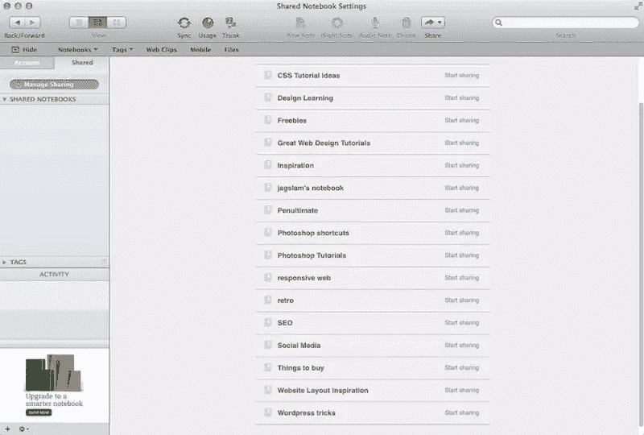
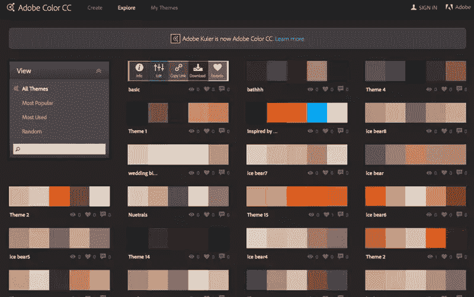
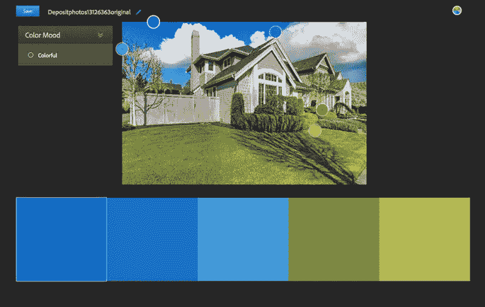
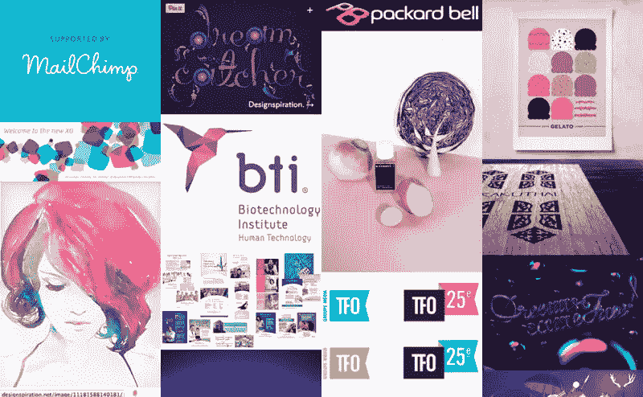
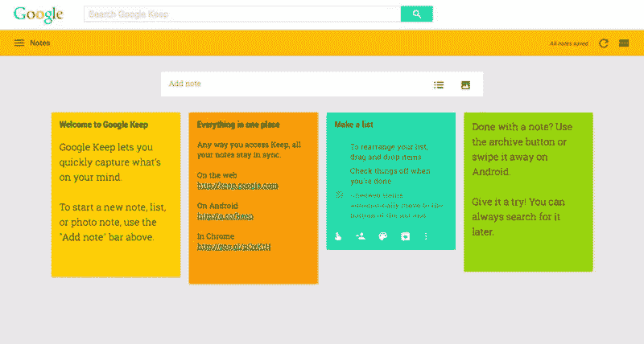

# 情绪板(或如何将你的灵感装瓶)

> 原文：<https://www.sitepoint.com/mood-boards-finding-inspiration/>

图片来源:Incase。

无论你是平面设计师还是网页设计师，保持创意源源不断都是很困难的。我们不断推出一个又一个项目，所以我们必须有一个不断更新的资源来源。

我发现灵感是一个双重过程。我们需要在日常旅行中收集它，并储存起来以备后用。但我们也需要收集特定项目的集合，帮助我们定义新作品或工作的基调和方向。

## 那么，什么是“情绪板”呢？

如果你不熟悉情绪板的概念，它们是颜色、图案、纹理、视觉细节、思想、想法和概念的集合，为项目定下基调。设计机构创建情绪板是为了感受一个项目，并帮助客户和员工达成共识。

情绪板可以是数字的，也可以是印刷作品和材料的集合，或者两者兼而有之。它们可以由照片、油漆样本、织物样本、文本示例以及几乎任何与项目相关的东西组成。

可以添加到情绪板上的东西真的没有限制。例如，在电影[机器人](http://en.wikipedia.org/wiki/Robots_%282005_film%29) (2005)中，主角罗德尼从 1960 年的大众面包车到 1955 年的舷外马达等一切事物中汲取灵感。动画师们甚至收集了吉米·斯图尔特的老电影剪辑，借用演员们瘦长的动作。

情绪板通常在项目开始时开发。目标是抓住你要设计的东西的本质。

## 制作情绪板的应用程序

既然我们已经了解了什么是情绪板，以及为什么我们想要使用情绪板，那么知道一些找到你正在寻找的东西的最佳位置是很重要的。其中一些资源非常棒，尤其是当你时间紧迫的时候。

### 拼趣

Pinterest 视觉效果丰富，拥有一个庞大、活跃的贡献者社区。

[**Pinterest**](http://pinterest.com/) 必须是榜单上的第一名。

毫无疑问，这是寻找美丽、有趣和分类良好的图像和图形的最佳去处之一。正是这种人群驱动的趋势使得这个网站特别有用。整个网站有一个强大的搜索工具，你可以把图片重新钉在你自己的板上，以便妥善保管。

您可以轻松地为每个项目创建一个新的板，并轻松地将相关资源重新固定在那里。

最重要的是，当你在网上搜索时，Pinterest 的“锁定”按钮扩展可以让你在浏览时收集灵感。这使您能够从任何网站或资源固定图像。

这不仅能让你把图片钉在板上，还能链接回你最初获取图片的网站。这就省去了所有的跑腿和猜测，让你记不起在哪里偶然发现了什么东西。

### Evernote

Evernote 是一个成熟的应用程序，拥有超过其份额的杀手级功能。

不再提那么多了， [**Evernote**](http://evernote.com/) 是另一个收集灵感的好工具。

您可以收集链接、网站页面等等。对你的物品进行分类和高度提炼的能力使得它成为一个收集灵感的好工具。

Evernote 突出的一点是能够保存音频笔记，这非常棒。这是独一无二的，也是记录特定时间想法和感觉的好方法。假设你正在做一个项目，你突然灵光一现。您可以将这个想法保存为音频笔记，以便以后使用。如果您是 Mac 用户，您也可以存储 iSight 备忘录。这可让您保存小视频以备后用。

Evernote 还可以很容易地过滤搜索结果，以便您以后可以找到它们。您只能查看 web 剪辑、通过移动设备添加的内容或实际文件。

Evernote 还有一个杀手锏功能——[自动 OCR](https://blog.evernote.com/blog/2013/10/11/quick-tip-how-to-search-for-text-inside-an-image/) (光学字符识别)。这意味着你甚至可以搜索图片中的文字，如电影标题、书籍封面或印刷说明。

相当酷！

### Adobe 彩色 CC

如果你在 Photoshop 或 Illustrator 中工作，并且需要一些调色板灵感， [Adobe Color CC](https://color.adobe.com/create/color-wheel/) (以前称为 Kuler)是调色板和灵感的首选工具。

你可以浏览世界各地专业人士制作的调色板。通过浏览，您可以浏览所有可用的调色板。您也可以通过键入关键字来细化搜索。例如，如果你输入“复古”，你会得到一个由其他设计师制作并上传的复古风格调色板列表。

从上传的 JPeG 生成的调色板。

另一个突出的特性——与我们讨论的情绪板非常吻合——允许您从任何上传的图像生成调色板。从上图可以看出，您可以选择不同的参考点对图像进行颜色采样。这是非常有用的，因为你的情绪板上的一个图像可以很快成为你的项目调色板的灵感。

Adobe Color CC 使您能够保存这些调色板并将其直接导入 Photoshop 或 Illustrator，从而提高您的工作效率并加快您的工作流程。

### Niice.co

为创建情绪板而建的[Niice.co](http://niice.co/ "Niice.co")是设计师收集灵感的绝佳工具。他们甚至有一个简短的视频，告诉你如何在使用他们网站的 2 分钟内建立一个情绪板。Niice.co 是所有关于惊人的，创造性的图像，以帮助给你创造的火花。该网站非常适合向您展示独特的概念，这些概念在其他任何地方都不会有。

Niice.co 有一个很棒的搜索功能，它显示在网站的顶部。比如我在搜索功能中输入“紫色”，你可以在上面的截图中看到结果。

如果你不确定你在找什么，你也可以点击“给我惊喜”,你会惊喜地发现一组华丽的图片。您最多可以有 5 个免费的情绪板，您可以随意拖动和排列其中的图像。

如果你想保存图片并创建自己的情绪板，你可以用 Niice 来做。有一个 Chrome 扩展，可以让你把图片从网上保存到你的心情板上。另一个很棒的功能是，你可以通过电子邮件地址添加合作者，为情绪板做贡献。这对于创意团队和机构来说非常好，使每个成员都能对项目有所投入。

### Google Keep

如果你已经很好地融入了 Google-verse，Keep 可能适合你。

你可能没听说过这个，但是 Google Keep 是待办事项列表和你个人情绪板的混合体。你可以从网上收集链接和图片。

您可以将笔记或想法添加到 Google keep，并保存起来以备后用。它可以在网络、安卓和 Chrome 上同步，所以你可以在浏览网页时添加内容。

我喜欢 Keep 的一点是，你可以在事后完善一切。你可以检查清单上的项目，缩小对你的项目真正重要的图片、链接和想法的范围。这使你能够在把你的想法和概念缩小到一个精简和优化的格式之前，从广阔的地方开始。

# 结论

下次你需要为一个项目收集灵感时，你可以使用这些工具中的任何一个来使这个过程更快、更容易、更有条理。Niice 之类的工具允许在项目情绪板上与其他人轻松协作。这是协调创意团队及其协作努力的强大工具。

## 分享这篇文章