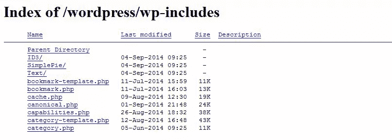

# 进一步保护 WordPress 的更多提示

> 原文：<https://www.sitepoint.com/more-tips-to-further-secure-wordpress/>

WordPress 经常被视为各种安全漏洞的非官方替罪羊。像许多其他流行的网络应用一样，WordPress 是一个吸引人的攻击目标。显然，WordPress 中的安全性，和任何应用程序一样，需要放在上下文中考虑。幸运的是，WordPress 受益于各种各样的安全配置选项和第三方插件，以帮助满足那些希望提高整体安全性的人。

在这篇文章中，我将在蒂姆·卡尔的 [10 条建议中添加更多的方法来帮助你保护你的网站，从安装 WordPress 之前开始。](https://www.sitepoint.com/tips-to-secure-wordpress/)


## 清理您的计算机

在开始安装 WordPress 之前，确保你的电脑没有恶意软件/病毒。这听起来可能是显而易见的，但重要的是您的系统没有恶意软件并处于可信状态。

如果你的电脑被感染了，你所有的安全措施都将失效。建议用防病毒软件保护你的系统，防止所有的恶意软件和病毒。

## 在另一个目录中安装 WordPress

WordPress 核心文件可以愉快地存在于另一个位置，而不是根目录。这项技术经常被争论，所以你的里程可能会有所不同。扫描器和攻击者仍然可以找到 WordPress 的地址，但是我们认为这是值得一提的，因为这个话题经常出现。

即使这不会直接提供额外的安全性，但它肯定会帮助您的服务器保持有序，这也是非常重要的。

例如，如果你的网站有 www.example.com 域名，那么最好把 WordPress 安装在类似 www.example.com/directory.的地方

下一步是将`index.php`和`.htaccess`文件复制到根目录。如果`.htaccess`文件不可见，你必须在你的 FTP/SFTP/SCP 软件或 cPanel 文件管理器中使隐藏文件可见。

如果你浏览你的站点，不要担心你现在会得到的错误。转到`index.php`并修改以下内容:

> require('/WP-blog-header . PHP ')；
> 到
> 要求('/directory/WP-blog-header . PHP ')；

现在你的登录网址将是*www.example.com/directoy/wp-admin.*

安装完成后，你应该在管理面板中打开你的 WordPress 设置，更改 WordPress 的 URL，这样它就会指向*www.example.com/directory*和博客 URL【www.example.com T3。

## 更改数据库前缀

默认情况下，WordPress 创建数据库时会在`wp_`前添加表格。这是因为使用自动化工具的垃圾邮件发送者和黑客知道您的数据库结构。拥有一个默认的数据库前缀使他们的生活变得容易多了。这是另一个争论的话题，然而就像在另一个目录中安装 WordPress 一样，这是一个经常出现的问题。

在安装过程中的`wp-config.php`配置期间，将表前缀更改为类似 wp_Df3R_ 的随机且唯一的值。

为了更有效地组织表格，前缀以`wp_`开始，以`_`结束。您可以使用数字、字母和下划线。

## 保卫 wp-config.php

作为 WordPress 中最重要的文件，它存储了数据库、用户名、密码和认证密钥等有价值的信息，任何人都不能直接访问`wp-config.php`。

如上所述，我们可以将`wp-config.php`存储在根文件夹之外。现在，我们将为它添加一个额外的安全层。

要拒绝对此文件的访问，您应该在`.htaccess`文件的顶部添加以下代码:

```
<files wp-config.php>
    order allow,deny
    deny from all
    </files>
```

其他人不应修改或写入此文件。为了防止其他用户读取它，文件权限应该是 440 或 400，但是您应该咨询您的主机来检查这一点。

## 删除 WordPress 版本号

有时留下 WordPress 版本号可能会有安全风险，尤其是如果 WordPress 没有定期更新的话。当然，我们强烈建议定期更新，就像执行[其他定期 WordPress 维护任务](https://www.sitepoint.com/definitive-guide-to-wordpress-maintenance/)一样。

生成 WordPress 版本的代码在`header.php`中:

```
<meta name="generator" content="WordPress <?php bloginfo('version'); ?>" />
```

要删除 WordPress 版本号，你应该把下面一行添加到你的活动主题的`functions.php`文件中:

```
<?php remove_action('wp_head', 'wp_generator'); ?>
```

## 使用密钥

使用秘密密钥在 WordPress 安全中起着重要的作用。这些安全密钥有助于加密 WordPress 使用的 cookies 中存储的数据。如果不知道这些密钥，攻击者将很难进入你的 WordPress 站点。

WordPress 会在安装的时候为你创建这些值，但是这些值可能在旧的网站上不存在，或者如果`wp-config.php`文件已经被手动替换。

默认情况下，密钥在 wp-config.php 列表中列出，如下所示:

```
define('AUTH_KEY',         'put your unique phrase here');
define('SECURE_AUTH_KEY',  'put your unique phrase here');
define('LOGGED_IN_KEY',    'put your unique phrase here');
define('NONCE_KEY',        'put your unique phrase here');
define('AUTH_SALT',        'put your unique phrase here');
define('SECURE_AUTH_SALT', 'put your unique phrase here');
define('LOGGED_IN_SALT',   'put your unique phrase here');
define('NONCE_SALT',       'put your unique phrase here');
```

如果您需要重新生成这些密钥，您可以访问 WordPress.org 在[https://api.wordpress.org/secret-key/1.1/salt/](https://api.wordpress.org/secret-key/1.1/salt/)提供的官方生成器。

如果攻击者拥有安全密钥，即使密码已被更改，他们也可以重新获得对站点的访问权。因此，如果你的网站遭到破坏，不要忘记更改你的密钥——不仅仅是密码！

## 禁用目录浏览

WordPress 允许用户浏览网页目录，如果他们知道去哪里找的话。显然，这是我们想要避免的。攻击者可以利用目录浏览来找到最易受攻击的文件。开发人员或网站管理员将备份文件或档案放在奇怪的地方并不罕见。



通过在`.htaccess`中添加一行，可以确保没有人能够查看目录的内容

```
Options –Indexes
```

## 保护多个安装

如果你在同一个主机上有多个 WordPress 实例，你应该为每个数据库使用不同的用户凭证。数据库用户名和密码应该是唯一的在 wp-config.php 文件为您的每个网站。这将确保每个站点的隔离，以防其中一个站点被黑客攻击。

这是一个简单的技巧，但是重用相同的凭证是人们一直在做的事情。

## WordPress 安全插件

如果你不愿意做上面提到的改变，有几个插件可以帮助你维护 WordPress 安装的安全性，甚至在你成为恶意攻击的受害者时帮助你快速恢复。

以下是最流行的安全插件列表:

*   苏库里
*   [iThemes 安全](https://ithemes.com/security/)
*   [多合一 WP 安全&防火墙](https://wordpress.org/plugins/all-in-one-wp-security-and-firewall/)
*   [防弹安全](https://wordpress.org/plugins/bulletproof-security/)
*   [文字围栏](https://wordpress.org/plugins/wordfence/)

Charles Costa 曾经探讨过 WordPress 安全插件的话题，这非常值得一读。

## 结论

由于很大一部分网站都是由 WordPress 驱动的，所以 WordPress 的安全性成为一个热门话题也就不足为奇了。如果你对你的网站和你的网站安全很认真，你肯定应该探索你的选择，并花额外的时间来锁定你的网站。

概括地说，我们之前已经介绍了保护 WordPress 的 10 个技巧，在这篇文章中，我们将介绍更多的技巧来帮助你更好地管理你的网站安全。如果你热衷于了解更多，我也推荐阅读 WordPress.org 官方文档“[强化 WordPress](http://codex.wordpress.org/Hardening_WordPress) ”。

如果你有任何增加 WordPress 安全性的额外建议，请在下面的评论中告诉我们。

## 分享这篇文章