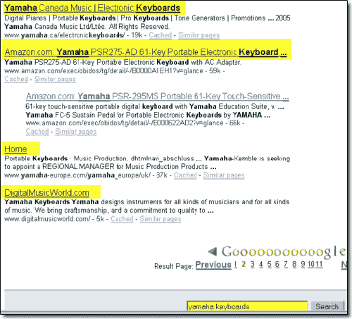

# 避免 5 个最常见的 SEO 错误

> 原文：<https://www.sitepoint.com/most-common-seo-mistakes/>

如果你曾经访问过 SitePoint 的[网站评论论坛](https://www.sitepoint.com/forums/forumdisplay.php?f=12)，你可能已经读过一些贴在那里的搜索引擎优化评论，其中一些是我写的。你会注意到，在这些对搜索引擎优化网站的评论中，很多评论都是重复的:“你的网站很漂亮，但你的 SEO 还有很多不足之处。你忽略了 X、Y 和 z。这里有一些解决问题的方法…”

由于 X、Y 和 Z 是如此常见，问题的解决方案也往往相同，所以我决定在本文中总结最常见的 SEO 错误及其解决方案。这些 SEO 错误是:

1.  使用非标准的标题元素

1.  未能优化图像标记

1.  在清晰的代码可以使用的地方使用蜘蛛难以辨认的 JavaScript

1.  未能使用标题元素指示内容层次结构

1.  糟糕的语法和拼写

让我们依次看看这些问题。

##### 使用非标准的标题元素

几年前，Fernando Freire bez 写了一篇优秀的文章，讲述了向用户显示标题元素的不同地方，它在今天仍然和当时一样重要。

首先，让我们定义什么是标准的标题元素。一旦这个概念清楚了，严重偏离标准的情况就会很明显，你会发现改正错误很容易。

标准的标题元素应该:

1.  包括一个或两个网站的关键字

1.  在前三至五个单词中包含对页面基本内容的引用(包含网站关键字的变体也是可以的。)

这个定义背后的逻辑是，蜘蛛只考虑标题元素的大约前 60 个字符。此外，他们擅长识别关键字填充的情况，我们将在后面看到，并且应该避免。

让我们考虑一些例子。对于生产婴儿摇铃的公司，标准的标题元素可能如下所示:

```
<title>Baby Rattles by Shake It Up Baby Inc.</title>
```

很简单。关键词包含在标题的前两个单词中。公司名称中的“响尾蛇”关键词有一个变体。包括空格在内，总共有 38 个字符。

相比之下，许多网站使用非标准的标题元素，看起来更像这样:

```
<title>Baby Rattles, Baby Toys, Rattles for Babies, Baby Shaker, Baby Rattle by Rattle Your Cage Inc. </title>
```

这个标题有四个问题。你能认出他们吗？标题使用了明显的关键词填充——这是一种在标题中包含大量关键词的做法，希望网站会因为所有这些关键词而被选中。事实上，这种做法可能会导致搜索引擎对该网站进行处罚，这可能会导致该网站在搜索引擎结果页面上的排名下降，甚至更糟:该网站可能会被搜索引擎禁止，并从结果页面中完全删除。

在标题中添加如此多的关键字是浪费能量，因为蜘蛛只阅读前 60 个字符左右。

出现在标题末尾的公司名称可能很少或根本没有被蜘蛛考虑，这使得人们很难找到使用该公司名称进行搜索的网站。

最后，它看起来不专业，垃圾邮件。谁会相信一个诉诸这种可疑商业行为的网站呢？

下面的截图显示了一些非标准的标题元素，这些元素是在雅马哈键盘的谷歌搜索引擎结果页面(SERPs)的第二页上返回的。注意雅马哈加拿大公司和雅马哈欧洲公司的相对位置。它们都同样与搜索雅马哈键盘相关，但其中一个使用“Home”作为标题元素。


*使用正确的标题元素可以让你的搜索引擎排名大不相同。*

##### 未能优化图像标记

这绝对是我今天最讨厌站长的事情之一。如此多有才华的 PhotoShop 大师创造了精彩的横幅、背景艺术和其他图像…然后以一种蜘蛛会忽略它们的方式将它们添加到他们的页面上！

横幅图像的一些非优化 HTML 示例如下所示:

```

```

我甚至见过这样的例子:

```

```

在第二种情况下，没有包括任何信息，至少是浪费了一个机会，但也会对那些有视觉障碍的访问者产生严重的可访问性影响。但是第一个例子也提出了一个问题:它对图像不够具体。

例如，如果横幅图像包含短语“SIUBNI 生产的婴儿摇铃玩具”(Shake It Up Baby Now，Inc .的首字母缩写)，则 alt 属性也应该为“SIUBNI 生产的婴儿摇铃玩具”简单。

事实是，mylogo.jpg 对搜索引擎蜘蛛来说毫无意义。因此，我们需要通过使用 alt 属性向蜘蛛描述图像。

要描述一个标志图像，公司的名称和“标志”这个词就足够了。对于由几幅图片组成的合成或镶嵌图像，我会在这些图像的 alt 属性中写入“公司名称徽标 1”、“公司名称徽标 2”等等。

当然，人们可能会选择利用这个建议:为了创建大量的 alt 属性，可能会使用大量的图像——最终目标是用关键字填充。再说一遍，这些都是愚蠢的策略，可能会让网站被禁止搜索引擎。即使没有禁令，显示几十张图片也会对页面加载时间产生严重影响，并可能导致流量在网站完全出现之前就离开。

下面这个网站说得对——差不多。暂时忽略非语义标记；主要的一点是，这些图像没有使用 alt 属性进行优化，尽管每个图像下至少有一行文本来描述显示的内容。

*描述不当的 alt 属性会阻止搜索引擎以及残疾用户“看到”你的页面。*

简而言之，使用 alt 属性通过关键字来描述图像内容。请不要放馅料。

##### 在清晰的代码可以使用的地方使用蜘蛛难以辨认的 JavaScript

我最近看到了一个“交易”网站，它汇集了互联网上的热门交易。因为它从各种来源获取内容，所以网站定期提供搜索引擎喜欢的新鲜内容。然而，问题是该网站的聚合器使用了 JavaScript。

结果，所有那些精彩的、频繁更新的内容完全没有被搜索引擎注意到。下图展示了这个了不起的网站，以及它背后不那么了不起的代码。


有很多内容聚合器执行相同的功能——从网络上的其他地方或同一网站的其他地方提取信息，并将其显示在网站的主页上——使用 PHP 或其他一些服务器端语言。在服务器上执行内容聚合，而不是使用 JavaScript，将生成蜘蛛可读的 HTML。

令人震惊的是，许多网站管理员使用 JavaScript 来显示他们希望搜索引擎索引的内容。直到最近，我也是其中之一——我的博客使用 JavaScript 生成的 blogrolls。后来我用干净的 HTML 替换了它们。毕竟，相关的外部链接对一个网站来说很重要，正如谷歌工程师 Matt Cutts 所写的。

要点很简单:尽可能少地使用 JavaScript，用它来增强用户体验，但不要显示您希望搜索引擎看到的内容。

##### 未能使用标题元素指示内容层次结构

正如大多数 SitePoint 读者所知，header 标签(h1、h2 等。)有明确的目的:它们建立网站的重要部分和内容层次。然而，与标题元素和图片描述一样，正确的标题层次结构是最没有得到充分利用的 SEO 工具之一。

即使在今天，随着微格式将语义 Web 的概念提升到一个全新的水平，继续用非语义标记创作页面的网站管理员的数量也是惊人的。即使受过良好教育的开发人员使用 CSS 来定位和样式化页面上的元素，也会忽略良好层次结构的重要性。

考虑[这个目录](http://www.abc-directory.com/)。如果您查看页面的标记，您将不会在整个文档中找到一个标题元素！这并非孤例。

[根据 WebAIM](http://www.webaim.org/techniques/semanticstructure/) 的说法，层级或标题标签的问题在于“它们缺乏微妙性:在大多数网络浏览器中，它们让标题看起来大得离谱(`<h1>`、`<h2>`)或小得离谱(`<h4>`、`<h5>`、`<h6>`)。”然而，这个借口在今天已经不再有效，因为 CSS 允许开发人员修改层次结构标签的显示。看看任何运行标准模板的 Blogger.com 博客，你会发现侧边栏的标题被修改成合适的大小。

我犯这个错误的借口是，我从别人那里得到了我的 SEO 博客的模板，而我缺乏编辑它的编码技能。然而，我认识到这是一个问题，并把它放在我的 SEO 待办事项列表中。

根据谷歌的常识性网站管理员指南(注意页面的标准标题元素)，网站管理员应该“创建一个层次清晰、有文本链接的网站。”

要纠正这个错误，首先要确定你的网站想要表达的要点(提示:你的关键词应该包含在这个内容中)。然后，使用 CSS 建立层次结构中元素的显示。最后，将关键点放在标题元素中。

##### 糟糕的语法和拼写

谷歌图书管理员中心是谷歌多年来最大的战略举措，然而该组织在很大程度上淡化了该项目的重要性。通过与图书馆员的公开合作，谷歌在开发算法的战斗中赢得了盟友。

正如图书管理员网络索引的凯伦·g·施耐德在 T2 为谷歌图书管理员中心的时事通讯写的一篇文章所说，“作者身份”很重要。“在 LII，我们非常怀疑网站上有太多的印刷或语法错误。除了把某人指向一个语法有问题的网站会让我们觉得很糟糕之外，这也是一个很大的暗示，表明网站上的内容普遍不符合标准。”两期时事通讯之后，似乎谷歌已经雇佣了他们的第一个图书管理员，而以前只有工程师被认为能够解决搜索的问题…

这个故事的寓意是什么？不要忘记拼写检查！然而，除了拼写检查之外，买一本可用的语法指南(在[易贝](http://search.ebay.com/search/search.dll?MfcISAPICommand=GetResult&ht=1&shortcut=0&from=R41&query=grammar+guide&category0=&Submit=Search)等网站上花不到 10 美元),确保你的句法、标点和其他语法元素都是正确的。

目前，网站管理员仍然可以摆脱糟糕的语法，但从长远来看，这将会改变，所以现在就开始改善你的语法和拼写，让自己在竞争中领先一步。

当然，与此同时，糟糕的语法阻碍了你的网站获得客户的信任，如果没有信任，就没有购买。投资良好的语法实际上是投资获得客户的信任。从个人经验来看，我推荐通用语言奇才和[文案比尔·希尔顿](http://www.billhilton.biz/)，我在[的 SitePoint 论坛](https://www.sitepoint.com/forums/showthread.php?t=398234)遇见了他。

##### 摘要

总结一下，在今天的网页设计社区中，有五个非常常见的 SEO 错误:

1.  使用非标准的标题元素

1.  未能优化图像标记

1.  在清晰的代码可以使用的地方使用蜘蛛难以辨认的 JavaScript

1.  未能使用标题元素指示内容层次结构

1.  糟糕的语法和拼写

幸运的是，这些问题很容易解决，但是，读完这篇文章后，您应该能够完全避免它们。

## 分享这篇文章