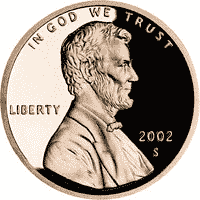

# 大多数人仍然不会为没有广告的内容付费，你会吗？

> 原文：<https://www.sitepoint.com/most-people-still-wont-pay-for-ad-free-content-would-you/>

周末*格言*在进行了一项调查，询问人们是否愿意支付象征性的费用——每月 3-4 美元——从他们喜欢的网站上移除广告。目前还不清楚问题的措辞是这样的，即该提议是一次性付费删除多个网站的广告，还是在每个网站付费删除广告。我们假设是后者。

也许并不奇怪，绝大多数人不会为他们喜欢的网站的无广告版本付费。84%的人表示，他们不太可能或根本不可能为无广告内容付费。不到 5%的人表示他们很可能会支付任何水平的费用。

那反映了我过去的经历。在成为一名科技作家之前，我为一家大型政治网站写文章，该网站提供无广告版本，每月收费约 3.95 美元。如果没记错的话，不到 5%的访问者愿意为无广告体验付费，尽管网站上贴满了你不会相信的广告。

很少有成功的内容网站是围绕付费访问模式建立的，大多数都是高度小众的内容网站，如科学期刊。《华尔街日报》可能是网上最成功的内容付费业务，订阅收入估计达到 5000 万美元。然而，对于大多数品牌来说，要求用户付费来访问内容几乎是不可能的。*《大西洋月刊》* [在今年年初](http://www.readwriteweb.com/archives/the_atlantic_tears_down_pay_wall.php)取消了收费，纽约时报*也是如此*。今年两个网站的流量都有所增长，尽管这可能是对美国总统竞选兴趣增加的结果。

然而，底线是让人们为内容付费在互联网上是一个几乎不可能的提议，尤其是对那些免费提供的内容。尽管人们似乎讨厌广告——想想 [AdBlock 加 Firefox 插件](https://addons.mozilla.org/en-US/firefox/browse/type:1/cat:all?sort=popular)每周获得 30 万次以上的下载——他们还没有讨厌到为无广告内容付费的地步。

你呢？你会付费从你最喜欢的内容网站上删除广告吗？你向用户销售无广告内容成功了吗？请在评论中告诉我们。

## 分享这篇文章