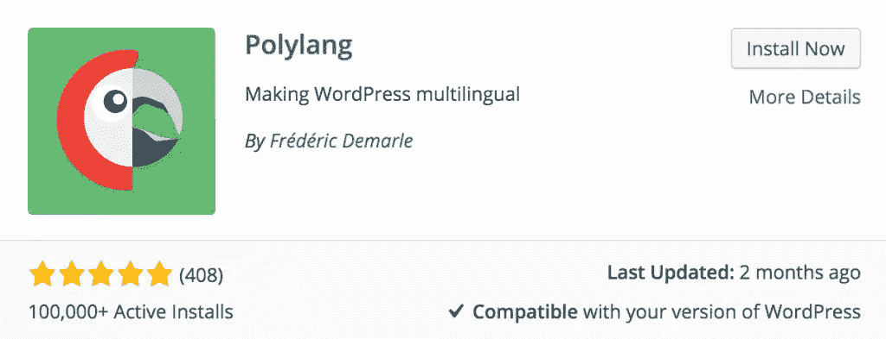

# 使用 Polylang 的多语言 WordPress 网站

> 原文：<https://www.sitepoint.com/multilingual-wordpress-websites-with-polylang/>

WordPress 有很多不同的语言版本。但是，当你在“通用设置”面板中切换到另一种语言时，默认情况下，你不能同时使用几种语言。

有时，能够使用几种语言是我们所追求的。我可以用自己的例子来说明这一点:我的博客有两种语言版本(英语和法语)。如果你更喜欢法语，你可以切换到它没有任何问题，我不需要切换整个网站的语言偏好。

默认情况下，在 WordPress 中不可能做到这一点，但是有插件可以帮助你实现这个目标。在这篇文章中，我将向你介绍一个完全免费的插件 Polylang。我们将看看如何安装它，如何配置它，最重要的是，如何使用它来翻译整个网站(不仅仅是帖子！).

## 在 WordPress 上管理几种语言

### 为什么要用 Polylang？

取决于你想做什么，默认的 WordPress 工具就足够了。例如，你可以用一种给定的语言创建一篇文章，用另一种语言创建同样的文章，加上正确的标签来区分它。这只是一个例子，但是如果你想让事情简单，你可以这样做。


然而，这不是一个完整的解决方案。使用 Polylang 的好处是，这个插件不只是让你翻译你的帖子。事实上，如果你的主题被翻译成正确的语言，你的访问者将会看到一个完整的翻译网站。以我为例，当你在我的博客上阅读一篇法语文章时，你会看到一个翻译过的边栏和页脚。

Polylang 是一个帮助你创建多语言网站的强大工具。一旦你配置好了，使用 Polylang 翻译你的文章就像我们上面看到的例子一样简单。也许更容易！

### 安装 Polylang

你可以通过[WordPress.org](https://wordpress.org/plugins/polylang/)免费下载 Polylang 插件。它可以像其他插件一样安装和激活。



### 管理可用语言

Polylang 有自己的选项面板，可从管理面板的“设置”菜单中的“语言”条目访问。我们将从该面板的第一个选项卡“语言”开始。顾名思义，它可以让你管理你想在网站上使用的语言。

要添加一种新语言，最简单的方法是使用标有“选择一种语言”的下拉列表。默认情况下，有几十种语言可供选择，你很可能会找到你想要的那一种。如果你不能，你仍然可以通过创建你自己的来使用它(它的名字，地区，代码和方向)。

您还可以选择语言在列表中出现的顺序。“订单”文本输入不包括数字。语言将使用这个数字按升序排序。

添加语言后，您可以编辑其信息。将鼠标悬停在列表中的语言上可以看到这些选项。

## 配置 Polylang

通过访问 Polylang 选项面板中的“设置”选项卡，您将找到一些有用的选项来个性化您的多语言体验。

第一个选择，可能也是最重要的一个，是你希望你的网站使用的默认语言。它可以是您添加的任何语言。如果您的访问者使用您不支持的语言，他们将看到此默认语言。

如果你的网站不是新的，很有可能你已经发表了一些文章。因为你在创建 Polylang 之后已经安装了它们，所以现有的文章没有语言设置。您可以在此选项卡中为他们提供所有默认语言设置。

在此选项卡中，您还会发现一些您想要检查的选项，尤其是您的 URL 首选项。

## 完全翻译的网站

### 主题翻译

如上所述，Polylang 不仅仅是翻译我们的帖子。我们的游客可以用他们喜欢的语言进行完整的体验。

为此，你需要一个翻译过的主题。如果你使用的主题是翻译就绪的，你应该在其中找到一个 POT 文件(可能在类似于`languages`的子文件夹中)。这个文件包含了主题中使用的所有字符串。这样你就可以把它们翻译成你想要的所有语言。

现在，当 Polylang 在你的网站上显示正确的语言时，它不仅会显示该语言的帖子，还会显示主题。这样，你的访问者就不会在英文页面上看到法语文本。

请注意，如果您使用 WordPress 默认主题，如 Twenty Fifteen，当您在 Polylang 中添加一种新语言时，它会尝试下载并安装这种语言的主题翻译。

### 动态字符串翻译

我们不能用一个简单的文件翻译所有的东西。例如，小部件的标题是由用户(您)创建的字符串，因此我们自然不能使用 POT 文件来翻译它们。然而，多亏了 Polylang，还有另一种方法来翻译它们。

进入 Polylang 选项面板的第二个选项卡。这个标签叫做“字符串翻译”,包含了你的网站上显示的各种字符串。默认情况下，Polylang 会生成几个动态字符串。你会发现字符串，如网站名称和描述，你甚至可以翻译时间格式。

Polylang 还将检索您正在使用的所有小工具。它们的标题和内容(例如文本小部件)可以用动态字符串翻译。值得注意的是，当您在 Polylang 处于活动状态时创建一个小部件时，您现在可以在小部件设置中选择一种语言。

在“字符串翻译”选项卡中，Polylang 以原始语言列出了所有注册的动态字符串。然后你可以把它们翻译成你使用的语言。不仅你的主题可以翻译，你的动态内容也可以翻译。

### 注册我们自己的动态字符串

如果你正在开发一个主题或插件，你可以通过注册你自己的动态字符串来使它“多语言就绪”。例如，如果您需要显示一个用户可以自己定义的字符串，它会很有用。通过注册这些字符串，这些相同的用户将能够提供多种语言的字符串。

要注册字符串，使用`pll_register_string()`功能。与其他插件定义的任何其他函数一样，您应该通过以下测试来检查该函数是否存在:

```
if (function_exists('pll_register_string')) {
    // The function exists, do whatever you want!
}
```

即使安装并激活了 Polylang，也可能会缺少此功能。例如，有可能在创建之前过早地调用它。为了确保不要太早调用它，一定要在“plugins_loaded”动作发生后调用它。例如，如果您直接在主题的`functions.php`文件中注册字符串，就会出现这种情况。

现在我们已经看到了如何调用这个函数，是时候看看它的参数了。这个函数有四个参数，但最后两个是可选的。

第一个参数是字符串的名称。这个名字是描述它的一种方式。请参考您当前的“字符串翻译”选项卡，了解其用法示例。例如，像“l，F，j，Y”这样的字符串并不总是清晰的，但是对于“日期格式”这个名称，它是清晰的。

第二个必需的参数是要翻译的字符串。你可以用任何你想要的语言来写，但是要尽量和你的主题或者插件保持一致。

```
pll_register_string('My awesome string', 'This is a translated string.');
```

第三个参数表示字符串必须放入的组。默认情况下，这个组被命名为“polylang ”,但是你可以定义你自己的组，例如通过指明你的主题的名称。您的用户可以在注册字符串列表中看到组名。这是让你的用户更好地理解你的字符串显示在哪里的另一种方式(如果几个插件使用 Polylang，你的用户会感谢你指出一个字符串是你的插件而不是另一个插件的)。

最后一个参数不会对每个人都有用，但可能对某些人有用。默认情况下，它是一个设置为`false`的布尔值。如果将 If 设置为`true`，那么 Polylang 将提供一个多行文本区域，让用户翻译字符串，而不是一行文本输入。

### 检索注册的字符串

注册字符串后，用户可以在“字符串翻译”选项卡中翻译它们。但是您仍然需要一种方法来检索它们，以便显示正确的翻译！

基本上有两个函数可以用于此。第一个是`pll__()`(注意`__()` WordPress 函数的两个下划线)。你给它要翻译的字符串，它返回相同的字符串，翻译成当前语言。

```
$translated_string = pll__('This is a translated string.');
```

如果你不想对这个翻译后的字符串做任何事情(比如把它注入到一个像`sprintf()`这样的函数中)，你可以直接用`pll_e()`回显它。

```
pll_e('This is a translated string.');
```

还可以使用第三个函数:`pll_translate_string()`。最后一个包含两个参数:要翻译的字符串和您希望翻译的语言。例如，如果您希望以目标语言显示类似“以[任何语言]查看这篇文章”的文本，这可能会很有用。

```
echo pll_translate_string('View this post in French', 'fr');
```

## 帖子翻译

### 翻译帖子

现在你已经设置了 Polylang，你现有的所有文章都应该使用默认语言。这意味着它们不会出现在其他语言中。

在文章列表中，您会发现新的列表示每种添加语言的翻译状态。如果一个“加号”显示在一个帖子行中，这意味着相应的翻译不存在。你可以点击这个“加号”来添加翻译。

在这一点之后，我们没有什么需要做的了。你写你的翻译像任何其他职位，就是这样！除了“棒极了”你还有别的词来形容这个吗？

请注意，您也可以在编辑文章时添加翻译。Polylang 在编辑器中有自己的框，列出了当前帖子的现有翻译。在此列表中，您可以编辑现有翻译并添加其他翻译。

### 翻译类别和标签

到目前为止，我们已经翻译了我们的主题、小部件和帖子，但是仍然有一些事情我们没有涉及:像类别和标签这样的分类法。我们可以通过访问您的管理面板的“类别”或“标签”页面来翻译这些内容。你将能够翻译它们，就像我们翻译文章一样。

一旦你的类别和标签被翻译，你就可以在你的文章翻译中使用它们。然而，我想在这里与您分享最后一个 Polylang 选项:翻译之间的同步。

在页面末尾的“设置”标签中，您会发现一些复选框。通过检查其中的一些，您可以激活帖子的所有翻译之间的相应元素的同步。

例如，假设您有一个名为“我的类别”的类别，用法语翻译为“Ma catégorie”。你将在这一类别中用英语写一篇文章，并想把它翻译成法语。在这个翻译中，不要指明任何类别:如果您已经激活了分类法同步，那么将自动选择“Ma cateégorie”类别！

## 征服世界！

在本文中，我描述了 Polylang 中我认为有用的大多数主要选项，但是还有一些您肯定想了解的选项。不要犹豫在本地安装中测试 Polylang，并且在您的产品网站上使用这个插件之前测试一些变化。

如果你想了解更多 Polylang 提供的选项、功能、滤镜，可以访问官方 [Polylang 文档](https://polylang.wordpress.com/documentation/)，非常完整。

## 分享这篇文章