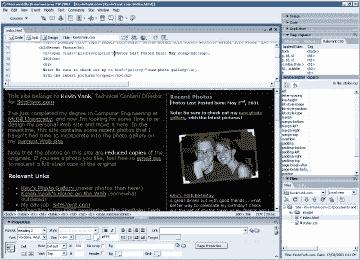
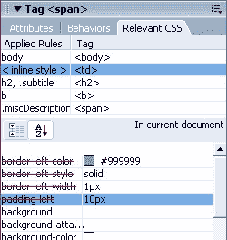

# 回顾–Dreamweaver MX 2004(Macromedia)

> 原文：<https://www.sitepoint.com/mx-2004-macromedia/>

**又是一年，又是一个版本的 Dreamweaver。一如既往，最大的问题是:你应该为更新付费吗？嗯，如果你在网页设计工作中使用 CSS 尤其是页面布局——那么今年的答案是“绝对可以！”**

随便看一眼 Dreamweaver MX 2004，就会发现 Macromedia 界面设计人员又开始研究它了。连续第二个版本，Macromedia 已经完全修改了界面的外观。令人欣慰的是，界面的变化主要是肤浅的，一切都和它在 Dreamweaver MX 中的工作方式一样，只是它看起来更光滑！

除此之外，Dreamweaver MX 2004 最大的变化是改进了 CSS 支持。从代码编辑器到 WYSIWYG 视图，该程序的所有现有功能都为 CSS 提供了更好、更完整的支持。WYSIWYG 视图一直让我感到惊讶，它是如此接近地模拟 CSS 兼容的浏览器，如 Mozilla、Internet Explorer 6 和 Opera 7，代码编辑器现在提供了完整的弹出提示，用于手动编码 CSS。

复杂的背景和边框，错综复杂的定位层次，浮动和显示模式…都在那里！在 Dreamweaver 的 WYSIWYG 视图中，除了最复杂的 CSS 布局之外，所有的布局都应该看起来相当不错(如果不是 100%正确的话)。在某些情况下，Dreamweaver 的 WYSIWYG 视图甚至比最新版本的 Internet Explorer 更符合 CSS 标准！

但是 Macromedia 在这个版本中强调 CSS 的真正亮点是相关的 CSS 面板。

有了这个界面设计的奇迹，您可以在 WYSIWYG 或代码视图中立即看到应用于当前所选元素的所有 CSS 规则。我也不只是在谈论匹配所选元素的规则。该面板显示适用于所选元素及其祖先的每个规则！这使您可以通过 CSS 继承看到影响所选元素的属性。

在面板的顶部，您会看到一个可能影响当前元素的规则列表。根据 CSS 的层叠规则，这些规则按照它们应用于元素的顺序列出。单击某个特定的规则，面板的下半部分会告诉您它是在哪里定义的(例如“在 styles.css 中”或“在当前文档中”)，并列出它定义的 css 属性。影响所选元素的已定义属性以正常的蓝色文本显示，而那些不是继承的属性，或者在级联中被稍后的规则覆盖的属性会显示一条红线。

这个面板也不仅仅用于检查 CSS 规则。列表中的所有属性都可以直接编辑；如果您喜欢手工编写 CSS 代码，您可以双击上半部分的任何规则，直接跳到主编辑器中相关的代码行。

有了这个独特的工具，Macromedia 似乎已经解开了在 GUI 中逻辑处理 CSS 的秘密。如果你的 CSS 知识有点生疏，这需要一点时间来适应，但对于我们这些完全了解 CSS 如何工作的人来说，这确实是一个值得一看的特性。

好吧，但是如果 CSS 不是你的那杯茶呢？或者，如果 Dreamweaver MX 中的 CSS 支持对于您使用这项技术的方式来说已经足够了呢？MX 2004 中还有许多其他新的和改进的功能:

*   **Automatic browser compatibility checking**

    如果 Dreamweaver 检测到任何可能阻止您的页面在特定浏览器中工作的编码错误或不受支持的功能，文档区域顶部的小图标会通知您。单击按钮，结果面板会给出一个完整的列表，您可以依次单击该列表来修复每个问题。

    这听起来可能很像 Dreamweaver MX 的验证功能，但该功能检查 HTML 和 CSS 代码，并可以找到和识别大多数流行浏览器的已知兼容性问题(不仅仅是发布的规范)，包括最近的条目，如 Macintosh 的 Safari 1.0。

    如果你不想在使用比如说 Netscape 4 不支持的 CSS 属性时得到通知，请不要担心！您可以配置检查哪些浏览器和版本的兼容性。

*   **Secure FTP support**

    这对我来说是个大问题，因为所有的 SitePoint 服务器都只接受通过安全 FTP 的文件传输。

    你看，普通 FTP 都是明文收发所有数据(包括密码！)，所以很容易被黑客攻击。另一方面，安全 FTP 对流入和流出服务器的所有数据进行加密。如果你仍然使用 FTP 上传文件，现在是时候考虑这个安全的选择了！

    有了这种新的支持，我终于可以将更改上传到我的网站，而不必打开单独的程序，并且我可以充分利用 Dreamweaver 的文件管理面板中的功能。

*   **Direct editing of remote files**

    说到这里，有时您希望快速更新存储在远程服务器上的文件，而不需要在 Dreamweaver 中设置完整的站点。

    Dreamweaver MX 2004 的“站点”面板现在允许您创建简单的 FTP 和网络服务器连接，以及成熟的站点。通过这些连接，您可以快速打开、编辑和更新远程文件，而无需设置本地目录结构来镜像本地站点。

这些只是 Dreamweaver MX 2004 所提供的部分改进。为了全面了解这些变化，我建议下载 30 天免费试用版，并在您自己的工作中使用一段时间。不过，为了满足你的好奇心，这里列出了我注意到的一些更重要的改进:

*   对于有经验的用户来说，一个不显眼且有用的欢迎屏幕
*   代码编辑器通常更加有用和强大，包括 ASP.NET 的弹出提示
*   PHP 支持现在与其他服务器模型的功能相当
*   与 Fireworks 的集成使您可以在 Dreamweaver 中执行简单的图像编辑任务
*   XML 名称空间支持改进了 XML 编辑
*   从 HTML 识别程序(包括 Microsoft Office 应用程序)粘贴会保留格式
*   包含 HomeSite+的更新版本

##### 最大的问题

所以，回到大问题。正如你所看到的，这个新版本有很多内容，但是最大的变化肯定是在 CSS 支持方面。如果你不打算从这些功能中受益，那么 199 美元的更新价格可能有点太贵了，归根结底，这是该产品大多数领域的一个进步。

但是如果你使用 CSS 来格式化你的网站，特别是如果你使用或者希望使用 CSS 页面布局，那么这是一个不可或缺的更新。现在就得到它，永不回头！

**产品名称:**Dreamweaver MX
公司: Macromedia
**价格:**$ 399.00(199.00 美元升级)
**30 天试用下载可用:**[http://www.macromedia.com/software/dreamweaver/](http://www.macromedia.com/software/dreamweaver/)

## 分享这篇文章