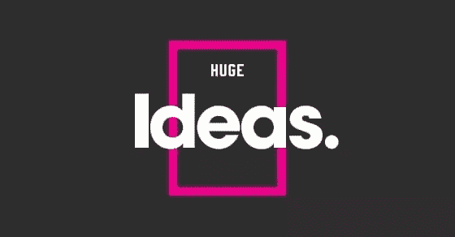
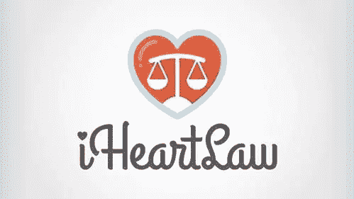
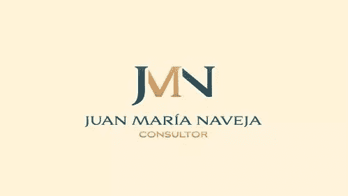
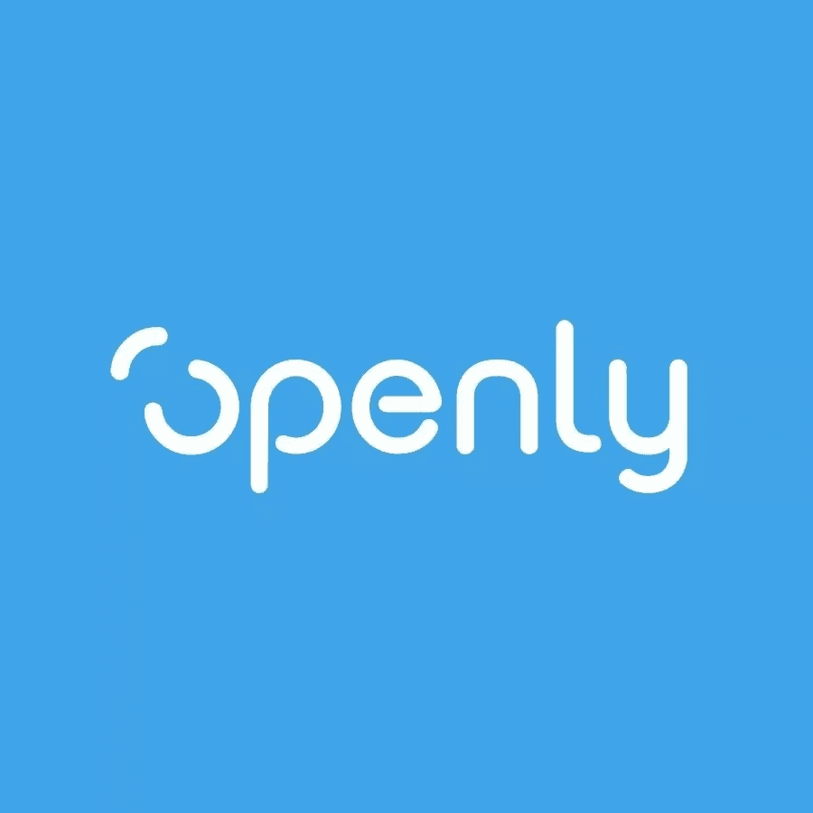
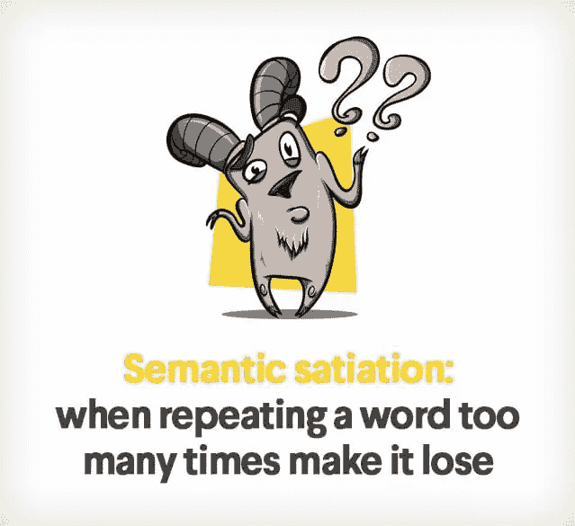
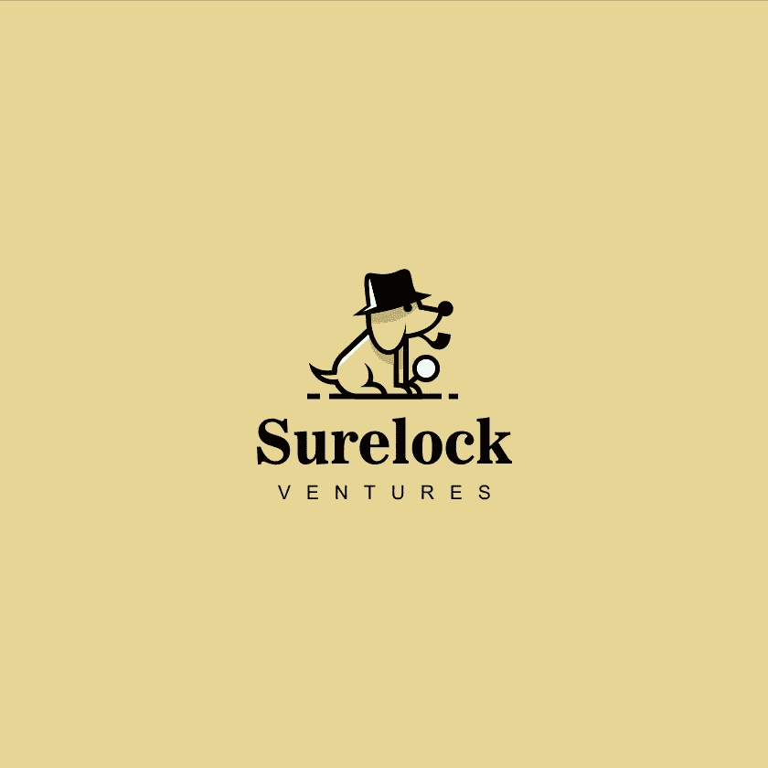

# 如何在设计思维的帮助下给你的企业命名

> 原文：<https://www.sitepoint.com/name-your-business/>

这篇文章之前发表在 [99designs 博客](https://99designs.com/blog/business/how-to-name-your-business/?utm_source=partner&utm_medium=paid-referral&utm_campaign=sitepoint&utm_content=interview-post)上。想要最好的设计来改造你的企业吗？[考虑发起一场 99 设计的设计大赛！](https://99designs.com/launch/?utm_source=partner&utm_medium=paid-referral&utm_campaign=sitepoint&utm_content=interview-post)

作为一名企业家，给你的企业命名是你必须完成的最令人兴奋也是最令人畏惧的任务之一。名字是向世界介绍你的企业，是你推销时从嘴里说出来的第一句话，是你希望人们在你与他们谈论你的公司后会记住的一个词。

这不仅是第一印象，通常来说，也是你生意的持久基石。你可以不断重复你的商业计划、货币化、产品、电子邮件营销、标志设计——实际上是你的商业战略和执行的任何部分——但是一旦你确定了一个名字，你可能会希望它坚持下去。

那么，你如何着手对你职业努力的成果进行洗礼，希望在未来的许多年里？设计思维可以提供一些伟大的工具，引导你做出完美的选择。

通过有线电视拍照

即使你以前没有听说过这个术语，如果你曾经在小组中头脑风暴过或者在研讨会中使用过便笺，你可能已经进行过某种形式的设计思考。该学科的领军人物蒂姆·布朗(Tim Brown)将其定义为“一种以人为中心的创新方法，从设计师的工具包中汲取营养，整合人们的需求、技术的可能性和商业成功的要求。”

> “我想要一个能唤起海滩回忆的名字和相关图像，所以我认为救生员塔是理想的选择。”
> –塔桨板

我喜欢把设计思维更简单地理解为一套原则、工具和练习，使我们能够组织我们的思维，并对一系列问题提出更具协作性、同理心和创造性的解决方案。它的迷人之处在于它的多功能性；虽然这些是“设计”工具，但每个人——不仅仅是设计师——都可以成功地利用它们，应对各种挑战。因此，当你阅读这篇文章并浏览小册子的练习时，我鼓励你在面对公司生活中的其他任务和挑战时，在心理上(或物理上)记下这些工具，并将它们纳入你的个人工具包中。

现在，让我们给你取个名字吧！

### 第一步:定义

实际上，暂时忘记这个名字，开始考虑更大的图景。你的公司到底是干什么的？驾驶任务是什么？作为一家公司，你的核心价值观是什么？你希望向世界展示什么？

考虑这一点很重要的原因是名字不是一个独立的东西；这是贵公司品牌众多重要元素中的第一个。因此，它将在你必须做出的其他设计决策中发挥作用:视觉标志、配色方案、包装、网站、产品设计等。)和非视觉(公司价值观、传播、营销等)。)

巨大的品牌是巨大的

一家公司抓住了这一点，那就是总部位于布鲁克林的大型数字代理公司。您可以看到徽标本身包含的“巨大”元素，它以粗体、全大写字体显示名称。你可以从他们直到中期使用黑色和洋红色作为配色方案中看到这一点。你可以在他们的网站上看到占据页面大部分的大图片和伴随图片的大字体(我相信是 AvantGarde Bold typefont)。

这些只是视觉设计元素——还不止于此。该网站的副本有一个独特的声音，与他们的视觉风格的大胆和厚颜无耻完全匹配(“因为在乎而获得报酬”是他们职业页面的一个亮点)，他们的公司视频展示了充满活力和运动的工作场所文化:一群人准备做一些大事情。一切都完美地联系在一起，表达了创新、大胆和大胆思考的核心价值观。

> “kiva 的名字来源于‘Kiva’这个词，Kiva 是一个神圣的美国土著房间，一个可以进行治疗、社区甚至转变的地方。正是考虑到这一神圣的景观，Kiva 糖果公司诞生了。”
> –Kiva 糖果

所以花点时间写下你的业务驱动力:几个要点就够了。然后在接下来的过程中不断回头参考它们，以确保名字和公司的潜在价值之间存在联系。

### 第二步:发现

虽然马上开始列名单很有诱惑力，但从一些研究开始，设置背景，让创意源源不断，总是一个好主意。

#### 温习行话

你可能已经了解了你所在领域正在发生的事情——毕竟这可能是你的专业领域——但是查看关于这个主题的最新文章和研究可能会有所帮助。关键主题是什么？行业内外的人们都在忙些什么？新兴趋势是什么？记下包含专家和您的(未来)用户所关心的关键词，以确保以客户为中心的观点。

#### 对竞争对手进行尽职调查。

接下来，用谷歌搜索一下你的竞争对手。如果你没有直接的竞争对手，那就去查查你所在领域的主要公司。这将有助于你对行业内的命名趋势有一个整体的了解。你当然没有义务去适应这个模式，但是要意识到你有多“偏离”它，并确保这是有意的。例如，如果你所在行业中 99%的公司都以“姓&姓&合伙人”命名，你应该认识到，将你的公司命名为“iHeartLaw”将会引起注意——是好是坏，我们不能说。当你浏览竞争对手的名字时，也访问他们的网站，想想每个名字在整体上如何代表公司品牌。写下你爱的人*和你恨的人*。

Azael Carrera 的标志概念

法律服务公司命名和整体品牌的对比方法。Terry Bogard 为 Juan Maria Naveja 设计

### 考虑公司命名趋势。

一些创业公司命名趋势，包括家喻户晓的公司和崭露头角的创业公司，有:

*   一个单词的时髦名字；想想:[优步](https://www.uber.com/)或者[茶杯](https://cupsapp.com/)。
*   复合词；想想: [Evernote](https://evernote.com/) 或者 [TripleMint](http://triplemint.com/) 。
*   人名；想想看:奥斯卡或 T2【克莱尔。
*   混搭的名字；想想: [Instagram](http://instagram.com/) 或者[dressmetry](http://www.dressometry.com/)。
*   像-ify、-ster、或-ly 这样的后缀加在单词上；想: [Spotify](https://www.spotify.com/) ， [Napster](http://us.napster.com/) 或者[心满意足](https://contently.com/)。
*   元音是被高估的名字；想想: [Flickr](https://www.flickr.com/) 或者 [Stringr](https://beta.stringr.com/) 。
*   故意拼错一个单词(不仅仅是去掉元音，I 变成了 y，c 变成了 k 或 q，等等。);想一想: [Lyft](https://www.lyft.com/) ， [Rubrik](https://www.rubrik.com/) 或者 [Proov](https://proov.io/) 。

> “我过去常常非常聪明地给我的初创公司命名……[现在]，简单地想一个真实的词来描述该服务或该初创公司将提供的服务的一个关键特征。我就是这样到达名字缓冲区的。”
> –Joel Gascoigne，Buffer 首席执行官

这些命名趋势各有利弊，尤其是在网上建立公司的物流方面，我们将在本文后面更深入地讨论。总的来说，简单性和域可用性是反向相关的，所以您应该小心地找到一个平衡点。

最后，你不应该觉得局限于这些格式。许多我最喜欢的公司名称都不属于这些类别，比如 [TheRealReal](https://www.therealreal.com/) (同一个词出现两次，真的吗？然而它是有效的。)、[罗宾汉](https://www.robinhood.com/)(别人会把你当回事吗？是的。)， [x.ai](https://x.ai/) (那是什么？没错。)当然还有我自己的创业公司 [day100](http://day100.me/) (名字里一个字*和*一个号？是的，我们在它背后有一个很酷的意思)。

后缀万岁。通过博拉德找布鲁诺。

混搭。通过 ludibes。

一个字的重拳。伊恩·道格拉斯写给 Rhshaner 的

所以，当你在下一步考虑名字的变化或组合时，不要把这些趋势当作限制，而是当作方便的例子。

### 第三步:发展

困惑的山羊

现在我们开始有趣的部分:发展想法，或头脑风暴。这里有一些建议，告诉你如何在不陷入语义饱和(重复一个单词太多次会让它失去意义的有趣现象)或沉浸在便利贴中(尽管我会提前告诉你，会有很多便利贴):

*   **数量，而不是质量。**是的，你没看错。与生活中的大多数事情不同，这不是要马上确定一个完美的名字，而是要产生许多可以相互借鉴的想法。
*   团队合作成就梦想。你当然可以自己进行大量的头脑风暴，但是新鲜的观点会非常有帮助和令人惊讶。因此，如果可以的话，让其他人参与进来，创造一个集思广益的环境，让人们在分享疯狂的想法时感到舒服，而判断会被推迟。
*   **获得视觉效果。正如汤姆和大卫·凯利在他们的书《创造性自信》中所说，一个领导者应该毫不犹豫地伸手去拿一支记号笔。所以不要只是写，还要把自己的想法拟出来。素描不好；这不是艺术性的问题，而是要表达清楚。这些图像可以激发你的名字，作为一个奖励，现在你也有了公司标志的愿景。**

> “[我们]对名字有两个要求:我们想要一个以“W”开头的三个字母的单词，并且要容易记住。”
> –Wix

*   **玩游戏。仅仅坐下来用意识流的方式写一堆名字的头脑风暴会议不会持续很久。通过整合练习和挑战，让它变得有趣和更有成效。我们已经覆盖了你:检查我们的头脑风暴练习的小册子。**
*   **出轨一点。**不必自己或和团队想出每一个名字。利用[词库](http://www.thesaurus.com/)获取相关关键字的同义词，利用 [Naminum](http://www.naminum.com/) 和 [Namemesh](http://www.namemesh.com/) 等命名工具获取基于关键字的各种名称变体。
*   **迭代。**当然，创业公司的黄金法则在这里也适用。休息一会儿(或者散步或者小睡一会儿),然后一遍又一遍地进行头脑风暴练习。试着改变你的环境来促进不同的创造过程。如果这是一个团队的努力，尝试与不同的群体，如团队成员，朋友，未来的用户等。和不同的组大小。

### 第四步:交付

你的头脑风暴会议可能产生了数百个命名的想法。现在是时候把你面前所有的纸片，便利贴，涂鸦收集起来，开始缩小范围了。

### 删除“嗯”的想法

以下是如何:

*   首先，根据相似性(例如，相同的词根)将它们分组，并消除任何重复。
*   第二，删除那些语义过于复杂、拼写/输入起来非常麻烦的单词。相信我，你不会想错过销售机会，因为销售主管不会拼写你的公司名称，因此无法在网上联系到你。

满满的好主意。通过 HBO。

*   第三，试着大声说出来。它们容易说吗？它们听起来好笑吗？不要成为硅谷的一群人，他们想出了 SMLLR，目标是“更小”，然后意识到它也可以被理解为“smeller”。
*   第四，和其他人一起测试这个；最好是不熟悉你工作的人。询问他们对这个名字的最初印象:听起来如何，感觉如何。看看这与您在流程开始时概述的公司价值观和使命有何不同。

### 检查入围名单的可用性

现在你有了一个候选名单，你必须检查他们是否真的有用。你不仅需要核实域名的可用性，还需要核实相关的社交媒体:Twitter、LinkedIn、脸书和 Instagram 是最受欢迎的。免费的一站式服务是 [Namechk](https://namechk.com/) ，它会自动检查你输入的每个名字在所有可能的平台上的可用性。

> “我们知道我们想要一个容易记忆、平易近人、友好的名字，但我们不希望它是一个已经存在的词。Dave [Rusenko，Weebly 的联合创始人]实际上建立了一个算法，它可以根据长度、辅音和元音的组合以及字母顺序等规则自动生成可用的域名。com 是可用的。当我们看到 Weebly 时，我们知道它是赢家。”
> –wee bly 联合创始人兼首席营销官 Dan Veltri

如果没有呢？这比你想象的要经常发生。在这个时代，大多数领域，尤其是简单的领域，早已不复存在。值得庆幸的是，如果你不知道自己想要的确切名字，还有其他选择或创意:

*   尝试一个流行的非 com 域名。最普遍的替代域名结尾，尤其是初创公司，是。co，。木卫一，。你也可以在 [Namechk](https://namechk.com/) 上轻松查看一大堆域名的可用性。
*   **了解特定行业。有些域名的结尾对某些行业来说比其他行业更好:例如，你可以选择。金融现金。以技术换技术。电子商务购物等等。查看更多[综合列表](https://smallbiztrends.com/2016/03/alternatives-to-com.html)。**
*   变得更有创造力。让域名结尾与你的公司名称一起玩，例如像 [soul.camp](http://soul.camp/) 和 [bonus.ly](https://bonus.ly/) 这样的公司将结尾无缝集成到名称中。
*   **妥协。回顾一下这些趋势，看看去掉一个元音或把一个辅音改成它的语音对等词是否会有所不同。你对这种妥协满意吗？**

不寻常的拼写。通过艺术西格玛。

的。co 选项。Via vraione。

### 测试并决定

好吧。你粗略地缩小了范围，评估了人们对多个选项的反应，检查了名字的可用性，现在你只剩下前两三个了。如何着手完成这个看似不可能完成的任务呢？

> 我想创造一个易于品牌识别和搜索引擎优化的新词，并且希望它易于发音。贝尔格雷

如果你的直觉没有稳定地指引你一个方向，那就民主化这个过程。当然，你可以继续亲自询问人们，虽然这在许多方面都是一个可靠的策略，但总会有一些偏见和有限的样本量影响调查的准确性。

而是把它放到网上。这里有两种方法:

*   **黑客之道:** A/B 测试一下，让数字说话。你可以通过为你的目标用户/客户设置相同的登陆页面和定向广告来做到这一点。然后比较流量/参与度，挑选大众投票。创业博客 StartupBros 提供了一个很好的[例子](http://startupbros.com/how-to-pick-the-perfect-name-for-your-business-or-startup/)。这是一个很好的策略，因为它尽可能地接近模拟现实生活，而且你肯定会做出数据驱动的决定。
*   社交方式:对于技术水平不高或不愿意花钱的人来说，上面的过程可能看起来有些令人畏惧或缺乏吸引力。暗示社交方式:询问你在线社交网络中的关系。你有可能拥有 LinkedIn、Twitter 和脸书，对于大多数专业人士来说，这些网站很容易就拥有数百甚至数千个联系。建立一个简短的民意调查，并与他们分享。你可以通过免费的外部调查来做到这一点，比如[谷歌表单](https://www.google.com/forms/about/)，它提供了将所有结果放在一个地方并为你预先分析的便利。或者，你可以直接在社交媒体平台上发布民意调查，或者使用他们内置的民意调查工具(Twitter 的是免费的；脸书的是付费的)，或者简单地以状态的形式提出问题和选项。诚然，分析数据将涉及一些人工工作，但响应率可能会更高。无论你选择哪种方式，社交方式的一个隐藏的好处是营销效果:你在你的网络中创造了关于你的公司的意识，并让人们兴奋地认为他们在你的品牌推广过程中有发言权。

### 去给你的企业命名吧！

小蚱蜢，你准备好了。这些设计思维技巧和练习小册子有望补充所需的工具包，以提出一个创造性的，令人难忘的，有意义的和可用的(！)您公司的名称。这是工作，我知道，但毕竟你不会在第一印象上有第二次机会，所以把它做好是值得的。

## 分享这篇文章