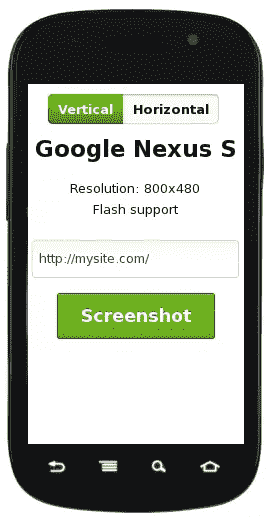

# 需要在多种设备上测试你的网站吗？Mobilito 可以帮忙

> 原文：<https://www.sitepoint.com/need-to-test-your-site-on-multiple-devices-mobilito-can-help/>

移动设备的多元化使得越来越难确保你的网站在许多屏幕分辨率和屏幕比例下看起来都很好，从 iPhone 320×480 到 Nook Color 600×1024。更糟糕的是，这些设备可以垂直或水平放置。

在桌面世界中，网页设计可以通过使用更大的空白区域来获得更高的屏幕分辨率。但是在移动世界中，屏幕空间是宝贵的，应该充分利用。缩小分辨率也是一个挑战，因为随着移动浏览器的自动缩放，它可能会导致非常小的字体。

一旦你在一个移动设备上测试了你的网页布局，或者幸运的话在两个设备上测试，你需要检查它在其他设备上的效果。网上很少有资源提供虚拟移动浏览器来测试布局。最近推出的 Mobilito.net 填补了这一空白。

Nexus S 上的 Mobiloto

Mobilito.net 是一个在虚拟移动浏览器上截图的免费网站:iPhone 3&4，iPad 1&2，Nexus S，Nook Color 等。选择一个移动设备，选择您的设备方向(垂直或水平)，并对任何公共网站进行截图。这是在多个设备上验证布局的简单方法。

Mobilito.net 有一些局限性。首先，它的设备选择有限:没有 Galaxy Nexus，没有 Kindle Fire 等。希望这些将很快被添加。其次，它缓存截图一天:如果你在 24 小时内输入相同的网址，你会得到相同的截图。您可以通过稍微修改 URL 来解决这个问题，例如通过附加一个查询字符串(？foo)或锚(#foo)来创建唯一的 URL。

这也可以用来传教:你可以很容易地把一个网站的截屏发给一个客户，向他的移动用户展示他当前的页面看起来有多糟糕。

希望这能让你作为网页设计师的生活变得轻松一点，用户会喜欢在他们的移动设备上看起来不错的网站，不管他们使用的是什么屏幕分辨率。

## 分享这篇文章