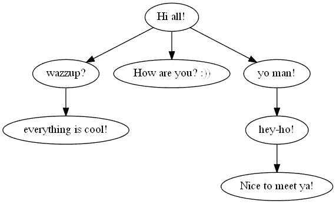

# 带轨道的嵌套注释

> 原文：<https://www.sitepoint.com/nested-comments-rails/>


到处都是评论。博客、社交网络、粉丝网站、学习资源——它们都有某种评论系统。通常，我们希望为用户提供既可以留言**又可以回复**的选项。表示回复的最自然的方式是嵌套它们(就像一个[俄罗斯娃娃](https://en.wikipedia.org/wiki/Russian_doll))。

本文展示了如何借助`closure_tree` gem 在 Rails 应用程序中实现嵌套注释。此外，它还将描述 gem 提供的一些很酷的特性，同时指出一些问题。

源代码可以在 [GitHub](https://github.com/bodrovis/SitePointNestedComments) 上获得。

工作演示可以在[http://nested-comments.radiant-wind.com/](http://nested-comments.radiant-wind.com/)上找到。

## 准备项目

*我将使用 Rails 4.0.4，但是您可以使用 Rails 3* 实现相同的解决方案

好的，计划是这样的:我们将创建一个简单的应用程序，允许用户打开新的讨论线程，以及在已经打开的线程上留下他们的评论。在第一次迭代中，这个应用程序将只提供一个启动新线程的选项，而第二次将添加嵌套。

创建没有默认测试套件的新应用程序:

```
$ rails new nested_comments -T
```

以下是我们将要使用的宝石列表:

```
gem 'closure_tree'
gem 'bootstrap-sass'
```

不多，嗯？像往常一样，我使用 Twitter Bootstrap 进行一些基本的样式设计——你可以使用任何其他 CSS 框架或者从头开始创建你的设计。

Matthew McEachen 创建的 [closure_tree](https://github.com/mceachen/closure_tree) gem 将帮助我们为`Comment`模型创建嵌套。这颗宝石有一些替代品，特别是斯蒂芬·克罗斯创造的[血统](https://github.com/stefankroes/ancestry)。我使用 ancestry 有一段时间了，但它已经很长时间没有更新了，尽管 GitHub 上存在一些公开的问题。因此，我决定改用`closure_tree`(我注意到`ancestry`现在似乎正在更积极地发展)。另外，我喜欢`closure_tree`提供的一些选项。不过，这里描述的解决方案也可以用`ancestry`来实现。

让我们创建`Comment`模型:

```
rails g model Comment title:string author:string body:text
```

我在这里保持简单——评论有一个`title`、`author`(作者的名字或昵称)和一个`body`。对于本文的目的来说，这些就足够了，但是在实际的应用程序中，您可能希望建立某种身份验证。

清单中的下一点是设置路线:

*config/routes.rb*

```
root to: 'comments#index'
resources :comments, only: [:index, :new, :create]
```

之后，创建控制器:

*控制器/评论 _ 控制器. rb*

```
class CommentsController < ApplicationController
  def index
    @comments = Comment.all
  end

  def new
  end

  def create
  end
end
```

现在，`new`和`create`方法是空的，我们稍后会解决它们。`index`方法只是从`comments`表中获取所有的注释——非常简单。

让我们花几分钟时间对页面应用一些引导样式。

*layouts/application . html . erb*

```
[...]
<body>

<div class="container">
  <% flash.each do |key, value| %>
    <div class="alert alert-<%= key %>">
      <button type="button" class="close" data-dismiss="alert">&times;</button>
      <%= value %>
    </div>
  <% end %>
</div>

<div class="container">
  <%= yield %>
</div>

</body>
[...]
```

*comments/index.html.erb*

```
<div class="jumbotron">
  <div class="container">
    <h1>Join the discussion</h1>
    <p>Click the button below to start a new thread:</p>
    <p>
      <%= link_to 'Add new topic', new_comment_path, class: 'btn btn-primary btn-lg' %>
    </p>
  </div>
</div>

<%= render @comments %>
```

`render @comments`意味着我们正在使用部分
`comments/_comment`渲染来自`@comments`数组的每个元素(配置块的约定！).这个片段还没有创建，所以我们现在就开始创建:

*comments/_ comment . html . erb*

```
<div class="well">
  <h2><%= comment.title %></h2>
  <p class="text-muted">Added by <strong><%= comment.author %></strong> on
    <%= l(comment.created_at, format: '%B, %d %Y %H:%M:%S') %></p>

  <blockquote>
    <p><%= comment.body %></p>
  </blockquote>
</div>
```

该片段使用`l`方法(实际上是在`I18n`中定义的`localize`方法的简写)呈现评论的标题、作者姓名、创建日期和时间，最后是正文。

现在，我们可以回到控制器的方法:

*控制器/评论 _ 控制器. rb*

```
[...]
def new
  @comment = Comment.new
end

def create
  @comment = Comment.new(comment_params)

  if @comment.save
    flash[:success] = 'Your comment was successfully added!'
    redirect_to root_url
  else
    render 'new'
  end
end

private

  def comment_params
    params.require(:comment).permit(:title, :body, :author)
  end

[...]
```

请注意，如果你使用 Rails 3 或者 Rails 4 的`protected_attributes` gem，你不需要定义`comment_params`方法。相反，您需要在`Comment`模型中指定`attr_accessible`,如下所示:

`models/comment.rb`

```
[...]
attr_accessible :title, :body, :author
[...]
```

在视图上:

*comments/new.html.erb*

```
<h1>New comment</h1>

<%= render 'form' %>
```

现在——猜猜看——我们需要创建`form`部分:

*comments/_form.html.erb*

```
<%= form_for(@comment) do |f| %>
  <% if @comment.errors.any? %>
    <div id="error_explanation">
      <h2><%= pluralize(@comment.errors.count, "error") %> prohibited this comment from being saved:</h2>

      <ul>
        <% @comment.errors.full_messages.each do |msg| %>
          <li><%= msg %></li>
        <% end %>
      </ul>
    </div>
  <% end %>

  <div class="form-group">
    <%= f.label :title %>
    <%= f.text_field :title, class: 'form-control' %>
  </div>

  <div class="form-group">
    <%= f.label :author %>
    <%= f.text_field :author, class: 'form-control', required: true %>
  </div>

  <div class="form-group">
    <%= f.label :body %>
    <%= f.text_area :body, class: 'form-control', required: true %>
  </div>

  <%= f.submit class: 'btn btn-primary' %>
<% end %>
```

正如您所看到的，这是一个非常简单的表单——真的没什么可说的。我们将在几分钟后回到这个话题。

在这一点上，你可以测试你的应用程序是如何工作的——继续并创建一些评论。我们已经完成了基础工作，准备将`closure_tree`集成到应用程序中。

## 使其嵌套

根据`closure_tree`的文档，首先要做的是在`comments`表中添加一个`parent_id`列:

```
$ rails g migration add_parent_id_to_comments parent_id:integer
$ rake db:migrate
```

该列将存储资源的直接父级的 ID。在没有父列的情况下，该列将有一个`null`值。我们还需要创建一个新表，其中包含注释的层次结构。

```
$ rails g migration create_comment_hierarchies
```

现在打开迁移文件并修改它:

*migrate/create _ comment _ hierarchy . Rb*

```
class CreateCommentHierarchies < ActiveRecord::Migration
  def change
    create_table :comment_hierarchies, :id => false do |t|
      t.integer  :ancestor_id, :null => false   # ID of the parent/grandparent/great-grandparent/... comments
      t.integer  :descendant_id, :null => false # ID of the target comment
      t.integer  :generations, :null => false   # Number of generations between the ancestor and the descendant. Parent/child = 1, for example.
    end

    # For "all progeny of…" and leaf selects:
    add_index :comment_hierarchies, [:ancestor_id, :descendant_id, :generations],
              :unique => true, :name => "comment_anc_desc_udx"

    # For "all ancestors of…" selects,
    add_index :comment_hierarchies, [:descendant_id],
              :name => "comment_desc_idx"
  end
end
```

不要忘记运行迁移:

```
$ rake db:migrate
```

现在我们需要告诉我们的模型它应该是嵌套的。这很简单:

*models/comment.rb*

```
acts_as_tree order: 'created_at DESC'
```

注意，我们这里用的是`order`。这是可选的，但是您可能想要为资源指定某种排序。在这种情况下，最合理的顺序是按创建日期降序排列。

此时，我们可以显示“回复”链接。实际上，创建回复和创建根评论是一样的。唯一的区别是指定了`parent_id`属性，所以让我们将它作为 GET 参数传递。

*comments/_ comment . html . erb*

```
[...]
<blockquote>
  <p><%= comment.body %></p>
</blockquote>

<p><%= link_to 'reply', new_comment_path(comment.id) %></p>
[...]
```

不幸的是，这不会马上生效，因为`new_comment_path`方法不期望传递任何参数。我们必须稍微修改一下路线:

*routes.rb*

```
[...]
resources :comments, only: [:index, :create]
get '/comments/new/(:parent_id)', to: 'comments#new', as: :new_comment
[...]
```

我在这里重新定义了`new`路线，添加了一个可选的`parent_id` GET 参数。

现在稍微调整一下`new`方法:

*控制器/评论 _ 控制器. rb*

```
def new
  @comment = Comment.new(parent_id: params[:parent_id])
end
```

我们还必须将这个`parent_id`添加到表单中。我们不希望我们的用户看到它，所以使用`hidden_field`辅助方法:

*comments/_form.html.erb*

```
[...]
<%= f.hidden_field :parent_id %>

<div class="form-group">
  <%= f.label :title %>
  <%= f.text_field :title, class: 'form-control' %>
</div>
[...]
```

`create`方法也需要修改:

*控制器/评论 _ 控制器. rb*

```
[...]
def create
  if params[:comment][:parent_id].to_i > 0
    parent = Comment.find_by_id(params[:comment].delete(:parent_id))
    @comment = parent.children.build(comment_params)
  else
    @comment = Comment.new(comment_params)
  end

  if @comment.save
    flash[:success] = 'Your comment was successfully added!'
    redirect_to root_url
  else
    render 'new'
  end
end
[...]
```

这里，我们检查`parent_id`属性的存在，以创建根注释或嵌套注释。注意`params[:comment].delete(:parent_id)`的使用。`delete`是一种从散列中删除具有特定键的元素的方法，返回该元素作为结果。因此，`parent_id`将作为参数传递给`find_by_id`方法。我们将它从`params`散列中删除，因为我们不允许在我们的`comment_params`私有方法中使用`parent_id`。

还有一件事可以改进。如果我点击一个“回复”链接，我将被重定向到一个新的页面，其中有一个表格。这没问题，但我可能想看我回复的实际评论:

*comments/new.html.erb*

```
<h1>New comment</h1>

<% if @comment.parent %>
  <%= render 'comment', comment: @comment.parent, from_reply_form: true %>
<% end %>

<%= render 'form' %>
```

如果评论没有父评论，那么`@comment.parent`将返回`nil`，因此链接将不会被呈现。另外，请注意我们传递给分部变量的`from_reply_form`变量。我们将使用它来告诉评论的一部分，它是从表单中呈现的，所以没有必要再次提供“回复”链接——用户已经在回复评论了！现在，改变部分:

*comments/_ comment . html . erb*

```
[...]
<% from_reply_form ||= nil %>
<% unless from_reply_form %>
  <p><%= link_to 'reply', new_comment_path(comment.id) %></p>
<% end %>
[...]
```

这里我们使用了一个“零保护”——操作符`||=`。如果`from_reply_form`有一个值，它不会对它做任何事情。如果没有定义`from_reply_form`，它就给它分配`nil`。我们需要使用一个“零保护”，因为这个部分也是从`index.html.erb`调用的，而没有通过`from_reply_form`。

现在，检查回复是否有效。好吧，它可以工作，但是有一个问题——注释不是嵌套的。列正在被设置，但是我们的注释正在被一个接一个地呈现，这肯定是应该被修复的。

幸运的是，`closure_tree`为我们提供了`hash_tree`方法，为我们的资源构建一个嵌套散列。请注意，如果您的`comments`表足够大，服务器可能会陷入一次加载所有资源的困境。如果发生这种情况，使用`limit_depth`选项来控制嵌套级别，如下所示:

```
Comment.hash_tree(limit_depth: 2)
```

继续调整`index`方法:

*控制器/评论 _ 控制器. rb*

```
def index
  @comments = Comment.hash_tree
end
```

哈希树将如下所示:

```
{a =>
  {b =>
    {c1 =>
      {d1 => {}
    },
    c2 =>
      {d2 => {}}
    },
    b2 => {}
  }
}
```

现在是棘手的部分。我们不知道我们的注释可以有多少层嵌套，但是我们想把它们都呈现出来。为了实现这一点，我们必须实现一个递归算法，只要嵌套的注释存在，它就会挖掘这些注释。为此创建一个助手方法是个好主意:

*helpers/comments _ helper . Rb*

```
module CommentsHelper
  def comments_tree_for(comments)
    comments.map do |comment, nested_comments|
      render(comment) +
          (nested_comments.size > 0 ? content_tag(:div, comments_tree_for(nested_comments), class: "replies") : nil)
    end.join.html_safe
  end
end
```

在每次迭代中，获取一个注释及其子元素，并将其存储在`comment`和`nested_comments`变量中。接下来，呈现注释(使用了`_comment.html.erb`部分)并检查是否有更多的嵌套注释。如果是，我们再次调用相同的`comments_tree_for`方法，传递`nested_comments`变量。另外，请注意，我们用一个具有`replies`类的`div`标签包装了这个方法调用的结果。

当`map`方法完成它的工作时，加入所有呈现的注释并调用`html_safe`,因为，否则，将呈现普通的 HTML。

现在可以使用这个助手了:

*comments/index.html.erb*

```
[...]
<%= comments_tree_for @comments %>
```

这是可行的，但是我们必须*可视化地*嵌套回复。将回复包装在一个`div.replies`标签中，我们可以给它添加一个非常简单的样式:

*样式表/application.css.scss*

```
.replies {margin-left: 50px;}
```

如果您想将这种可视化嵌套限制在 5 个级别，请添加以下代码行:

*样式表/application.css.scss*

```
/* 5 levels nesting */
.replies .replies .replies .replies .replies {margin-left: 0;}
```

为我们的资源提供了一些其他的奇特方法。例如，我们可以使用`leaf?`方法检查评论是否有回复。如果这个资源是嵌套链中的最后一个，它将返回`true`。

使用这种方法，我们可以鼓励用户回复评论:

*comments/_ comment . html . erb*

```
[...]
<% from_reply_form ||= nil %>
<% unless from_reply_form %>
  <% if comment.leaf? %>
    <small class="text-muted">There are no replies yet - be the first one to reply!</small>
  <% end %>
  <p><%= link_to 'reply', new_comment_path(comment.id) %></p>
<% end %>
[...]
```

您还可以借助于`root?`方法检查资源是否是根节点:

*comments/_ comment . html . erb*

```
<div class="well">
  <h2><%= comment.title %></h2>
  <p class="text-muted"><%= comment.root? ? "Started by" : "Replied by" %> <strong><%= comment.author %></strong> on
    <%= l(comment.created_at, format: '%B, %d %Y %H:%M:%S') %></p>
[...]
```

目前，我们没有提供删除评论的选项，但是你可能想知道如果根被删除，嵌套的评论会发生什么。默认情况下，它们的`parent_id`列将被设置为`null`，因此这些注释将成为根节点。您可以通过向`acts_as_tree`方法传递一个`dependent`选项来改变这种行为。可能的值有:

*   `:nullify`–将`parent_id`设置为`null`。
*   `:delete_all`–删除所有嵌套资源，不运行任何回调。
*   `:destroy`–删除所有嵌套资源，并为每个资源运行适当的回调。

## 图形可视化

您甚至可以用图表来直观地显示嵌套。`closure_tree`提供了一个`to_dot_digraph`方法，为一个 [Graphviz](http://www.graphviz.org/) 创建一个带有适当指令的`.dot`文件，这是一个非常棒的免费图形可视化工具。它实际上可以构建有很多节点和节点间关系的复杂图形。

图表的每个节点都有自己的标签——`to_digraph_label`方法用于绘制它。让我们打开模型，像这样覆盖它:

*models/comment.rb*

```
[...]
def to_digraph_label
  title
end
```

现在每个节点都有了评论的标题。现在你可以试试这个:

*   Open the console (`rails console`) and issue this command:

    ```
    File.open("example.dot", "w") do |f| 
      f.write(Comment.root.to_dot_digraph) 
    end
    ```

    它将获取所有子元素的第一个根注释，并建立它们之间的关系，将其保存到`example.dot`文件中。

*   下载并安装 Graphviz。
*   打开命令提示符，导航到`example.dot`所在的目录，运行`dot -Tpng example.dot > example.png`。
*   看一下`example.png`里面的可视化图形！



## 结论

各位，这篇文章就到这里。我们已经看过了`closure_tree`，并很快将其整合到我们的应用程序中。不要忘记，这种宝石可以用在许多不同的情况下——例如，当构建嵌套菜单或指定其他类型的关系时。

你的 app 里用过`closure_tree`吗？在评论中分享你的经验吧！

感谢您的阅读，下次再见！

## 分享这篇文章