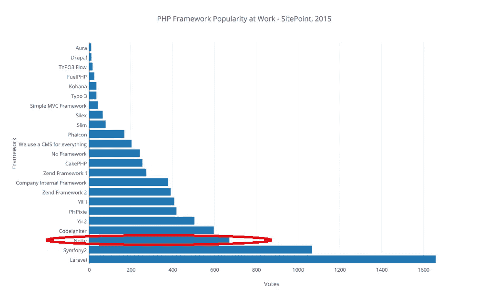
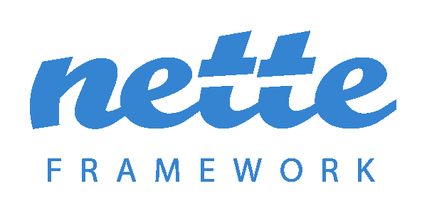
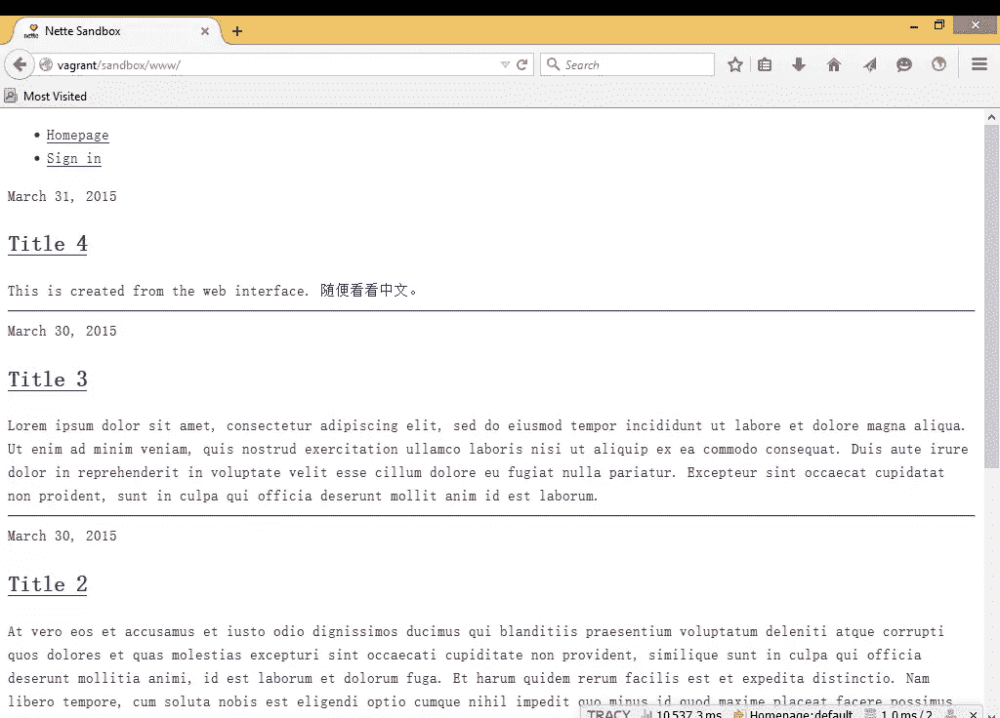
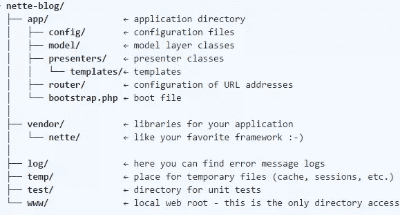
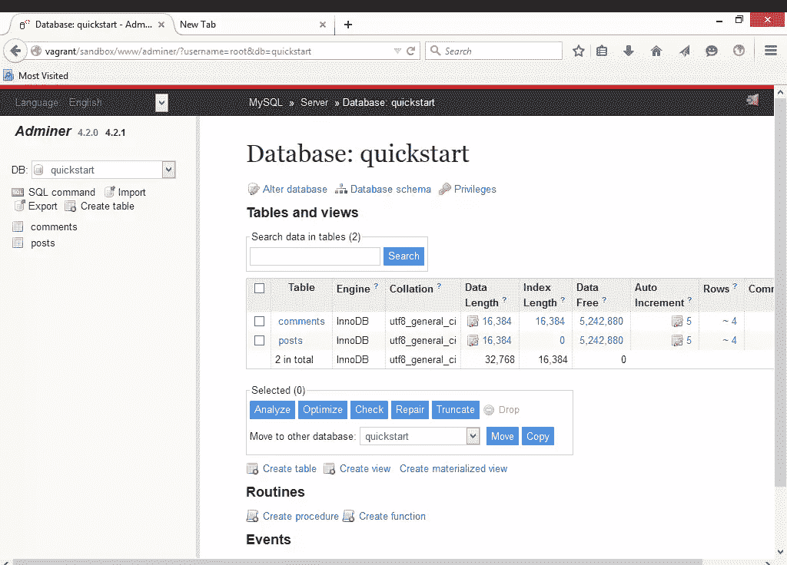
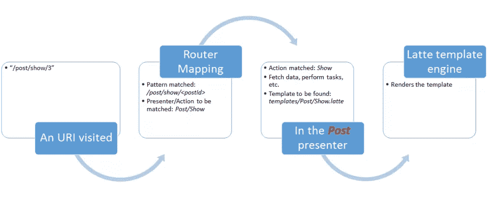
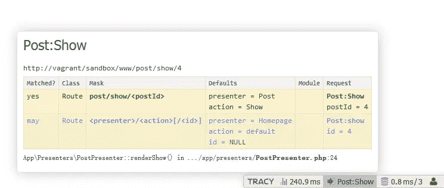

# Nette 框架:第一印象

> 原文：<https://www.sitepoint.com/nette-framework-first-impressions/>

SitePoint 的 PHP 频道对 2015 年最受欢迎的框架进行了年度调查，调查结果在这里进行了讨论。

我们看到了一些熟悉的名字:Laravel、Symfony2、Phalcon、Silex、Slim 等。但是等等，这是什么: **Nette** ？



根据调查结果，它在“工作中”和“个人项目中”都名列第三，仅次于两大巨头:Laravel 和 Symfony2。

在调查结果公布之前，我从未听说过这个框架。一个如此流行的框架值得研究。因此，在本文中，我们将看看 Nette，看看它能做什么，并讨论一些特性。



**注:**我们的复习将以[官方*入门*教程](https://doc.nette.org/en/2.3/quickstart/getting-started)为基础。

## 安装和引导

在`composer`的支持下，Nette 使用自引导方法(类似于 Laravel):

```
composer create-project nette/sandbox demo
```

这将在当前目录中创建一个`demo`目录，一个沙盒项目将被加载到该文件夹中。

Nette 的*入门*教程指导我们构建一个简单的博客应用程序，它具有基本的博客功能，如:列出所有帖子，查看单个帖子，创建/编辑帖子，评论，安全等。

让我向你展示当你完成教程时，这个应用程序会是什么样子(我没有添加任何 CSS 到它，所以整体外观相当初级):



**注:**这是装在[流浪箱](https://www.sitepoint.com/quick-tip-get-homestead-vagrant-vm-running/)里的。

在接下来的几节中，我们将研究 Nette 中的一些基本概念。由于我是 Symfony2 (SF2)的长期用户，大多数时候我会用它来做比较。请注意，对比笔记纯属我个人观点。

## 项目结构

Nette 被认为是一个 MVC 框架，尽管它的“模型”层几乎不见了。其项目结构也反映了这一点，但组织方式非常不同:



*以上项目结构摘自 Nette 的教程*

像在 SF2 中一样，有一个专用的`www`(SF2 中的`web`)目录来保存入口 PHP 文件:`index.php`和为 Apache 提供重写指令的`.htaccess`规则。它还将包含静态资源(CSS、JS、字体、图像等)。

像往常一样，将保留所有的供应商库。

许多其他文件夹将归入`app`:

*   顾名思义，所有的配置都驻留在这里。Nette 使用`config.neon`和`config.local.neon`来提供与数据库、安全性、服务、应用范围参数等相关的配置信息。Nette 会先加载`config.neon`，然后再加载`config.local.neon`。后者将覆盖前者中定义的相同参数，这在其他框架中也很常见。你可以在这里找到 Neon 文件格式。

*   `presenters`和`presenters/templates`:这两个文件夹覆盖了控制器和模板(视图)部分。Nette 使用[拿铁](https://latte.nette.org/)作为其模板引擎。稍后再喝拿铁，不要卡布奇诺——抱歉。

*   它拥有路由工厂类来定制漂亮的 URIs，从而在 URI 和控制器/动作之间建立了一座桥梁。稍后将详细介绍。

## 从数据库开始

Nette 附带了一个名为“Adminer”的便利工具来模仿一种`PHPMyAdmin`功能。界面简洁易用:



作为一个“嵌入式”工具，Adminer 的功能是有限的，所以如果这个工具不能满足您的需求，您可能需要切换到您喜欢的数据库管理工具。另外，需要注意的是，我们从`www`中的`adminer`子目录访问 Adminer。这可能不是一个好方法，尤其是在生产环境中。在部署阶段应忽略此文件夹–通过`.gitignore`、`.gitattributes`或其他方式，Nette 应在其文档中指出这一点。

## 路由器

我们正在开发一个简单的博客应用程序。我们希望一个显示特定帖子(由它的`postId`标识)的 URI 看起来像这样:`post/show/4`，但不像这样:`post/show?postId=4`。

Nette 建议使用路由器工厂来管理 URI(或 URI 模式)及其相应控制器/动作之间的链接。路由器工厂在`app/router/RouterFactory.php`中定义:

```
class RouterFactory
{

	/**
	 * @return \Nette\Application\IRouter
	 */
	public static function createRouter()
	{
		$router = new RouteList();
        $router[] = new Route('post/show/<postId>', 'Post:Show');
		$router[] = new Route('<presenter>/<action>[/<id>]', 'Homepage:default');
		return $router;
	}
}
```

路由的定义很简单:

*   带有参数的 URI“模式”:`post/show/<postId>`。
*   以及“控制器:动作”形式的字符串:`Post:Show`。

详细的网络路由文件可在[这里](https://doc.nette.org/en/2.3/routing)找到。

要使用这个路由器工厂，我们必须在`app/config/config.neon`中注册一个服务:

```
services:
	router: App\RouterFactory::createRouter
```

要在模板中基于路线生成链接，我们可以使用以下语法:

```
<a href="{link Post:Show $post->id}">{$post->title}</a>
```

我必须承认这个 Latte 语法比相应的 Twig 语法短一点。它将`{}`用于回显语句和控制语句。例如:

```
//To display a variable
{$var1}

//To run a foreach loop
{foreach $items as $item}
    ...
{/foreach}
```

Latte 还有一个强大的宏系统，方便一些常见的任务。例如，下面的代码片段将只在`$items`不为空时显示一个列表:

```
<ul n:if="$items">
...
</ul>
```

当用户希望基于返回的结果集显示某个部分时，这可能会很方便。

## 控制器和动作

Nette 中的一个**演示者**是控制者。所有演示者都在`app/presenters`文件夹中，文件名应以`Presenter.php`结尾。例如，我们有 *PostPresenter* 用于发布相关动作， *SignPresenter* 用于登录/注销相关动作。

在 presenter 文件中，我们定义了一个类来保存所有可以调用的动作(方法)。例如，要显示由其`postId`(及其相关评论)标识的特定帖子，该方法如下所示:

```
namespace App\Presenters;

use Nette;
use Nette\Application\UI\Form;

class PostPresenter extends BasePresenter
{

    private $database;

    public function __construct(Nette\Database\Context $database)
    {
        $this->database = $database;
    }

    public function renderShow($postId)
    {
        $post = $this->database->table('posts')->get($postId);

        if (!$post)
        {
            $this->error('Post not found');
        }

        $this->template->post     = $post;
        $this->template->comments = $post->related('comments')->order('created_at');
    }
    ... ...
}
```

在`renderShow($postId)`中，通过匹配`$postId`从数据库中抓取一个`$post`。然后，将呈现一个带有变量的模板(在本例中是帖子和相关评论)。

我们注意到这个过程很简单，但是隐藏了很多细节。比如这个`database`是哪里来的？

在`app/config/config.local.neon`中，我们可以看到这一段(跟随教程):

```
database:
	dsn: 'mysql:host=127.0.0.1;dbname=quickstart'
	user: root
	password: xxxxxx
	options:
		lazy: yes
```

这是一个熟悉的数据库连接设置。当要调用一个控制器/动作时，Nette 将这个 DSN 转换成一个数据库对象(或数据库上下文),并将其注入到该控制器类的构造函数中。因此，所有方法都可以通过依赖注入来访问数据库。

模板渲染呢？我们只看到了变量赋值，但没有显式调用“render”方法。这也是 Nette 大会的一部分。当一个动作被赋予一个`render`前缀时，这个动作将在方法调用返回时呈现一个模板。

这种情况下，方法是`renderShow`。这个方法链接到 URI，就像我们前面定义的“post/show/3”(在路由定义中，`render`前缀被忽略):`$router[] = new Route('post/show/<postId>', 'Post:Show');`。

`renderShow`将在`app/presenters/templates`下开始寻找模板寻找:

*   名为“Post”的目录，因为这是这个`renderShow`动作的控制器名。
*   然后一个名为`Show.latte`的模板填充所有变量并显示出来。

让我们在下面的图表中总结一下 Nette 中使用的命名和映射约定:



## 拿铁模板引擎

如果你熟悉 Twig，你会发现拿铁还挺好学的。

它使用`{...}`对来逃避常规的 HTML 解析，并且不区分纯打印(Twig 等价:`{{...}}`)或控制(``)。此外，变量必须以`$`符号为前缀，否则`{ }`对中的字符串文字将被视为宏，很可能导致语法错误，即“未知宏{xxxx}”。

当我们处理结果集上的迭代时，有一个很方便的特性，这很常见:

```
<ul n:if="$items">
{foreach $items as $item}
    <li id="item-{$iterator->counter}">{$item|capitalize}</li>
{/foreach}
</ul>
```

除了`foreach`循环的常规用法外，还设置了一个条件来决定是否显示下面的`<ul>`部分。只有当`$items`中至少有一个项目时，`<ul>`部分才会出现。在这个宏的帮助下，我们可以节省一些行，避免使用`if...endif`对。

Latte 支持模板继承、模板包含、过滤器和许多其他很酷的功能。详情请访问其[官方文档](https://doc.nette.org/en/2.3/templating)。

## 授权和表单

关于访问控制的官方文档对我们来说是一个很好的起点。

Nette 支持内存和数据库凭证。通过使用内存认证，我们使用下面的代码片段:

```
$authenticator = new Nette\Security\SimpleAuthenticator(array(
    'john' => 'IJ^%4dfh54*',
    'kathy' => '12345', // Kathy, this is a very weak password!
));
$user->setAuthenticator($authenticator);
```

然后，系统可以明确地让用户使用以下内容登录:

```
$user->login($username, $password);
```

其中用户名和密码可以从表单提交中获得。

Nette 支持角色和 ACL(访问控制列表),并使用“授权者”来执行授权。

首先，我们可以用层次结构创建一些角色:

```
$acl = new Nette\Security\Permission;

//Define a guest role and a registered user role

$acl->addRole('guest');
$acl->addRole('registered', 'guest');
```

在上面的代码中，角色`register`继承自 guest。

然后，我们定义用户可以访问的一些资源:

```
$acl->addResource('article');
$acl->addResource('comments');
$acl->addResource('poll');
```

最后，我们设置授权规则:

```
$acl->allow('guest', array('article', 'comments', 'poll'), 'view');
$acl->allow('registered', 'comments', 'add');
```

因此，`guest`可以查看文章、评论和投票，而`registered`用户除了继承自`guest`的特权之外，还可以添加评论。

我真的不喜欢这种门禁。在我看来，即使是受控方法本身之外的注释或者装饰器的使用也比这要好。我认为集中式文件(SF2 的`security.yml`)是最佳实践:整洁、干净、灵活。

表单是在各自的演示器中生成的。特别是，表单创建包括一个回调事件处理程序来处理成功的表单提交。

```
protected function createComponentCommentForm()
    {
        $form              = new Form;
        $form->addText('name', 'Your name:')->setRequired();
        $form->addText('email', 'Email:');
        $form->addTextArea('content', 'Comment:')->setRequired();
        $form->addSubmit('send', 'Publish');
        $form->onSuccess[] = [$this, 'commentFormSucceeded'];

        return $form;
    }
```

但是，这不是要呈现的表单的`action`。

例如，让我们看一下上面的代码，`renderShow`显示了一个帖子详细信息页面和一个供读者输入评论的表单。在 presenter 中，我们只分配了一个`post`变量和一个`comments`变量来保存相关的评论。评论输入表单呈现在模板`app/presenters/templates/Post/Show.latte`中:

```
<h2>Post new comments</h2>
{control commentForm}
```

该页面的源代码摘录如下:

```
<h2>Post new comments</h2>
<form action="/sandbox/www/post/show/4" method="post" id="frm-commentForm">

<table>
<tr class="required">
	<th><label for="frm-commentForm-name" class="required">Your name:</label></th>

	<td><input type="text" name="name" id="frm-commentForm-name" required data-nette-rules='[{"op":":filled","msg":"This field is required."}]' class="text"></td>
</tr>

...
<tr>
	<th></th>

	<td><input type="submit" name="send" value="Publish" class="button"></td>
</tr>
</table>

<div><input type="hidden" name="do" value="commentForm-submit"></div>
</form>
```

我们清楚地看到，分配的表单动作是`/sandbox/www/post/show/4`，它实际上是显示帖子本身的 URI。源代码中没有任何地方表明存在一个到`commentFormSucceeded`方法的挂钩。

这种“内部链接”可能会让 Nette 初学者感到困惑。我的意思是，有一个单独的方法来处理表单是一种常见的做法，因此为这样的过程分配一个 URI 也是合理的。

Nette 使用回调/事件处理程序来做这件事也很好，但是在用户点击“提交”按钮和输入被保存在数据库之间肯定有一些遗漏或者没有被清楚地解释。

我们知道持久化是在一个叫做`commentFormSucceeded`的方法中执行的，我们自己实现了这个特性。但是它们是如何连接的还不清楚。

## 其他很酷的功能

Nette 附带了一个名为“ [Tracy](https://tracy.nette.org/) ”的调试器。在调试模式下，我们会在页面的右下角看到一个小工具栏，告诉我们重要的页面信息:



在生产模式下，可通过更改`app/bootstrap.php`将其禁用:

```
$configurator->setDebugMode(false); // "true" for debug mode
```

**注意:**从开发模式切换到生产模式后，如果遇到任何问题，请清空`temp/cache`文件夹内容。

Nette 还包括一个名为“Tester”的测试套件。用法也很简单。详情见[此处](https://tester.nette.org/)。

## 最后的想法

Nette 是一个相对较新的框架。它的 2.0 版本是大约 3 年前发布的。由于 SitePoint 的调查，我们很多人都注意到了这一点。

它的 Github 问题跟踪器非常活跃。我张贴在那里的两个问题在不到 10-30 分钟内得到了回答，并且都指向正确的解决方案，但是它的文档需要大量的工作。在我试图按照教程应用的文档设置它的过程中，我发现了许多错别字和遗漏的解释。

如果我可以给 SF2 打 10 分——不是说 SF2 完美，只是为了比较——我对 Nette 的初始分数在 7 到 8 之间。它很成熟，写得很好，容易学习，配备了先进的功能，但也有一些需要改进的地方。

你熟悉奈特吗？也欢迎分享你的观点和评论。

## 分享这篇文章