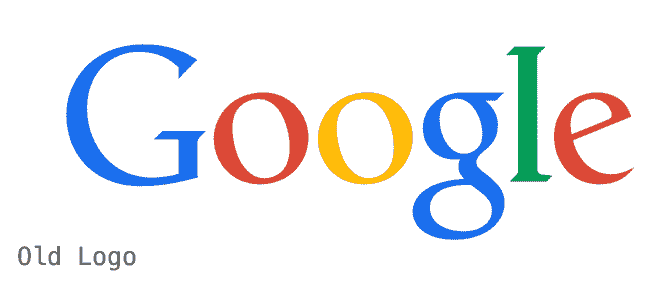
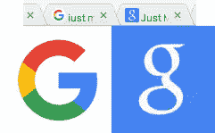
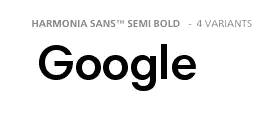
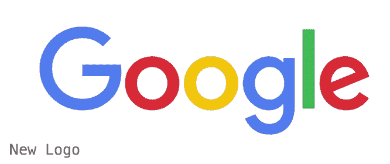
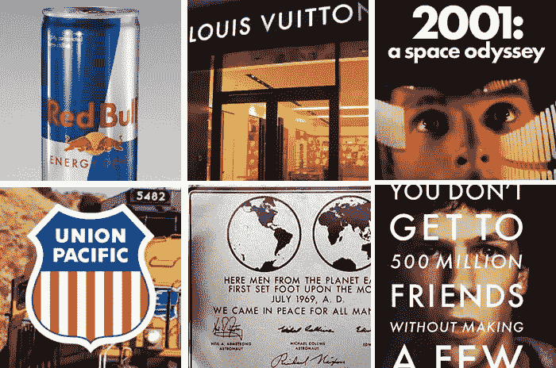

# 谷歌新 Logo 真的像漫画 Sans 吗？

> 原文：<https://www.sitepoint.com/new-google-logo-really-look-like-comic-sans/>

谷歌并不经常改变它的品牌，但当它改变时，很难忽视它。从搜索页面，到应用程序图标，再到浏览器标签，这是一个融入我们在线生活的品牌。

昨天，“大 G”推出了可能是他们有史以来最大的品牌重塑努力。在这里。

“我拍摄了衬线”——谷歌转向一种几何无衬线字体。

正如你所看到的，新的标识保留了谷歌的商标彩色字体，但现在以更清晰、略重的三衬线字体呈现。

颜色主题也被引入到他们的方形徽标中——蓝色背面熟悉的白色小写字母“G ”,被一个新的大写字母“G”所取代，对角分割成彩色块。

对我来说，那个多色的“G”比白色和蓝色的“G”更像“谷歌”。

设计师亚历克斯·库克、乔纳森·贾维斯和李宗盛在[谷歌设计博客](https://design.google.com/)上谈论他们为期一周的设计冲刺。

对我来说，更新为无衬线字体似乎更有意义。他们以前的衬线字体——尤其是“阅读眼镜 g”——总有一种更古老的、浪漫小说和勃朗特姐妹的书卷气。新的几何无衬线更多的是一个快乐的工程师的建设。

## 但是“互联网”是怎么想的呢？

通过对媒体、推特和脸书的筛选，似乎有两种截然不同的反应:

### 1).总的来说，设计师喜欢它

利平科特的创意总监康妮·伯索尔说:“(T2)谷歌的新标志优雅简洁，但仍然保持了最初设计的有趣和好玩。

“*这真的不仅仅是一个标志，更是一种智能系统*，”T2 基础设计的创始合伙人杰夫·库克说。

SitePoint 自己的设计& UX 作家劳拉·伊莉莎白在推特上写道:“ *[耶，我爱@谷歌的新标志。可爱的玩意儿](https://twitter.com/laurium/status/638751141724049408)*

连线称之为 *[..更简单、更年轻、更友好的](http://www.wired.com/2015/09/google-new-logo/)* ”。

但也不全是戒指代言。

### 2).许多非设计人员都很苦恼。

乔恩·格鲁伯抱怨道::*他们的旧商标很傻。这个新的简直就是垃圾。刚好适合一个没品味的公司”*。

谷歌官方博客上的公众评论包括:

*   从一个漂亮专业的标志变成了一个基本的 noring(原文如此)一级字体，你喜欢吗？
*   是的。完全没有改善
*   做那个 2。新的贫民窟臭死了！。在收藏夹栏上很难找到

@desusnice 的另一条[推文坚称](https://twitter.com/desusnice/status/638742512056815617)***谷歌的新标志让我们更接近他们最终过渡到漫画无*** 。

所以…我们知道有些人不喜欢改变。

## 只是不是你喜欢的类型？

有趣的是，许多抱怨将更新描绘成比前一个化身更****幼稚*** 。*

*

哈耳摩尼亚桑斯的“谷歌”。

尽管谷歌设计团队告诉我们“新标识是以一种定制的几何无衬线字体设置的”，但这些字体与一些非常成熟的字体非常相似，包括 [Harmonia Sans](http://www.linotype.com/752614/HarmoniaSans-family.html) (查看大写字母“G”)、[二十世纪](https://en.wikipedia.org/wiki/20th_century)，或许还有几何字体的教父 [Futura](https://en.wikipedia.org/wiki/Futura_(typeface)) 。

这是新标识与经典 Futura 的视觉对比。

覆盖着经典 Futura 的新标志。

正如你所看到的，有一些小的不同——对“e”的活泼的扭曲是一个明显的区别——但是主要的特征都在那里。

Futura 由保罗·伦纳于 1927 年设计，是有史以来最常青、最受欢迎的字体之一。Futura 著名用法的完整列表是一个电话簿，但快速“最热门”列表包括:

*   2001:太空漫游标题
*   社交网络电影海报
*   红牛罐
*   大众广告
*   路易威登品牌
*   阿波罗登月牌匾

<small>红牛，路易威登，2001:太空漫游，社交网络，阿波罗 11 号月亮牌匾和联合太平洋(顺时针)</small>

这些都是令人难以置信的优雅和高档的用法。很难想出比登月牌更“庄严”的文件，而路易威登正是高端精致的定义。

具有这些特征的字体没有什么天生的粗糙或落后。那么，为什么有些人把一种非常相似的谷歌字体解读为“不专业”和“像漫画一样”？

我认为这是因为谷歌标志已经很长时间看不见了。我们大多数人可能在 15 年前第一次看到谷歌标志。如果你能记得你看到它的前 10 秒钟——如果你不能，我不会责怪你——我怀疑你会认为这个新的搜索引擎看起来有点幼稚和不专业。

但是，嘿，这个搜索非常有效，一分钟后你就忘记了顶部的那些学龄前儿童的颜色。从那以后你就一直专注地盯着搜索框。

直到今天，那是！

一种新的字体出现了，人们多年来第一次看到(我的意思是真的看到)这个标志。这是一个:“*天啊！谷歌一直在使用幼儿园的配色方案，而我没人告诉我！啊啊啊啊啊！！！*

我算了一下，在这个新标志对这个星球的大部分人来说变得几乎看不见之前，我们还有大约 24 个小时。

我在脑子里倒数。* 

## *分享这篇文章*