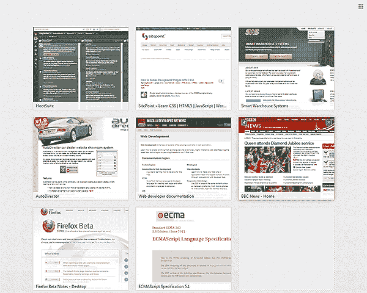

# 你的浏览器是否暴露了隐私数据？

> 原文：<https://www.sitepoint.com/new-tab-thumbnails-expose-private-data/>

包括 [The Register](http://www.theregister.co.uk/2012/06/22/firefox_new_tab_security_concerns/) 和 [ZDNet](http://www.zdnet.com/blog/security/firefox-thumbnails-could-expose-private-data-fix-coming-soon/12568) 在内的几个网站报道称，火狐 13 的新标签页正在拍摄被访问页面的缩略图——包括那些在安全 HTTPS 会议期间的页面:

这个问题不是 Firefox 独有的；Chrome 和 Safari 也可以生成 HTTPS 页面内容的缩略图，但它们的图像较小，可读性较差。Firefox 的较大快照可以显示包含可见账号、余额和主题行的网络邮件和网上银行会话——即使在你注销后。

幸运的是，缩略图是由浏览器生成并存储在本地的。不会向服务器发送 URL 或数据，可以通过清除历史记录或单击屏幕右上角的“隐藏新标签页”图标来删除图像。

虽然这个问题不太可能影响那些只使用单一设备的人，但那些使用共享电脑的人应该小心。Firefox 通常会在浏览器重启后刷新新的标签页，所以最好在会话期间使用隐私浏览模式，或者在之后立即清除最近的历史记录选项。

Mozilla 已经承认了这一行为，并承诺将很快发布补丁。但这对我们所有人都是一个教训:如果我们不小心，看似无害和有用的软件功能可能会导致不良的安全副作用。

## 分享这篇文章