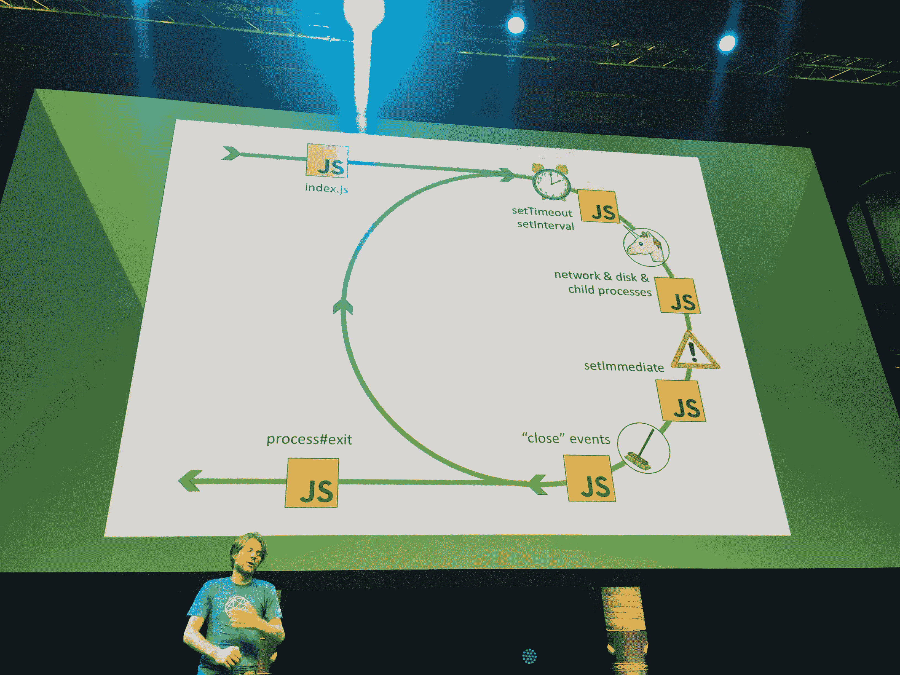

# 10 Node.js 最佳实践:来自 Node 大师的启示

> 原文：<https://www.sitepoint.com/node-js-best-practices-from-the-node-gurus/>


10 Node.js 最佳实践:来自 Node 大师的启示作者是客座作者 **Azat Mardan** 。SitePoint 客座博文旨在为您带来来自网络社区的杰出作家和演讲者的精彩内容。

在我之前的文章[2017 年成为更好的节点开发人员的 10 个技巧](https://www.sitepoint.com/10-tips-to-become-a-better-node-developer)中，我介绍了 10 个 Node.js 技巧、诀窍和技术，你可以将它们应用到今天的代码中。这篇文章延续了这一思路，提供了另外 10 个最佳实践来帮助您将节点技能提升到一个新的水平。这是我们将要讨论的内容:

1.  [使用 npm 脚本](#usenpmscripts)——当您可以使用 npm 脚本和节点更好地组织 bash 脚本时，停止编写它们。例如`npm run build`、`start`和`test`。当节点开发人员审视一个新项目时，npm 脚本就像是事实的唯一来源。
2.  [使用环境变量](#useenvvars) —通过将`process.env.NODE_ENV`设置为`development`或`production`来使用`process.env.NODE_ENV`。一些框架也会使用这个变量，所以要遵守惯例。
3.  [理解事件循环](#understandtheeventloop) — `setImmediate()`不是立即的，而`nextTick()`不是下一个。使用`setImmediate()`或`setTimeout()`将 CPU 密集型任务卸载到下一个事件循环周期。
4.  [使用函数继承](#usefunctionalinheritance)——避免陷入盲目的争论，避免陷入调试和理解原型继承或类的耗费脑力的陷阱，就像一些最多产的节点贡献者所做的那样，只使用函数继承。
5.  [恰当地命名事物](#namethingsappropriately) —给有意义的名称，这些名称将作为文档。此外，请不要使用大写文件名，如果需要，请使用破折号。文件名中的大写字母不仅看起来奇怪，而且[会导致跨平台问题](http://stackoverflow.com/a/1594041/1136887)。
6.  [考虑不使用 JavaScript](#considernotusingjavascript)——ES6/7 是一个可悲的附加版本，它诞生于 6 年的会议，当时我们已经有了一个更好的 JavaScript，叫做 CoffeeScript。如果你想让船舶代码更快，停止浪费时间辩论`var` / `const` / `let`、分号、`class`和其他参数，就使用它。
7.  [提供本机代码](#considernotusingjavascript)——当使用 transpilers 时，提交本机 JS 代码(构建的结果),这样您的项目可以在没有构建的情况下运行
8.  [用 gzip](#knowexpressmiddleware) —咄！以及合理的日志记录——根据环境的不同，不会太多也不会太少。`npm i morgan -S`
9.  [纵向扩展](#scaleup) —从节点开发的第一天起，就开始考虑集群和无状态服务。使用 pm2 或 strongloop 的集群控制
10.  [缓存请求](#cacherequests) —通过将节点服务器隐藏在静态文件服务器(如 nginx)和/或请求级缓存(如 Varnish Cache 和 CDN 缓存)之后，最大限度地利用节点服务器。

因此，让我们一分为二，分别看一看它们。我们走吧。

## 使用 npm 脚本

现在，为构建、测试以及最重要的启动应用程序创建 npm 脚本几乎是一个标准。当节点开发人员遇到新的节点项目时，这是他们首先考虑的地方。有些人( [1](https://www.keithcirkel.co.uk/how-to-use-npm-as-a-build-tool/) 、 [2](https://medium.com/@dabit3/introduction-to-using-npm-as-a-build-tool-b41076f488b0#.uxgz421r0) 、 [3](https://medium.freecodecamp.com/why-i-left-gulp-and-grunt-for-npm-scripts-3d6853dd22b8#.xsxz0txdq) 、 [4](https://www.sitepoint.com/guide-to-npm-as-a-build-tool/) )甚至抛弃了 Grunt、Gulp 之类的东西，转而使用更低级但更可靠的 npm 脚本。我完全能理解他们的论点。考虑到 npm 脚本有前置和后置挂钩，您可以达到非常复杂的自动化水平:

```
"scripts": {
  "preinstall": "node prepare.js",
  "postintall": "node clean.js",
  "build": "webpack",
  "postbuild": "node index.js",
  "postversion": "npm publish"
} 
```

通常，在开发前端时，您希望运行两个或更多的观察进程来重新构建代码。例如，一个用于 webpack，另一个用于 nodemon。你可以用`&&`来做这件事，因为第一个命令不会释放提示符。然而，有一个方便的模块叫做[并发](https://www.npmjs.com/package/concurrently)，它可以产生多个进程并同时运行它们。

另外，安装开发命令行工具，如 webpack、nodemon、gulp、Mocha 等。*当地*避免冲突。例如，您可以指向`./node_modules/.bin/mocha`，或者将这一行添加到您的 bash/zsh 概要文件(路径！):

```
export PATH="./node_modules/.bin:$PATH" 
```

## 使用环境变量

即使在项目的早期阶段，也要利用环境变量来确保没有敏感信息的泄露，并且从一开始就正确地构建代码。此外，一些库和框架(我知道 Express 肯定会这样做)会引入像`NODE_ENV`这样的信息来修改它们的行为。将其设置为`production`。设置您的`MONGO_URI`和`API_KEY`值。您可以创建一个外壳文件(如`start.sh`)并将其添加到`.gitignore`:

```
NODE_ENV=production MONGO_URL=mongo://localhost:27017/accounts API_KEY=lolz nodemon index.js 
```

Nodemon 还有一个配置文件，您可以在其中放置您的环境变量([示例](https://github.com/remy/nodemon/blob/master/doc/sample-nodemon.md)):

```
{
  "env": {
    "NODE_ENV": "production",
    "MONGO_URL": "mongo://localhost:27017/accounts"
  }
} 
```

## 了解事件循环

强大而聪明的[事件循环](https://www.youtube.com/watch?v=8aGhZQkoFbQ)使得 Node 如此快速和聪明，因为它利用了等待输入和输出任务完成所浪费的所有时间。因此，Node 在优化受 I/O 限制的系统方面非常出色。

如果您需要执行一些 CPU 密集型的任务(例如，计算、密码散列或压缩)，那么除了为这些 CPU 任务生成新的进程之外，您可能希望使用`setImmediate()`或`setTimeout()`来探索任务的延迟——它们回调中的代码将在下一个事件循环周期中继续。`nextTick()`作品的循环与名字相反。啊！

这是从事事件循环研究的 Bert Belder 的图表。他清楚地知道事件循环是如何工作的！



## 使用函数继承

JavaScript 支持原型继承，即对象从其他对象继承。在 ES6 中，操作符也被添加到语言中。然而，与函数继承相比，它明显复杂。大多数节点专家更喜欢后者的简单性。它是通过简单的函数工厂模式实现的，不需要使用`prototype`、`new`或`this`。当您更新原型时没有隐含的影响(导致所有实例也发生变化)，因为在函数继承中，每个对象都使用自己的方法副本。

考虑一下 TJ Holowaychuk 的代码，他是 Express、Mocha、Connect、Superagent 和许多其他节点模块背后的多产天才。Express 使用函数继承([完整源代码](https://github.com/expressjs/express/blob/master/lib/express.js)):

```
exports = module.exports = createApplication;
// ...
function createApplication() {
  var app = function(req, res, next) {
    app.handle(req, res, next);
  };

  mixin(app, EventEmitter.prototype, false);
  mixin(app, proto, false);

  app.request = { __proto__: req, app: app };
  app.response = { __proto__: res, app: app };
  app.init();
  return app;
} 
```

客观地说，核心节点模块大量使用原型继承。如果你遵循这种模式，确保你知道它是如何工作的。你可以在这里阅读更多关于 JavaScript 继承模式的内容。

## 恰当地命名事物

这个很明显。好名字是一份文件。你喜欢哪一个？

```
const dexter = require('morgan')
// ...
app.use(dexter('dev')) // When is the next season? 
```

只看`app.use()`根本不知道`dexter`在干什么。不如换个更有意义的名字:

```
const logger = require('morgan')
// ...
app.use(logger('dev')) // Aha! 
```

同样，文件名必须正确反映内部代码的用途。如果你看一下 Node ( [GitHub link](https://github.com/nodejs/node/tree/master/lib) )的`lib`文件夹，里面有平台捆绑的所有核心模块，那么你会看到文件/模块的清晰命名(即使你不是很熟悉*所有*核心模块):

```
events.js
fs.js
http.js
https.js
module.js
net.js
os.js
path.js
process.js
punycode.js
querystring.js 
```

内部模块标有下划线(`_debugger.js`、`_http_agent.js`、`_http_client.js`)，就像代码中的方法和变量一样。这有助于警告开发人员，这是一个内部接口，如果您正在使用它，您只能靠自己——如果它被重构甚至删除，不要抱怨。

## 考虑不使用 JavaScript

啊？你刚刚读对了吗？但是管它呢？是的。没错。即使有了 ES6 和 ES2016/ES7 增加的两个功能，JavaScript 仍然有它的怪癖。除了 JavaScript 之外，您或您的团队还可以通过很少的设置受益。根据专业水平和应用程序的性质，你可能更适合使用提供强类型的 [TypeScript](https://www.typescriptlang.org/) 或 [Flow](https://flowtype.org/) 。另一方面，还有纯粹功能性的 [Elm](http://elm-lang.org/) 或 [ClojureScript](https://clojurescript.org/) 。CoffeeScript 是另一个伟大的、久经考验的选择。你也可以看看 [Dart 2.0](https://www.dartlang.org/) 。

当你所需要的只是几个宏(宏允许你*构建*你想要的语言)，而不是一个全新的语言时，那么考虑 [Sweet.js](http://sweetjs.org) 就能做到这一点——允许你写代码生成代码。

如果你走的是非 JavaScript 路线，请仍然包括你的编译代码，因为有些开发人员可能不太理解你的语言，无法正确地构建它。比如 VS Code 是最大的 TypeScript 项目之一，可能在 Angular 2 之后，Code 使用 TypeScript 用类型修补 Node 的核心模块。在 VS 代码回购的`vscode/src/vs/base/node/`([链接](https://github.com/Microsoft/vscode/tree/master/src/vs/base/node))中，可以看到类似`crypto`、`process`等熟悉的模块名称。但是有了`ts`分机。回购中还有其他`ts`文件。然而，他们也包含了带有本地 JavaScript 代码的`vscode/build`。

## 了解 Express 中间件

Express 是一个很棒的非常成熟的框架。它的出色之处在于允许无数其他模块来配置它的行为。因此，你需要知道最常用的中间件，你需要知道如何使用它*。所以为什么不去拿我的快递小抄呢？我在这里列出了主要的中间件模块。例如，`npm i compression -S`将通过压缩响应来降低下载速度。`logger('tiny')`或`logger('common')`将分别提供更少(开发)或更多(生产)日志。*

 *## 按比例增加

Node 在异步方面非常出色，因为它的非阻塞 I/O，并且它保持这种异步编码方式简单，因为只有一个线程。这是一个尽早开始伸缩的机会，甚至可以从第一行代码开始。有一个核心的`cluster`模块，它可以让你在没有太多问题的情况下垂直扩展。然而，一个更好的方法是使用一个工具，如 [pm2](http://pm2.keymetrics.io/) 或 [StrongLoop 的集群控制](https://apidocs.strongloop.com/strong-cluster-control/)。

例如，您可以这样开始使用 pm2:

```
npm i -g pm2 
```

然后，您可以启动同一服务器的四个实例:

```
pm2 start server.js -i 4 
```

对于 Docker，pm2 版本 2+有`pm2-docker`。因此，您的 docker 文件可能如下所示:

```
# ...

RUN npm install pm2 -g

CMD ["pm2-docker", "app.js"] 
```

官方的 Alpine Linux pm2 映像在 [Docker Hub](https://hub.docker.com/r/keymetrics/pm2-docker-alpine/) 中。

## 缓存请求

这是 DevOps 的最佳实践，它将允许您从您的节点实例中获得更多好处(您可以使用 pm2 或类似工具获得多个实例，见上文)。方法是让节点服务器做应用程序的事情，如发出请求、处理数据和执行业务逻辑，并将静态文件的流量卸载到另一个 web 服务器，如 Apache httpd 或 Nginx。同样，您可能应该使用 Docker 进行设置:

```
FROM nginx

COPY nginx.conf /etc/nginx/nginx.conf 
```

我喜欢用 Docker compose 让多个容器(nginx、Node、Redis、MongoDB)互相协同工作。例如:

```
web:
  build: ./app
  volumes:
    - "./app:/src/app"
  ports:
    - "3030:3000"
  links:
    - "db:redis"
  command: pm2-docker app/server.js

nginx:
  restart: always
  build: ./nginx/
  ports:
    - "80:80"
  volumes:
    - /www/public
  volumes_from:
    - web
  links:
    - web:web

db:
  image: redis 
```

## 摘要

在今天这个开源软件的时代，没有任何借口可以不从公开的可信且经过测试的代码中学习。你不需要在核心圈子里才能进去。学习永远不会停止，我相信很快我们将会有不同的最佳实践，基于我们将经历的失败和成功。他们是有保证的。

最后，我想写的是软件是如何吞噬世界的，JavaScript 是如何吞噬软件的……有很多很棒的东西，比如年度标准发布、很多很多的 npm 模块、工具和会议……但相反，我将以一句谨慎的话结束。

我看到越来越多的人追逐下一个新的框架或语言。这是发光物体综合症。他们每周学习一个新的库，每月学习一个新的框架。他们强迫性地查看 Twitter、Reddit、黑客新闻和 JS 周刊。他们利用 JavaScript 世界中压倒性的活跃程度来拖延。他们没有公开的 GitHub 历史。

学习新的东西是好的，但是不要把它和实际建造东西混淆了。重要的是，什么支付你的工资，其实是建设的东西。**停止工程**。你不是在建造下一个脸书。承诺 vs .生成器 vs .异步 await 对我来说是没有意义的，因为当有人在讨论中回复一个线程时，我已经写好了我的回调(并且使用 CoffeeScript 比普通的 ES5/6/7 快 2 倍！).

最后的最佳实践是使用最佳实践，而最佳实践中的最佳实践是掌握基本原理。阅读源代码，尝试代码中的新事物，最重要的是自己编写大量代码。现在，在这一点上，停止阅读，去发布重要的代码！

如果这篇文章还不够，这里还有一些关于最佳节点实践的阅读材料:

*   [https://blog . rising stack . com/nodejs-at-scale-NPM-best-practices](https://blog.risingstack.com/nodejs-at-scale-npm-best-practices)
*   [https://devcenter.heroku.com/articles/node-best-practices](https://devcenter.heroku.com/articles/node-best-practices)
*   [https://blog.risingstack.com/node-js-best-practices](https://blog.risingstack.com/node-js-best-practices)
*   [https://express js . com/en/advanced/best-practice-performance . html](https://expressjs.com/en/advanced/best-practice-performance.html)
*   [https://www . code mentor . io/nodejs/tutorial/nodejs-best-practices](https://www.codementor.io/nodejs/tutorial/nodejs-best-practices)

## 分享这篇文章*