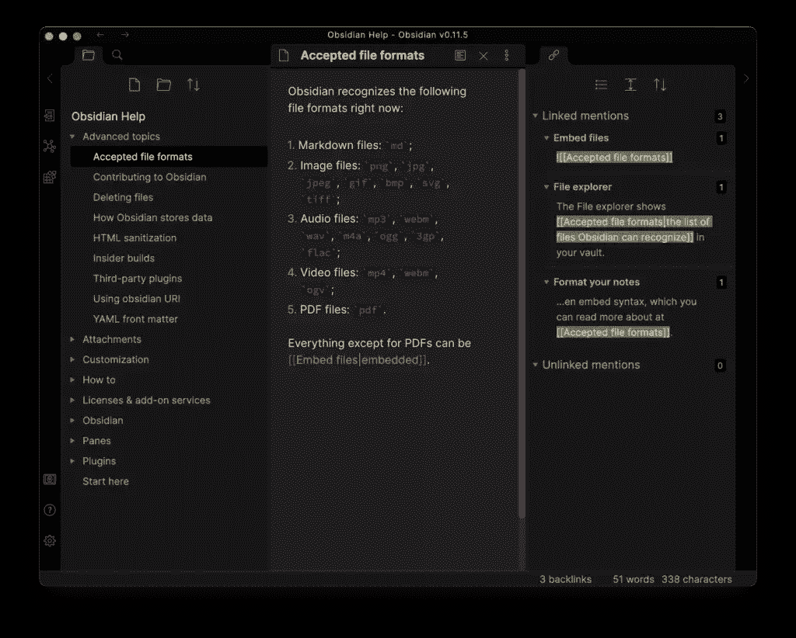
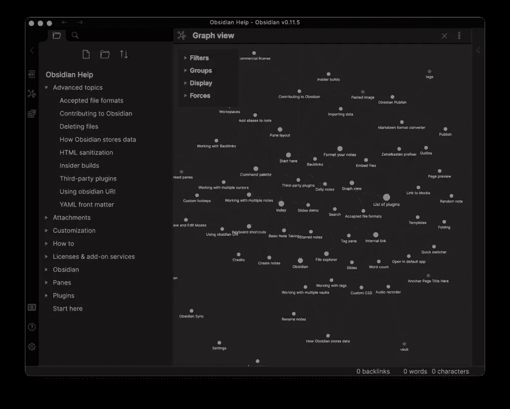
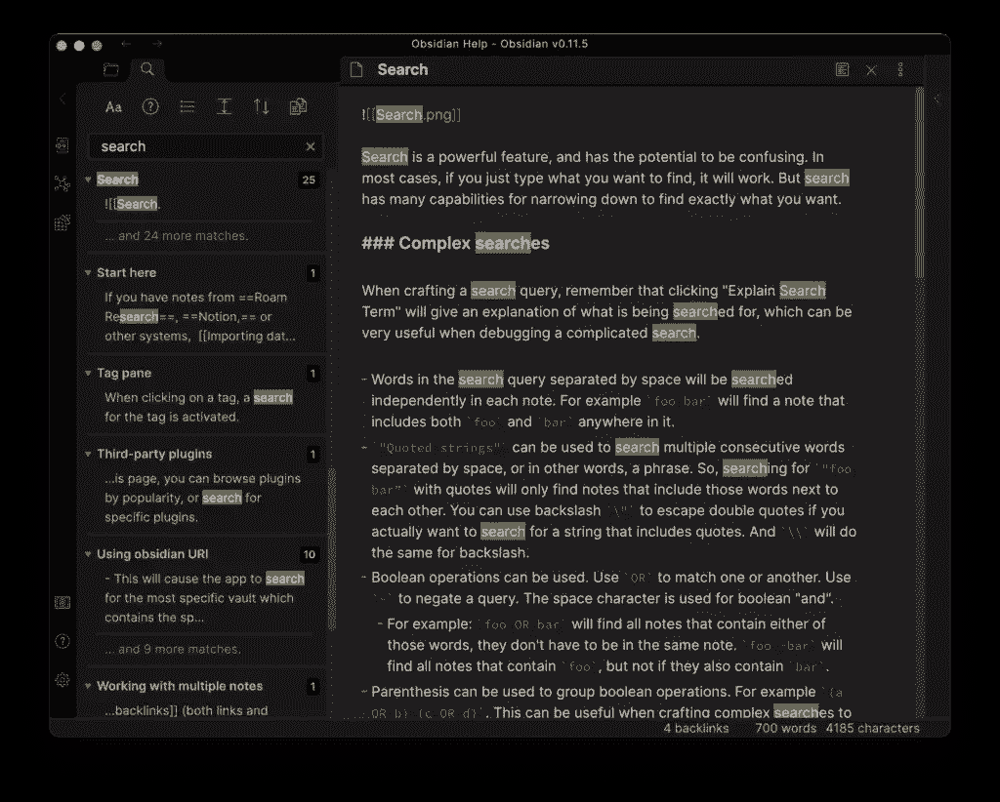
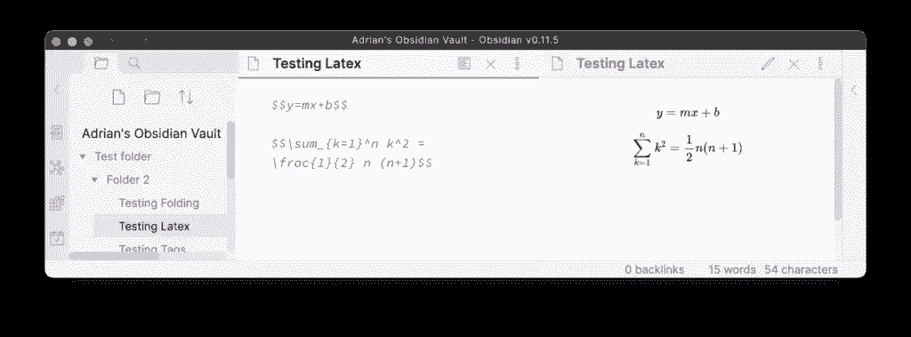
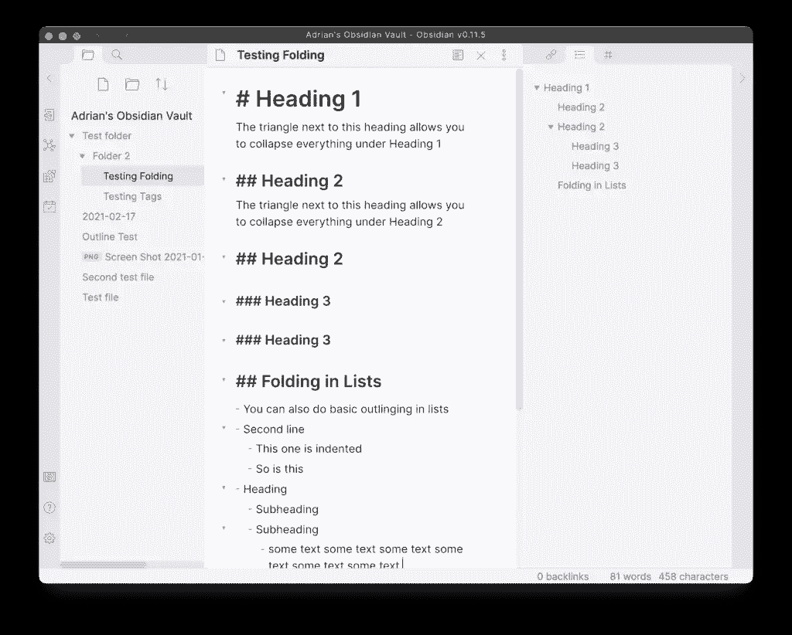
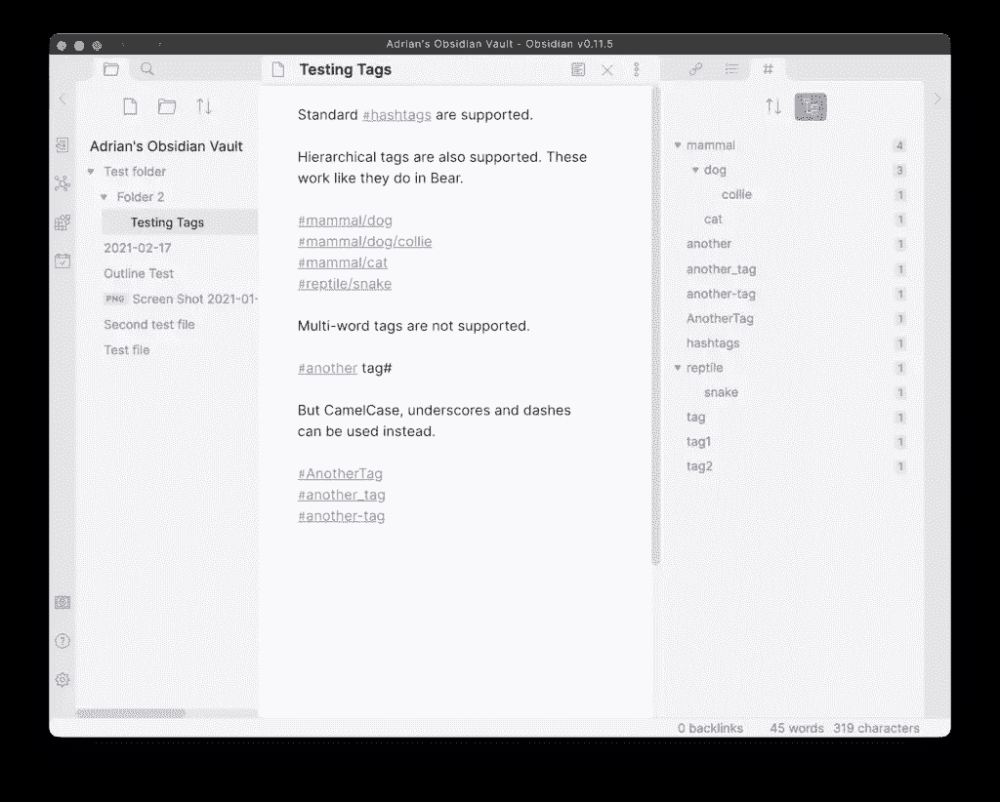
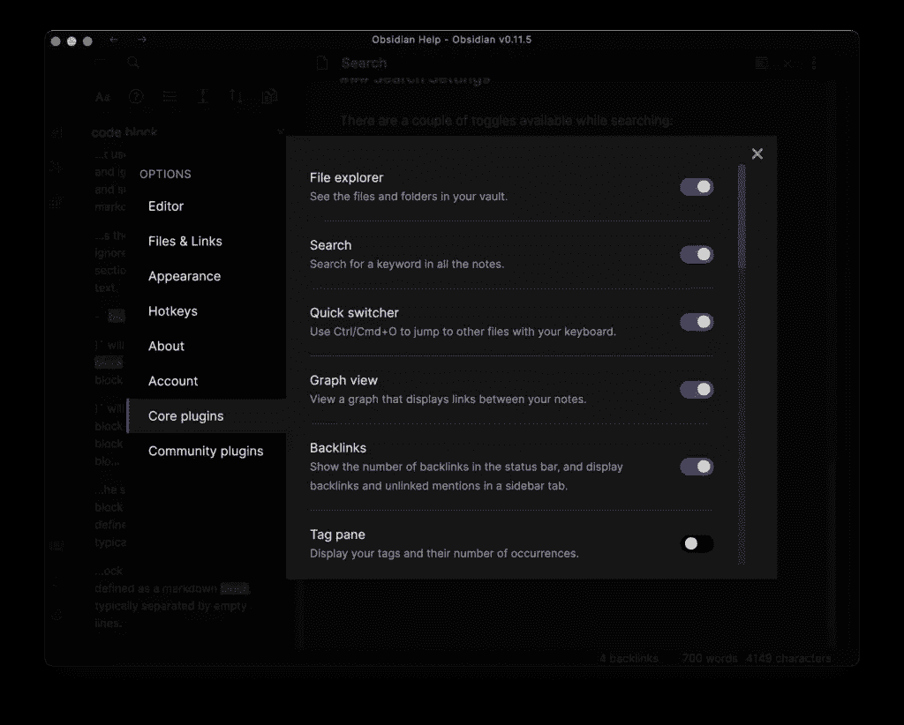
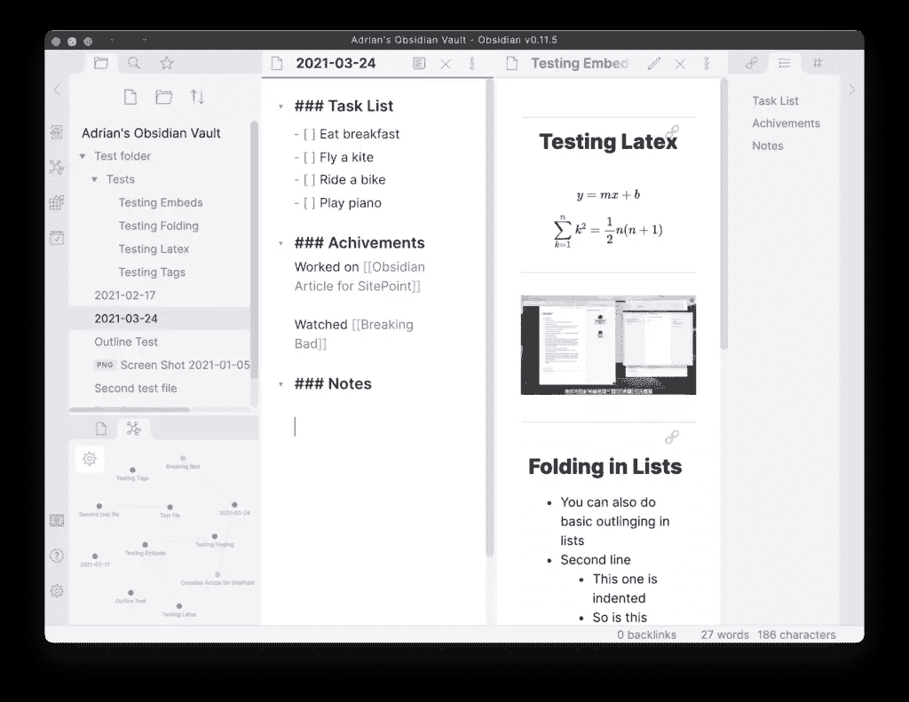

# 黑曜石指南:本地降价网络笔记

> 原文：<https://www.sitepoint.com/obsidian-beginner-guide/>

**Obsidian 是一款[笔记和知识管理应用](https://obsidian.md/)，它是由 Dynalist 的开发者开发的，Dynalist 是一款流行的在线 outliner，也是我最喜欢的工具之一。他们认为它是“记录笔记的 IDE”它让你把一个纯文本文件的集合变成一个丰富的链接思想的网络。快速开始这个黑曜石笔记教程。**

Obsidian 的数据存储在 Markdown 文件的本地文件夹中。该应用程序强大的链接和反向链接功能将这些独立的文件变成一个知识库，作为你的第二个大脑。我最初对这个应用程序印象不深，直到我发现可以通过插件添加广泛的功能。你真的可以把它变成你自己的。

开发人员将它用作任务管理器、[软件开发知识库](https://joshwin.imprint.to/post/how-i-use-obsidian-to-manage-my-goals-tasks-notes-and-software-development-knowledge-base)，以及笔记、想法和代码片段的储存库。它因其开放架构、可扩展性、代码块、GitHub 集成、Vim 键绑定和可配置热键而受到赞赏。

## 黑曜石笔记 App 是什么？

Obsidian 程序将其数据存储在 Markdown 文件的文件夹中，因此绝对没有锁定，您可以使用任何文本编辑器或 Markdown 编辑器访问您的笔记。现有的降价文件(或文件夹)可以在黑曜石中打开。您的笔记存储在本地，也可以使用 iCloud、Google Drive、GitHub 等存储在云上。

Obsidian 的[关于我们](https://obsidian.md/about)页面列出了开发者使用该应用的三个基本方向:

*   本地优先和纯文本
*   林克是一等公民
*   让它超级可扩展

这些价值观引起了我的共鸣。它们确保我的数据安全并在我的控制之下，并允许我决定哪些功能我需要，哪些不需要。默认情况下，它的许多更高级的功能都是关闭的，这使得不太懂技术的用户更容易使用它。但是在引擎盖下有很大的力量。

该应用程序是模态的，并提供预览和编辑模式。第一个隐藏标记并显示图像，而第二个显示 Markdown 语法和图像路径。链接在预览模式下是可点击的，但是在编辑模式下你需要`Command`点击。我想这使得编辑链接更加简单。您可以选择默认激活的模式。

### 黑曜石 Mac、Windows 和 Linux 应用程序

基于电子的应用程序可用于 macOS、Windows 和 Linux。目前还没有网络应用，移动应用已经出现了几个月，用户普遍给予了积极的评价。

## 黑曜石主要概念

这里有一些使用黑曜石你需要了解的主要概念。

**链接和反向链接:**链接将单个的笔记转化为相关想法的网络。根据您在设置中的选择，使用降价链接或`[[wikilinks]]`创建链接。反向链接是自动生成的，并显示在侧边栏和上下文包括在内。未链接的提及也会列出。在预览模式下点击`Command`，在编辑模式下点击`Command`，跟随一个链接，用`Command` + `Option` +左箭头键返回。

**别名:**可以为每个便笺创建别名，以便您可以使用不同的名称链接到它们。

**侧边栏:**左侧侧边栏显示反向链接和未链接的引用。未链接的引用可以通过单击更改为链接。插件也用它来显示标题的轮廓、标签面板等等。

**图形视图:**这是您的笔记之间关系的图形表示。将鼠标悬停在某个笔记上，会以紫色显示所有相关笔记，单击某个笔记会将您带到那里。

**块:**每个页面都是由块组成的，这些块可能是段落、列表等等。每个块前后都有一个空行。您可以使用语法`[[filename^block]]`创建到特定块或标题的链接。

**Search:** search 查找包含某个单词或短语的笔记，并在导航栏中显示，在选中的笔记中高亮显示。可以打开和关闭区分大小写，并且运算符可用于路径、文件、标签、行和节。

分割窗口:黑曜石允许你像在 IDE 中一样多次分割窗口。窗格可以链接在一起滚动。它的一个用途是在两个链接的窗格中显示同一便笺的编辑和预览模式。另一种方法是在新的窗格中打开一个链接。

**Markdown:** 编辑模式支持显示 Markdown，预览模式不支持。像 Dynalist 和 Roam，不太标准。例如，`**bold**`文本用双星号创建，而`__italics__`需要双下划线而不是单下划线或星号。支持表格、任务列表、删除线和脚注。

**Latex:** 你可以通过将 Latex 代码包含在双美元符号中来添加数学符号。

**代码块:**代码块可用，支持语法高亮显示。使用 Prism，支持 [255 种语言](https://prismjs.com/#supported-languages)。

**折叠:**有一个设置允许你折叠标题和/或缩进，允许你使用黑曜石作为大纲视图。大纲插件在侧边栏中显示标题的目录。

**标签:**支持标准 hash 标签，以及嵌套标签。不支持多词标签。标签窗格可以使用插件显示在侧边栏中。

**文件夹:**笔记可以组织在层次文件夹中，允许您创建文档的大纲。

**嵌入:**可以使用`![[filename]]`嵌入笔记和其他文件。语音备忘录可以嵌入录音机插件。

**库:**使用不同的库可以创建无限数量的知识库。这些只是降价文件的不同文件夹。

**插件:**扩展性是黑曜石的核心价值观之一。目前，[有 22 个插件可用](https://publish.obsidian.md/help/Plugins/List+of+plugins)，包括反向链接、图表视图、搜索、标签窗格、每日笔记、带星号的笔记、模板和大纲。

## 入门指南

你的第一步是下载笔记应用程序。Obsidian 可用于 Windows、macOS 和 Linux，一个移动应用程序可用于 iOS 和 Android。你不必付费或注册帐户，默认情况下，你的笔记存储在本地。

成本是黑曜石相对于竞争对手的一大优势。个人使用完全免费，但也有很多付费的机会:

*   你可以通过成为 Catalyst 用户在经济上支持该软件，这需要花费 25 美元(一次性付款)并获得一些额外津贴。
*   与端到端加密和版本控制同步的成本为每年 48 美元。
*   选择性发布笔记的能力每年花费 96 美元。
*   商业用户每年为每个用户支付 50 美元。

我建议你做的第一件事是安装**每日笔记**插件，你可以选择让你的每日笔记在启动时自动打开，或者通过点击屏幕左侧的图标手动打开。

你可以用这张纸条来生活，记下你的想法，你已经完成的事情，以及你计划要实现的事情。用语法`- [ ]`创建未完成的任务，用`- [x]`创建未完成的任务。当按下`Enter`时，任务列表继续，要点击复选框，你需要处于预览模式。不幸的是，没有整理所有未完成任务的视图。

不要将所有内容都存储在今天的便笺中，而是创建到其他页面的链接并在那里添加信息。今天的页面将添加一个反向链接。

如果你想轻松访问一些关键音符，打开**星号**插件。这允许您将常用笔记和搜索标上星号，当您点按窗口顶部的星号图标时，它们将出现在导航栏中。

还可以探索命令面板插件(由`Command` + `P`激活)，它可以让您探索常用命令和键盘快捷键，以及快速切换器(`Command` + `O`)，它可以让您通过键入名称来打开或创建新的笔记。

如果你在其他地方有笔记，这是一个很好的机会，你可以把它们和你的黑曜石作品一起导入。[帮助页面](https://publish.obsidian.md/help/How+to/Import+data)提供了从 [Roam Research](https://www.sitepoint.com/roam-research-beginners-guide/) 、[idea](https://www.sitepoint.com/notion-beginners-guide/)、Evernote、OneNote、Apple Notes、Bear、Zkn3 和 TiddlyWiki 导入的说明。

了解黑曜石的最好方式之一是通过**演示&帮助库**，从菜单中选择**打开帮助**即可激活。在这里，您可以探索应用程序可以做什么，同时体验界面。在导航窗格的底部，您会发现一个名为**从这里开始**的注释。它向你介绍了一些快速潜入的地方，一些工作流程的想法，以及该应用程序的 Discord 帐户和论坛的链接。

你也可以通过查看黑曜石帮助的[在线版本](https://publish.obsidian.md/help/Index)来感受一下**发布**功能可以实现什么。

## 扩展和定制黑曜石

使用黑曜石的时候，不要只做笔记。花点时间把你的笔记链接起来，尝试标签。选择几个用例开始，比如收集代码片段，记录软件，记录你的想法和灵感。你用这个应用程序越多，它就变得越有用。

窗格可以被拖放到你喜欢的任何地方。这使您可以设置软件来适应您的偏好和工作流程。例如，您可以在左下方持续查看图表，打开您的每日笔记，并查看您正在处理的另一个笔记。一旦你有了喜欢的布局，使用**工作空间插件**保存它。

黑曜石不是局外人。这就是开发者的另一个产品 Dynalist 的用途。但是你可以在黑曜石中启用一些非常有用的特性。在设置中(在编辑器下)，您可以单独启用**折叠标题**和**折叠缩进**。这将允许您折叠笔记的各个部分，以获得其内容的概述。启用**大纲插件**可以让你在侧边栏看到一个可点击的目录。

这些设置还允许您选择黑暗或光明模式，并使窗口半透明。像在浏览器中一样，可以使用`Command` + `+`和`Command` + `-`调整文本大小。在设置中，你可以访问一系列的**社区主题**，或者你可以[创建自己的](https://publish.obsidian.md/help/How+to/Add+custom+styles)。

可以使用**核心插件**添加功能，也有大量的**社区插件**可用。这些可以直接从“设置”的“社区插件”部分访问，一旦你关闭安全模式，你就可以在那里安装它们。名单上的人数很快接近 200 人，下面是几个例子:

*   高级表格
*   滑动窗格
*   思维导图
*   黑曜石饭盒
*   自然语言日期
*   热键++

如果你创建了自己的，你可以通过向官方[黑曜石释放](https://github.com/obsidianmd/obsidian-releases)回购创建一个拉请求，将它添加到列表中。你会在那里找到如何做的说明，你也会发现 [API 文档](https://github.com/obsidianmd/obsidian-api)和[示例插件](https://github.com/obsidianmd/obsidian-sample-plugin)很有帮助。

**模板插件**可以让你方便地将文本片段添加到当前笔记中。你只需将它们添加到一个特定的(可配置的)文件夹中，就可以得到许多变量，包括`{{title}}`、`{{date}}`和`{{time}}`。

确保你备份了你的黑曜石数据。你可以用标准的备份软件或者使用第三方插件比如 [obsidian-git](https://github.com/denolehov/obsidian-git) 在本地完成这项工作。[观看此视频](https://effectiveremotework.com/2020/09/obsidian-sync-your-vaults-with-git-github/)了解更多详情和选项。

## 最后的想法

黑曜石是一个强大的个人知识管理者，也是一个有效的第二大脑。当你使用它的时候，你会创造和发现你的思想和想法之间的联系。

这是漫游研究等更昂贵选择的绝佳替代方案。它对个人使用是免费的，并提供 Roam 目前缺乏的桌面(很快将会是移动)应用。

比起 Roam，许多用户可能更喜欢 Obsidian 的功能。作家可能会发现黑曜石的笔记比 Roam 的大纲更容易处理。在 Obsidian 中，您可以利用拆分窗口，通过拖放自定义布局。

最后，很多用户会被黑曜石的理念和价值观所吸引。本地存储文件的安全性很有吸引力，因为它是将数据存储在纯文本文件文件夹中的开放方式。这与 Roam 目前提供的服务形成了鲜明对比。

黑曜石是给你的吗？我很想听听你的想法。我用得越多，就越觉得它有吸引力。这是一次发现之旅，我发现我认为缺失的功能可以作为设置或插件使用。这个设计决策允许用户从相对空白的画布开始，添加他们需要的功能。

## 资源:

文本:

*   [黑曜石 100 天](https://www.zylstra.org/blog/2020/10/100-days-in-obsidian-pt-1/)——六集系列
*   [我如何使用黑曜石管理我的目标、任务、笔记和软件开发知识库](https://joshwin.imprint.to/post/how-i-use-obsidian-to-manage-my-goals-tasks-notes-and-software-development-knowledge-base)
*   黑曜石——我的第二个大脑？
*   [我为什么转行:深入了解 Roam 与黑曜石](https://nileswyler.medium.com/why-i-switched-a-deep-dive-into-roam-vs-obsidian-df1a394971ff)
*   [用黑曜石和盖茨比打造 DIY 数字花园](https://dev.to/joeholmes/creating-a-diy-digital-garden-with-obsidian-and-gatsby-378e)
*   [用黑曜石改变你的写作过程](https://medium.com/the-brave-writer/obsidian-is-the-practical-tool-you-need-to-transform-your-writing-process-bec20c01a430)
*   我们如何开发思维的变革工具？

视频:

*   [黑曜石——反向链接和知识图表的力量](https://www.youtube.com/watch?v=n7xrHPpTWJ0)
*   [黑曜石——记笔记的基础知识](https://www.youtube.com/watch?v=z6F8RBIpQCE)
*   [程序员最佳笔记软件:黑曜石](https://www.youtube.com/watch?v=7yoY5zwx76k)
*   [如何通过 GitHub code spaces | FOAM | Dendron | log seq |](https://www.youtube.com/watch?v=CaqhIoj8MWk)远程使用黑曜石
*   [黑曜石插件(0 . 9 . 10)——我在黑曜石应用中的顶级插件](https://www.youtube.com/watch?v=X61wRmfZU8Y)
*   [创建自己的黑曜石插件|如何开始使用](https://www.youtube.com/watch?v=9lA-jaMNS0k)
*   [漫游 vs 曜石:哪个最适合你？](https://www.youtube.com/watch?v=xSo4K8sPHQU)
*   [为什么曜会追上遨游](https://www.youtube.com/watch?v=_x54XJrECvk)
*   [观念 vs 黑曜石完整对比//回顾 2021](https://www.youtube.com/watch?v=vTVkbMNy2as)
*   [黑曜石:最安全的观念选择](https://www.youtube.com/watch?v=ms4cWMsOITs)
*   [黑曜石:新的最佳笔记应用学生概述——优于漫游研究](https://www.youtube.com/watch?v=aK2fOQRNSxc)
*   [黑曜石:用 Git/GitHub 同步你的金库](https://effectiveremotework.com/2020/09/obsidian-sync-your-vaults-with-git-github/)
*   [我如何将黑曜石用作第二大脑](https://www.youtube.com/watch?v=uqVx22lo9_4)
*   [我的 2020 年 Zettelkasten 和 Evergreen Notes 综合黑曜石工作流程](https://www.youtube.com/watch?v=Ewhfok91AdE)
*   [下面是我如何使用黑曜石中的标签和链接来管理我的 Zettelkasten](https://www.youtube.com/watch?v=zIh1S7ra3aI)

## 分享这篇文章