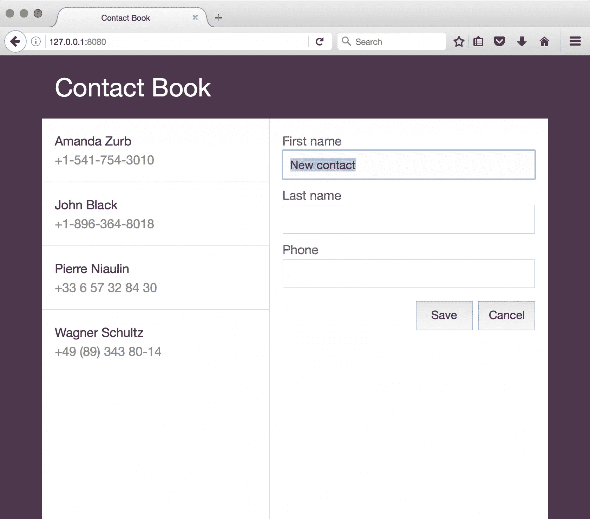
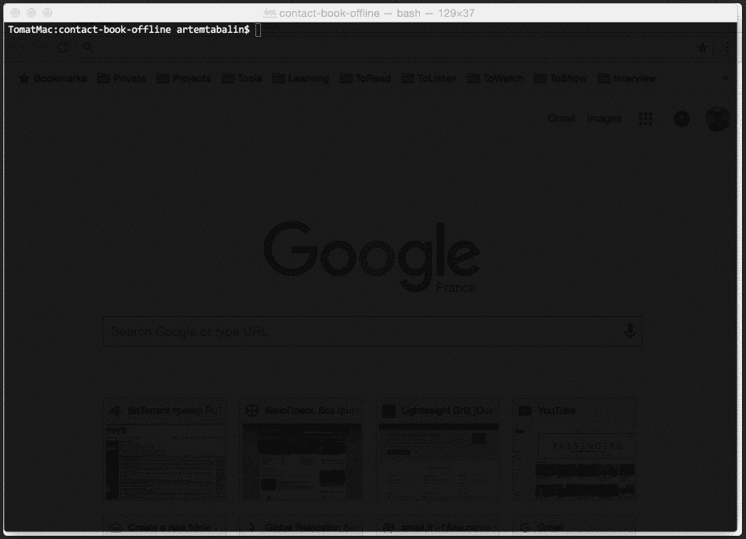
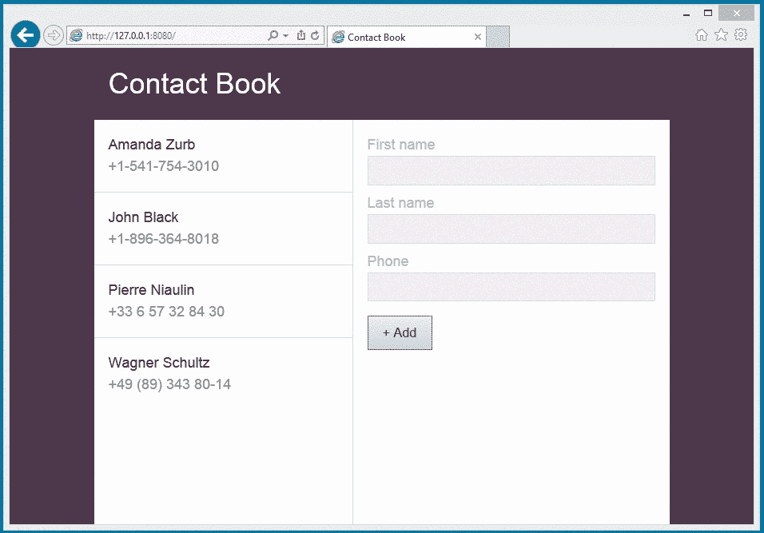
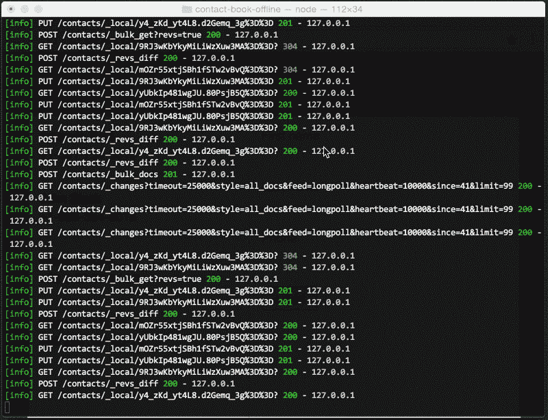

# 使用 Service Workers & PouchDB 创建离线 Web 应用程序

> 原文：<https://www.sitepoint.com/offline-web-apps-service-workers-pouchdb/>


离线 web 应用程序变得越来越流行。离线支持是如此重要，以至于现在经常谈论“离线优先”的方法，在这种情况下，它成为一个主要的考虑因素。随着渐进式网络应用的兴起，它也越来越受欢迎。

在这篇文章中，我们将看看如何通过实现资产缓存、客户端数据存储和与远程数据存储的同步来为基本的联系人列表 web 应用程序添加离线支持。

[GitHub 上有 app 的源代码](https://github.com/sitepoint-editors/contact-book-offline)。

## 为什么支持离线？

为什么要关心离线支持？

我自己每天花一个多小时在火车上。我不想浪费这个时间，所以我带着我的笔记本电脑在路上工作。我用手机网络上网。连接不可靠，时不时就掉。我的用户体验取决于我正在使用的网络应用。只有几个应用程序，具有良好的离线支持，表现符合预期，连接丢失是透明的。有些行为古怪，所以当我刷新页面时，我丢失了数据。大多数根本不支持离线，我必须等待稳定的连接才能使用它们。

不可靠的连接不是唯一的用例。我们也可以谈论你可能离线几个小时的情况，例如，在飞机上。

离线支持的另一个重要优势是性能提升。事实上，浏览器不需要等待从服务器加载资产。数据一旦存储在客户机上，也是如此。

因此我们需要离线:

1.  即使连接不稳定(火车上的手机网络)，也能使用应用程序
2.  能够在没有网络连接的情况下工作(在飞机上)
3.  为了提高性能

## 渐进式网络应用

谷歌的[渐进式网络应用](https://developers.google.com/web/progressive-web-apps/) (PWA)概念是一种方法，旨在提供网络应用，提供本地移动应用的 UX。PWA 包括离线支持，但它还涵盖更多内容:

*   响应能力–支持不同的外形规格:手机、平板电脑、台式机
*   [网络应用清单](https://developer.mozilla.org/en-US/docs/Web/Manifest)–在主屏幕上安装应用
*   应用程序外壳——一种设计模式，其中基本 UI 应用程序外壳与后来加载的内容相分离
*   推送通知–从服务器获得“即时”更新

Addy Osmani 写了一篇很棒的关于 PWA 的介绍文章。

在本文中，我们将只关注一个方面:离线支持。

## 定义离线支持

让我们明确一下支持离线需要什么。我们需要注意两个方面:

1.  应用资产——缓存 HTML、JS 脚本、CSS 样式表、图像
2.  应用数据–在客户端存储数据

### 应用资产

HTML5 中第一个缓存离线资产的解决方案是 [AppCache](https://developer.mozilla.org/en-US/docs/Web/HTML/Using_the_application_cache) 。这个想法是提供一个应用程序清单，描述哪些资源应该存储在浏览器缓存中。因此，下次加载应用程序时，这些资产将从浏览器缓存中取出。

> **重要**:虽然简单，但是使用 AppCache 有很多[陷阱](http://alistapart.com/article/application-cache-is-a-douchebag)。这个标准现在被弃用了，尽管它仍然被浏览器广泛支持。

引入了服务工人来取代 AppCache。它们为离线支持提供了灵活的解决方案。服务工作者对发出的请求进行控制，允许脚本拦截它们并返回必要的响应。缓存逻辑完全由开发人员负责。应用程序代码本身可以检查资产是否保存在缓存中，并仅在需要时从服务器请求它。

需要注意的是，服务人员仅通过 HTTPS(本地主机允许 HTTP)连接获得支持。我们很快就会看到如何使用服务人员。

### appdata

App 数据可以存储在浏览器提供的离线存储中。

HTML5 引入了几个选项:

*   [web storage](https://www.w3.org/TR/webstorage/)–键值存储
*   NoSQL 数据库
*   [web SQL](https://dev.w3.org/html5/webdatabase/)–内置 SQLite 数据库

WebStorage 是一个键值存储。这是最简单的跨浏览器存储，但是有几个陷阱需要注意。您必须注意您放入的数据的序列化和反序列化，因为值必须是普通的字符串。对于较大的数据集，您可能会遇到[大小限制](https://www.html5rocks.com/en/tutorials/offline/quota-research/#toc-desktop)。此外，有可能进入竞争状态，这意味着如果您在浏览器中同时打开两个选项卡，您可能会以意外的行为结束。

IndexedDB 更加强大，似乎是离线存储的最佳选择。它有足够的[空间可用](https://www.html5rocks.com/en/tutorials/offline/quota-research/#toc-desktop)。它支持事务，可以安全地同时在几个浏览器标签中使用。它也是所有现代浏览器都支持的 T4。

**WebSQL** 在浏览器中字面意思是 SQLite。客户机上带有 ACID 的全功能关系数据库。不幸的是，WebSQL 已经被标准委员会否决了，而且在非 Blink/Webkit 浏览器中也不被支持。

有几个库提供了离线存储的抽象:

*   [local feed](https://localforage.github.io/localForage/)–简单的类似本地存储的 API
*   [IDB wrapper](http://jensarps.github.io/IDBWrapper/)–跨浏览器索引数据库包装器
*   [pouch db](https://pouchdb.com/)–受 CouchDB 启发的客户端存储解决方案。如果使用 CouchDB，它支持与后端自动同步。

## 通讯录应用程序

现在，让我们看看如何向 web 应用程序添加离线支持。我们的示例应用程序是一个基本的通讯录:



左侧是联系人列表，右侧是用于编辑联系人的详细信息表单。联系人有三个字段:名、姓和电话。

可以在 GitHub 上找到 [app 源代码](https://github.com/sitepoint-editors/contact-book-offline)。要运行该应用程序，您需要安装 Node.js。如果你不确定这一步，你可以遵循我们的[NPM](https://www.sitepoint.com/beginners-guide-node-package-manager/)初学者指南。

首先从项目文件夹下载源代码并运行以下命令:

```
$ npm install
$ npm run serve 
```

后端呢？我们使用 [pouchdb-server](https://github.com/pouchdb/pouchdb-server) 在 CouchDB 存储上提供 REST API，使用 [http-server](https://github.com/indexzero/http-server) 服务前端资产。

我们的`package.json`的`scripts`段是这样的:

```
 "scripts": {
    "serve": "npm-run-all -p serve-front serve-backend",
    "serve-front": "http-server -o",
    "serve-backend": "pouchdb-server -d db"
  }, 
```

包`npm-run-all`允许并行运行几个命令。我们启动两个服务器:`http-server`和`pouchdb-server`。

现在让我们来看看对应用程序资产的离线支持的实现。

## 离线资产

目录 **/public** 包含应用程序的所有资产:

*   **/CSS/style . CSS**–应用样式表
*   **/js/ext**–包含外部库的目录(PouchDB 和 Babel 使用 ES2015 语法)
*   **/js/app . js**–主应用程序脚本
*   **/js/register-service-worker . js**-注册服务工作者的脚本
*   **/js/store . js**–使用 PouchDB 存储的适配器类
*   **/contact book . app cache**–app cache 宣言
*   **/index . html**–应用程序标记
*   **/service-worker . js**-服务人员的来源

旅程从服务人员的注册开始。以下是`register-service-worker.js`中的注册码:

```
if ('serviceWorker' in navigator) {
    navigator.serviceWorker.register('/service-worker.js', {
        scope: '/'
    }).then(function() {
        // success
    }).catch(function(e) {
        // failed
    });
} 
```

首先，我们检查浏览器是否支持`serviceWorker`。如果是，我们调用`register`方法，提供服务工作者脚本的 URL(在我们的例子中是`/service-worker.js`)和额外的参数来指定服务工作者的范围。参数是可选的，根`/`是`scope`的默认值..

> **重要事项**:为了能够使用应用程序的根目录作为作用域，服务工作者脚本应该位于应用程序的根目录中。

`register`方法返回一个`Promise`。

服务人员的生命周期从安装开始。我们可以处理`install`事件，并将所有需要的资源放入缓存:

```
var CACHE_NAME = 'contact-book-v1';

var resourcesToCache = [
  '/',
  '/css/style.css',
  '/js/ext/babel.min.js',
  '/js/ext/pouchdb.min.js',
  '/js/register-service-worker.js',
  '/js/store.js',
  '/js/app.js'
];

self.addEventListener('install', function(event) {
  event.waitUntil(
    // open the app browser cache
    caches.open(CACHE_NAME)
      .then(function(cache) {
        // add all app assets to the cache
        return cache.addAll(resourcesToCache);
      })
  );
}); 
```

最后一件事是处理每次从服务工作器范围获取资源时触发的`fetch`事件:

```
self.addEventListener('fetch', function(event) {
  event.respondWith(
    // try to find corresponding response in the cache
    caches.match(event.request)
      .then(function(response) {
        if (response) {
          // cache hit: return cached result
          return response;
        }

        // not found: fetch resource from the server
        return fetch(event.request);
      })
  );
}); 
```

就是这样。让我们测试一下它的工作情况:

1.  使用`npm run serve`运行应用程序
2.  在 Chrome 中打开网址 http://127.0.0.1:8080/
3.  用控制台中的`Ctrl + C`停止网络服务器(或者使用 Chrome 开发工具[模拟离线](https://developers.google.com/web/tools/chrome-devtools/network-performance/network-conditions)
4.  刷新网页



该应用程序仍然可用。厉害！

### AppCache

上述解决方案的问题是服务人员的浏览器支持有限。我们可以使用[广泛支持的](http://caniuse.com/#feat=offline-apps) AppCache 实现一个后备解决方案。点击阅读更多关于 AppCache 使用[的信息。](https://www.html5rocks.com/en/tutorials/appcache/beginner/)

基本用法很简单，包括两个步骤:

1.  定义应用缓存清单`contactbook.appcache`:

    ```
    CACHE MANIFEST
    # v1 2017-30-01

    CACHE:
    index.html
    css/style.css
    js/ext/babel.min.js
    js/ext/pouchdb.min.js
    js/store.js
    js/app.js 
    ```

    对于我们的简单应用程序，我们定义了一个单独的部分`CACHE`并将所有资产放在那里。

2.  从 HTML 引用清单文件:

    ```
    <html manifest="contactbook.appcache" lang="en"> 
    ```

就是这样。让我们在不支持服务人员的浏览器中打开该页面，并按照我们之前的方式进行测试。



## 离线数据

能够缓存资产是很棒的。但这还不够。让一个应用活起来的是独一无二的数据。我们将使用 PouchDB 作为客户端数据存储。它功能强大，易于使用，并提供开箱即用的数据同步。

如果你不熟悉它，可以看看这个[对 PouchDB](https://www.sitepoint.com/getting-started-with-pouchdb/) 的介绍。

助手类`Store`负责与 PouchDB 的交互:

```
class Store {

  constructor(name) {
    this.db = new PouchDB(name);
  }

  getAll() {
    // get all items from storage including details
    return this.db.allDocs({
        include_docs: true
      })
      .then(db => {
        // re-map rows to collection of items
        return db.rows.map(row => {
          return row.doc;
        });
      });
  }

  get(id) {
    // find item by id
    return this.db.get(id);
  }

  save(item) {
    // add or update an item depending on _id
    return item._id ?
      this.update(item) :
      this.add(item);
  }

  add(item) {
    // add new item 
    return this.db.post(item);
  }

  update(item) {
    // find item by id
    return this.db.get(item._id)
      .then(updatingItem => {
        // update item
        Object.assign(updatingItem, item);
        return this.db.put(updatingItem);
      });
  }

  remove(id) {
    // find item by id
    return this.db.get(id)
      .then(item => {
        // remove item
        return this.db.remove(item);
      });
  }
} 
```

`Store`类的代码是一个典型的 CRUD 实现，提供了一个基于承诺的 API。

现在，我们的主要应用程序组件可以使用`Store`:

```
class ContactBook {

  constructor(storeClass) {
    // create store instance
    this.store = new storeClass('contacts');

    // init component internals
    this.init();

    // refresh the component
    this.refresh();
  }

  refresh() {
    // get all contacts from the store
    this.store.getAll().then(contacts => {
      // render retrieved contacts
      this.renderContactList(contacts);
    });
  }

    ...
} 
```

将`Store`类传递给构造函数，将 app 类从具体的存储中分离出来。一旦创建了商店，就在`refresh`方法中使用它来获取所有联系人。

应用程序初始化如下所示:

```
new ContactBook(Store); 
```

其他应用程序方法与商店互动:

```
class ContactBook {
  ...

  showContact(event) {
    // get contact id from the clicked element attributes
    var contactId = event.currentTarget.getAttribute(CONTACT_ID_ATTR_NAME);

    // get contact by id
    this.store.get(contactId).then(contact => {
      // show contact details
      this.setContactDetails(contact);

      // turn off editing
      this.toggleContactFormEditing(false);
    })
  }

  editContact() {
    // get id of selected contact
    var contactId = this.getContactId();

    // get contact by id
    this.store.get(this.getContactId()).then(contact => {
      // show contact details
      this.setContactDetails(contact);

      // turn on editing
      this.toggleContactFormEditing(true);
    });
  }

  saveContact() {
    // get contact details from edit form
    var contact = this.getContactDetails();

    // save contact
    this.store.save(contact).then(() => {
      // clear contact details form
      this.setContactDetails({});

      // turn off editing
      this.toggleContactFormEditing(false);

      // refresh contact list
      this.refresh();
    });
  }

  removeContact() {
    // ask user to confirm deletion
    if (!window.confirm(CONTACT_REMOVE_CONFIRM))
      return;

    // get id of selected contact
    var contactId = this.getContactId();

    // remove contact by id
    this.store.remove(contactId).then(() => {
      // clear contact details form
      this.setContactDetails({});

      // turn off editing
      this.toggleContactFormEditing(false);

      // refresh contact list
      this.refresh();
    });
  } 
```

以下是使用 store CRUD 方法的基本操作:

*   `showContact`–从列表中选择联系人后，显示联系人的详细信息
*   `editContact`–允许编辑联系人的详细信息
*   `saveContact`–保存新的或现有联系人的详细信息
*   `removeContact`–删除选定的联系人

现在，如果您在离线时添加联系人并刷新页面，数据不会丢失。

但是，有一个‘但是’…

### 数据同步

这一切都很好，但是所有数据都存储在浏览器的本地。如果我们在另一个浏览器中打开应用程序，我们将看不到这些更改。

我们需要实现与服务器的数据同步。双向数据同步的实现不是一个小问题。幸运的是，如果我们在后端有 CouchDB，它是由 PouchDB 提供的。

让我们稍微改变一下我们的`Store`类，使它与远程数据源同步:

```
class Store {

  constructor(name, remote, onChange) {
    this.db = new PouchDB(name);

    // start sync in pull mode
    PouchDB.sync(name, `${remote}/${name}`, {
      live: true,
      retry: true
    }).on('change', info => {
      onChange(info);
    });
  } 
```

我们向构造函数添加了两个参数:

*   `remote`–远程服务器的 URL
*   `onChange`–一旦来自后端的更改被触发的回调

`PouchDB.sync`方法完成了这个任务，并开始与后端同步。`live`参数表示它应该定期检查更改，而`retry`表示当错误发生时重试(因此，如果用户离线，同步不会停止)。

我们需要相应地更改 app 类，并将所需的参数传递给`Store`构造函数:

```
class ContactBook {

  constructor(storeClass, remote) {
    this.store = new storeClass('contacts', remote, () => {
      // refresh contact list when data changed
      this.refresh();
    });

    ...
  } 
```

主 app 类构造函数现在接受传递给商店的远程 URL。`onChange`回调只是调用`refresh`方法刷新联系人列表。

应用程序初始化必须更新:

```
new ContactBook(Store, 'http://localhost:5984'); 
```

搞定了。现在，我们的应用程序允许在离线时编辑联系人列表。一旦应用程序建立了网络连接，数据就会与后端存储同步。

让我们来测试一下:

1.  用`$ npm run serve`运行网络服务器
2.  在两个不同的浏览器中打开 URL http://127.0.0.1:8080/
3.  点击`Ctrl + C`停止网络服务器
4.  在两种浏览器中编辑联系人列表
5.  用`$ npm run serve`再次运行网络服务器
6.  在两个浏览器中查看联系人列表(根据两个浏览器中的更改，它应该是最新的)



太好了，我们做到了！

在 GitHub 上查看 app 的[完整源代码。](https://github.com/sitepoint-editors/contact-book-offline)

## 结论

如今，提供线下体验越来越有价值。能够在交通工具上使用连接不稳定的应用程序，或者在飞机上离线，对于经常使用的应用程序来说至关重要。这也是为了提高应用程序的性能。

为了支持离线，我们需要关注:

*   缓存应用程序资产——在所有现代浏览器都支持 AppCache 之前，使用支持 AppCache 的服务人员
*   在客户端存储数据——使用浏览器离线存储，比如 IndexedDB，其中有一个可用的库

我们刚刚看到了所有这些是如何实现的。我希望你喜欢阅读。请在评论中分享你对这个话题的想法！

*这篇文章由[詹姆斯·科尔斯](https://www.sitepoint.com/author/jkolce/)和[克雷格·巴克勒](https://www.sitepoint.com/author/craig-buckler/)进行了同行评审。感谢 SitePoint 的所有同行评审员使 SitePoint 的内容尽可能做到最好！*

## 分享这篇文章