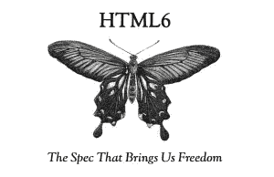

# 本周我们关注的是:整体框架和火狐操作系统

> 原文：<https://www.sitepoint.com/on-our-radar-this-week-monolithic-frameworks-and-firefox-os/>

欢迎来到《在我们的雷达上》,这是一个来自 web 开发世界的新闻、趋势和其他酷东西的每周综述。

本周，微软与谷歌的关系继续恶化，因为谷歌的安全团队在微软能够修补之前披露了 Windows 中的三个新漏洞。[微软已经批评谷歌](http://www.theverge.com/2015/1/12/7530791/microsoft-criticizes-google-for-bug-disclosure-approach)，声称搜索巨头的行为不必要地危及客户，而在一个奇怪的事件转变中，宣布[谷歌不会修复影响 60%安卓手机的漏洞](http://arstechnica.com/security/2015/01/google-wont-fix-bug-hitting-60-percent-of-android-phones/)。

在其他地方，[ShipYourEnemiesGlitter.com](http://shipyourenemiesglitter.com/)，一项向你讨厌的人(或者是真正喜欢亮片的人)匿名递送装满亮片的信封的服务，[成为头条新闻](http://www.bdcwire.com/ship-your-enemies-glitter-is-the-perfect-new-way-to-inconvenience-the-people-you-hate/)。随着该网站迅速走红，该计划背后的 22 岁企业家[恳求人们停止使用它](http://www.theguardian.com/technology/2015/jan/16/ship-your-enemies-glitter-founder-sells-company)。然后他兑现了他的筹码，并把网站放在 Flippa 上出售。

最后，马克·扎克伯格带着“工作中的脸书”试点项目走进办公室，这意味着负责占用你工作日时间的社交网络可能很快就会成为你公司的关键生产力工具之一。

## 框架——你站在哪里？

我对 JavaScript 框架持观望态度已经有一段时间了，所以我饶有兴趣地阅读了彼得-保罗·科赫(因 QuirksMode 而出名)的一篇观点文章，引用了 T2 关于 AngularJS 的问题。这篇文章在[黑客新闻](https://news.ycombinator.com/item?id=8886041)的一个评论帖中引起了相当多的争论，这也值得一看。

许多人欢呼 2015 年是单一 JavaScript 框架的[结束，声称我们需要转向基于组件的前端解决方案，但目前有太多的碎片来创建行业标准方法。](https://andywalpole.me/#!/blog/142134/2015-the-end-the-monolithic-javascript-framework)

说到碎片化，[前几天发布了 IO.js 的 1.0 版本](http://blog.risingstack.com/iojs-overview/)，[抢先一步](http://readwrite.com/2015/01/13/io-js-fork-node-js-version-1-0)。

Ember.js 正在开发[，让开发者能够在 Node.js](http://emberjs.com/blog/2015/01/08/inside-fastboot-faking-the-dom-in-node.html) 中运行他们的应用。这是他们快速启动计划的一部分，包括能够在服务器上启动 JavaScript 应用程序，并在浏览器中“再水合”它们。

变得过于臃肿的不仅仅是 JavaScript 框架。让我们来看看[组件驱动的 CSS 框架](https://www.sitepoint.com/component-driven-css-frameworks/)以及它们的发展方向。

## 本周流行语——火狐操作系统

Firefox OS(也叫 Boot to Gecko)是一款面向智能手机和平板电脑的开源操作系统。它由 Mozilla 创建，使用 HTML5、JavaScript 和其他开放网络技术直接与设备硬件通信。该平台针对入门级智能手机进行了优化，但也将用于其他设备，如可穿戴设备和智能电视。

相对而言，火狐操作系统是智能手机市场的新人。SitePoint 的作者 Elio Qoshi 回顾了 2014 年的一些里程碑事件，然后问[未来一年会发生什么](https://www.sitepoint.com/state-firefox-os-whats-store-2015/)。

最近，JavaScript Jabber 小组成员与 [Jason Weathersby](https://twitter.com/JasonWeathersby) (火狐操作系统的传播者)进行了交谈，涉及的话题从 [Gonk](http://en.wikipedia.org/wiki/Gonk) 、 [Gecko](https://developer.mozilla.org/en-US/docs/Mozilla/Gecko) 和[Gaia](https://developer.mozilla.org/en-US/Firefox_OS/Platform/Gaia)(《FxOS 的三个等级】)到[如何在你的树莓 Pi](https://www.youtube.com/watch?v=9cODs3ft8Xc) 上安装火狐。

火狐操作系统被一些人视为苹果和谷歌在智能手机市场主导地位的大胆挑战者。在这篇文章中，一位评论家分享了他对 s Firefox OS Fx0 手机的第一印象，并得出结论[它对 Android](http://www.androidauthority.com/lg-fx0-impressions-577569/) 没有威胁(至少暂时没有)。

火狐操作系统模拟器让你可以在浏览器中舒适地体验 Mozilla 的新操作系统。对开发者和好奇者来说都是好消息。

最后，这是一个有趣的视角，展示了火狐操作系统如何为盲人用户改变生活。

## 迅速发生的

看起来苹果的新编程语言正在经历某种迅速流行的过程。这是根据[最新的 RedMonk 编程语言排名](http://redmonk.com/sogrady/2015/01/14/language-rankings-1-15/)，它从第 68 位跃升至第 22 位。

我们被警告要正确看待这些排名(例如，它们没有反映出当今公司最常用的语言)，但尽管如此，它们可能只是让我们对程序员真正感兴趣的语言有所了解。

如果你喜欢开始使用 Swift，Tuts+正在运行一个从零开始的 Swift 课程，它涵盖了从集合和元组到函数和控制流的所有内容。

与此同时，在 SitePoint 上，我们有一个关于 Swift 游戏编程的两部分系列[，Rico Zuniga 向你展示如何制作俄罗斯方块的克隆版。](https://www.sitepoint.com/series/swiftgametutorial/)

这里有一个关于如何在 Swift 中创建滑动和可拖动 UIView 组件的[视频教程——很像你在 iOS 通知中心找到的那个。](https://www.youtube.com/watch?v=hbuL-vUDBhg)

最近在 iOhYes 播客上(我喜欢这个名字)，小组成员讨论了 Swift 中的[设计模式，并提供了每个模式的示例实现。](http://iohyespodcast.com/?p=563)

## 事物的下一个版本

对 HTML5、CSS3、ES5 和 PHP5 已经有了大致的了解，是时候看看接下来会发生什么了。你不认为网络现在会停滞不前，是吗？

布鲁诺·什科沃茨(SitePoint 的 PHP 频道编辑)讨论了 PHP 7 中的[返回类型、渴望已久的特性和移除的工件。请务必查看评论中的讨论。](https://www.sitepoint.com/php-7-revolution-return-types-removed-artifacts/)

既然 HTML5 规范已经最终确定，第六版的工作已经开始认真地(严肃地)进行。找出 HTML 中的[内容。下一个](http://www.script-tutorials.com/html-next-or-ideas-for-html6/)。

[CSS 选择器级别 4](http://dev.w3.org/csswg/selectors-4/) 是 CSS 选择器规范的下一个迭代。你可以[发现什么将会改变](https://grack.com/blog/2015/01/11/css-selectors-4/)，什么疯狂的新事物将会成为可能。

尽管 ECMAScript 6 计划在 2015 年年中发布，但它已经过时了(开玩笑)。这里有一个视频，详细介绍了 ES6 将为 JavaScript 带来的变化和补充。这里有一段视频，让我们先睹为快[ES7](https://www.youtube.com/watch?v=DqMFX91ToLw)即将发布的内容。

额外链接:[一个 ES6 兼容性表](http://kangax.github.io/compat-table/es6/)帮助可视化哪个浏览器支持什么。

* * *

这就是这周的全部内容。感谢加入我们。

我将留给你一份微软 Windows 10 活动的 [9 个最大公告的摘要(为什么他们找不到 10 个，我不知道)，一份关于](http://www.theverge.com/2015/1/21/7865539/microsoft-windows-10-event-what-you-need-to-know)[磁场要有多强才能真正杀死你](https://gravityandlevity.wordpress.com/2015/01/12/how-strong-would-a-magnetic-field-have-to-be-to-kill-you/)的相当深入的研究，以及[警方现在可以看到你家里面的令人担忧的消息](http://www.usatoday.com/story/news/2015/01/19/police-radar-see-through-walls/22007615/)(对此你几乎无能为力)。

那么哪些链接引起了你的注意呢？你站在框架的哪一边？你会考虑使用火狐操作系统吗？你对下一个版本的<insert technology="" here="">不感兴趣吗？请告诉我们，我们希望听到您的想法。</insert>

## 分享这篇文章