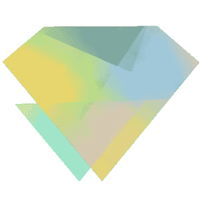

# 蛋白石:浏览器中的红宝石和生命的游戏

> 原文：<https://www.sitepoint.com/opal-ruby-browser-game-life/>

欢迎来到本文的第二部分，我们来看看 Opal，一个 Ruby 到 Javascript 的编译器！

在上一期文章中，我介绍了 Opal 并展示了如何在您的系统上安装它。我们在欧泊创作了康威《生命游戏》的前半部分。特别是，使用 HTML 5 canvas 元素实现网格，并为其添加一些交互性。

在本文中，我们将通过实现其余的逻辑来完成我们的应用程序，并将它挂接到画布上。完整的源代码可以在文章末尾找到。

让我们开始吧！

## 游戏规则

你可能还记得，康威的生活游戏由 4 个简单的规则组成:

#### 规则 1

任何少于两个活邻居的活细胞都会死亡，似乎是由于人口不足造成的。

#### 规则 2

任何有两个或三个活邻居的活细胞都可以存活到下一代。

#### 规则 3

任何有三个以上活邻居的活细胞都会死亡，好像是因为过度拥挤。

#### 规则 4

任何一个死细胞，只要有三个活的邻居，就会变成活细胞，就像通过繁殖一样。

## Protip:使用`pp`作为`console`。原木

在这个过程中，您可能会使用大量的`console.log`语句进行调试。事实上，我过去就是这样做的。然后，我学会了一个很棒的技巧:

> [@ bentanweihao](https://twitter.com/bentanweihao)[@ opa lrb](https://twitter.com/opalrb)[# protip](https://twitter.com/search?q=%23protip&src=hash)` console . log `映射到[# PP](https://twitter.com/search?q=%23pp&src=hash)([https://t.co/5mrxIiOJdV](https://t.co/5mrxIiOJdV))，牛逼文章 btw:)
> 
> —eliaschito(͜͡ʖ͡)(@ elia)[2014 年 4 月 4 日](https://twitter.com/elia/statuses/452082285563871233)