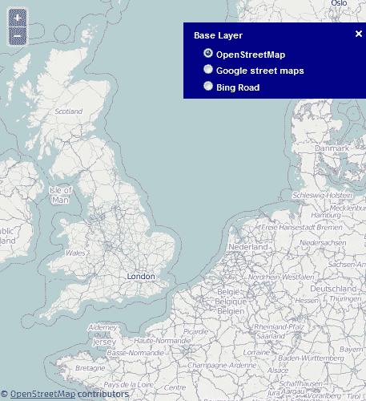
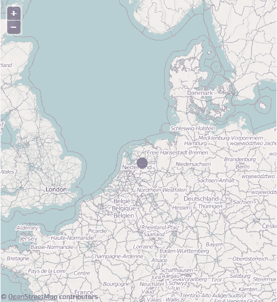

# OpenLayers——谷歌地图的替代品

> 原文：<https://www.sitepoint.com/openlayers-alternative-google-maps/>

你们中的大多数人可能在某个时候使用或查看过 Google Maps API 或 Bing Maps API，因为你想要在联系人页面上显示一个带有指针的精美地图。实话实说吧；它给页面增加了一个互动的元素，这可能会给它带来更多的惊喜。不幸的是，Google for one 不允许你在网站上需要认证的区域使用他们的地图。

[OpenLayers](http://openlayers.org/) 让您能够在任何环境中以您想要的方式可视化您的数据。你不受提供的地图材料的约束，可以从各种各样的地图背景中进行选择。由你我这样的志愿者维护的 [OpenStreetMap](http://www.openstreetmap.org/) 就是最好的例子之一。如果你遇到任何问题，你可以更新地图本身。这个界面很简单，他们会立即实现您的更改。

## 入门指南

OpenLayers 的基础很简单——在页面中包含 JavaScript，放置一个带有 id 的`div`,并将其传递给 OpenLayers。以下示例使用 jQuery 加载 OpenLayers，但 jQuery 不是必需的。

```
jQuery(window).on('load', function() {
  var map = new OpenLayers.Map('map', {
    projection: new OpenLayers.Projection('EPSG:900913')
  });
  var osm = new OpenLayers.Layer.OSM();            
  var gmap = new OpenLayers.Layer.Google('Google street maps');
  var bing = new OpenLayers.Layer.Bing({
    key: 'register your api key at bingmapsportal.com',
    type: 'Road',
    metadataParams: { mapVersion: 'v1' }
  });

  map.addLayers([osm, gmap, bing]);
  map.setCenter(new OpenLayers.LonLat(2.2, 54.0)
    .transform(new OpenLayers.Projection('EPSG:4326'), map.getProjectionObject()), 5);
  map.addControl(new OpenLayers.Control.LayerSwitcher());
});
```



现在我们有一张地图，包含了 OpenStreet 地图、Google 街道地图和 Bing 街道地图。

有一件事我觉得需要解释。在第一行，你会看到一些关于投射的东西。你可能会问什么？投影是看世界的一种方式。在过去的一段时间里，人们认为地球是平的，而投影是让地球再次变平的一种方法。我们都知道 WGS84 坐标系来自我们的 GPS(又名。EPSG:4326)，但大多数国家都有一个或多个用于地理数据的投影。

在这些应用中非常流行的是球面墨卡托投影(EPSG:900913)，它也被谷歌和必应使用。这就是为什么我们告诉 OpenLayers 使用那个。这就是 OpenLayers 的过人之处。您可以在每个图层或数据上设置不同的投影，OpenLayers 将处理它们之间的转换。

示例的其余部分不言而喻——创建所有地图层，将它们添加到视图中，集中在某个位置(再次注意转换),并显示一个层切换器。

## 让我们在地图上放些东西

现在，让我们把我们自己的东西添加到地图上。对于 OpenLayers，这意味着添加一个矢量层。矢量图层将包含由几何组成的要素。让我们从一个简单的开始，把你的位置添加到地图上。这是怎么做的。

```
var overlay = new OpenLayers.Layer.Vector('Your location');
var map = new OpenLayers.Map('map');

map.addLayers([new OpenLayers.Layer.OSM('OSM'), overlay]);
map.setCenter(
  new OpenLayers.LonLat(2.2, 54.0).transform(
    new OpenLayers.Projection('EPSG:4326'),
    map.getProjectionObject()
  ), 11);

navigator.geolocation.getCurrentPosition(function(position) {
  var yourLocation = new OpenLayers.Geometry.Point(position.coords.longitude, position.coords.latitude)
        .transform(new OpenLayers.Projection('EPSG:4326'), map.getProjectionObject());

  map.getLayersByName('Your location')[0].addFeatures([new OpenLayers.Feature.Vector(yourLocation)]);
  map.setCenter(new OpenLayers.LonLat(yourLocation.getCentroid().x, yourLocation.getCentroid().y)); 
});
```



第一行添加矢量层。基于您的位置创建一个点，该点作为一个要素添加到矢量图层。然后地图以你为中心。

## 添加您自己的风格

你对地图上的橙色圆点满意吗？大概不会。幸运的是，用你自己的风格地图来定制你的地图是非常简单的。每一层可以有不同的风格。在一个图层上，普通特征(“默认”)或“选定”特征可以有不同的样式。这是一个只有“默认”样式的简单样式地图的例子。

```
var styleMap = new OpenLayers.StyleMap({
  pointRadius: 20,
  strokeColor: '#ff0000',
  fillColor: '#ff0000',
  fillOpacity: 0.6
});
var overlay = new OpenLayers.Layer.Vector('Your position', {styleMap: styleMap});
```

这导致我们的位置显示为有点透明的红点。但是，我们可以更进一步。如果您的要素具有属性，您可以告诉样式使用这些命名的属性，如下所示。

```
var styleMap = new OpenLayers.StyleMap({
  pointRadius: '$(pointRadius)',
  strokeColor: '#ff0000',
  fillColor: '$(pointColor)',
  fillOpacity: 0.6
});
```

如果你有其他要求，你可以更进一步。定义一个引用函数的上下文，这些函数将被传递给当前正在呈现的功能。从那里控制渲染。这方面的一个例子如下所示。

```
var context = {
  getColor: function(feature) {
    return '#00ff00';
  },
  getPointRadius: function(feature) {
    return 15;
  }
}
var template = {
  strokeColor: '${getColor}',
  pointRadius: '${getPointRadius}',
}
var styleMap = new OpenLayers.StyleMap(new OpenLayers.Style(template, {context: context}));
```

## 动态地图数据

现在，如果你跟着走，你就有东西可以展示，对吗？让我们来讨论一下如何查询自己的后端来显示数据。下面你可以看到一个动态矢量层的例子。

```
var myLayer = new OpenLayers.Layer.Vector('My vector data', {
  strategies: [new OpenLayers.Strategy.BBOX()],
  protocol: new OpenLayers.Protocol.HTTP({
    url: 'http://my.server.net/geoData',
    params: {
        src: map.projection,
        maxfeatures: 1500,
    },
    format: new OpenLayers.Format.GeoJSON(),
  }),
  styleMap: new OpenLayers.StyleMap(style),
});
```

当视图边界框改变时，边界框(BBOX)策略将读取新特征。我选择使用 GeoJSON 作为我的 URL 的返回格式。OpenLayer 支持多种格式——KML、XML、GPX、XLS、CSV、JSON、GeoJSON、GeoRSS 等等。

您将得到一个带有边界参数`bbox=left,bottom,right,top`的请求。这些是当前视口的外部边界。明智的做法是将图层的投影传给自己进行验证。我还添加了`maxFeatures`来告诉我的后端返回多少。这里定为 1500，挺多的。根据用户计算机/设备的性能，当前的网络浏览器可能会出现问题。在 DOM 中移动> 500 个元素并呈现它们可能是一个很大的要求。OpenLayers 有一个叫做集群的解决方案。

```
var myLayer = new OpenLayers.Layer.Vector("My vector data", {
  strategies: [new OpenLayers.Strategy.BBOX(),
               new OpenLayers.Strategy.AnimatedCluster({
                  distance: 10,
                  animationMethod: OpenLayers.Easing.Expo.easeInOut,
                  animationDuration: 10
              })],
  protocol: new OpenLayers.Protocol.HTTP({
      ...
});
```

您可以将其作为一种策略添加到您的图层中，这样，如果您的点在某个半径范围内，它就会开始对这些点进行聚类。在我的例子中，我使用了可以下载的动画集群策略。对于一个奇特的动画来说也是如此。

现在你有了一个解决方案，它会询问你想在用户区显示什么。如果特征靠得太近，它会很好地对它们进行聚类。您可以向集群添加不同的样式来显示这一点。真的由你来决定！

## 结论

使用 OpenLayers，您可以在提供和可视化数据的方式上获得很大的自由度。看看 OpenLayers 网站上的例子和 API 描述，看看如何在矢量图层上绘图。如果你使用 OpenStreetMap，不要忘记检查和更新你的邻居。

我们很想知道你是否看到了使用 OpenLayers 的可能性。或者您可能已经在某个地方实现了它。请在评论中告诉我们。

您可以在[演示页面](http://www.slatius.nl/experiments?id=openlayers)上看到本文中的代码。

## 分享这篇文章