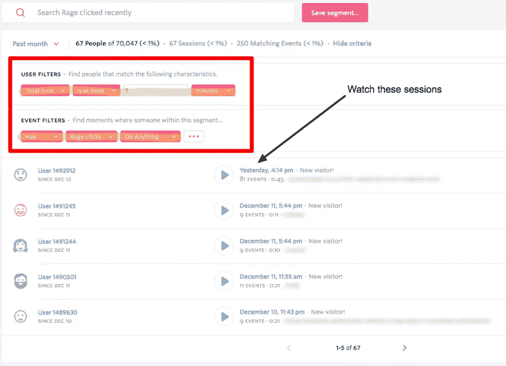
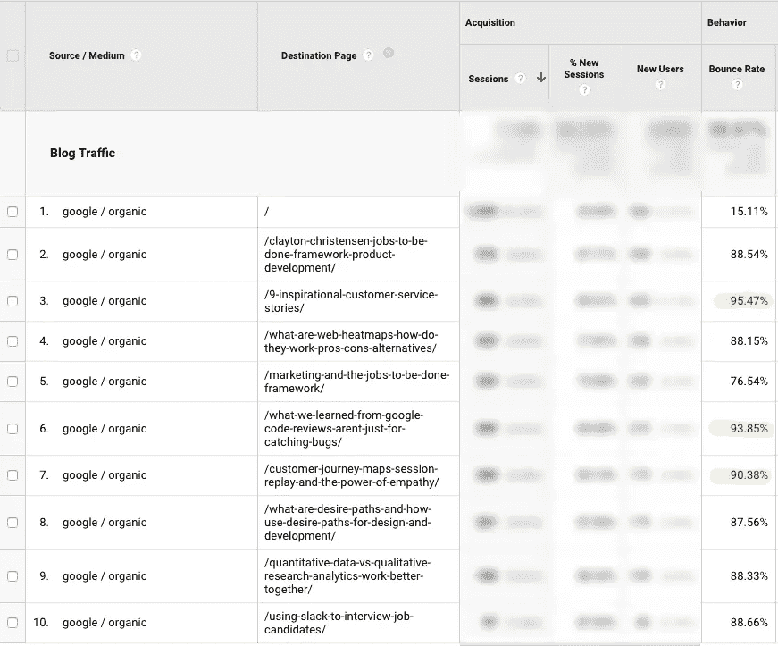
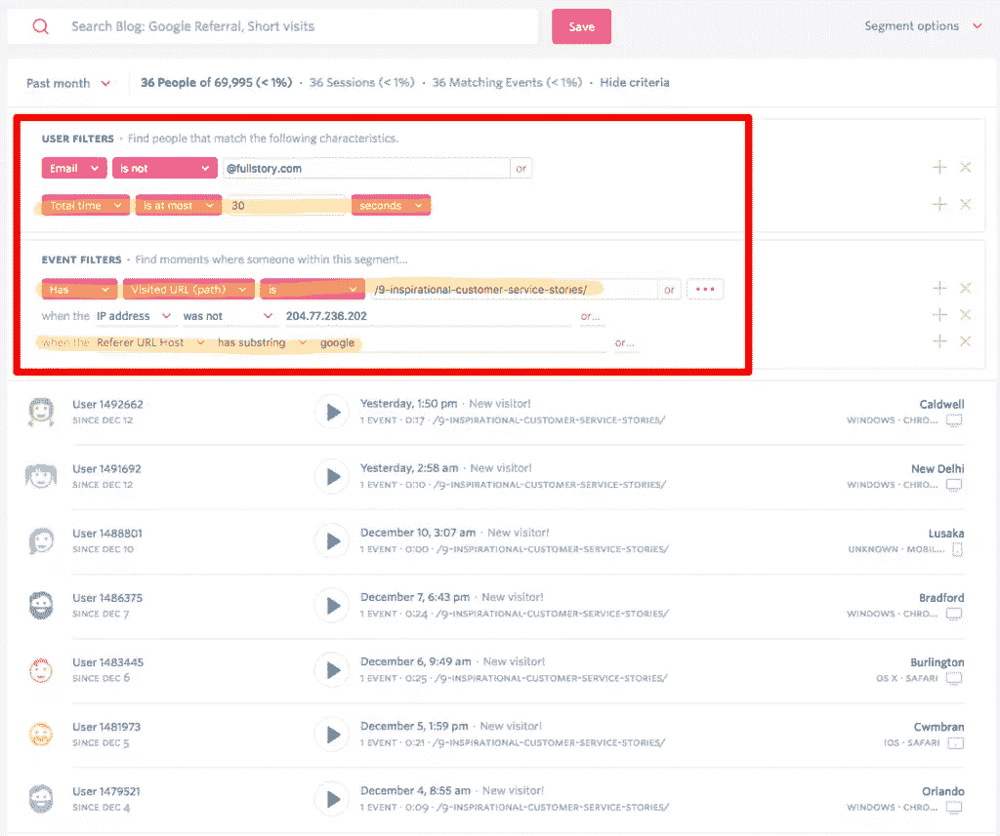
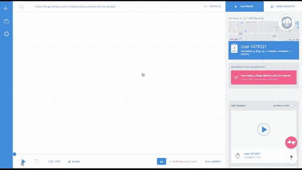
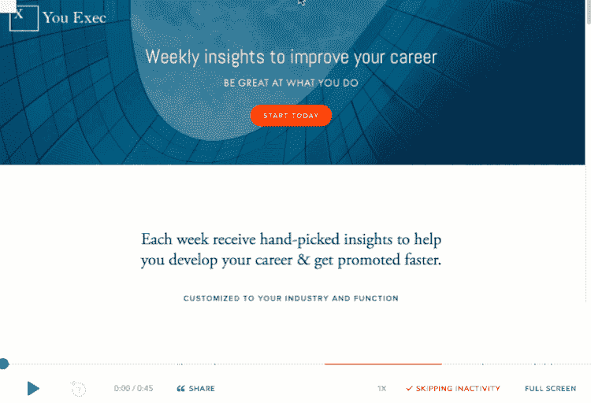

# 使用 FullStory 的会话回放工具优化跳出率

> 原文：<https://www.sitepoint.com/optimizing-bounce-rates-with-fullstorys-session-replay-tool/>

当谈到分析时,“洞察力”是事实上的首选词——这是有充分理由的。团队需要知道关于他们的产品、用户、网站性能(等等)的关键信息来做决定。

当谈到网络分析时，典型的见解是围绕点击和点击、页面访问、会话持续时间、跳出率、转换率和其他聚合数据点构建的指标。这些度量对于诊断与 UX 或其他相关的问题(或发现机会)是有用的，但是一旦确定，这通常是团队陷入困境的地方。

解决这种数据困境的方法是“放大”已识别的问题，看看发生了什么，了解更多，然后提出可行的解决方案。这种混合的定量-定性策略利用了[诊断和描述性分析](https://www.sitepoint.com/descriptive-analytics-vs-diagnostic-analytics)工具。但实际上它是如何工作的呢？又能发现什么样的洞见？

在这篇文章中，我们将重点关注跳出率，特别关注跳出率如何被用来识别*搜索引擎优化*、*应用副本优化*、*登陆页面优化*(包括识别虚假付费流量)，以及整体 UX 优化的机会。

跳出率是有意义的——但是是什么呢？

如果你想知道 qual-quant 策略在现实生活中是如何工作的，考虑一下网络分析中最常用的指标之一:跳出率。

回顾一下，退回被定义为“仅触发对分析服务器的单个请求的会话，例如当用户在您的网站上打开单个页面，然后在该会话期间退出，而没有触发对分析服务器的任何其他请求”。(来源:[谷歌分析](https://support.google.com/analytics/answer/1009409?hl=en)。)

跳出率很低，对吧？嗯，正如谷歌分析在其帮助页面上解释的那样，“视情况而定。”关于跳出率的事情是，虽然它们可能会指出一些问题，*或*标志着不同流量来源的相对表现，*或*次优 UX，它们几乎不会告诉你页面上实际上什么是有效的(或无效的)。

使用跳出率作为高性能或低性能网页的信号，然后使用像 [FullStory](https://www.fullstory.com) 这样的会话重放工具来分析这些页面，可以帮助提供优化页面所需的答案。

它是这样工作的。

## 优化 UX 的跳出率和完整的故事

首先，[使用谷歌分析](https://www.sitepoint.com/finding-problem-areas-on-your-website-with-google-analytics)(或者你喜欢的分析平台)识别表现不佳的页面。然后，在 FullStory 中搜索这些页面上的会议记录，使用有问题的 URL 作为您的分段参数。然后，您可以根据其他标准(例如从特定 URL 引用的会话，或者持续时间不超过 60 秒的访问)进一步优化您的结果。

你也可以通过包含用户沮丧信号的会话来减少搜索。在 FullStory，我们称之为“愤怒点击”。"

你可以在 FullStory 中搜索所有包含 Rage 点击的会话。

一旦你有了一个需要观察的时段列表，留出一个小时来观察。在电子表格中记录任何令人惊讶的行为:

*   点击了什么——或者*没有点击*?
*   用户注意力似乎会下降到哪里？
*   这一页上有什么东西破了吗？
*   关键元素是否被掩盖了？

当你观察时，在电子表格中做笔记。一个小时后——或者一旦你达到收益递减点——回顾你的笔记，看看是否有趋势出现。过一会儿，这种定性分析将会带来一些立竿见影的改进*和*一些关于如何优化用户体验的想法。执行即时改进，并使用你的想法(和一个方便的 [A/B 测试工具](https://www.sitepoint.com/ab-testing-tools/))进行实验。

听起来很简单，对吧？但是这在所有情况下都有效吗？

## 用 FullStory 优化 SEO

谷歌搜索算法使用许多信号来评估内容与特定查询的相关性。其中一个问题是，用户在点击某个特定结果后，是否必须返回他们的谷歌搜索。例子:想象一下，你搜索“跳出率”，然后登陆一个谈论篮球的网站。不太相关；你点击返回，转到另一个谷歌搜索结果。谷歌看到了这一点，并将其纳入未来的搜索结果。

虽然不可能将特定的会话与特定的谷歌搜索相匹配，但你可以使用谷歌分析和 T2 的谷歌搜索控制台根据搜索位置、点击率和印象等来识别表现最佳的网页。

*   在 Google Analytics(或者任何你使用的定量分析工具)中记录你的前 5-10 页的跳出率。
*   创建一个跳出率高得多的网页列表。关注那些你想优化搜索的网页。

*在 Google Analytics 中，你可以调出 Google/organic referrals，添加目的页面的第二维度。你也可以根据跳出率进行优先排序。挑选跳出率低的页面，在 FullStory 中进一步调查。*

利用这个列表，在 FullStory 中搜索包含对这些非常受欢迎的页面的访问的会话。根据 Google 推荐的访问次数进一步过滤结果列表。通过将你的会话过滤为那些短的(比如 30 秒或更短)来获得更具体的内容。

在上面的 FullStory 中，我们创建了一个搜索会话，总时间为 30 秒，推荐源为 Google，登陆页面是我们想要优化的内容。观看这些会议，看看哪里可能会出错。

在您开始观看会话之前，请设身处地为您的用户着想。他们使用一组关键词来寻找答案。那些关键词可能是什么？这个搜索会如何影响你对这个页面的使用？

现在重放列表中的会话。观察用户是如何接受内容的。看看你能否根据他们停顿的地方或他们突出显示的内容来确定他们在寻找什么。最后，他们在弹跳之前做了什么？你的问题就在那一刻。

*看了很多次[这篇关于 FullStory](https://blog.fullstory.com/9-inspirational-customer-service-stories/) 的博客文章后，我们注意到许多用户在我们列表中的第一个故事后就离开了。我们会看看我们是否能更吸引人，让读者停留更久。*

一旦你对这些活跃的访问者的行为有了一个感觉，列出一个改变的清单来测试未来。你可能会意识到你的介绍太长了，或者有些图片让人分心。也许完全是其他的东西。如果你根据自己的观察做出了改变，记下你所做的改变，过一段时间后回到你的量化工具，看看你是否提高了跳出率和/或你在有机搜索中的出现率。

同样的概念也适用于提高 UX 的转换。

## 优化登陆页面的付费流量

如果你向你的网站发送付费流量，你可能会使用定量分析工具来看看这些访问表现如何。简单地看跳出率(和转换率)可能会告诉你什么时候一个活动失败了，但他们不能完全回答*为什么*(如果我们下次做得更好，我们需要从错误中学习)。

这是因为付费访问可能会因为各种原因表现不佳。假设你的广告面向正确的受众(一个重要的假设)，页面优化是高跳出率最有可能的罪魁祸首。从糟糕的登陆页面设计到隐藏的行动号召，或者[过长的页面文案](https://blog.fullstory.com/from-0-12-percent-optimizing-conversions-with-session-replay/)都可能伤害你的跳出率。

无论采取什么方法，基本策略都是一样的。

浏览 FullStory 中的会话，并创建一个包含您的登录页面付费访问的列表。细化列表，以包括较短的会议。重放会话，进行观察，然后带着一些直接的改进或要测试的东西离开。如果您使用 A/B 测试工具来试验解决方案，请基于您的回放见解来改进变化。

冲洗，重复！

除非，你的登陆页面的付费流量是不真实的。You Exec 使用 FullStory session replay 来分析来自谷歌和脸书的付费流量。你高管发现 90%的谷歌和脸书广告流量似乎是无用的(机器人？).他们能够通过比较真实用户的会话和来自机器人的可疑会话来发现差异:

*You Exec 的 GIF 录音截图。如果你看看真实版的[，你会看到它显示了自然的光标移动和类似人类的滚动行为(回放速度比实际速度快 3 倍)。](https://static1.squarespace.com/static/56f1d1777da24fd2594c0f51/t/587b07839f745611b9fb09cb/1484457912603/?format=1500w)[假版本](https://static1.squarespace.com/static/56f1d1777da24fd2594c0f51/t/587b0901b8a79b66d30029f9/1484458250880/?format=1500w)显示互动不存在，时间大多花在空转上。*

虽然诊断性网络分析工具可以暗示某个特定的流量来源有问题，但唯一确定的方法是使用更人性化的工具。为此，FullStory 的会话回放非常有效。

## 消除混淆文本和全文

我们将以跳出率案例研究结束，该案例研究说明了如果没有描述性分析工具提供的答案，神秘的跳出率几乎不可能确定原因。

Appcues，[一个入职和应用内消息工具](https://www.appcues.com/)，注意到他们的注册表格跳出率上升。通过在 FullStory 中重放会话进行仔细观察，他们注意到用户在点击提交按钮时会感到困惑。点击按钮后，内容从*创造你的第一次体验*变为*预热我们的引擎*。

通过观察会话，Appcues 推断，预热引擎的副本*让用户感到困惑。他们不明白这是什么意思。变化很简单。Appcues 把点击后的文字改成了*谢谢！你将在一秒钟内被重定向*，并很快看到激活率的增加。如此愚蠢的错误，却是如此简单的解决方案。*

## 少弹跳，多玩耍！

像谷歌分析这样的定量分析工具对于[识别问题和机会](https://www.sitepoint.com/finding-problem-areas-on-your-website-with-google-analytics)非常有用。但这些高层次的见解只是开始:你需要一个定性的分析工具来深入挖掘。

[FullStory](https://www.fullstory.com) 就是那种工具。搜索并重放推动高跳出率的实际的个人用户会话。进行观察，假设解决方案，并基于真实的观察改进你的站点！

## 分享这篇文章