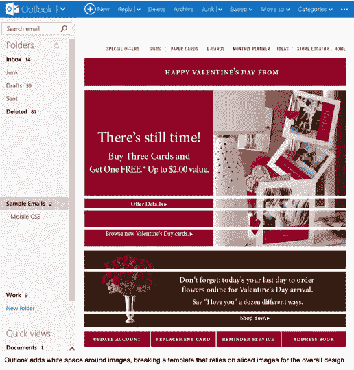
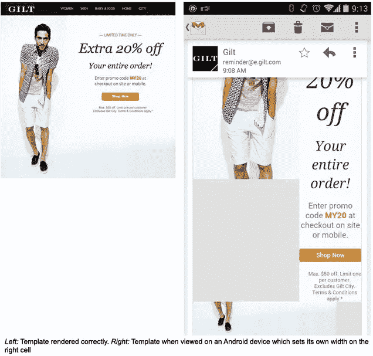
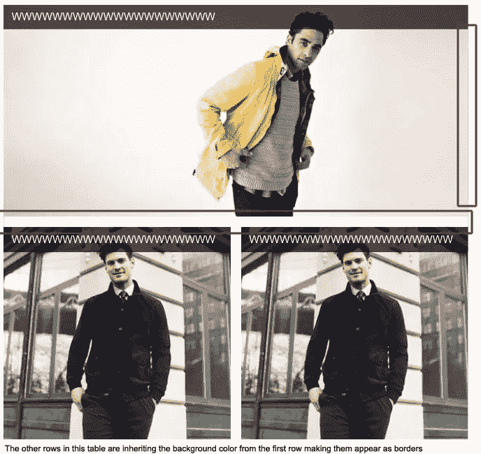

# 在收件箱中表现良好

> 原文：<https://www.sitepoint.com/optimizing-for-the-inbox/>

[](https://www.flickr.com/photos/nieve44/2369734521/)

照片:雪 44/光

编写电子邮件可能是一件棘手的事情。一旦你把基本规则记下来，就一帆风顺了——直到你遇到一些错误。

众所周知，在 web 开发中，bug 是正常的——但是电子邮件引入了一些额外的复杂性。

你的收件人不仅会使用不同的浏览器，而且你还必须与各种电子邮件提供商、设备和应用程序竞争——所有这些都会以无数种方式呈现你的电子邮件代码(你一直努力从设计转换到收件箱)。

最好熟悉你的用户将用来查看你的信息的每一个画布(以及它们的许多怪癖),并在收件箱中表现良好。下面是我这些年来遇到的一些最常见的错误，以及解决它们的方法。

## Gmail、雅虎和 iOS 变得忧郁

还记得网页主要由黑色文本和白色背景组成，偶尔会有蓝色文本下划线的时候吗？读者抓住了蓝色代表“超链接”的事实，并学会了点击哪里。

大多数网页设计师不再像 1999 年那样狂欢了，他们会用一个十六进制值来替代默认的蓝色，来赞美他们的个人设计和调色板。

不幸的是，在雅虎和 Gmail 中查看的电子邮件对放弃蓝色链接的偏好有点固执。简单地在`<a>`标签中定义一个新的十六进制值作为样式在这些平台上是行不通的。最简单的解决方案是添加一个额外的`<span>`标签，嵌套在`<a>`标签中，第二次定义十六进制值。

```
<a href="http://www.gilt.com/" target="_blank" style="color:#c98702;">
  <span style="color:#c98702">
    Act Now
  </span>
</a>
```

**Gmail 看世界不是黑白分明的。**当使用十六进制值#FFFFFF 或#000000，或者将链接颜色定义为“黑色”或“白色”时，无论您以多少种方式定义这些值，Gmail 仍将默认为蓝色——在`<a>`标签中，在附加的`<span>`标签中，等等。

为了覆盖纯黑色或白色文本中的蓝色链接，我将文本颜色替换为一个十六进制值，与标准的黑色和白色相差一个字符，即#FFFFF1 或#000001，并在`<a>`标记和附加的`<span>`标记中定义它。这种差别非常细微，人眼可以分辨出是黑色还是白色，Gmail 会尊重你的颜色选择。

同样，即使你没有添加`<a>`标签，iOS 也会自动将电话号码、地址和日期变成蓝色超链接。

**它为什么会这样？**可能是因为它假设你会想要调用、映射或添加这些文本块到你的日历中。为了避免不想要的/令人惊讶的链接，再次用`<span>`包裹任何电话号码、地址和其他“易受攻击”的内容，并手动将其设置为您选择的颜色。

iOS 支持 topline CSS 和媒体查询，因此如果您的电子邮件中有很多地址、电话号码或日期，您可以定义一次颜色，然后在整个代码中添加该类。


## Outlook 和 Gmail ❤空白

图像地图在电子邮件客户端中没有得到广泛支持，所以一个[最佳实践](https://www.sitepoint.com/rules-best-practice-email-design-coding-practices/)是将图像切片。请注意，Outlook 和 Gmail 都在图像周围添加了空白，这产生了类似缝隙的效果，每当图像需要紧密堆叠或刷新时，都会导致一些恶化。

令人欣慰的是，给每张图片添加一个`display:block`样式可以消除多余的空白。



```

```

## Android 上的 Gmail 应用程序带来了自己的宽度

在 Gmail 应用程序上查看电子邮件时，Android 会不时地为表格中的单元格设置自己的宽度。我在有两列或更多列的嵌套表格中注意到了这一点——一列得到了所有的爱和更大的宽度，而另一列被留在一个狭窄的单元格中。

这里有一个解决方法:

*   如果单元格包含等宽的图像，则为单元格添加最小宽度值。
*   如果单元格不包含构成全部预期宽度的元素，则添加一个透明 GIF 作为单元格中的第一行代码，并将 image 标签中的宽度设置为所需的单元格宽度(是的，像 1999 年一样编码)。除了将 min-width 值附加到单元格之外，还应该强制单元格扩展以包含图像，并确保单元格以正确的宽度呈现。



```
<table width="650" align="center" border="0" cellpadding="0" cellspacing="0" style="background-color:#f7fcff">
  <tr> 
    <td width="240" valign="top" style="background-color:#E4E3DD; min-width:240px;">
      <a href="http://www.gilt.com/?%%=v(@tracking_parameters)=%%CRM20_M" target="_blank" alias="BODY - Main Image"></a>
    </td> 
    <td width="410" valign="top" style="background-color:#f7fcff; min-width:410px;">
      
    </td>
...
```

## iOS 创建自己的边界

我注意到，每当背景颜色或图像应用于表格中的行时，就会出现这种错误。iOS 继承了背景颜色，在表格外部显示为边框，然后在您放大以近距离查看时消失。

**我的解决方法:**添加一个额外的包装表格，其中定义了父背景颜色，并嵌套表格和包含以前显示的背景颜色的单元格，以确保整个表格获得指定给它的预期颜色。



```
<table width="645" align="center" border="0" cellpadding="0" cellspacing="0" style="background-color:#ffffff;">
  <tr>
    <td width="645" style="background-color:#FFFFFF; padding-top:15px;">
      <table width="645" align="center" border="0" cellpadding="0" cellspacing="0" style="background-color:#454441;">
        <tr> 
          <td width="645" style="padding-left:11px; background image:url(http://cdn.gilt.com/emaimg/1326817406_hero_overlay.jpg); background-repeat:no-repeat; background-color:#454441;"> 
          </td>
        </tr>
      </table>
    </td>
  </tr>
  <tr>
    <td width="645" valign="top" style="padding-bottom:15px;background-color:#ffffff;">
      <a href="#" target="_blank" alias="Image - Top Picks Hero">
        
      </a>
    </td>
  </tr>
</table>
```

希望这些建议的 bug 修复能让你不至于一头撞墙。请放心，随着电子邮件客户端和应用程序的不断发展，会有更多的漏洞出现。

请记住，测试、测试、测试总是很重要的——在你最喜欢的设备上，在多个电子邮件客户端上，在像 [ReturnPath](http://www.returnpath.com/) 和 [Litmus](https://litmus.com/) 这样的渲染工具上。还要记住，分享你自己的解决方案没有坏处——当轮到你的同事发现最新的漏洞时，他们会感谢你的。

## 分享这篇文章