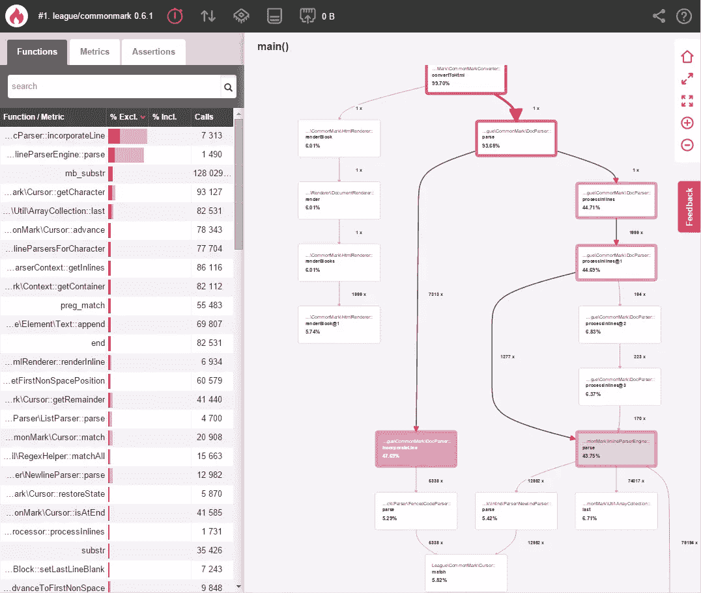
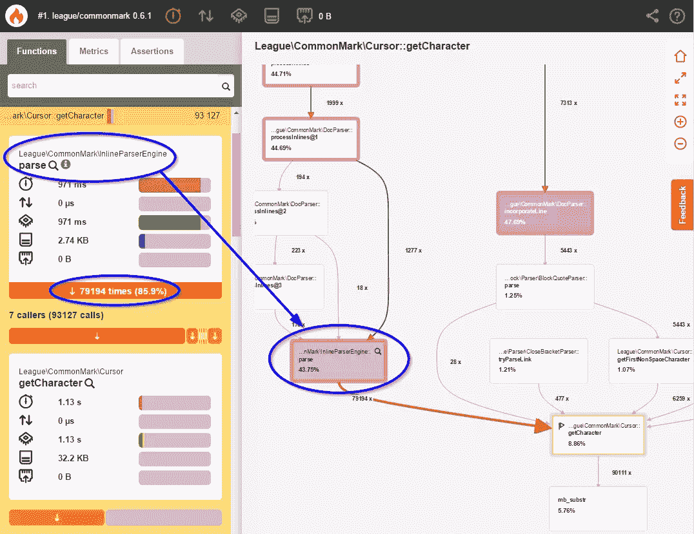
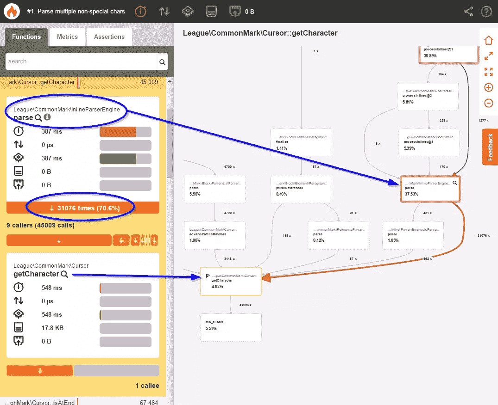
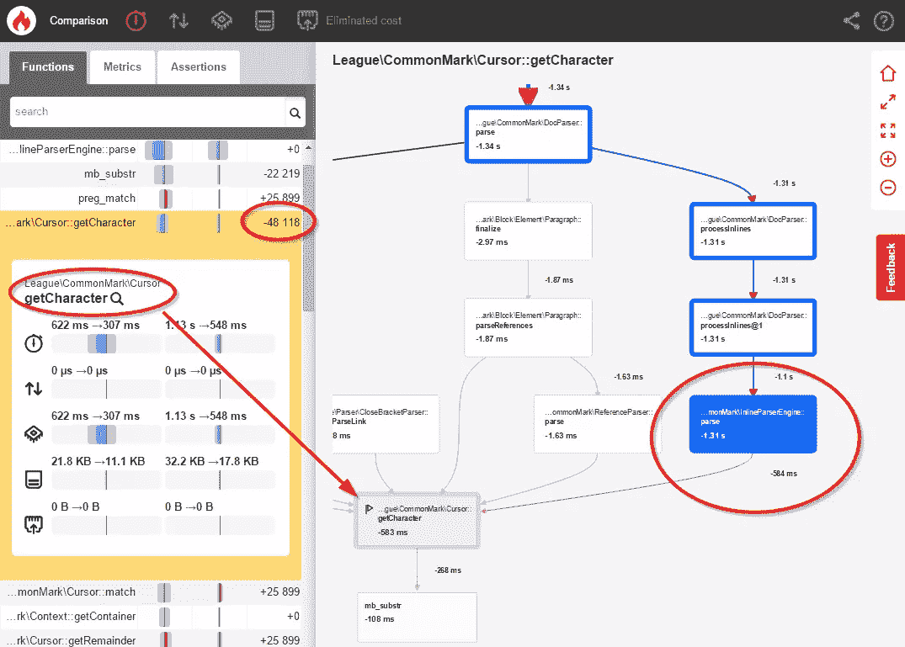
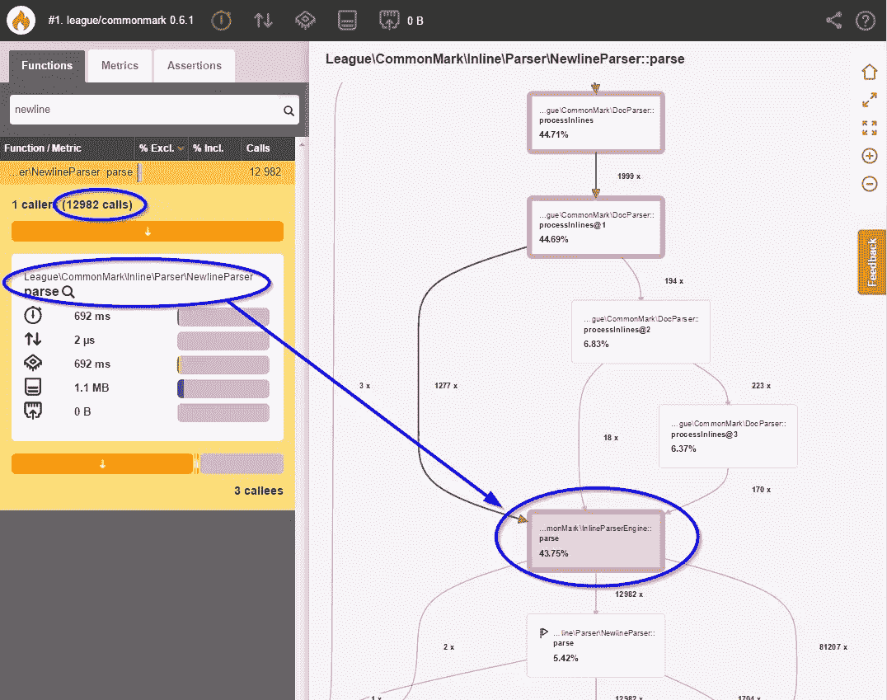
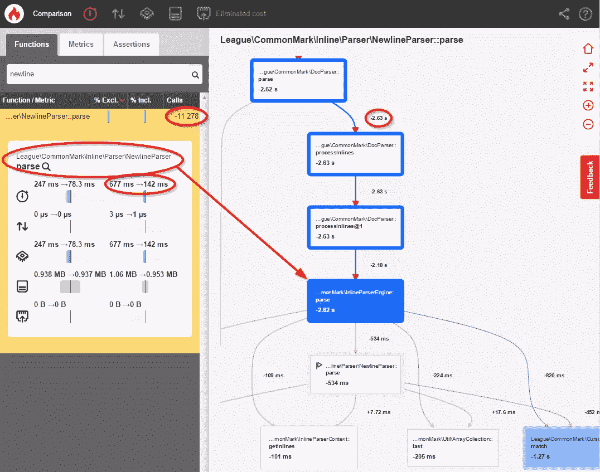

# 案例研究:用 Blackfire.io 优化 CommonMark Markdown 解析器

> 原文：<https://www.sitepoint.com/optimizing-league-commonmark-blackfire-io/>

**你可能知道，我是 [PHP 联盟](http://thephpleague.com/)的 [CommonMark Markdown 解析器](http://commonmark.thephpleague.com/)的作者和维护者。这个项目有三个主要目标:**

1.  完全支持整个[通用标记规范](http://spec.commonmark.org/)
2.  匹配行为[的 JS 引用实现](https://github.com/jgm/CommonMark/tree/master/js)
3.  要写得很好，具有超级可扩展性，以便其他人可以添加他们自己的功能。

最后一个目标可能是最具挑战性的，尤其是从性能的角度来看。其他流行的 Markdown 解析器是使用带有大量 regex 函数的单个类构建的。正如您在该基准测试中看到的，它让他们的速度快如闪电:

| 图书馆 | 平均值。解析时间 | 文件/类计数 |
| --- | --- | --- |
| [parse down1 . 6 . 0](http://parsedown.org/) | 2 毫秒 | one |
| [PHP Markdown1 . 5 . 0](https://michelf.ca/projects/php-markdown/) | 4 毫秒 | four |
| [PHP Markdown Extra1 . 5 . 0](https://michelf.ca/projects/php-markdown/extra/) | 7 毫秒 | six |
| [普通标志0 . 12 . 0](http://commonmark.thephpleague.com/) | 46 毫秒 | One hundred and seventeen |

不幸的是，由于紧密耦合的设计和整体架构，很难(如果不是不可能的话)用定制逻辑来扩展这些解析器。

对于联盟的 CommonMark 解析器，我们选择将可扩展性置于性能之上。这导致了一个解耦的面向对象的设计，用户可以很容易地定制这个设计。这使得其他人能够构建他们自己的[集成](https://github.com/thephpleague/commonmark#integrations)、[扩展](https://github.com/thephpleague/commonmark#community-extensions)和[其他定制项目](https://packagist.org/packages/league/commonmark/dependents)。

该库的性能仍然不错——最终用户可能无法区分 42 毫秒和 2 毫秒(无论如何，您应该缓存您的渲染降价)。尽管如此，我们仍然希望在不影响我们主要目标的情况下，尽可能地优化我们的解析器。这篇博客文章解释了我们如何使用 [Blackfire](https://blackfire.io/) 做到这一点。

## 逆火剖析

Blackfire 是来自[感官实验室](https://sensiolabs.com/)的一个神奇的工具。您只需将它附加到任何 web 或 CLI 请求上，就可以获得应用程序请求的令人惊叹的、易于理解的性能跟踪。在这篇文章中，我们将研究如何使用 Blackfire 来识别和优化在 league/commonmark 库的 0.6.1 版本中发现的两个性能问题。

让我们从分析 league/commonmark 解析 commonmark 规范文档的内容所需的时间开始:



稍后，我们会将该基准与我们的更改进行比较，以衡量性能改进。

**快速补充:注意:** Blackfire 在分析时会增加开销，所以执行时间会比平时长很多。关注相对百分比变化，而不是绝对的“挂钟”时间。

### 优化 1

查看我们的初始基准，您可以很容易地看到，使用`InlineParserEngine::parse()`的内联解析占据了执行时间的 43.75%。单击此方法会显示有关发生这种情况的原因的更多信息:



这里我们看到`InlineParserEngine::parse()`调用了`Cursor::getCharacter()` 79，194 次——对降价文本中的每个字符调用一次。以下是 0.6.1 中该方法的部分摘录(略有修改):

```
public function parse(ContextInterface $context, Cursor $cursor)
{
    // Iterate through every single character in the current line
    while (($character = $cursor->getCharacter()) !== null) {
        // Check to see whether this character is a special Markdown character
        // If so, let it try to parse this part of the string
        foreach ($matchingParsers as $parser) {
            if ($res = $parser->parse($context, $inlineParserContext)) {
                continue 2;
            }
        }

        // If no parser could handle this character, then it must be a plain text character
        // Add this character to the current line of text
        $lastInline->append($character);
    }
} 
```

Blackfire 告诉我们,`parse()`每年花超过 17%的时间检查**。单身。性格。一个。在。时间**。但是这 79，194 个字符中的大多数都是不需要特殊处理的纯文本！我们来优化一下。

让我们使用正则表达式来捕获尽可能多的非特殊字符，而不是在循环末尾添加一个字符:

```
public function parse(ContextInterface $context, Cursor $cursor)
{
    // Iterate through every single character in the current line
    while (($character = $cursor->getCharacter()) !== null) {
        // Check to see whether this character is a special Markdown character
        // If so, let it try to parse this part of the string
        foreach ($matchingParsers as $parser) {
            if ($res = $parser->parse($context, $inlineParserContext)) {
                continue 2;
            }
        }

        // If no parser could handle this character, then it must be a plain text character
        // NEW: Attempt to match multiple non-special characters at once.
        //      We use a dynamically-created regex which matches text from
        //      the current position until it hits a special character.
        $text = $cursor->match($this->environment->getInlineParserCharacterRegex());

        // Add the matching text to the current line of text
        $lastInline->append($character);
    }
} 
```

完成这一更改后，我使用 Blackfire 重新分析了这个库:



好吧，事情看起来有点好转了。但是，让我们使用 Blackfire 的比较工具来实际比较这两个基准，以便更清楚地了解发生了什么变化:



**这个变化导致对那个`Cursor::getCharacter()`方法的调用**减少了 48，118 次，整体性能提升了**11%**！这当然很有帮助，但是我们可以进一步优化内联解析。

### 优化 2

根据[普通标记规格](http://spec.commonmark.org/0.22/#hard-line-breaks):

> 前面有两个或更多空格的换行符被解析为硬换行符(在 HTML 中呈现为
> 标签)

因为这种语言，我最初让`NewlineParser`停下来调查它遇到的每一个空格和`\n`字符。下面是原始代码的一个例子:

```
class NewlineParser extends AbstractInlineParser {
    public function getCharacters() {
        return array("\n", " ");
    }

    public function parse(ContextInterface $context, InlineParserContext $inlineContext) {
        if ($m = $inlineContext->getCursor()->match('/^ *\n/')) {
            if (strlen($m) > 2) {
                $inlineContext->getInlines()->add(new Newline(Newline::HARDBREAK));
                return true;
            } elseif (strlen($m) > 0) {
                $inlineContext->getInlines()->add(new Newline(Newline::SOFTBREAK));
                return true;
            }
        }
        return false;
    }
} 
```

这些空间大多数都不特殊，因此在每个地方停下来用正则表达式检查它们是很浪费的。您可以在原始 Blackfire 配置文件中轻松看到性能影响:



我震惊地看到**整个解析过程的 43.75%**在计算**12982 个空格和换行符**是否应该转换成`<br>`元素。这是完全不可接受的，所以我开始优化它。

请记住，规范规定序列必须以换行符(`\n`)结束。因此，不要停留在每个空格字符上，让我们只停留在换行符上，看看前面的字符是否是空格:

```
class NewlineParser extends AbstractInlineParser {
    public function getCharacters() {
        return array("\n");
    }

    public function parse(ContextInterface $context, InlineParserContext $inlineContext) {
        $inlineContext->getCursor()->advance();

        // Check previous text for trailing spaces
        $spaces = 0;
        $lastInline = $inlineContext->getInlines()->last();
        if ($lastInline && $lastInline instanceof Text) {
            // Count the number of spaces by using some `trim` logic
            $trimmed = rtrim($lastInline->getContent(), ' ');
            $spaces = strlen($lastInline->getContent()) - strlen($trimmed);
        }

        if ($spaces >= 2 ) {
            $inlineContext->getInlines()->add(new Newline(Newline::HARDBREAK));
        } else {
            $inlineContext->getInlines()->add(new Newline(Newline::SOFTBREAK));
        }
        return true;
    }
} 
```

修改完成后，我重新分析了应用程序，看到了以下结果:



*   `NewlineParser::parse()`现在只被调用了 1，704 次，而不是 12，982 次(减少了 87%)
*   一般内联解析时间减少了 61%
*   **整体解析速度提升 23%**

## 摘要

两种优化都实现后，我重新运行了 league/commonmark 基准测试工具，以确定实际性能影响:

Before:

59ms

After:

28ms

通过对**做两个简单的改动**，性能提升了**52.5%**！

能够看到性能成本(执行时间和函数调用数量)对于识别这些性能猪至关重要。如果没有这些性能数据，我很怀疑这些问题会被注意到。

概要分析对于确保您的代码快速高效地运行是绝对重要的。如果你还没有一个分析工具，那么我强烈建议你去看看。我个人最喜欢的是 Blackfire(免费增值)，但是也有其他的分析工具。它们的工作方式都略有不同，所以四处看看，找到最适合你和你的团队的方式。

* * *

这篇文章未经编辑的版本最初发表在科林的博客上。经作者许可，此处再版。

## 分享这篇文章