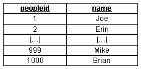
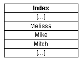
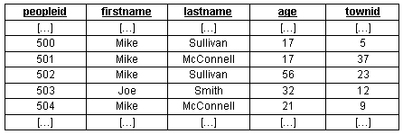

# 优化您的 MySQL 应用

> 原文：<https://www.sitepoint.com/optimizing-mysql-application/>

**你已经读完了凯文·杨克的文章[使用 PHP 和 MySQL 建立一个数据库驱动的网站](http://www.webmasterbase.com/article.php/228)，当它开始变慢的时候，你正高兴地对你的网站进行数据库化。你需要在你的主机威胁要把你踢出去之前让你的网站重新运转起来，因为你差点杀了他们的服务器。你是怎么做到的？输入:MySQL 的内部涡轮增压器，索引。**

**免责声明**

我试图让我的查询尽可能简单，但是我假设您对数据库和 SQL 语言有基本的了解(更具体地说，是 MySQL 的实现)。我还假设您已经安装了 MySQL 3.23，因为其中一些查询可能无法在 3.22 上运行。如果你还没有 MySQL 3.23，如果可能的话，我强烈建议你安装它，因为一些性能提升是显著的。

##### 什么是索引？

索引是表中特定列的有组织版本。MySQL 使用索引来促进记录的快速检索。有了索引，MySQL 可以直接跳转到你想要的记录。如果没有任何索引，MySQL 必须读取整个数据文件才能找到正确的记录。这里有一个例子。

假设我们创建了一个名为“people”的表:

```
CREATE TABLE people ( 

  peopleid SMALLINT NOT NULL, 

  name CHAR(50) NOT NULL 

);
```

然后，我们将 1000 个不同的名字以完全随机的非字母顺序插入到表格中。数据文件的一小部分可以这样表示:



正如您所看到的，无论如何,“name”列都没有可识别的顺序。如果我们在“名称”列上创建一个索引，MySQL 会自动按字母顺序排列该索引:



对于索引中的每个条目，MySQL 还在内部维护一个指向实际数据文件中正确行的“指针”。所以如果我想获得姓名为 Mike ( `SELECT peopleid FROM people WHERE name='Mike';`)时 peopleid 的值，MySQL 可以在姓名索引中查找 Mike，直接跳转到数据文件中正确的行，返回 peopleid 的正确值(999)。MySQL 只需要查看一行就可以得到结果。如果没有“name”上的索引，MySQL 将会扫描数据文件中的所有 1000 行！一般来说，MySQL 需要评估的行数越少，它完成工作的速度就越快。

##### 索引的类型

MySQL 中有几种类型的索引可供选择:

[注意:完整的查询列表和示例可以在本文末尾找到。]

1.  **"Normal" Indexes** – "Normal" indexes are the most basic indexes, and have no restraints such as uniqueness. These can be added by creating an index (`CREATE INDEX name_of_index ON tablename (columns_to_index);`), altering the table (`ALTER TABLE tablename ADD INDEX [name_of_index] (columns_to_index);`), or when creating the table (`CREATE TABLE tablename ( [...], INDEX [name_of_index] (columns_to_index) );`).
2.  **Unique Indexes** – Unique indexes are the same as "Normal" indexes with one difference: all values of the indexed column(s) must only occur once. These can be added by creating an index (`CREATE UNIQUE INDEX name_of_index ON tablename (columns_to_index);`), altering the table (`ALTER TABLE tablename ADD UNIQUE [name_of_index] (columns_to_index);`) or when creating the table (`CREATE TABLE tablename ( [...], UNIQUE [name_of_index] (columns_to_index) );`).
3.  **Primary keys** – Primary keys are unique indexes that must be named `"PRIMARY"`. If you have used `AUTO_INCREMENT` columns, you’re probably familiar with these. These indexes are almost always added when creating the table (`CREATE TABLE tablename ( [...], PRIMARY KEY (columns_to_index) );`), but may also be added by altering the table (`ALTER TABLE tablename ADD PRIMARY KEY (columns_to_index);`). Note that you may only have one primary key per table.
4.  **全文索引**-MySQL 在全文搜索中使用全文索引。因为全文搜索太新了，会给本文增加不必要的复杂性，所以我不会在这里解释它。如果你想了解更多信息，请访问 [MySQL 文档](http://www.mysql.com/doc/F/u/Fulltext_Search.html)。

##### 单列索引与多列索引

您可能已经注意到，在上面的`CREATE INDEX, ALTER TABLE`和`CREATE TABLE`查询中，我引用了列(复数)。同样，这可以通过一个例子得到最好的解释。

下面是一个更复杂版本的人员表:

```
CREATE TABLE people (  

  peopleid SMALLINT NOT NULL AUTO_INCREMENT,  

  firstname CHAR(50) NOT NULL,  

  lastname CHAR(50) NOT NULL,  

  age SMALLINT NOT NULL,  

  townid SMALLINT NOT NULL,  

  PRIMARY KEY (peopleid)  

);
```

(注意，因为“peopleid”是一个`AUTO_INCREMENT`字段，所以它的*必须被*声明为主键)

我们插入的一小段数据可能如下所示(暂时忽略 townid):



从这个片段中，我们有四个麦克(两个苏利文，两个麦康奈尔)，两个 17 岁的年轻人，和一个不相关的古怪球(乔·史密斯)。

这个表的用途是获取具有特定名字、姓氏和年龄的用户的 peopleid。例如，我想找到 17 岁的 Mike Sullivan 的 people id(`SELECT peopleid FROM people WHERE firstname='Mike' AND lastname='Sullivan' AND age=17;`)。因为我不想让 MySQL 进行全表扫描，所以我需要研究一些索引。

我的第一个选择是在单个列、名字、姓氏或年龄上创建索引。如果我将索引放在 firstname ( `ALTER TABLE people ADD INDEX firstname (firstname);`)上，MySQL 将使用该索引来限制 firstname='Mike '的记录。使用这个“临时结果集”，MySQL 将单独应用每个附加条件。首先它排除了那些不姓 Sullivan 的人。然后它排除了那些不到 17 岁的人。MySQL 现在已经应用了所有条件，并且可以返回结果。

这比强迫 MySQL 进行全表扫描更有效，但是我们仍然强迫 MySQL 扫描比它需要的多得多的行。我们可以删除名的索引，添加姓或年龄的索引，但是结果会非常相似。

这就是多列索引发挥作用的地方。如果我们在三列上添加一个索引，我们可以在一次操作中获得正确的集合！下面是我用来添加这个索引的代码:

```
ALTER TABLE people ADD INDEX fname_lname_age (firstname,lastname,age);
```

由于索引文件是有组织的，MySQL 可以直接跳转到正确的名字，然后移动到正确的姓氏，最后直接到正确的年龄。MySQL 已经找到了正确的行，而不必扫描数据文件的任何一行！

现在，您可能想知道在(firstname)、(lastname)和(age)上创建三个单列索引是否与在(firstname，lastname，age)上创建一个多列索引相同。不:完全不一样。运行查询时，MySQL 只能使用一个索引。如果您有三个单列索引，MySQL 将尝试选择限制性最强的一个，但是限制性最强的单列索引将比我们在(firstname，lastname，age)上的多列索引的限制性小得多。

##### 最左边前缀

多列索引通过最左侧前缀提供了额外的好处。继续我们之前的例子，我们有一个关于(名字，姓氏，年龄)的三列索引，我将其昵称为“fname_lname_age”(我将在后面详细解释)。搜索下列列组合时将使用该索引:

*   名字，姓氏，年龄
*   名字，姓氏
*   西方人名的第一个字

换句话说，我们基本上在(名字，姓氏，年龄)，(名字，姓氏)和 just(名字)上创建了索引。下列查询可以使用该索引:

```
SELECT peopleid FROM people WHERE firstname='Mike'   

   AND lastname='Sullivan' AND age='17';  

SELECT peopleid FROM people WHERE firstname='Mike'  

   AND lastname='Sullivan';  

SELECT peopleid FROM people WHERE firstname='Mike';
```

以下查询根本无法使用索引:

```
SELECT peopleid FROM people WHERE lastname='Sullivan';  

SELECT peopleid FROM people WHERE age='17';  

SELECT peopleid FROM people WHERE lastname='Sullivan'  

   AND age='17';
```

##### 如何选择要索引的列

优化中最重要的步骤之一是选择要索引的列。有两个主要的地方需要考虑索引:在`WHERE`子句中引用的列和在 join 子句中使用的列。请看下面的查询:

```
SELECT   

      age          ## no use indexing   

FROM   

      people   

WHERE   

      firstname='Mike'         ## consider indexing   

     AND   

      lastname='Sullivan'       ## consider indexing
```

这个查询与过去的有些不同，但是仍然非常简单。由于在`SELECT`部分引用了“age ”, MySQL 不会用它来限制选择的行。因此，没有必要对其进行索引。这里有一个更复杂的例子:

```
SELECT   

      people.age,         ## no use indexing   

      town.name         ## no use indexing   

FROM   

      people   

LEFT JOIN   

      town   

    ON   

      people.townid=town.townid      ## consider indexing   

            ##       town.townid   

WHERE   

      firstname='Mike'         ## consider indexing   

     AND   

      lastname='Sullivan'       ## consider indexing
```

索引 firstname 和 lastname 的可能性仍然存在，因为它们再次位于`WHERE`子句中。您需要考虑索引的另一个字段是 town 表中的 townid 字段(请注意，我只是将 town 表作为一个连接示例)，因为它位于一个连接子句中。

"所以我简单地考虑索引`WHERE`子句或 join 子句中的每个字段？"差不多，但不完全是。接下来，您需要考虑在字段上进行比较的类型。MySQL 只会对'<'、'< = '、' = '、'>'、'> = '、【T1]和一些`LIKE`操作使用索引。这些特定的`LIKE`操作是第一个字符不是通配符(%或 _)的时候。`SELECT peopleid FROM people WHERE firstname LIKE 'Mich%';`会使用指数，但`SELECT peopleid FROM people WHERE firstname LIKE '%ike';`不会。

##### 分析索引效率

您对使用哪些索引有一些想法，但是您不确定哪一个是最有效的。嗯，你很幸运，因为 MySQL 有一个内置的 SQL 语句来做这件事，称为`EXPLAIN`。一般的语法是`EXPLAIN select statement;`。你可以在 [MySQL 文档](http://www.mysql.com/doc/E/X/EXPLAIN.html)中找到更多信息。这里有一个例子:

```
EXPLAIN SELECT peopleid FROM people WHERE firstname='Mike'    

   AND lastname='Sullivan' AND age='17';
```

这将返回一个有点神秘的结果，看起来通常如下所示:

[注意:为便于阅读，表格分为两行]
`+--------+------+-----------------+-----------------+  
| table  | type | possible_keys   | key             |  
+--------+------+-----------------+-----------------+  ...  
| people | ref  | fname_lname_age | fname_lname_age |  
+--------+------+-----------------+-----------------+  

   +---------+-------------------+------+------------+  
   | key_len | ref               | rows | Extra      |  
... +---------+-------------------+------+------------+  
   | 102     | const,const,const | 1    | Where used |  
   +---------+-------------------+------+------------+` 

让我们一列一列地分解它。

*   **表格**–这是表格的名称。当您有大型连接时，这将变得很重要，因为每个表都有一行。
*   **type** – The type of the join. Here’s what the MySQL documentation has to say about the `ref` type:
    <q>All rows with matching index values will be read from this table for each combination of rows from the previous tables. ref is used if the join uses only a leftmost prefix of the key, or if the key is not `UNIQUE` or a `PRIMARY KEY` (in other words, if the join cannot select a single row based on the key value). If the key that is used matches only a few rows, this join type is good.</q>

    在这种情况下，由于我们的索引不是`UNIQUE`，这是我们能得到的最好的连接类型。

    总之，如果连接类型被列为“ALL ”,并且您没有试图选择表中的大多数行，那么 MySQL 正在进行全表扫描，这通常是非常糟糕的。您可以通过添加更多索引来解决这个问题。如果您想了解更多信息，MySQL 手册会更深入地介绍这个值。

*   **possible _ keys**–可能使用的索引的名称。这就是给你的索引起名字有帮助的地方。如果将“名称”字段留空，则该名称默认为索引中第一列的名称(在本例中为“名字”)，这不是很好的描述。
*   **键**–显示 MySQL 实际使用的索引的名称。如果这是空的(或`NULL`)，那么 MySQL 没有使用索引。
*   **key _ len**–正在使用的索引部分的长度，以字节为单位。在本例中，它是 102，因为名字占 50 个字节，姓氏占 50 个字节，年龄占 2 个字节。如果 MySQL 只使用索引的名字部分，那么这个值就是 50。
*   **ref**–显示 MySQL 将用来选择行的列名(或单词“const”)。这里，MySQL 引用三个常量来查找行。
*   **rows**–MySQL 认为在知道自己拥有正确的行数之前必须经历的行数。显然，一个是你能得到的最好的。
*   **Extra**–这里有许多不同的选项，其中大多数都会对查询产生不利影响。在这种情况下，MySQL 只是提醒我们它使用了`WHERE`子句来限制结果。

##### 索引的缺点

到目前为止，我只讨论了为什么索引很棒。然而，它们也有一些缺点。

首先，它们**占用了磁盘空间**。通常这并不重要，但是如果您决定以每种可能的组合索引每一列，那么您的索引文件将比数据文件增长得更快。如果您有一个大表，索引文件可能会达到操作系统的最大文件大小。

第二，他们**减缓编写查询**的速度，比如`DELETE, UPDATE,`和`INSERT`。这是因为 MySQL 不仅必须写入数据文件，还必须将所有内容写入索引文件。但是，您可能能够以这样一种方式编写您的查询，性能下降不是很明显。

##### 结论

索引是提高大型数据库速度的关键之一。无论您的表有多简单，500，000 行的表扫描都不会很快。如果您的站点有一个 500，000 行的表，您应该花时间分析可能的索引，并考虑重写查询以优化您的应用程序。

和往常一样，索引的内容比我在本文中介绍的要多。更多信息可以在官方的 MySQL 手册中找到，或者在保罗·杜波依斯的伟大著作《T2》中找到。

##### 查询参考

**通过`CREATE INDEX:`**
`CREATE INDEX [index_name] ON tablename (index_columns);`添加一个“正常”指标示例:`CREATE INDEX fname_lname_age ON people (firstname,lastname,age);`

**通过`CREATE INDEX:`**
`CREATE UNIQUE INDEX [index_name] ON tablename (index_columns);`添加唯一指标示例:`CREATE UNIQUE INDEX fname_lname_age ON people (firstname,lastname,age);`

**通过`ALTER TABLE:`**
`ALTER TABLE tablename ADD INDEX [index_name] (index_columns);`添加一个“正常”指标示例:`ALTER TABLE people ADD INDEX fname_lname_age (firstname,lastname,age);`

**通过`ALTER TABLE:`**
`ALTER TABLE tablename ADD UNIQUE [index_name] (index_columns);`添加唯一指标示例:`ALTER TABLE people ADD UNIQUE fname_lname_age (firstname,lastname,age);`

**通过`ALTER TABLE:`**
`ALTER TABLE tablename ADD PRIMARY KEY (index_columns);`添加主键示例:`ALTER TABLE people ADD PRIMARY KEY (peopleid);`

**通过`CREATE TABLE:`**
`CREATE TABLE tablename (    
 rest of columns,    
 INDEX [index_name] (index_columns)    
 [other indexes]    
);`添加一个“正常”指标示例:
`CREATE TABLE people (    
 peopleid SMALLINT UNSIGNED NOT NULL,    
 firstname CHAR(50) NOT NULL,    
 lastname CHAR(50) NOT NULL,    
 age SMALLINT NOT NULL,    
 townid SMALLINT NOT NULL,    
 INDEX fname_lname_age (firstname,lastname,age)    
);`

**通过`CREATE TABLE:`**
`CREATE TABLE tablename (    
 rest of columns,    
 UNIQUE [index_name] (index_columns)    
 [other indexes]    
);`添加唯一指标示例:
`CREATE TABLE people (    
 peopleid SMALLINT UNSIGNED NOT NULL,    
 firstname CHAR(50) NOT NULL,    
 lastname CHAR(50) NOT NULL,    
 age SMALLINT NOT NULL,    
 townid SMALLINT NOT NULL,    
 UNIQUE fname_lname_age (firstname,lastname,age)    
);`

**通过`CREATE TABLE:`**
`CREATE TABLE tablename (    
 rest of columns,    
 INDEX [index_name] (index_columns)    
 [other indexes]    
);`添加主键示例:
`CREATE TABLE people (    
 peopleid SMALLINT NOT NULL AUTO_INCREMENT,    
 firstname CHAR(50) NOT NULL,    
 lastname CHAR(50) NOT NULL,    
 age SMALLINT NOT NULL,    
 townid SMALLINT NOT NULL,    
 PRIMARY KEY (peopleid)    
);`

**通过`ALTER TABLE:`**
`ALTER TABLE tablename DROP INDEX index_name;`删除(移除)一个“正常”或唯一的指标例如:`ALTER TABLE people DROP INDEX fname_lname_age;`

**通过`ALTER TABLE:`**
`ALTER TABLE tablename DROP PRIMARY KEY;`删除主键示例:`ALTER TABLE people DROP PRIMARY KEY;`

## 分享这篇文章