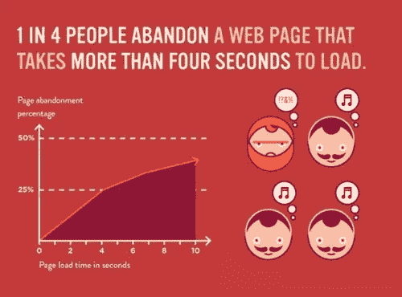

# 优化响应式设计网站的性能

> 原文：<https://www.sitepoint.com/optimizing-responsive-design-websites-for-performance/>

响应式设计已经成为网页设计的宠儿好几年了，尽管它在 2013 年达到了一个顶峰。这当然不足为奇。一个可以适应所有设备的网站比担心一个单独的移动网站要容易得多。

然而，[响应失败的一个方面是速度](http://www.guypo.com/uncategorized/real-world-rwd-performance-take-2/)。如果没有优化，一个响应式站点将为一个完整的桌面站点提供所有 HTTP 请求，即使它们是隐藏的。这当然会大大降低手机或平板电脑网站的速度。那么，你能做些什么让它更快呢？

碰巧的是，相当多的事情。优秀的老网站充斥着各种工具和技巧，所以这里有一些最好的。



*(图片来源:[塞斯·韦特](http://sethwaite.com/2012/08/how-slow-website-speed-destroys-your-conversion-rates/) )*

## 应该对图像进行适当的优化

我们都知道，图像通常是导致加载速度缓慢的罪魁祸首，对于响应迅速的网站来说也是如此。有几种方法可以达到这个目的，最快最简单的是使用[自适应图像](http://adaptive-images.com/)。这可以检测屏幕大小，自动创建、缓存和交付缩小版本的图像，而无需更改< scr >或< img >标记。

一个轻量级的 PHP 解决方案，该软件应该与流体图像技术一起使用，并能真正帮助减少时间。它使用一个 htaccess 文件、一个 PHP 文件和一行 JavaScript 来决定访问者的屏幕大小。

您还可以自定义软件，并设置图像和浏览器缓存的质量。

## 媒体查询

在网上可以找到大量体面的框架，它们不再需要使用媒体查询，例如 [Bootstrap](http://twitter.github.io/bootstrap/) 。但这是否意味着你不应该费心去了解它们呢？不，太多的知识从来都不是一件坏事，你真的想完全依赖别人的代码吗？

响应式设计中的媒体查询是一个 CSS 声明，用于根据目标设备上的屏幕大小调用其他声明。有两种方法可以使用它们:作为外部调用或者直接写在样式表中。

**外部代码**

```
<link rel="stylesheet" media="screen and (min-width:320px) and (max-width:480px)" href="css/mobile.css" />
```

**直接调用**

```
@media screen   and (min-width:320px) and (max-width:480px){

 /*Style Declarations For This Width Range */ 

 }
```

当设备在 320 像素和 480 像素之间时，这两种方法都可以调用 CSS 声明。如您所见，@media 屏幕开始查询，最大和最小宽度属性设置参数。

看起来还是很麻烦？看看 [ProtoFluid](http://protofluid.com/?c=mediaQueries) ，它允许你创建自适应 CSS，而不必在每个设备上测试它。

其他值得一试的资源是 [unsemantic 的 CSS 框架](http://unsemantic.com/)，它允许你处理百分比，而不是列和 [Screenfly](https://quirktools.com/) ，它允许你直接在浏览器中构建线框，对测试也很有用。

## 最小化 HTTP 请求

如前所述，所有 HTTP 请求都被发送到每个设备，除非您告诉它不要这样做，那么如何减少这些请求并减少 DOM 加载时间呢？JavaScript 和 CSS 资源可以对此有所帮助，比如 [Compass](http://compass-style.org/) 。

这是一个开源的 CSS 创作框架，允许开发人员简单方便地创建干净的标记和创建精灵和扩展。

对于 JavaScript，像 [UglifyJS](http://lisperator.net/uglifyjs/) 这样的工具是无价的，因为它压缩代码，允许自动处理 JavaScript。

## 有条件加载

这对于确保移动和平板设备不会下载各种内容(包括图像、地图等)非常理想。尤其是第三方脚本，如 gravatars 和社交媒体图标，因为它们通常适用于更大的设备。

[ZurBlog](http://zurb.com/article/883/small-painful-buttons-why-social-media-bu) 指出

> …加载脸书、推特和谷歌社交媒体按钮总共需要 19 个请求，占用 246.7k 带宽。
> 
> 从长远来看，加载一个完整的、缩小版的整个 [Foundation](http://foundation.zurb.com/) 框架需要两倍的带宽和三倍的请求数量。

社交活动真的需要这么多负担吗？这真的要看情况。如果你依赖社交信号进行搜索引擎优化，那么使用简单的分享网址并不适合你。这是因为分享网址只是为了分享，而不是添加赞或者 g++ 1。

然而，总有你的主站点，URL 可以合并到移动和平板设备的样式表中。

例如:

```
<a href="http://www.facebook.com/sharer.php?u=URL&amp;t=TITLE">link or image</a>
```

*(来源 ZurBlog)*

## 测试，测试…

无论你使用哪种技术和资源，构建一个响应式网站最重要的方面应该是测试。如前所述，您可以使用 Screenfly 等资源，但在尽可能多的真实设备上测试它也是一个好主意。

询问家人、朋友、同事，无论是谁，但要在尽可能多的设备上彻底测试。你应该记住的一件事是可用性，所以确保它不只是看起来好，而是通过拇指测试，易于导航，最好在页面顶部有强烈的行动号召。

也看看文本，它是否正确显示，或者看起来被挤压，并把其他内容推到屏幕上奇怪的地方。您可以使用 [FitText](http://fittextjs.com/) 来解决这个问题，这是一个 JQuery 插件，可以自动更新字体大小，提供最小和最大大小的选项。

它允许忽略 CSS 字体大小，并且只应用于标题，而不是段落文本。

响应式设计是一种创新的、值得推荐的设计方法，尽管有些人称之为现代闪光。然而，我不认为我们都对它感到兴奋，甚至谷歌说这是建立移动网站的最好方式。

当涉及到移动设备和平板电脑时，一切都是关于可用性的，所以你在设计时应该始终牢记这一点，实现这一点的一个方法是从移动设备开始设计网站，而不是首先从桌面开始。

目前，极简主义设计是一种趋势，那么为什么不考虑将极简主义和响应结合起来，以确保你建立一个快速、美观和易于使用的网站呢？

## 分享这篇文章