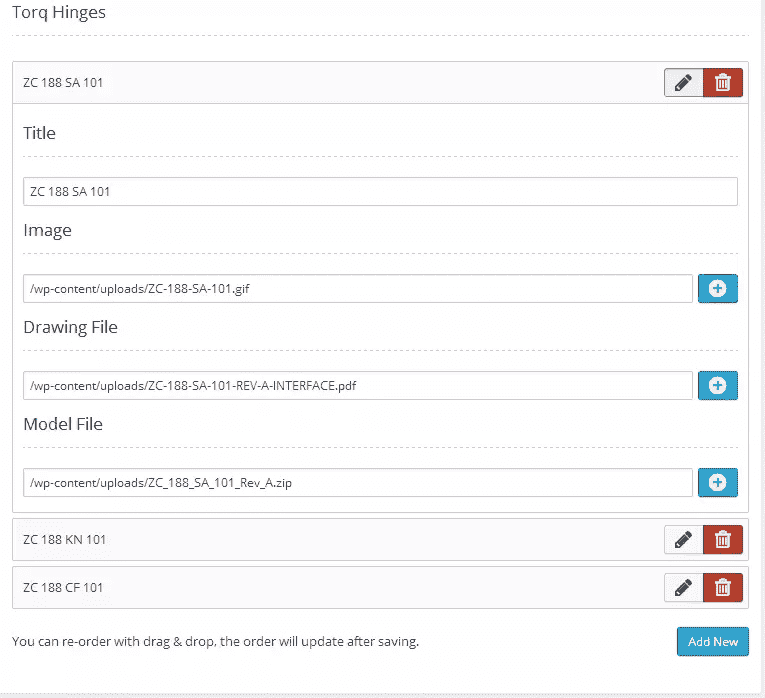
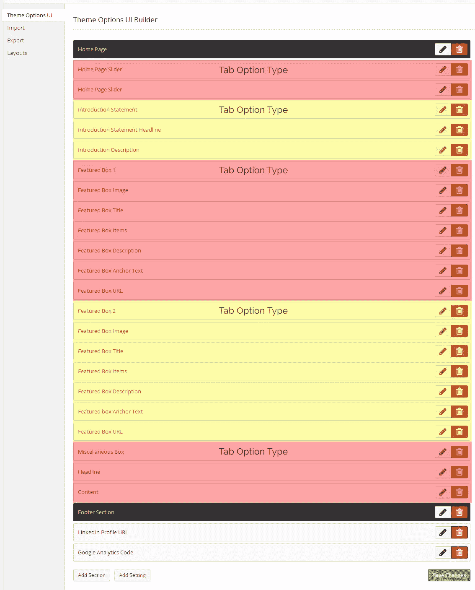
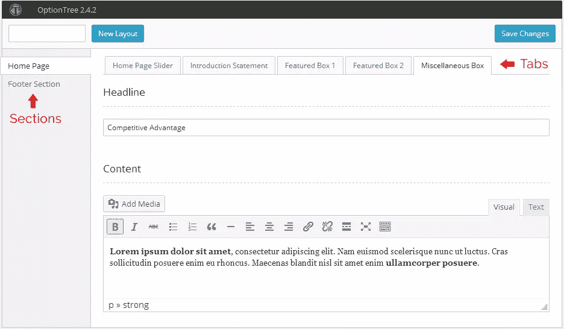

# 选项树–高级选项

> 原文：<https://www.sitepoint.com/optiontree-advanced-options/>

在上一篇文章中，我们介绍了如何安装 OptionTree 以及如何将它与您的主题集成在一起。我们还探索了 OptionTree 提供的许多最基本但非常有用的选项类型。这些选项可以在几分钟内使用 OptionTree 的简单 UI 主题选项生成器实现，这是首屈一指的。

## 探索一些更高级的选项

我们现在将继续探索一些最先进的选项，您只需点击几下就可以将它们包含在您的主题中。不要被术语“高级选项”吓到，OptionTree 使它们都易于集成，然而，它被认为是“高级”的，因为需要从头开始手工编码。开始了。

### 日期选择器

“日期选择器”选项类型绑定到标准表单输入字段，该字段显示一个日历弹出窗口，允许用户在输入字段获得焦点时选择任何日期。返回值是日期格式的字符串(YYYY-MM-DD)。

```
array(
    'id'          => 'spyr_demo_date_picker',
    'label'       => __( 'Date Picker', 'text-domain' ),
    'desc'        => __( 'Your description', 'text-domain' ),
    'type'        => 'date-picker',
    'section'     => 'your_section',
)

// Get the value saved on Theme Options Page
$spyr_demo_date_picker = ot_get_option( 'spyr_demo_date_picker' );

// Get the value saved for a Page, Post or CPT ( Within the loop )
$spyr_demo_date_picker = get_post_meta( $post->ID, 'spyr_demo_date_picker', true );

// Checking if the date has passed
$date = new DateTime( ot_get_option( 'spyr_demo_date_picker' ) );
$now  = new DateTime( "now" );

// Compare the 2 dates
// Not that this example assumes you have not changed the date format
// through the ot_type_date_picker_date_format filter like shown below
if( $now > $date ) {
    echo 'Date is in the past';
} else {
    echo 'Date has not passed yet';
}

// Change displayed format and returnd value
// Defaults to yy-mm-dd
// Not recommended but it's possible
add_filter( 'ot_type_date_picker_date_format', 'spyr_modify_date_picker_date_format', 10, 2 );
function spyr_modify_date_picker_date_format( $format, $field_id ) {
    if( 'spyr_demo_date_picker' == $field_id ) {
        return 'mm-dd-yy';
    }
}
```

### 日期时间选择器

“日期时间选择器”选项类型绑定到标准表单输入字段，该字段显示一个日历弹出窗口，允许用户在输入字段获得焦点时选择任何日期和时间。返回值是日期和时间格式的字符串(YYYY-MM-DD HH:MM)。

```
// OptionTree Date Time Picker Option Type

// Example code when being used as a Metabox or
// Exported OptionTree file to be used in Theme Mode

array(
'id'          => 'spyr_demo_date_time_picker',
'label'       => __( 'Date Time Picker', 'text-domain' ),
'desc'        => __( 'Your description', 'text-domain' ),
'std'         => '',
'type'        => 'date-time-picker',
'section'     => 'your_section',
)

// Get the value saved on Theme Options Page
$spyr_demo_date_time_picker = ot_get_option( 'spyr_demo_date_time_picker' );

// Get the value saved for a Page, Post or CPT ( Within the loop )
$spyr_demo_date_time_picker = get_post_meta( $post->ID, 'spyr_demo_date_time_picker', true );

// Checking if the date has passed
$date = new DateTime( ot_get_option( 'spyr_demo_date_time_picker' ) );
$now  = new DateTime( "now" );

// Compare the 2 dates
// Not that this example assumes you have not changed the date format
// through the ot_type_date_time_picker_date_format filter like shown below
if( $now > $date ) {
    echo 'Date is in the past';
} else {
    echo 'Date has not passed yet';
}

// Change displayed format and returnd value
// Defaults to yy-mm-dd
// Not recommended but it's possible
add_filter( 'ot_type_date_time_picker_date_format', 'spyr_modify_date_time_picker_date_format', 10, 2 );
function spyr_modify_date_time_picker_date_format( $format, $field_id ) {
    if( 'spyr_demo_date_time_picker' == $field_id ) {
        return 'mm-dd-yy';
    }
}
```

### 尺寸

“测量”选项类型是输入和选择字段的混合。文本输入接受一个值，选择字段允许您选择要添加到该值的度量单位。目前，默认单位是像素、%、em 和 pt。然而，你可以用*ot _ measurement _ unit _ types*过滤器来改变这些。

```
// OptionTree Measurement Option Type

// Example code when being used as a Metabox or
// Exported OptionTree file to be used in Theme Mode

array(
    'id'          => 'spyr_demo_measurement',
    'label'       => __( 'Measurement', 'text-domain' ),
    'desc'        => __( 'Your description', 'text-domain' ),
    'type'        => 'measurement',
    'section'     => 'your_section',
)

// Get the value saved on Theme Options Page
// Returns an array
$spyr_demo_measurement = ot_get_option( 'spyr_demo_measurement' );

// Get the value saved for a Page, Post or CPT ( Within the loop )
// Returns an array
$spyr_demo_measurement = get_post_meta( $post->ID, 'spyr_demo_measurement', true );

// Displaying the result side by side
echo $spyr_demo_measurement[0] . $spyr_demo_measurement[1];

// Adding a new measurement option to the list
add_filter( 'ot_measurement_unit_types', 'spyr_ot_measurement_unit_types', 10, 2 );
function spyr_ot_measurement_unit_types( $measurements, $field_id ) {
    if( 'demo_measurement' == $field_id ) {
        return array_merge( $measurements, array( 'rem' => 'rem' ) );
    } 
}

// Override list of measurements
add_filter( 'ot_measurement_unit_types', 'spyr_ot_measurement_override_unit_types', 10, 2 );
function spyr_ot_measurement_override_unit_types( $measurements, $field_id ) {
    if( 'demo_measurement' == $field_id ) {
        return array( 'rem' => 'rem' );
    } 
}
```

### 数字滑块

“数字滑块”选项类型显示一个 jQuery UI 滑块。它将返回一个用于自定义函数或循环的数值。

```
// OptionTree Numeric Slider Option Type

// Example code when being used as a Metabox or
// Exported OptionTree file to be used in Theme Mode

array(
    'id'          => 'spyr_demo_numeric_slider',
    'label'       => __( 'Numeric Slider', 'text-domain' ),
    'desc'        => __( 'Your description', 'text-domain' ),
    'type'        => 'numeric-slider',
    'section'     => 'your_section',
    'min_max_step'=> '-500,5000,100',
)

// Get the value saved on Theme Options Page
$spyr_demo_numeric_slider = ot_get_option( 'spyr_demo_numeric_slider' );

// Get the value saved for a Page, Post or CPT ( Within the loop )
$spyr_demo_numeric_slider = get_post_meta( $post->ID, 'spyr_demo_numeric_slider', true );
```

### 开/关

“开/关”选项类型显示一个简单的开关，可用于“开”或“关”。保存的返回值为“开”或“关”。

```
// OptionTree On/Off Option Type

// Example code when being used as a Metabox or
// Exported OptionTree file to be used in Theme Mode

array(
    'id'          => 'spyr_demo_on_off',
    'label'       => __( 'On/Off', 'text-domain' ),
    'desc'        => __( 'Your description', 'text-domain' ),
    'type'        => 'on-off',
    'section'     => 'your_section',
)

// Get the value saved on Theme Options Page
$spyr_demo_on_off = ot_get_option( 'spyr_demo_on_off' );

// Get the value saved for a Page, Post or CPT ( Within the loop )
$spyr_demo_on_off = get_post_meta( $post->ID, 'spyr_demo_on_off', true );

// Checking whether it's On or Off
if( 'off' != $onoff ) {
    echo 'It\'s On';
} else {
    echo 'It\'s Off';
}
```

### 走廊

“图库”选项类型保存图像附件 id 的逗号分隔列表。您将需要创建一个前端功能来显示您的主题中的图像。您将能够通过 *add_image_size()* 获得您的主题可能添加的任何图像大小。

```
// OptionTree Gallery Option Type

// Example code when being used as a Metabox or
// Exported OptionTree file to be used in Theme Mode

array(
    'id'          => 'spyr_demo_gallery',
    'label'       => __( 'Gallery', 'text-domain' ),
    'desc'        => __( 'Your description', 'text-domain' ),
    'type'        => 'gallery',
    'section'     => 'your_section',
)

// Get the value saved on Theme Options Page
// Return a comma separated list of image attachment IDs
$spyr_demo_gallery = ot_get_option( 'spyr_demo_gallery' );

// Get the value saved for a Page, Post or CPT ( Within the loop )
// Return a comma separated list of image attachment IDs
$spyr_demo_gallery = get_post_meta( $post->ID, 'spyr_demo_gallery', true );

// Get the list of IDs formatted into an array 
// and ready to use for looping through them
$gallery_img_ids = wp_parse_id_list( $spyr_demo_gallery );
```

### 滑块

“滑块”选项类型允许您在几分钟内创建一个滑块。然后，您可以使用这些可重复的字段来保存稍后用于填充滑块的信息。此选项很快被弃用，取而代之的是更灵活的“列表项”选项。

```
// OptionTree Slider Option Type

// Example code when being used as a Metabox or
// Exported OptionTree file to be used in Theme Mode

array(
    'id'          => 'spyr_demo_slider',
    'label'       => __( 'Slider', 'text-domain' ),
    'desc'        => __( 'Your description', 'text-domain' ),
    'type'        => 'slider',
    'section'     => 'your_section',
)

// Get the value saved on Theme Options Page
// Returns an array
$spyr_demo_slider = ot_get_option( 'spyr_demo_slider' );

// Get the value saved for a Page, Post or CPT ( Within the loop )
// Returns an array
$spyr_demo_slider = get_post_meta( $post->ID, 'spyr_demo_slider', true );

// Loop through the array to build your Slider.
// Note that every slider is different
// We have access to the following array keys
// title, description, image and link
echo '<ul class="slides">';
foreach( $spyr_demo_slider as $slide ) {
    echo '<li><a href="'. $slide['link'] .'"></a></li>';
}
echo '</ul>';
```

### 列表项目

“列表项目”选项类型允许大量定制。您可以向“列表项目”添加设置，当用户添加新的“列表项目”时，这些设置将显示给用户。通常，这用于为自定义布局创建滑动内容或代码块。滑块是一个“列表项目”选项类型，有四个预定义的字段，所以你可以在几分钟内建立一个图像滑块。“列表项”选项类型允许您定义自己的字段，它们的 ID，这些字段甚至可以有自己的选项类型。可能性是无限的。

这是一个“列表项”设置的例子。



### 上传

“上传”选项类型用于上传任何 WordPress 支持的媒体。上传后，用户需要按下“发送到选项树”按钮，以便用该媒体的 URI 填充输入。这个特性有一个警告。如果您导入了主题选项，并且在一个站点上传了媒体，旧的 URI 将不会反映新站点的 URI。您将不得不重新上传或 FTP 任何媒体到您的新服务器，并在必要时更改 URIs。

通过将 *ot-upload-attachment-id* 添加到类别属性中，也可以将“上传”选项类型保存为附件 ID。这将允许您通过 add_image_size()注册任何图像大小。根据 *ot-upload-attachment-id* 是否被添加到 CSS Class 字段，返回值将是附件 ID 或者图像的源链接。

```
// OptionTree Upload Option Type

// Example code when being used as a Metabox or
// Exported OptionTree file to be used in Theme Mode

array(
    'id'          => 'spyr_demo_upload',
    'label'       => __( 'Upload', 'text-domain' ),
    'desc'        => __( 'Your description', 'text-domain' ),
    'type'        => 'upload',
    'section'     => 'your_section',
    'class'       => 'ot-upload-attachment-id', // Optional CSS Class
)

// Get the value saved on Theme Options Page
$spyr_demo_upload = ot_get_option( 'spyr_demo_upload' );

// Get the value saved for a Page, Post or CPT ( Within the loop )
$spyr_demo_upload = get_post_meta( $post->ID, 'spyr_demo_upload', true );
```

### 标签

“选项卡”选项类型允许您将一组字段组合在一起，这些字段通常会在页面中向下展开。您会发现自己一遍又一遍地使用这个选项。此字段没有返回值。像往常一样，实现这个选项只需要几次点击，用户界面看起来对您和您的客户来说都很棒。

要通过主题选项 UI 构建器创建选项卡，您所要做的就是确保“选项卡”选项类型位于您想要分组的字段组上方。您可以添加更多的“选项卡”,方法是对您想要分组的其他选项进行同样的操作。当一个“制表符”遇到另一个“制表符”或一个新节的开始时，它就结束了。

为了帮助您直观地理解这一点，让我们用一个真实的例子来看看 UI 构建器:



当您访问“外观”下的主题选项页面时，这是您将从这些选项中获得的内容。



### 颜色选择器

“颜色选择器”选项类型保存一个十六进制颜色代码，用于 CSS 中。使用它来修改你的主题的颜色。

```
// OptionTree Color Picker Option Type

// Example code when being used as a Metabox or
// Exported OptionTree file to be used in Theme Mode

array(
'id'          => 'spyr_demo_colorpicker',
'label'       => __( 'Colorpicker', 'text-domain' ),
'desc'        => __( 'Your description', 'text-domain' ),
'type'        => 'colorpicker',
'section'     => 'your_section',
)

// Get the value saved on Theme Options Page
$spyr_demo_colorpicker = ot_get_option( 'spyr_demo_colorpicker' );

// Get the value saved for a Page, Post or CPT ( Within the loop )
$spyr_demo_colorpicker = get_post_meta( $post->ID, 'spyr_demo_colorpicker', true );
```

## 结论

尽管这些是 OptionTree 的一些最先进的功能，但最好的功能还在后面。

OptionTree 让你的字体设计变得非常简单，让你和你的客户可以轻松地设计你的 HTML 元素。

在以后的文章中，我们将看看如何使用 CSS 并创建“背景”和“字体”选项类型，这将使你的 WordPress 主题达到一个全新的水平。

## 分享这篇文章