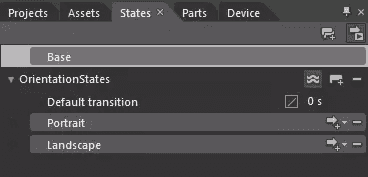
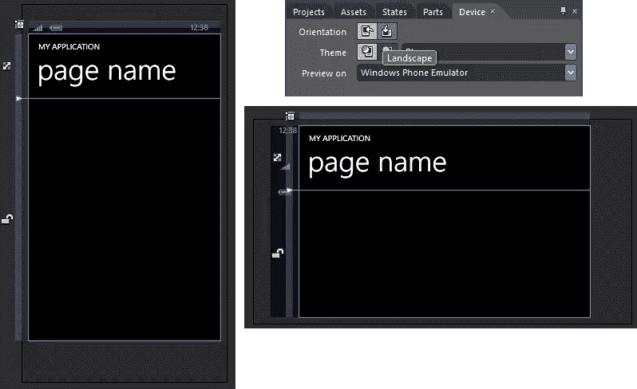
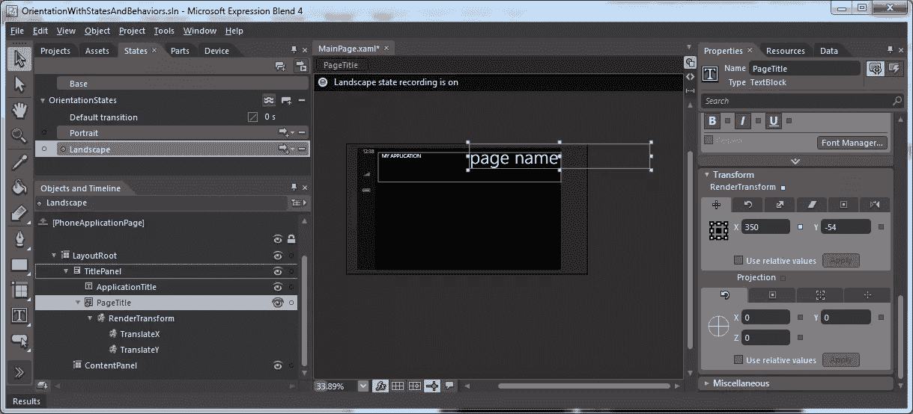
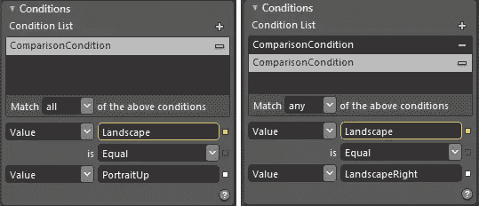

# WP7 中的方向和行为

> 原文：<https://www.sitepoint.com/orientation-and-behaviours-in-wp7/>

正如我在以前的一些帖子中指出的，Windows Phone 开发与其他移动平台的区别之一是我们必须使用的一套令人敬畏的工具。在这篇文章中，我们将看看如何通过在 Expression Blend 中定义不同的布局来处理不同的手机方向。

让我们从一个新的 Windows Phone 应用程序开始。我的偏好是在 Visual Studio 中创建新项目，然后立即切换到 Expression Blend。由于我们希望页面能够响应设备的方向变化，因此需要将 SupportedOrientations 属性更改为 PortraitOrLandscape。这可以在 PhoneApplicationPage 的属性窗口中设置。

找到“状态”窗口(如果它不可见，您可以通过“窗口”菜单显示它)。最初，您的页面不会定义任何状态或状态组，所以首先要做的是通过单击 Add state group 图标创建一个新的状态组。我们将状态组称为 OrientationStates，因为它将包括不同的视觉状态，换句话说，不同的布局，用于页面的不同方向。

作为状态组的题外话:你可以有多个状态组；每个状态组代表一组互斥的状态。换句话说，你的页面不能同时处于属于同一个状态组的两个不同状态。但是，页面可以处于不同状态组中的两种不同状态。
然后，我们将添加两个状态，纵向和横向，方法是单击状态窗口右侧 OrientationStates 标题下的 Add State 按钮。您应该有一个类似于下面的状态窗口。

[](https://www.sitepoint.com/wp-content/uploads/2012/01/sp0018_01.png)

状态窗口

接下来要做的是定义两种布局的屏幕外观。纵向很容易，因为它将与当前布局相同，并且与设计图面当前显示的方式相同(下图)。要定义景观状态的布局，我们首先要更改设计图面的布局(单击状态窗口中的底部，以确保您不处于状态编辑模式，设计图面周围不应有红色边框)。在设备窗口中，将方向更改为横向(上图),这应该会将设计图面更改为横向，如下图所示

[](https://www.sitepoint.com/wp-content/uploads/2012/01/sp0018_02.png)

现在，您已经准备好定义景观状态了。所以，回到状态窗口，点击景观状态。现在，您应该会看到红色边框出现在设计图面周围，表明您处于状态编辑模式。在本例中，我们只需翻译“页面名称”标题，使其出现在屏幕顶部的另一个标题旁边。选择标题并在“属性”窗口中，然后在转换标题下找到 RenderTransform 属性。将平移 X 值更改为 350，将平移 Y 值更改为-54(参见图 3)。

[](https://www.sitepoint.com/wp-content/uploads/2012/01/sp0018_03.png)

最后，将默认过渡更改为 1s，并通过单击“状态”窗口右上角的“打开过渡预览”按钮来启用过渡。现在，如果你点击 Portait 和 Landscape，你会看到“页面名称”标题在屏幕上显示出来。

定义了两种不同的布局后，我们需要处理 OrientationChanged 事件，然后根据设备的新方向，我们需要更改页面的状态。我们可以很容易地用代码做到这一点:

```
public MainPage() {
   InitializeComponent();

   OrientationChanged += PageOrientationChanged;
}

void PageOrientationChanged(object sender, OrientationChangedEventArgs e) {
   if(Orientation==PageOrientation.PortraitUp) {
       VisualStateManager.GoToState(this, &quot;Portrait&quot;, true);
   }
   else {
       VisualStateManager.GoToState(this, &quot;Landscape&quot;, true);
   }
}
```

或者，我们可以利用 SDK 中提供的 GoToStateAction 行为。在 Expression Blend 的“资源”窗口中，找到 GoToStateAction 行为，并向页面添加两个实例(在此阶段，不要担心它们附加到哪个元素)。您可以使用此行为来更改控件(在本例中为页面)的状态，作为在源控件上引发事件的结果。现在，处理方向改变事件的技巧(我们马上就要开始连接)是，产生的状态改变取决于设备现在的方向。幸运的是，您可以使用 Expression Blend 中的属性窗口来定义 GoToStateAction 行为的条件。

选择第一个 GoToStateAction，并在属性窗口中将 StateName 更改为 Portrait，这应该在下拉列表中可用。接下来，在 Conditions 部分，单击 Add Condition (+)按钮将条件添加到 listbox 中(图 4，左图)。单击第一个值行旁边的高级选项(小方块)按钮，并从上下文菜单中选择数据绑定。从“创建数据绑定”窗口的“元素属性”选项卡中，选择 PhoneApplicationPage 元素(左窗格)和“方向”属性(右窗格)，然后单击“确定”(图 4，右图)。

[](https://www.sitepoint.com/wp-content/uploads/2012/01/sp0018_04.png)

图 4

在第二个值行中输入值“PortraitUp”。条件列表应该类似于图 5 的左图。现在，对另一个 GoToStateAction 重复相同的过程。但是，这一次要确保 StateName 设置为 Landscape，并且需要创建 to 条件。一个应该测试 LandscapeRight 的值，另一个测试 LandscapeLeft 的值。您还需要将匹配从“all”更改为“any ”,因为您希望它匹配两个条件中的任何一个。

[](https://www.sitepoint.com/wp-content/uploads/2012/01/sp0018_05.png)

图 5

我之前提到过，我们仍然需要将这些 GoToStateAction 行为绑定到页面上的 OrientationChanged 事件。为此，只需将 SourceObject 属性更改为指向 phoneApplicationPage(单击该属性右侧的小方块，选择 Data Binding，然后从“创建数据绑定”对话框的“元素属性”选项卡中选择 phoneApplicationPage 元素)。然后从 EventName 下拉列表中选择 OrientationChanged 事件。

现在你知道了——当你运行你的应用程序时，你会看到当你改变设备的方向时(或者使用左右旋转按钮改变模拟器的方向时),你会看到你的页面布局发生了变化。

## 分享这篇文章