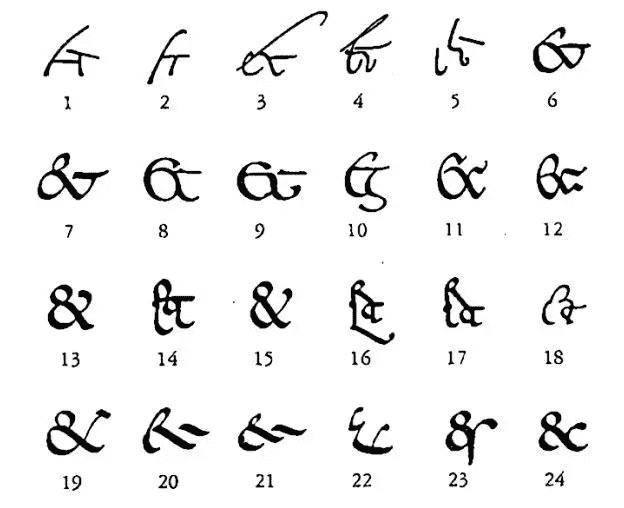
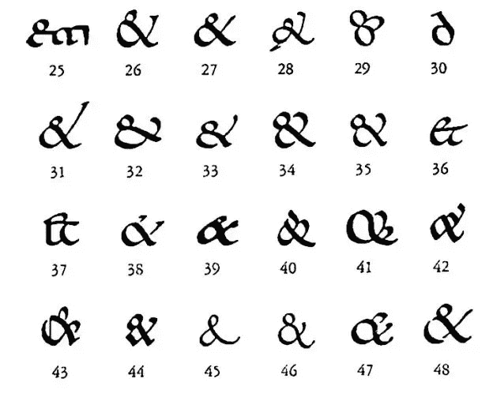
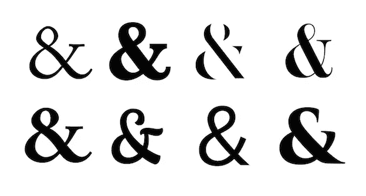
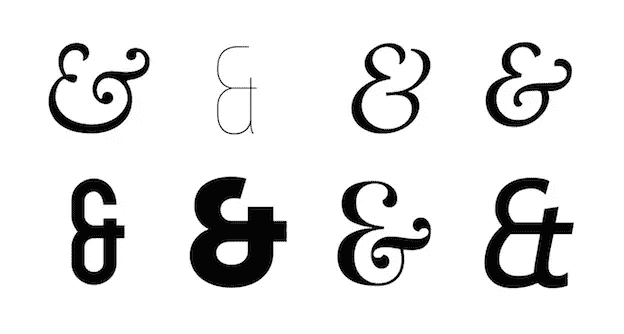

# 设计历史:了解你的&符号

> 原文：<https://www.sitepoint.com/origin-of-the-ampersand/>

我们无时无刻不在看到这个符号。优雅、弯曲、可塑性无限。但是神秘而无处不在的&符号的由来是什么呢？你如何选择哪一个是最好的版本呢？请继续阅读，了解你想知道的关于这种古老文字工具的一切:

### 和号的由来

*第 1 部分，共 2 部分:与号的演变从扬·奇乔德的*与号:它的起源和发展*(经由[shadycharacters.co.uk](http://www.shadycharacters.co.uk/2011/06/the-ampersand-part-2-of-2/))*

与传统故事不同的是，语标“&”出现在它现在代表的单词“与”之前。它曾经是字母表中的第 27 个字母，来源于罗马单词“et”。当古罗马抄写员在公元 1 世纪左右用罗马草书书写时，他们倾向于将两个字母连接成一个连字。

这个符号随着时间的推移而演变，到文艺复兴时期，已经发展成为我们现在非常熟悉的书法符号。

*第 2 部分，共 2 部分:与号的演变从扬·奇乔德的*与号:它的起源和发展*(经由[shadycharacters.co.uk](http://www.shadycharacters.co.uk/2011/06/the-ampersand-part-2-of-2/))*

单词*和符号*是通过一个叫做 mondegreen 的过程演变而来的——当一个新单词来自其他单词的常见错误发音时。19 世纪的英国小学生会背诵字母表，以“X、Y、Z”结尾，并说出&他们插入了“per say ”,以表示“&”是独立的，而不是以一个悬挂的连接词结束字母串。

很明显，这不是一个完美的解决方案，因为随着时间的推移，孩子们将单词混淆在一起，创造出单词&符号。随着时间的推移，它被从字母表中删除，就像它之前的许多迷人的字符一样。但从 1837 年开始，它被加入字典。

#### 提隆尼亚人 *et*

让它变得更令人困惑的是，在中世纪,“和”并不是唯一用来表示“和”的符号。蒂罗尼亚语是一种不同的书写系统的名称，是一种在修道院教授的拉丁语的速记。他们对单词 *et* 的连写看起来有点像现在的数字 7，并且在爱尔兰和苏格兰仍然流传至今。这是东部时间:⁊

### 使用

*赫夫勒&弗莱尔-琼斯(现赫夫勒&公司)拆分前的标志*

虽然,“与”这个词由来已久，但它在当代文化中已经找到了自己的位置。我们可能最熟悉的方式是在正式或商业头衔中使用，如律师事务所或如今的时尚餐厅和高档商品商店(即 Craftsmen & Wolves 或 Hoefler & Co .)

在研究这篇文章时，我们发现了另一个有趣的小事实:短语 etches，最常被表达为 *etc。*也可以表达为 *& c.*

它在计算机编程语言和数学中也有用途。有一个数学符号叫做“T0”与“T1”，它实际上是这个符号的颠倒版本:⅋.

### 风格

“与”符号有几种不同的样式。主要的变化是在加洛林/罗马风格和斜体风格之间，尽管几乎每种不同的字体风格(即哥特式)都有自己的符号。正如您从下面的示例中注意到的，有些字体根据所选的特定字体同时使用罗马和斜体，Adobe Caslon Pro 及其斜体版本就是一个完美的例子。

#### 古罗马的

可能是最广泛认可的与号版本。从顶部顺时针方向 Adobe Caslon Pro、Baskerville(粗体)、precious、迪多特(粗体)、Trajan Pro、Proxima Nova、Nautilus Pompilius 和 Menlo。

#### 意大利语族的

斜体版本往往更古怪和浪漫:从上到下顺时针方向 Adobe Caslon Pro(斜体)，Bebas Neue(细)，Grafolita，爱荷华州旧风格(斜体)，Trebuchet(斜体)，Prata，Museo Slab，Mohave(粗体)

#### 小写字母

从技术上讲，这些也是斜体，但在形状上似乎是基于小写字母 *e* : Cochin，Adobe Garamond Pro(斜体)，Hoefler(斜体)，Minion Pro

#### 选择的

对于设计师来说，符号是一个很好的形状，可以在显示字体中注入字符。从左边开始是科帕尔 STD，魅力，Prisma，和 Zapfino。

### 在设计中使用&符号的提示

*   **用于显示:**记住，符号用于显示排版——一个标志，*可能是*一个标题。它不是用来代替设计正文中的“和”这个词的。
*   拥抱正确的风格:我们在上面提到过这一点，但是这个特殊的符号有很多风格。确保你选择了一个适合你工作的公司风格的。罗马体更正式一些，对于直截了当的专业商务来说可能是更好的选择，而斜体则更柔和一些，可以用在更轻松的场合。
*   **探索你的选项:**你的“与”符号不必和你的其他文本一样大小、颜色或字体。想办法让角色脱颖而出！
*   浏览，浏览，浏览:浏览你字体库里所有的&符号——我们保证，有很多。但是如果你找不到你要找的东西，看看这个资源:【opensourceampersands.org】T2

#### 你最喜欢的与号版本是什么？下面给我们看看！

*经 [99designs 设计师博客](http://99designs.com/designer-blog/)许可转载 T3*

*封面图片:[opensourceampersands.org](http://opensourceampersands.org/)*

## 分享这篇文章