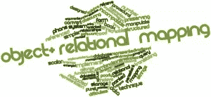

# Ruby 中的 ORM:简介

> 原文：<https://www.sitepoint.com/orm-ruby-introduction/>



任何在开发基于 web 的应用程序或使用 web 框架方面有经验的人都处理过关系数据库，如 MySQL 或 PostgreSQL。处理 SQL 有时可能有点可怕，尤其是在处理跨不同表的数据和应用各种过滤器时。

这就是奥姆来救援的地方。

## ORM 是什么？

ORM 是对象关系映射的缩写。

> 计算机软件中的对象关系映射(ORM、O/RM 和 O/R 映射)是一种编程技术，用于在面向对象编程语言中的不兼容类型系统之间转换数据。这实际上创建了一个可以在编程语言中使用的“虚拟对象数据库”。尽管一些程序员选择创建自己的 orm 工具，但是执行对象关系映射的免费软件包和商业软件包都是可用的。
> ——[维基百科](http://en.wikipedia.org/wiki/Object-relational_mapping)

换句话说，ORM 框架是用面向对象的语言(如 Ruby、Python、PHP 等)编写的。)并包装在关系数据库中。对象类映射到数据库中的数据表，对象实例映射到这些表中的行。

## 优势

以下是 ORM 作为一个概念的优势。值得注意的是，并不是所有的 ORM 实现都支持以下优点。

### 独立于数据库

这可能是在应用程序中使用 ORM 的最大优势。不需要编写特定于特定数据库的代码。简单地使用 SQLite 开始一个项目，然后，转换到 MySQL 或 PostgreSQL。在数据库配置适配器中修改几行代码就可以使它与另一个数据库一起工作。

### 领域模型模式

当使用 ORM 构建应用程序时，它允许业务代码使用业务模型和数据库之间的映射来访问对象，而不是数据库结构本身。

### 减少代码并提高效率

ORM 提供了一种抽象，允许开发人员专注于他们的业务逻辑，而不是复杂的数据库查询，从而大大减少了代码并提高了开发人员的效率。

### 丰富的查询界面

ORM 框架通常带有丰富的查询接口，将开发人员从复杂的 SQL 语义中解放出来。

### 关系

ORM 提供了一个轻松的数据库关系管理。当一个查询被翻译成相应的 SQL 时，相关对象被自动加载。

### 并发

ORM 支持并发性，允许多个用户同时更新同一组数据。

### 贮藏

对象可以缓存在内存中，减少数据库的负载。

### 处理

对对象的更改可以绑定到事务，事务可以提交或回滚。在给定的时间点，多个事务可以是活动的，但是所有这些事务都是相互隔离的。

## 不足之处

### 开销

ORM 框架增加了一个抽象层，加快了开发速度，降低了复杂性，但是，它也增加了应用程序的开销。使用 ORM 会消耗更多内存，增加 CPU 使用率。

### 学习曲线

将 ORM 应用到应用程序中要求开发人员拥有使用特定框架的经验。大多数 ORM 框架都有一个学习曲线。

### 表演

一些操作，如批量插入、更新、删除等。使用 ORM 实现时速度较慢。通常，使用原生 SQL 查询可以更有效地处理这些问题。

### SQL 无知

虽然 ORM 让开发人员的生活变得更加轻松，但它通常会导致开发人员不学习 SQL 和数据库内部知识，除非开发人员热衷于探索相同的内容。

## Ruby 中的 ORM 框架

有很多用 Ruby 写的 ORM 框架。这里简单介绍一些比较流行的。

### [激活记录](https://rubygems.org/gems/activerecord)

ActiveRecord 是 Rails 自带的 ORM。ActiveRecord(或 AR)试图遵循[活动记录设计模式](http://www.martinfowler.com/eaaCatalog/activeRecord.html)。它在 Rails 采用的 MVC 架构中扮演模型的角色。

ActiveRecord 使用业务对象从数据库中创建抽象，从而减轻了开发人员处理底层数据库复杂性的负担。ActiveRecord 的主要原则之一是“约定胜于配置”。如果表名、变量名等遵循正确的约定，它会自动检测配置。但是，如果明确指定，总是可以覆盖默认配置。

ActiveRecord 的一些显著特征如下:

*   数据被表示为模型。
*   关联可以使用这些模型来实现。
*   可以通过相关模型实现继承。
*   在将数据保存到数据库之前对其进行验证。
*   处理数据库操作的面向对象方法。

尽管 ActiveRecord 包含在 Rails 中，但它可以作为独立的 gem 安装。

```
gem install activerecord
```

下面是一个演示 ActiveRecord 用法的快速示例:

```
require 'rubygems'
require 'activerecord'
ActiveRecord::Base.establish_connection(
  :adapter=> "mysql",
  :host => "localhost",
  :database=> "articles"
)

class Article < ActiveRecord::Base
end

#Creating a new article
Article.create(title:'ORM', author:'Manu')

#Fetching an article
article = Article.find(:first)

#Destroy an article
Article.find(:first).destroy
```

ActiveRecord 的主要缺点是它打破了单一责任原则(SRP)。由于域对象还处理持久性，这是一项额外的责任，因此对象的复杂性增加了。

## [DataMapper](http://datamapper.org/)

开发 DataMapper 是为了解决 ActiveRecord 库中的缺点，并创建一个快速、线程安全且功能丰富的 ORM 框架。它遵循[数据映射器设计模式](http://martinfowler.com/eaaCatalog/dataMapper.html)

在活动记录中，域模型封装了业务逻辑和数据库访问的责任，而 DataMapper 不了解数据库，导致带有业务逻辑的普通旧 Ruby 对象(POROs)。DataMapper 允许数据库逻辑和对象模型独立发展，将它们相互隔离，从而遵循单一责任原则(SRP)。

数据映射器的优势如下:

*   不需要编写迁移
*   作用域关系或集合链
*   对某些属性类型(如文本字段)的延迟加载会降低查询速度。
*   急切加载，避免 N+1 查询问题
*   脏跟踪，只保存实际改变的字段
*   尊重单一责任原则

使用数据映射器的简单示例:

```
require 'rubygems'
require 'dm-core'
require 'dm-migrations'
DataMapper::Logger.new($stdout, :debug)
DataMapper.setup(:default, 'mysql://localhost/test')
class Author
  include DataMapper::Resource
  property :id,   Serial
  property :name, String, :required => true
end
DataMapper.auto_migrate!

#Create a new record
Author.create(:name => 'Manu')

#Fetching a record using DM
Author.first(:name => 'Manu')

#Destroying a record
author = Author.get(7)
author.destroy
```

在上面的示例中，为了处理持久性，DataMapper::Resource 被添加到 Author 类中。

## [续集](http://sequel.jeremyevans.net/)

Sequel 旨在为与 SQL 数据库的交互提供一个简单的、独立于数据库的 API。它也基于 ActiveRecord 模式。ActiveRecord 和 Sequel 有很多相似之处。

优点是:

*   为构造 SQL 查询和表模式提供线程安全、连接池和简明的 DSL
*   包括一个全面的 ORM 层，用于将记录映射到 Ruby 对象并处理相关记录
*   支持高级数据库特性，如预准备语句、绑定变量、存储过程、保存点、两阶段提交、事务隔离、主/从配置和数据库分片
*   目前有针对 ADO、Amalgalite、CUBRID、DataObjects、DB2、DBI、Firebird、IBM_DB、Informix、JDBC、MySQL、Mysql2、ODBC、OpenBase、Oracle、PostgreSQL、SQLAnywhere、SQLite3、Swift 和 TinyTDS 的适配器

使用 Sequel 的简单示例:

```
require "rubygems"
require "sequel"

DB = Sequel.sqlite

DB.create_table :author do
  primary_key :id
  String :name
end

authors = DB[:authors]
authors.insert(:name => 'Manu')
```

## 结论

ORM 旨在解决一个问题，让开发人员的生活更轻松，有许多不同的选项来实现相同的目标。虽然 ActiveRecord 已经统治了 Ruby ORM 领域，但是 DataMapper 和 Sequel(以及其他)是合法的选择。如果您还没有，那么您应该选择一个适合您的用例的 ORM 策略。

## 分享这篇文章