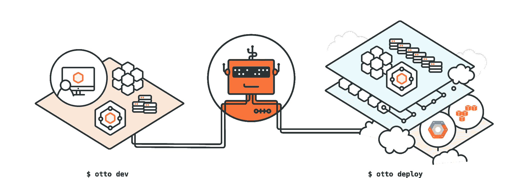

# Otto 使开发和部署变得轻而易举

> 原文：<https://www.sitepoint.com/otto-makes-development-and-deployment-a-breeze/>



Otto 是一款开源工具，用于为你的应用创建虚拟开发环境。它是流行的虚拟开发工具[流浪者](http://vagrantup.com)的继任者。这两个项目都是由[哈希公司](https://www.hashicorp.com/)创造的。

虚拟开发环境将应用程序环境从底层操作系统中抽象出来。这将确保应用程序在大多数/所有平台上的一致性，并消除基于平台的问题。Otto 使得创建这样的开发环境变得很容易，并且还可以帮助在生产服务器上设置相同的环境。

今天我们将看到如何使用 Otto 将一个简单的数据库支持的 Rails 应用程序部署到 AWS。如果您的机器上还没有 Otto，那么从安装 Otto 开始。

## 安装奥托

安装 Otto 非常简单。已经有打包的二进制文件可用于 Windows、Mac 和流行的 Linux 发行版。按照本页上[提供的步骤安装和配置 Otto。](https://www.ottoproject.io/docs/install/index.html)

在继续之前，通过在终端中键入以下命令，验证 Otto 是否已正确安装在您的计算机上:

```
otto version 
```

如果您看到一个`Command not available`错误，检查二进制文件是否正确地添加到您的系统路径中，或者尝试一个新的终端会话。

## 设置 Rails 应用程序

现在让我们创建 Rails 应用程序。在终端中输入以下命令:

```
rails new otto-example -d postgresql 
```

CD 放入目录，在根目录下创建一个名为 **Appfile** 的文件，并将下面的内容添加到其中。 **Appfile** 被 Otto 用来配置特定于应用的配置，比如依赖关系。

```
application {
  name = "otto-example"
  type = "ruby"
  dependency {
    source = "github.com/cromulus/otto-postgres"
  }
} 
```

运行以下命令来编译应用程序:

```
otto compile 
```

即使没有 **Appfile** ，Otto 也会自动检测出它是一个 Rails 应用程序，找出依赖关系(在我们的例子中是 PostgreSQL)，然后编译这个应用程序。但是表达清楚总是一个好习惯。现在启动开发环境:

```
otto dev 
```

如果您的机器上没有安装 vagger，这个命令将安装 vagger、VirtualBox 和其他您的应用程序和 Otto 运行所必需的工具。这将是一个相当大的下载，需要一些时间来完成整个过程。然而，这是一个一次性的过程，所以它是值得的。

> 如果你看到消息`Otto can't install Vagrant automatically`，请前往流浪者[下载](https://www.vagrantup.com/downloads.html)页面，为你的操作系统安装相应的软件包。
> 
> 如果你看到一个关于`Vagrant failed with status code 1`的错误信息，试着从他们的[下载](https://www.virtualbox.org/wiki/Downloads)页面手动安装 VirtualBox。

如果您看到任何类似于“无法连接到服务器”的错误消息，请尝试使用`otto dev ssh`ssh-ing 到 dev 环境中，并通过在命令行中键入`psql`来检查 Postgres 是否已经安装。如果没有，请使用以下命令安装它:

```
. /etc/default/locale
sudo apt-get install -y postgresql-9.1
sudo -u postgres createuser --superuser vagrant 
```

并运行 rake 命令来设置数据库:

```
rake db:create 
```

这样，就为我们的应用程序创建了数据库。如上所述，您可以使用以下工具进入开发环境:

```
otto dev ssh 
```

让我们快速地为我们的 Rails 应用程序创建一个脚手架:

```
rails generate scaffold post title body:text
rake db:migrate 
```

您可以在环境外部或内部运行这些命令。文件会自动同步。要验证一切正常，请在 Otto 环境中启动 Rack 应用程序:

```
rackup --host 0.0.0.0 
```

在另一个终端中，通过在项目目录中运行以下命令来获取虚拟机的 IP:

```
otto dev address 
```

上述命令的输出是一个 IPV4 地址。转到`http://<IP-ADDRESS>:9292`，如果一切正常，你会看到 Rails 的默认页面。

## 构建应用程序

现在，我们将了解如何构建我们的应用程序，以便为 AWS 做好准备。

Otto 有一个叫做*基础设施*的概念，它指的是我们想要部署应用的目标云平台。在本教程中，我们的基础设施是 AWS。对于每种基础设施，都有多种不同的配置。对于 AWS 来说，有两种口味随时可用——`simple`和`vpc-public-private`。简单风格适用于简单的应用程序，关注成本，牺牲可伸缩性。另一方面，vpc-public-private 选项为将来的可伸缩性设置了其他资源，如 NAT 实例。你可以在 **Appfile** 中指定你的风格，如果没有明确设置，默认为`simple`。

让我们通过在终端中键入以下命令来开始构建应用程序:

```
otto infra 
```

这个命令按照指定的风格配置云环境。这负责构建所有必要的模块，如 VPC 子网、路由器网关、供应实例等。在这一步中，Otto 会询问您的 AWS 访问密钥和密码，如果您已经有了帐户，您可以从这里的[获取。如果你不知道，你可以注册一个免费账户，在头 12 个月免费试用本教程。](https://console.aws.amazon.com/iam/home?#security_credential)

一旦您输入 AWS 凭证，Otto 将要求确认安装 [Terraform](https://www.terraform.io/) 。键入“yes”并继续该过程。简单地说，Terraform 是一个环境配置管理工具，也是由 Hashicorp 的优秀人员开发的。

键入`otto status`确认一切顺利。如果您看到基础设施状态为绿色，这意味着我们已经成功地为我们的应用程序配置了基础设施。让我们构建应用程序并部署它。

我们现在将构建应用程序。创建一个 Amazon 机器映像(AMI)，这是一个被 AWS 识别的磁盘映像。如果您愿意，也可以使用这一步构建 Docker 容器。要开始构建应用程序，请在终端中键入以下命令:

```
otto build 
```

它会询问您在配置基础架构步骤中输入访问密钥和访问密码后输入的密码。如果要求安装[封隔器](https://www.packer.io/)，输入密码并键入“yes”。Packer 是另一个 Hashicorp 工具，它从一个配置中为多个目的地(如 AWS 或 Digital Ocean)创建容器和机器映像。

如果您看到这样的错误消息，请尝试在 git 中初始化存储库并提交更改:

```
Error building app: error getting git commit: exit status 128
stdout:
stderr: fatal: bad default revision 'HEAD' 
```

构建过程可能需要几分钟时间。完成后，通过键入以下命令来验证构建是否完成:

```
otto status 
```

您应该会看到绿色的构建状态。

## 部署应用程序

这是教程的最后一步。让我们将定制的 AMI 部署到配置好的 AWS 基础设施中。在终端中键入以下命令:

```
otto deploy 
```

Otto 将采用我们构建的 AMI，并在我们的基础架构中推出新的服务器，然后在那里部署我们的 AMI。部署完成后，您应该会看到服务器的 IP 地址，在浏览器中打开它，您就可以看到我们的 web 应用程序正在 AWS 上运行。如果您想要重新访问部署的 IP 地址，您可以键入

```
otto deploy info 
```

以获取部署信息。

## 结论

至此，本教程到此结束。如图所示，奥托是如此简单却又如此强大。我建议仔细阅读他们的[文档](http://ottoproject.io/)，并充分利用它。Hashicorp 的人是说明开源为何如此伟大的光辉榜样，Otto 是进入环境管理论坛的一个非常引人注目的入口。看看 Otto，让我知道你是如何使用它的。

## 分享这篇文章