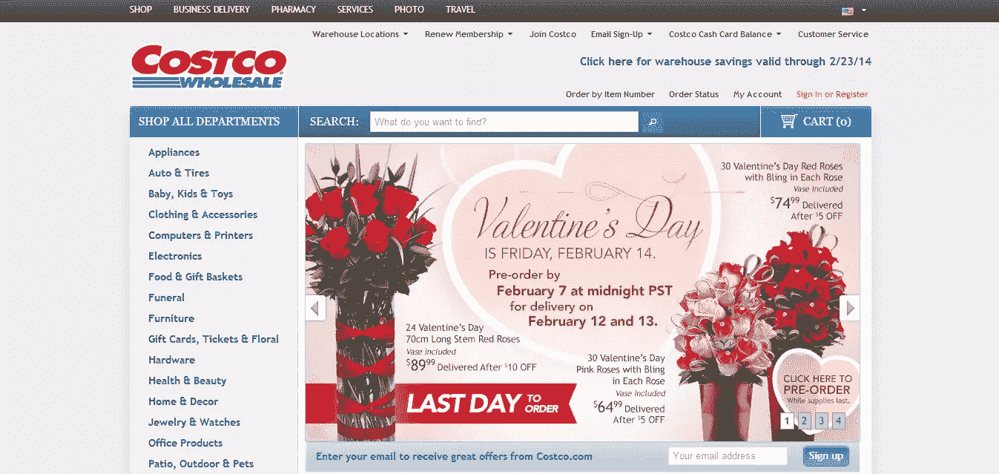

# 页面速度和业务指标:关系

> 原文：<https://www.sitepoint.com/page-speed-business-metrics/>

你的设计团队为你的网站主页的下一个版本开发了一个很棒的原型，从可用性和设计的最佳实践来看，一切都很好。它得到了您的测试人员的认可，所以您在您的站点中实现了更改……结果却莫名其妙地令人失望。

当你按常规做每件事时，怎么会发生这种事？

有三种常见的设计错误会影响页面的加载效率，最终会对页面浏览量和其他对网站成功至关重要的商业指标产生负面影响。

**页面速度和业务指标:关系**

您可能很熟悉这样一种观点，即 web 应用程序的速度与其实现预期目标的效率直接相关。

有许多证据证明了网页速度与其性能指标之间的明确联系，如客户满意度、销售额、购物车大小、跳出率、网页访问量以及您想到的所有其他业务指标。

[Walmart.com 的一项内部研究](http://minus.com/msM8y8nyh)得出的结果显示，加载时间每缩短一秒，网站转化率就会提高 2%。加载时间每改善 100 毫秒，收入的累计增长率就会上升 1%。

> ..加载时间每缩短一秒钟，网站转化率就会提高 2%

就像速度的提高对网站性能的积极影响一样，延迟会导致电子商务客户的惩罚:跳出率增加，页面访问量减少，购物车容量减少，转化率下降。

**当好的实践变成坏的**

那么，这些类型的错误如何升级呢？

原因是偷偷摸摸的。首先，您需要理解它们是如何被不同的设计最佳实践所掩盖的，以便首先意识到它们为什么会发生。这些错误非常普遍，所以性能下降不应该成为网站所有者无法忍受的耻辱。

以下三种最佳实践可能会对站点性能产生不良影响:

### 1)展示占据屏幕空间的横幅/传送带

放置特色横幅或旋转木马以促进和提高销售的做法已经根深蒂固，以至于许多网站开发者认为这是理所当然的。网站所有者通常不会花太多心思在网页上放置特色横幅。

**这种最佳实践是如何变成最差实践的？**

功能横幅通常是网站上加载的最后一个元素。例如，[QVC.com](http://www.qvc.com/)主页有一个幻灯片视图，这是许多页面的典型视图。您必须等待导航元素加载大约五秒钟，然后在横幅图像出现之前的五秒钟内，您会在功能区看到一个进度指示器。

QVC 典型场地荷载

用户通常不喜欢这种加载顺序，这对于网站所有者来说并不奇怪。

一个必须等待页面特征内容出现的用户不会花超过 1%的时间在这个网站上与这些内容进行视觉交流；而在打开页面后的一秒钟内看到特征内容的用户将在特征区域内的网站上花费将近 20%的时间。

简单地说，让访问者错过最重要内容的一个方法就是把它放在最后。

**我们如何解决？**

您可以通过对网站进行一些简单的改进来解决这个问题。首先，你需要优化页面上呈现对象的顺序。推荐这样一个显而易见的修复似乎很愚蠢，但是未能关注优先级的网站的数量更加明显。

你可以做的另一件事是优化图片。你不需要图像占一个典型页面总有效载荷的 50%以上。

许多开发人员忘记了另一项基本技术:图像压缩。这个简单的性能技巧将使你能够减少有效载荷，并仍然有效地突出图像。

大多数网站未能从渐进式图像渲染中受益，原因是渐进式 JPEGs 在 90 年代获得了糟糕的声誉。这种技术包括在增加分辨率显示完整版本之前加载低分辨率版本的图像。如果这种渐进式渲染被正确实现，它将更早地为访问者引入视觉内容。

### 2)主要 CTA(行动号召)链接/按钮位于功能横幅的底部

典型横幅的布局是可预测的:背景中的图像、标题文本、带描述的文本和 CTA 按钮。

这是许多网站使用的一种做法，没有理解它对性能的一些意想不到的影响。

**这种最佳实践是如何变成最差实践的？**

虽然有一些功能横幅在完全渲染之前是交互式的，但大多数在图像完全加载之前不会变成交互式的。如果用户不确定他们是否可以点击功能横幅直到按钮呈现，他们不太可能等着看。

例如，在好市多的主页上，只有在线优惠券的链接被隐藏在横幅的底部，尽管它对在线购物者来说相当重要。好市多主页需要 5 秒钟才能完全呈现，行动号召按钮最后才可见。

好市多的行动号召是最后一个要加载的元素。

**我们如何解决？**

这个解决方案和我们之前提到的没什么不同。同样，简单地优化网站上对象的呈现顺序是一个很好的解决方案，同时伴随着图像优化和按钮的渐进式呈现。

如果行动号召按钮如此重要，最简单的解决方法就是将它放在横幅的顶部。没有比这更简单的了！

### 3)在象牙塔中测试可用性和设计

在可用性测试中，许多 web 开发人员犯了这个错误。开发原型并让测试人员进入实验室，对网站进行各个阶段的测试，这是监督明显缺陷的一个行之有效的方法。这导致在将原型付诸实践之前，缺乏必要的修改和改进。

**这种最佳实践是如何变成最差实践的？**

当您在实验室中设计和测试原型和线框时，您会了解网站如何在一个完美的设置模型中运行，其中包括预加载的浏览器缓存、快速连接、最新的浏览器和快速的系统。

一个真正的站点查看器与这个设置相差甚远，你可以预期他们的计算机至少比你用来测试的系统慢五倍。

另一方面，第三方脚本抑制页面呈现的问题只有在您的站点上线时才会出现。当这些问题被忽略时，对于一个真正的用户来说，这个页面很容易需要 20 秒来加载。你不想那样的！

**我们如何解决？**

每个接触页面的人都要对页面的表现负责，不管他们涉及到了过程的哪个阶段。当每个单独的团队认为错误是其他人的责任时，绩效就会丧失。最后一个在页面上工作的人通常是因为性能失败而受到责备的人，这是完全不公平的。

设计、测试和开发阶段的每个阶段都必须将性能作为成功的主要因素之一。所有团队都必须从真实访问者的角度来看网页。

一种解决方案是在部署之前，在设计和测试阶段人为地阻塞连接。这将让您了解哪些地方出现了延迟，以及页面的呈现顺序。在部署阶段之后， [WebPagetest](http://www.webpagetest.org/) 可以帮助您将它与真实用户工具结合起来进行监控。

**结论**

拥有快乐用户的唯一方法是修复上述所有问题。当他们有如此简单的解决方案时，看到这些错误是多么普遍，真是可笑。

以这个例子为灵感:**每 400 毫秒的改进，雅虎的流量。被提高了 9%** 。

做一个快乐的网站所有者意味着你必须让你的用户快乐；这只能通过解决问题来实现。

## 分享这篇文章