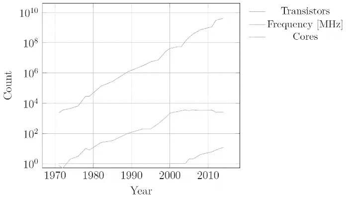

# 用 parallels 并行 javascript

> 原文：<https://www.sitepoint.com/parallel-javascript-with-paralleljs/>

伴随 HTML5 而来的最酷的新可能性之一是 [Web Workers API](https://developer.mozilla.org/en-US/docs/Web/API/Web_Workers_API) 的`Worker`接口。在此之前，我们必须引入一些技巧来为用户呈现一个有响应的网站。`Worker`接口允许我们创建运行时间长、计算量大的函数。此外，`Worker`实例可以被同时使用，这给了我们产生尽可能多的工作者的可能性。

在本文中，我将讨论为什么多线程很重要，以及如何在 JavaScript 中用 ParallelJS 实现它。

## 为什么是多线程？

这是一个合理的问题。从历史上看，产生线程的能力提供了一种在进程内划分工作的优雅方式。操作系统负责调度给每个线程的时间，使得具有较高优先级和较多工作的线程优先于低优先级空闲线程。

在过去的几年里，同步多线程(SMT)已经成为访问现代 CPU 计算能力的必要条件。原因很简单:摩尔定律对于单位面积上的晶体管数量仍然有效。然而，由于多种原因，频率缩放不得不停止。因此，现有的晶体管不得不另作他用。我们认为架构改进(例如 SIMD)和多核是最佳选择。



为了使用 SMT，我们需要编写并行代码，即并行运行以获得单一结果的代码。我们通常需要考虑特殊的算法，因为大多数顺序代码要么非常难以并行化，要么效率非常低。原因在于阿姆达尔定律，该定律指出加速比 *S* 由下式给出


其中 *N* 是并行工作线程(例如处理器、内核或线程)的数量，而 *P* 是并行部分。未来可能会使用更多依赖并行算法的核心架构。在高性能计算领域，GPU 系统和特殊架构，例如英特尔至强融核，代表了这样的平台。

最后，我们应该区分一般的并发应用程序或算法，以及并行执行。并行性是同时执行(可能相关的)计算。相反，并发是独立执行的进程的组合。

## JavaScript 中的多线程

在 JavaScript 中，我们已经知道如何编写并发程序，也就是通过使用回调。这些知识现在也可以转移到创建并行程序中去！

根据其自身的构造，JavaScript 在由事件循环(通常遵循 reactor 模式)作为中介的单线程中执行。例如，这为我们处理对(外部)资源的异步请求提供了一些很好的抽象。它还保证了之前定义的回调总是在同一个执行线程中被触发。没有线程间异常、竞争条件或其他与线程相关的问题。然而，这并没有让我们更接近 JavaScript 中的 SMT。

随着`Worker`接口的引入，这个问题找到了一个优雅的解决方案。从我们的主应用程序的角度来看，web worker 中的代码应该被视为并发运行的任务。通信也以这种方式进行。我们使用 messages API，它也可用于从包含的网站到托管页面的通信。

例如，以下代码通过向发起者发送消息来响应传入的消息。

```
window.addEventListener('message', function (event) {
	event.source.postMessage('Howdy Cowboy!', event.origin);
}, false);
```

理论上，一个网络工作者也可能产生另一个网络工作者。然而，实际上大多数浏览器都禁止这样做。因此，web 工作者之间唯一的交流方式是通过主应用程序。通过消息的通信是并发执行的，因此只有异步(非阻塞)通信。起初，这对于编程来说可能很奇怪，但是带来了几个好处。最重要的是，我们的代码应该是无竞争的！

让我们看一个简单的例子，在后台计算一个素数序列，使用两个参数来表示序列的开始和结束。首先我们创建一个名为`prime.js`的文件，其内容如下:

```
onmessage = function (event) {
	var arguments = JSON.parse(event.data);
	run(arguments.start, arguments.end);
};
function run (start, end) {
	var n = start;

	while (n < end) {
		var k = Math.sqrt(n);
		var found = false;

		for (var i = 2; !found && i <= k; ++i) {
			found = n % i === 0;
		}

		if (!found) {
			postMessage(n.toString());
		}

		n++;
	}
}
```

现在，我们只需要在主应用程序中使用下面的代码来启动后台工作器。

```
if (typeof Worker !== 'undefined') {
	var w = new Worker('prime.js');
	w.onmessage = function(event) {
		console.log(event);
	};
	var args = { start : 100, end : 10000 };
	w.postMessage(JSON.stringify(args));
}
```

相当多的工作。尤其讨厌的是另一个文件的使用。这产生了一个很好的分离，但是对于较小的任务来说似乎是完全多余的。幸运的是，有一条出路。考虑以下代码:

```
var fs = (function () { 
	/* code for the worker */ 
}).toString(); 
var blob = new Blob(
   [fs.substr(13, fs.length - 14)],
   { type: 'text/javascript' }
);
var url = window.URL.createObjectURL(blob);
var worker = new Worker(url);
// Now setup communication and rest as before
```

当然，我们可能希望有一个比这样的神奇数字(13 和 14)更好的解决方案，并且根据浏览器的不同，必须使用一个使用`Blob`和`createObjectURL`的后备方案。如果你不是 JavaScript 专家，`fs.substr(13, fs.length - 14)`所做的就是提取函数体。我们通过将函数声明转换成字符串(使用`toString()`调用)并删除函数本身的签名来实现这一点。

图书馆不能帮助我们吗？

## 遇到相似之处

这就是[parallels](http://adambom.github.io/parallel.js/)发挥作用的地方。它提供了一个很好的 API，方便了 web 工作者。它包括许多助手和非常有用的抽象。我们从提供一些数据开始。

```
var p = new Parallel([1, 2, 3, 4, 5]);
console.log(p.data);
```

数据字段产生所提供的数组。还没有援引任何“平行”的东西。然而，实例`p`包含一组方法，例如`spawn`，它将创建一个新的 web worker。它返回一个`Promise`，这使得处理结果变得轻而易举。

```
p.spawn(function (data) {
	return data.map(function (number) {
		return number * number;
	});
}).then(function (data) {
	console.log(data);
});
```

上面代码的问题是计算不会真正并行。我们只创建一个后台工作器，在一次扫描中处理整个数据阵列。只有处理完整个数组，我们才能得到结果。

更好的解决方案是使用`Parallel`实例的`map`函数。

```
p.map(function (number) {
	return number * number;
}).then(function (data) {
	console.log(data);
});
```

在前面的例子中，核心非常简单，可能太简单了。在一个真实的例子中，会涉及到很多操作和函数。我们可以通过使用`require`函数来包含引入的函数。

```
function factorial (n) { 
	return n < 2 ? 1 : n * factorial(n - 1);
}

p.require(factorial)

p.map(function (n) { 
	return Math.pow(10, n) / factorial(n); 
}).reduce(function (data) { 
	return data[0] + data[1]; 
}).then(function (data) {
	console.log(data);
});
```

`reduce`函数有助于将分散的结果聚合成一个结果。它为收集子结果和在所有子结果都已知的情况下执行某些操作提供了方便的抽象。

## 结论

ParallelJS 为我们提供了一种优雅的方式来规避使用 web workers 时可能出现的许多问题。此外，我们还获得了一个不错的 API，其中包含一些有用的抽象和助手。将来可以集成进一步的改进。

除了能够在 JavaScript 中使用 SMT 之外，我们可能还想使用矢量化功能。这里 [SIMD.js](https://hacks.mozilla.org/2014/10/introducing-simd-js/) 如果得到支持，似乎是一个可行的方法。此外，在未来的某一天(希望不会太远)，使用 GPU 进行计算可能是一个有效的选择。在 Node.js 中，CUDA 的包装器(一种并行计算架构)是存在的，但是执行原始 JavaScript 代码仍然是不可行的。

在此之前，ParallelJS 是我们释放多核 CPU 处理长时间计算能力的最佳选择。

你呢？如何使用 JavaScript 释放现代硬件的力量？

## 分享这篇文章