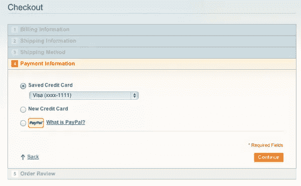

# Magento 中的 PayPal 信用卡令牌化

> 原文：<https://www.sitepoint.com/paypal-credit-card-tokenization-magento/>

作为一个强大的电子商务平台，Magento 长期以来一直支持与 PayPal 的各种信用卡支付解决方案集成。Classy Llama 新发布的 [PayPal 信用卡令牌化](http://www.magentocommerce.com/magento-connect/catalog/product/view/id/18715/s/paypal-credit-card-tokenization-extension-4490/)扩展增加了一个使用 PayPal 的商家非常想念的功能:客户可以保存信用卡以供重复使用。

构建这个扩展在很多方面对 Classy Llama 来说都是一个新的体验，特别是因为我们主要是一个代理而不是一个可分发的扩展开发者。事实上，这是我们第一次尝试为平台的官方市场 Magento Connect 开发扩展。本文简要介绍了该项目是如何发展的，以及开发过程中的一些亮点。

## 丢失的一块

"但是我真的需要允许顾客保留他们的信用卡."我们经常从客户那里听到这种情绪，表达了选择 PayPal 而不是竞争对手 Authorize.Net 作为他们的支付网关或处理器的主要障碍。

你看，我们所说的实际上根本不是存储的信用卡数据。存储敏感支付数据带来的 PCI DSS 合规性对于许多在线商家来说是不可行的，PayPal 和 Authorize.Net API 集成中都存在安全令牌替代方案。这些解决方案允许客户充分体验储值卡，而信用卡数据本身存储在支付提供商而不是商家网站。

然而，Magento 的核心代码库还没有在这两个服务上实现对这些特性的支持。虽然有几个付费的第三方扩展来增强 Authorize.Net 与该功能的集成，但迄今为止 PayPal 还没有现成的选项。

我们一直发现客户不愿意承担为他们的网站开发这种功能的成本。当潜在客户在最近的客户网站规划期间再次出现时，我们决定联系 PayPal:如果结果是一个可分发的扩展，可以为其他商家增加 PayPal 的价值，他们是否愿意为我们的新客户的网站分担开发节省的信用卡功能的成本？

反响热烈。该公司的整合专家和销售人员强烈感受到了这种扩展的缺乏，特别是当许多商家错误地预计 PayPal 可以直接控制 Magento 中包含和不包含的内容时(两家公司都是易贝品牌家族的一部分)。

我们最终有了一个可行的计划来完成一项关键的功能，为当前和未来的客户增加大量的价值。对商家来说，最好的部分是:扩展将是完全免费的，这将使 PayPal 与付费的 Authorize.Net 替代品形成强烈对抗。

这项工作的范围很快成形，除了简单的保存信用卡功能之外，还包括一些额外的功能。由于我们在最初的构建中有一个特定的目标客户，这个客户的特定需求部分地决定了将要包含的功能(支持与 PayFlow gateway 集成的计费协议就是这样一个功能)。然而，本文将主要关注保存的信用卡功能。

## 发展

### 环境

随着可分发扩展的开发，出现了一些特殊的挑战，这些挑战在典型的代理工作中是不存在的。作为一个独立的产品，只有模块本身会进入你的 VCS，而不是整个网站的代码库。然而，在开发过程中，您需要一个集成模块文件的活动环境，而不需要一次又一次地复制这些文件。

通常，在开发过程中，还需要在平台的不同版本之间轻松地测试代码。这些挑战可以通过简单地从您的 VCS 中排除大量的工作文件来解决，但是这并不理想，特别是在 Magento 中，您的定制代码必须在某种程度上分散在核心目录中。

幸运的是，对于 Linux/Unix 或 Mac OSX 环境，有一个工具可以毫不费力地解决这些问题。Colin Mollenhour 的轻量级和优秀的 [modman](https://github.com/colinmollenhour/modman) 脚本特别受 Magento development 的启发，将跨多个工作代码库维护一个项目的工作减少到几个简单的命令(该工具通过将您的项目文件保存在一个中央隐藏目录中并将符号链接放在您的实际代码库中来工作)。过去我们偶尔会使用 modman，这是管理我们 PayPal 扩展的开发环境的明确选择。

### 版本问题

有了一个好的版本测试系统，我们的信用卡令牌化扩展实际上会支持哪些版本？当时 Magento Enterprise 的当前版本是 1.12.0.2；这不仅根据常识是优先的，而且因为将享受项目的第一个成果的客户站点是在这个版本上的新构建。项目范围很清楚，最初与以前版本的兼容性将仅限于那些需要很少额外开发的版本。经过一点分析，我们知道了这个问题的答案，一个罕见而不幸的结局。我们最初的扩展不会向后兼容，甚至不会向后兼容到 1.12.0.0 版本。

原因归结于最近对 PayPal 集成的核心 Magento 配置选项的彻底检查，奇怪的是这发生在 1.12.0.0 和 1.12.0.2 之间。在 Magento 中，这样的设置很容易在 XML 文件的特定扩展名中定义。我们的系统自然需要一些自己的与核心 PayPal 选项集成的功能，而最近的全面更新意味着我们必须使用的 XML 节点结构与以往任何 Magento 版本都有很大不同。

这是一个范围蔓延可能很容易并且很早就开始的点。Magento 的 PayPal 集成的核心代码(甚至是实际访问所述配置选项的代码)在几个版本中变化很小，因此更广泛的兼容性几乎没有其他障碍。然而，额外开发两个版本的扩展配置文件也可能导致测试和调试时间的增加。

虽然版本检测通常是应用程序代码中的一个小技巧，但在 Magento 中，配置 XML 文件是一个没有真正解决这种问题的领域；因此，两个不同的扩展包看起来像是可能的场景，增加了前景的复杂性。

面对所有这些考虑，尽管我们希望发布具有更广泛兼容性的版本，但我们坚持使用范围。我们的扩展最初将支持 Magento Enterprise 1.12.0.2、并行社区 1.7.0.2 和(当时)即将推出的 Enterprise 1.13.0.0。结果，我们在预算内按时发布了一个功能扩展。

### 基础建筑

考虑到范围的简单性，这个扩展实际上没有多少技术实现选择。其中之一涉及到我们的用户界面方法以及这个决定对代码结构的影响。Magento 的核心代码定义了不同的支付方式和 PHP 类，这些 PHP 类在系统的许多类型的 config XML 文件中管理它们。PayPal 支付方式也不例外:

```
<payment>
    <paypal_express>
        <model>paypal/express</model>
        <title>PayPal Express Checkout</title>
        ...
    </paypal_express>
    <paypal_direct>
        <model>paypal/direct</model>
        <title>PayPal Payments Pro</title>
        ...
    </paypal_direct>
    ...
    <verisign>
        <model>paypal/payflowpro</model>
        <title>Payflow Pro</title>
        ...
    </verisign>
    ...
    <payflow_link>
        <model>paypal/payflowlink</model>
        ...
        <title>Credit Card</title>
        ...
    </payflow_link>
    <payflow_advanced>
        <model>paypal/payflowadvanced</model>
        ...
        <title>Credit Card</title>
        ...
    </payflow_advanced>
    ...
</payment>
```

上面大量的 XML 被截断了，但是剩下的显示了 PayPal Express 和扩展支持的四个直接信用卡解决方案是如何定义的。`<payment></payment>`下的每个节点都与付款选项单选按钮列表中的一个项目相对应，客户在结账时会看到这些选项(不包括 PayPal Express，根据商家选择的 PayPal 集成，实际上一次只能启用上述一项)。每个下面的节点定义了负责支付方法行为的 PHP 类。

鉴于这种由一个主类负责一种支付方式的结构，我们需要决定是覆盖现有支付方式的功能更有意义——这将为我们如何呈现保存的卡界面提供很大的灵活性——还是用完全独立的支付方式来扩展它们。

最后，后者最有意义。将使用保存的卡的逻辑保存在它自己的一组类中，以及它自己的绑定到它们的配置设置集合中，是一种更干净的结构。

```
<payment>
    <paypal_direct_customerstored>
        <model>cls_paypal/paypal_stored_customerstored_direct</model>
        ...
        <title>Saved Credit Card</title>
        ...
    </paypal_direct_customerstored>        
    <verisign_customerstored>
        <model>cls_paypal/paypal_stored_customerstored_payflowpro</model>
        ...
        <title>Saved Credit Card</title>
        ...
    </verisign_customerstored>
    <payflow_link_customerstored>
        <model>cls_paypal/paypal_stored_customerstored_payflowlink</model>
        ...
        <title>Saved Credit Card</title>
        ...
    </payflow_link_customerstored>
    <payflow_advanced_customerstored>
        <model>cls_paypal/paypal_stored_customerstored_payflowadvanced</model>
        ...
        <title>Saved Credit Card</title>
        ...
    </payflow_advanced_customerstored>
    ...
</payment>
```

用户界面的结果有点僵硬，但对客户来说非常清楚:“Saved Credit Card”将作为一个单独的选项出现在结账时的单选按钮列表中，如果客户之前选择了保存信用卡的话。



当然，一些基本信用卡方法类的覆盖仍然是必要的。毕竟，首先必须向客户提供保存卡的能力。但是实际上不同的支付处理逻辑将被清晰地分离，而不会侵入到核心集成的类中，每一次都有条件分支。

### 轻微颠簸

上面定义的类结构的一个问题是一个典型的继承问题。碰巧的是，负责我们四个支持的解决方案中的三个——PayFlow Pro、PayFlow Link 和 Payments Advanced——的主要类已经形成了一个继承链，只有微小的变化。我们的“保存卡”版本的所有三个，自然，将几乎相同，我们会喜欢比杠杆继承我们自己的逻辑。

唉，我们的每个类都需要在核心代码中扩展它的对应物。我们最终得到的解决方案是一个两全其美的方案，核心类包含主要的处理逻辑，作为属性引用，而不是由支付方法类扩展。后者上的方法几乎都是简单地调用核心类。其中一个付款类别的截断示例应该可以清楚地说明要点:

```
class CLS_Paypal_Model_Paypal_Stored_Customerstored_Payflowpro extends CLS_Paypal_Model_Paypal_Payflowpro
{
    //...

    protected $_commonPayflowMethod;

    public function __construct()
    {
        parent::__construct();

        // Initialize common method
        $this->_commonPayflowMethod = Mage::getModel(
            'cls_paypal/paypal_stored_customerstored_payflow',
            array(
                'caller_method' => $this,
                //... various other params
            )
        );
    }

    //...

    public function authorize(Varien_Object $payment, $amount)
    {
        return $this->_commonPayflowMethod->authorize($payment, $amount);
    }

    public function capture(Varien_Object $payment, $amount)
    {
        return $this->_commonPayflowMethod->capture($payment, $amount);
    }

    //...
}
```

其他难题浮出水面，到处都被克服了，但都无关紧要。事实上，我们对扩展的开发进展如此顺利感到非常高兴。然而，扩展完成后的一个缺点是，关于各种 PayPal 支付方式的信息被硬编码在核心模块中，这种方式带来了必要的刚性。

您已经在上面看到了通过 XML 定义新的支付方法是多么容易，如果我们的新方法是真正独立的，它们将会在很少侵入核心代码的情况下启动并运行。然而，由于它们依赖于现有的 PayPal 集成代码，因此它们受制于大量直接引用支付方法的类常量实例、指示如何检索配置信息的 case 语句，甚至是支付方法支持哪些国家的硬编码逻辑。

下面是我们自己重写无处不在的 PayPal 配置类的一些片段，展示了我们不得不插入新支付选项的一些地方:

```
class CLS_Paypal_Model_Paypal_Config extends Mage_Paypal_Model_Config
{
    //...

    // "Customer stored" payment methods
    const METHOD_PAYPAL_DIRECT_CUSTOMERSTORED          = 'paypal_direct_customerstored';
    const METHOD_PAYPAL_PAYFLOWADVANCED_CUSTOMERSTORED = 'payflow_advanced_customerstored';
    const METHOD_PAYPAL_PAYFLOWPRO_CUSTOMERSTORED      = 'verisign_customerstored';
    const METHOD_PAYPAL_PAYFLOWLINK_CUSTOMERSTORED     = 'payflow_link_customerstored';

    //...

    public function getCountryMethods($countryCode = null)
    {
        //Countries where this method is available
        //...

        // PayPal Direct 'Stored card' methods
        $countriesByMethod[self::METHOD_PAYPAL_DIRECT_CUSTOMERSTORED] = array(
            'US',
            'CA',
            'GB'
        );

        // PayPal Payflow-based 'Stored card' methods (Payflow Pro defines the list of supported countries)
        $countriesByMethod[self::METHOD_PAYPAL_PAYFLOWADVANCED_CUSTOMERSTORED] =
        $countriesByMethod[self::METHOD_PAYPAL_PAYFLOWLINK_CUSTOMERSTORED] =
        $countriesByMethod[self::METHOD_PAYPAL_PAYFLOWPRO_CUSTOMERSTORED] = array(
            'US',
            'CA',
            'AU',
            'NZ'
        );

        $countryMethods = parent::getCountryMethods($countryCode);

        foreach ($countriesByMethod as $methodCode => $countries) {
            //Add this method to the list of available methods in appropriate countries
            if (is_null($countryCode)) {
                foreach ($countries as $country) {
                    array_push($countryMethods[$country], $methodCode);
                }
            } elseif (in_array($countryCode, $countries)) {
                array_push($countryMethods, $methodCode);
            }
        }

        return $countryMethods;
    }

    protected function _getSpecificConfigPath($fieldName)
    {
        $path = parent::_getSpecificConfigPath($fieldName);

        if (is_null($path)) {
            switch ($this->_methodCode) {
                //...
                case self::METHOD_PAYPAL_DIRECT_CUSTOMERSTORED:
                    $path = $this->_mapStoredFieldset($fieldName);
                    break;
                default:
            }
        }

        return $path;
    }

    public function isMethodAvailable($methodCode = null)
    {
        $result = parent::isMethodAvailable($methodCode);

        if (!$result) {
            return false;
        }

        //...

        switch ($methodCode) {
            case self::METHOD_PAYPAL_DIRECT_CUSTOMERSTORED:
                if (!$this->isMethodActive(self::METHOD_WPP_DIRECT)) {
                    $result = false;
                }
                break;
            case self::METHOD_PAYPAL_PAYFLOWADVANCED_CUSTOMERSTORED:
                if (!$this->isMethodActive(self::METHOD_PAYFLOWADVANCED)) {
                    $result = false;
                }
                break;
            case self::METHOD_PAYPAL_PAYFLOWLINK_CUSTOMERSTORED:
                if (!$this->isMethodActive(self::METHOD_PAYFLOWLINK)) {
                    $result = false;
                }
                break;
            case self::METHOD_PAYPAL_PAYFLOWPRO_CUSTOMERSTORED:
                if (!$this->isMethodActive(self::METHOD_PAYFLOWPRO)) {
                    $result = false;
                }
                break;
        }

        return $result;
    }

    //...
}
```

最后，我不能肯定地说我能以任何更灵活的方式构建这样一个复杂的集成。然而，这种情况可能会发生，像这样的硬编码元素的最终结果更有可能是需要少量的重新工具来支持未来的 Magento 版本。

### 无需担心 API

事实上，它主要是一个 web 服务集成，这个扩展依赖于 API 调用其核心功能。然而，在这个领域，我们的任务变得非常简单，因为我们只是增强了现有的集成。Magento 的核心已经定义了发出适当请求的类，事实上我们根本不需要定义低级代码来构造 API 调用。

我们的扩展涉及 PayPal 的两个名称-值对(NVP)API——direct API 和 PayFlow gateway API。Magento 的 Mage_Paypal_Model_Api_Nvp 类定义了前者的逻辑，而后者直接在 PayFlow Pro 支付方法类及其后代中处理。一些直接 API 类的简单介绍:

```
class Mage_Paypal_Model_Api_Nvp extends Mage_Paypal_Model_Api_Abstract
{
    /**
     * Paypal methods definition
     */
    const DO_DIRECT_PAYMENT = 'DoDirectPayment';
    const DO_CAPTURE = 'DoCapture';
    const DO_AUTHORIZATION = 'DoAuthorization';
    //... (other constants for API method names)

    protected $_globalMap = array(
        // each call
        'VERSION'      => 'version',
        'USER'         => 'api_username',
        'PWD'          => 'api_password',
        'SIGNATURE'    => 'api_signature',
        //... (other API parameters and the properties they map to on this class
    )

    //...

    protected $_doAuthorizationRequest = array('TRANSACTIONID', 'AMT', 'CURRENCYCODE');
    protected $_doAuthorizationResponse = array('TRANSACTIONID', 'AMT');

    //...

    public function callDoAuthorization()
    {
        $request = $this->_exportToRequest($this->_doAuthorizationRequest);
        $response = $this->call(self::DO_AUTHORIZATION, $request);
        $this->_importFromResponse($this->_paymentInformationResponse, $response);
        $this->_importFromResponse($this->_doAuthorizationResponse, $response);

        return $this;
    }
}
```

我们主要关注的是所谓的参考交易，因为这是 PayPal API 的关键令牌化功能，使我们的“保存信用卡”版本能够工作。事实证明，至少在 direct API 方面，我们非常幸运，因为引用事务是核心集成已经支持的特性(计费协议)的必需组件。

很高兴发现已经在 API 类上定义了一个`callDoReferenceTransaction`方法，我们只需要设置正确的属性并从我们的支付方法类中调用它:

```
class CLS_Paypal_Model_Paypal_Stored_Customerstored_Direct extends CLS_Paypal_Model_Paypal_Direct
{
	//...

    protected function _placeOrder(Mage_Sales_Model_Order_Payment $payment, $amount)
    {
        // Get Reference ID
        $paymentStoredCardId = $this->getInfoInstance()->getData('stored_card_id');
        $referenceId = null;

        if ($paymentStoredCardId) {
            $storedCardModel = Mage::getModel('cls_paypal/customerstored')->load($paymentStoredCardId);
            if ($storedCardModel->getId()) {
                $referenceId = $storedCardModel->getData('transaction_id');
            }
        }

        //...

        $order = $payment->getOrder();

        $api = $this->_pro->getApi()
            ->setReferenceId($referenceId)
            ->setPaymentAction($this->getConfigData('payment_action'))
            ->setIpAddress(Mage::app()->getRequest()->getClientIp(false))

            ->setAmount($amount)
            ->setCurrencyCode($order->getBaseCurrencyCode())
            ->setInvNum($order->getIncrementId())
            ->setEmail($order->getCustomerEmail());

        //...

        // call api and import transaction and other payment information
        $api->callDoReferenceTransaction();
        $this->_importResultToPayment($api, $payment);

        //...

        return $this;
    }

}
```

我们预计基于支付流的解决方案会有更多的工作要做，但即使在这里，事情仍然相当简单。事实上，PayFlow API 并不期望在请求参数中有明确的方法名。仅通过在事务类型(例如，授权或捕获)之外包含一个`ORIGID`值来执行引用事务。

通过获取和设置适当的令牌，我们开始工作了。涉及的主要类不长于此:

```
class CLS_Paypal_Model_Paypal_Stored_Customerstored_Payflow extends CLS_Paypal_Model_Paypal_Stored_Payflow
{

    //...

    protected function _placeOrder(Mage_Sales_Model_Order_Payment $payment, $amount, $transactionType = self::TRXTYPE_AUTH_ONLY)
    {
        // Get Reference ID
        $paymentStoredCardId = $this->_commonMethod->getInfoInstance()->getData('stored_card_id');
        $referenceId = null;

        if ($paymentStoredCardId) {
            $storedCardModel = Mage::getModel('cls_paypal/customerstored')->load($paymentStoredCardId);
            if ($storedCardModel->getId()) {
                $referenceId = $storedCardModel->getData('transaction_id');
            }
        }

        //...

        // Prepare and run 'Reference Transaction' request
        $request = $this->_buildBasicRequest($payment);
        $request->setTrxtype($transactionType);
        $request->setAmt(round($amount, 2));
        $request->setOrigid($referenceId);

        $response = $this->_postRequest($request);
        $this->_processErrors($response);

        //...

        return $this;
    }

}
```

事实上，与我们保存的信用卡功能相比，我们要为 PayFlow Pro billing agreement 支付方法(不是本文的重点)做更多的 API 映射工作。

### 前方的路

目前，PayPal 信用卡令牌化扩展最明显的限制是其严格的兼容性要求。我很高兴地告诉大家，在不久的将来，我们已经走上了拓宽与以前 Magento 版本兼容性的轨道。(如果你愿意，请关注我们的博客，获取更新。)

此外，我们还希望在未来增加许多其他功能。例如，对 Magento 的循环支付模式的支持将是保存信用卡的自然选择。当我们计划扩展的未来时，我们将密切关注最需要的功能。

Magento Connect 的第一个扩展的开发对 Classy Llama 来说是一次重要的学习经历，也是一次非常积极的经历。我们很高兴看到 PayPal 的令牌化功能可以为 Magento 商家带来的好处。

## 分享这篇文章