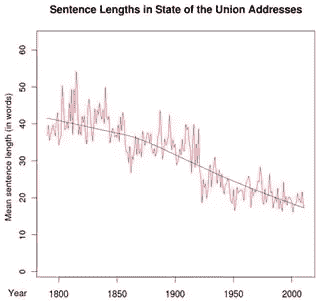
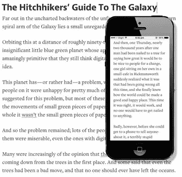
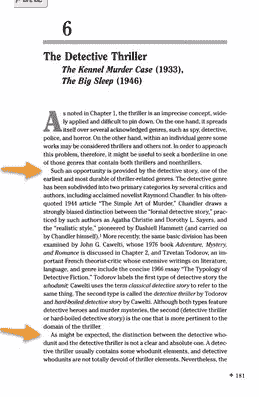

# 网络有没有完美的段落长度？

> 原文：<https://www.sitepoint.com/perfect-paragraph-length-even-care/>

大宪章的原始文件

这是写于 1215 年的[大宪章](https://en.wikipedia.org/wiki/Magna_Carta)原文。羊皮纸在 11 世纪非常昂贵，所以节俭的抄写员用细小密集的拉丁文书写。

虽然它很漂亮，但段落的缺失让它看起来很难懂——即使考虑到拉丁文。我们现代人的眼睛很难穿过那堵纯粹的文字墙。

### 为什么我们甚至需要段落？

段落在写作中有三个有用的目的。首先，它们帮助作者整理和组织他们的思想。第二，当读者阅读文本时，它们给读者“休息点”。

最后，段落为我们提供了文档的入口和出口点——导航文本的捷径。这在网络上特别有用，我们知道读者浏览、浏览和阅读文本的次数远远多于阅读印刷文本。

### 理想的段落长度是多少？

随着时间的推移，SOTU 的句子长度–来源:[语言日志](http://languagelog.ldc.upenn.edu/nll/?p=3534)

可以预见的是，这个问题有很多答案，但 200 年来普遍的共识越来越少。

Language Log 的马克·利伯曼写了一个脚本[分析了自 18 世纪末以来每一位美国总统的“就职演说”和“国情咨文”的结构](http://languagelog.ldc.upenn.edu/nll/?p=3534)。当然，句子长度和段落长度不同，但肯定有关系。

正如马克的图表所示，平均句子长度已经从每句 40 多个单词下降到 2011 年的不到 20 个单词。我对这种趋势没有意见，但有些人有。

无论驱动力是什么，我们长期以来一直在不断选择更短的句子和段落。

其他地方[鲍勃·布鲁克的作家之角](http://www.bobbrooke.com/WritersCorner/paragraphswhentouse.htm)建议你:

> 试着把你的段落限制在五行之内，而不是句子。如果太长，就把它分成一系列的副主题段落。

当然，网络上的“五行”随着设备的不同而不同。

雅虎！风格指南说:

> 保持段落简短。两到三句话就足够了。

### 这给我们带来了一个有趣的问题

作为联邦政府官员/设计师/UX 人，我们负责设置字体大小、行高、字距、对比度和所有其他排版选择，以创造最佳的用户体验。

1)为我们的版面设计理想的段落长度也是我们的工作吗？(我怀疑大多数人会说不)。

2)对于不同的屏幕尺寸,“理想的”段落长度肯定是不同的？在 Kindle 或台式机上阅读最舒服的东西肯定和在 iPhone 上效果最好的东西不一样。

段落的效用在小屏幕上消失了。

以两个设备上的相同文本为例:

在上面的手机上，当你一次只能看到一段或者最多两段的时候，很多段落的用处就开始消失了。我们得到了一面更加“大宪章式”的文字墙。

### 那么，我们能做什么呢？

在一个完美的世界里，为不同的设备重写内容可能是有意义的——“响应内容”。毕竟，我们在火车上阅读和躺在床上阅读有着不同的需求和期望，对吗？

当然，为每个设备/屏幕编写不同内容的实用性(和工作量)排除了这种可能性(至少目前如此)。

但我一直在想，可能有一个布局技巧可以帮助(稍微)将更多有用的段落放到手机屏幕上，而不需要大幅缩小文本大小。

在网络上，段落几乎总是以同样的方式呈现:它们以非缩进的文本开始，以等于空行的底部填充结束(就像这篇文章)。

但这只是呈现段落的一种方式——尽管是我们今天看到的最常见的方式。直到最近，大多数书都是这样的:

段落没有额外的底部填充，只是在第一句话上缩进了几个空格。几乎所有的书籍和报纸都使用这种段落风格长达 200 年，直到 20 世纪 60-70 年代它开始逐渐过时。

也许现在有一个很好的理由来重新介绍这个老技术——*仅仅是*用于我们的小屏幕布局？我们的宽屏不会改变，但是媒体的询问让我们只能在移动视图上更有效地使用这些段落分隔符。

这让我们在大屏幕上保持熟悉的呼吸空间，但在小屏幕上可能会提供更多的可读性和更好的 UX。这不会很戏剧化，但是把三段放在屏幕上可能就足够了，而不是两段。

这需要一些适当的 UX 测试，但我认为它有价值。

#### 你怎么看？

*原载于 [SitePoint 设计简讯](https://www.sitepoint.com/newsletter/)*

## 分享这篇文章