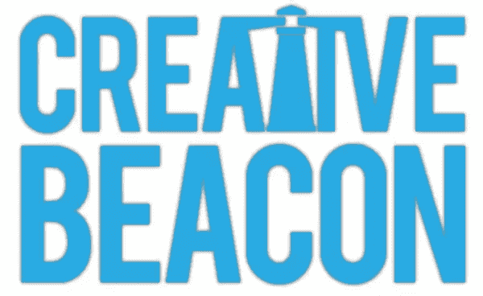
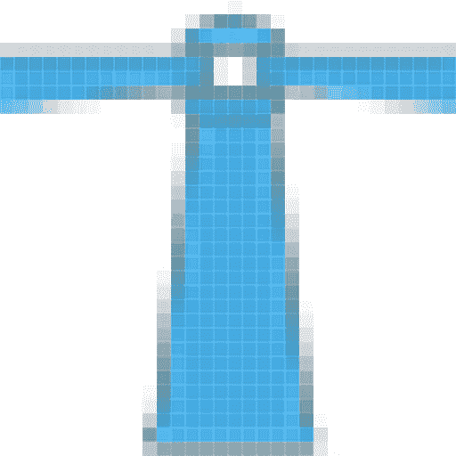
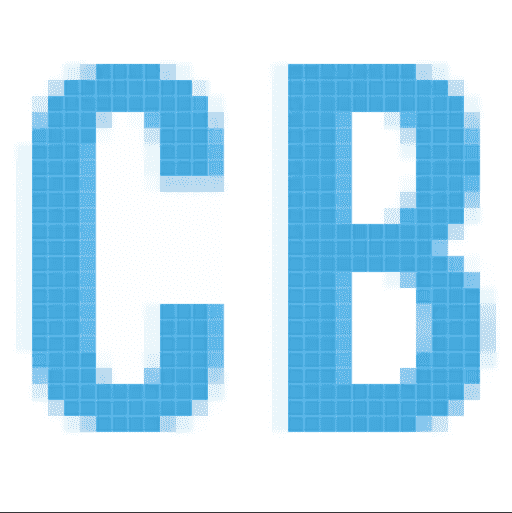

# 完善你网站的图标

> 原文：<https://www.sitepoint.com/perfecting-your-websites-favicon/>

### 什么是 Favicon？

当你访问一个你喜欢的网站时，你可以把它添加到你的收藏夹，为以后做书签。您可以使用任何浏览器很好地组织您的书签，但过一会儿，您的书签可能会开始堆积。你如何区分一个书签和另一个？也许你希望能够直观地识别一个站点的书签，而不必阅读每一个站点的名称和描述。这就是网站图标发挥作用的地方。favicon 是一个 16x 16px 或 32x 32px 的小图标，显示在浏览器的书签(或“收藏夹”)列表中，位于其 URL 旁边。在这里，您可以放置您的徽标或一个小的、可识别的图像，只需少量像素就能有效地代表您的站点。

### 创建收藏夹图标

你可以在任何你喜欢的图片编辑器中创建一个 favicon。您将不得不在以后转换您的文件，但最初的创建可以在 Photoshop 等程序中完成。您可以从创建一个 32px 乘 32px 或 16px 乘 16px 的新文档开始。我建议从大尺寸开始，因为大多数浏览器会缩小图标以适应其用途。较大的尺寸将用于显示较大的图标。

有了空白的画布，你的图标外观可以遵循几条不同的路线。如果你有一个现有的网站或标志，你会想把你的设计元素融入到你的网站图标中。你的空间非常有限，所以它可能是你的标志的缩略版本，或者是你在网站上使用过的签名字体。

使用如此小的格式可能是一种痛苦，但是如果你使用 Photoshop，你可以放大很远，以确保你的 favicon 是像素级的。只要确保以实际尺寸查看您的图标，以确保它在真实尺寸下具有理想的外观。我放大到 1600%，以建立我的。在这种接近微观的水平上工作将有助于调整对齐和尺寸；你可以简单地使用箭头键在一个主要方向上轻推你的图标。

一个有效的网站图标的关键是在正面和负面空间之间保持平衡。如果你把你的图标填得太满，就没有足够的空间来辨认它是什么。尤其是当你用字母作为你的图标时。

我将使用 Creative Beacon 作为现实生活中的例子(如上所示)。徽标由网站名称和嵌入字体的灯塔组成。这提供了一个很好的视觉来说明信息。我们的图标有两种选择。第一个可能是审查出灯塔，并使用它作为图标。我使用套索工具，简单地复制和粘贴。当我缩小到实际尺寸时，我看不出它是什么。你根本看不出那是一座灯塔。

另一个想法是使用标志的两个单词的第一个字母，当然是“C”和“B”。我使用了相同的字体，贸易哥特式，并使用了相同的标志中发现的蓝色签名。我将字母居中，但没有收紧字距。通常，我会把“C”和“B”拉得更近，但是我们必须记住，这将是 16px 乘 16px，负空间将真正有助于定义形式。这将使它们易于阅读和识别。

你也要避免使用长的或高的图像，或者任何有很多细节的东西，因为它在这么小的尺寸下会分解。毕竟，在你的设计中，你通常只使用 16px 乘 16px。关键是保持简单。

让我们比较一下我们以实际大小创建的两个图标，你马上就能看出哪个更好。在下面的例子中，灯塔是不可识别的。我知道它是灯塔的唯一方法是因为我创造了这个图标。然而，你可以很容易地读出 C 和 B。我们使用了对比鲜明的颜色。例如，我不会用海蓝宝石作为我的图标的背景色，因为这会使字母难以阅读。在这种情况下，lighthouse 就不能很好地工作，所以要确保你选择了适合你网站的正确格式。

### 图标文件格式

如果你上传一个 GIF 或者 PNG 文件，你的 favicon 会有 alpha 透明度，所以如果你的图标出现在 Firefox 的标签中，它后面不会有方形背景。这可以为你的小画布提供一些罕见的创造力，因为如果你想要在你的收藏夹中有一个独特的非方形形状，你可以相当容易地实现它。请注意，在我创建的 favicon(使用 JPEG 文件格式)中，白色背景出现在 Firefox 的标签中，如下所示。如果你不想这样，那么你会希望将你的初始设计保存为 GIF 或 PNG 格式。

### 上传您的收藏夹图标

一旦你决定了一个网站图标，你可以在线搜索一个网站图标生成器。这使得任何人都可以轻松地从 JPEG、GIF 或 PNG 文件类型生成 favicon。我在这里找到了一个很好的图标生成器。只需单击左侧菜单栏中的上传图像，然后选择您之前在 Photoshop 中创建的文件。他们可以选择缩小以适应一个正方形或保持其当前格式。我们不想压扁我们的图标；我们已经创建了一个方形图标。

您可以预览您的 favicon 外观，如果您满意，您可以下载自己的自定义 favicon。完成后，单击下载链接下载您的网站图标。ico 格式。现在，我们要做的就是把图标放在你网站的根目录下。当浏览器打开你的网站时，他们会寻找这个。请注意，在下面的例子中，我的新 favicon 出现在浏览器的 URL 旁边。

你的图标可能不会立即出现，尤其是如果你之前有一个通用的图标。不要绝望，只需清空浏览器缓存，重启浏览器。如果这不起作用(尤其是如果你正在使用 Safari ),你将不得不重置 Safari。

### 结论

为你的网站创建一个 favicon 并不难，但是很少有设计师会仔细考虑这个问题。在竞争激烈的网络世界中，这是将你的网站与其他网站区分开来的为数不多的机会之一，也是让你更有可能回到你的网站(通过点击浏览器书签)的机会之一。没有网站图标——或者更糟，没有运行网站的 CMS 软件的网站图标——是一个常见的、容易修复的错误，它会使你的网站和你的书签页面混在一起而不被注意。

您可以在几分钟内创建自己的自定义图标。通过遵循一些简单的规则，你可以让你的网站图标脱颖而出，并鼓励人们再次访问，比如给它足够的对比度、足够的空间，以及让你的网站图标非常简单。你想要立即得到认可、回访和品牌强化。

关于创建你的自定义图标，你有什么建议要分享吗？你在网上有一些最喜欢的图标吗？请在下面的评论中与我们分享。

## 分享这篇文章