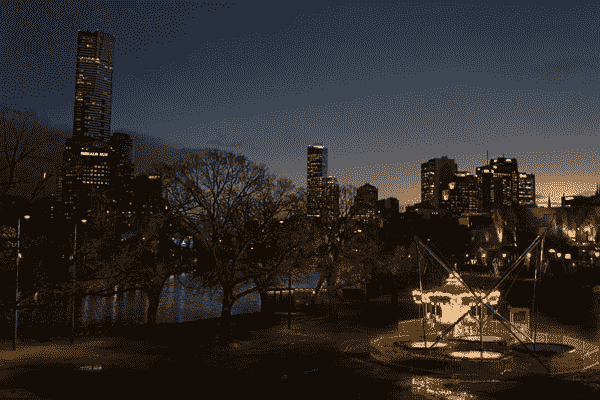
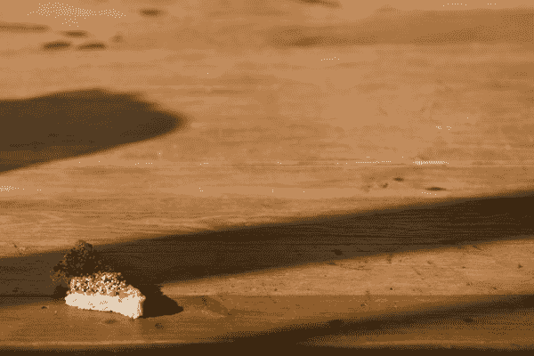
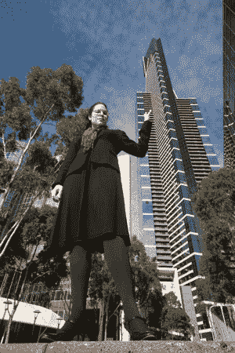
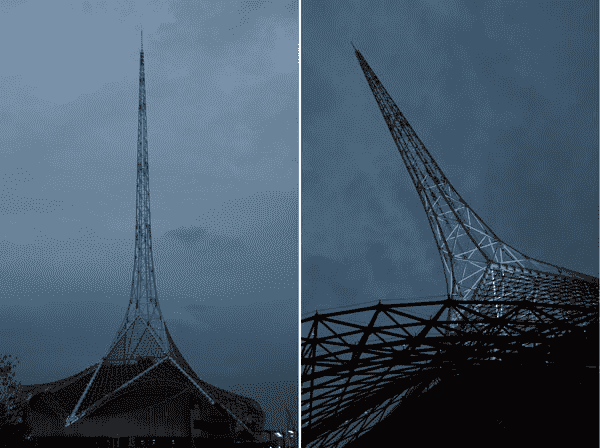
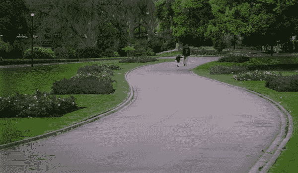
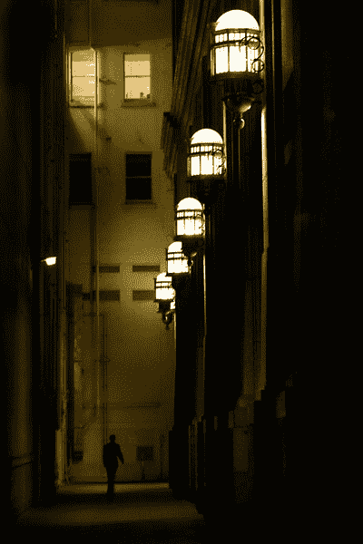

# 如何拍出非凡的照片，第二部分:构图

> 原文：<https://www.sitepoint.com/photography-for-the-web-composition/>

Paul Duncanson 的《网络摄影》 是 SitePoint 图书出版公司的最新版本。它包含所有你需要知道的把你的标准相机拍摄的照片转换成令人印象深刻的华丽图像。你可能已经知道，我们已经将《T4》的第一章和第二章作为该书的免费样本 PDF 的一部分，几周前，我们发表了一篇关于曝光的[文章，摘自该书。这篇文章是从第二章摘录的，讲述了写作的原则。请继续阅读以了解更多信息，或者下载免费样本，在方便的时候离线阅读这两章。](https://www.sitepoint.com/article/photography-for-the-web-exposure)

构图是在场景中放置元素以使其更具美感的艺术。这是一个已经写了很多书的主题。这里我给你一个构图的一些基本原理的概述。我们不会告诉你以某种方式拍照，而是向你展示一些吸引观众兴趣的成熟技术，鼓励他们探索照片，而不只是盯着它的表面。

## 构成

好的构图源自许多不同的设计原则，而这些原则又基于我们对视觉线索反应的心理学和神经学。为了使用它们，没有必要知道这些原则起作用的潜在原因；几千年前首次注意到它们的艺术家只是观察人们对场景、图像和物体的反应，并推断出他们可以应用于创作新作品的原则。

有效的作文可能是偶然发生的。有时一切都完美地排列在一起:你看到一个场景，当你通过取景器看时，它正是你希望它出现的方式。更多时候，并不是这样。最好的构图通常需要摄影师的努力。有时是场景中物体的仔细排列，有时只是找到合适的拍摄角度。顶级广告摄影师可能会为一张照片花费数周的计划、数天的布置和数小时的微调。风景摄影师不能这么容易地安排他们的主题，但他们可以花几个星期寻找最佳角度的位置，然后再等几个星期，等待光线和天气合适。

没有人指望你花那么多时间去拍照，但是如果你在点击之前花点时间来构建你的照片，你可能会惊讶于你的图像会有多大的改善。

在接下来的几页中，我们会发现一些你在创作图像时可能用到的构图元素。如果您的图像要工作，这些并不是您必须遵循的严格规则(即使它们中至少有一个被称为规则)。专业摄影师有时会故意忽略它们，以达到很好的效果。然而，在你练习和提高技能水平的时候，记住它们是很有用的。

## 焦点

用一个从其他元素中脱颖而出的突出物体或区域来给你的图像加框，让观看者可以轻松地进入图像，一个他们可以探索其他元素并在他们移开视线之前返回的地方。在你拍摄之前，考虑你的照片是关于什么的是一个好主意，这样你就可以围绕那个物体或主题来拍摄。

当你给照片加框时，把主体放在不模糊的地方，这样就不会有其他东西分散观众对主体的注意力。如果主体占据了画面的很大一部分，聚焦于一个突出的特征。(如果是人，重点看他们的眼睛。聚焦的眼睛在观众和肖像之间建立了更强的联系。)如果你无法避开周围繁忙的场景，使用浅景深来模糊背景，这样就不会将注意力从主体上转移开。通过清晰地展示被摄主体，让观众清楚你为什么要拍摄。

如果你的场景包含许多元素，记住哪个物体首先引起了你的注意。它很有可能是一个比其周围明显更亮的点(除非它是一个明亮的场景，在这种情况下，它可能比附近的区域明显更暗)。我们的注意力自然会被吸引到局部对比度高的区域——图像中亮度差异较大的小区域。最高的对比点往往是我们首先看的地方，如果那是你的主题，人们就会看它。当你构图的时候，试着把你的主体框在最亮的地方或者最亮的地方。

**图一。旋转木马的明亮灯光**

在[图 1，“旋转木马的明亮灯光”](#fig_basics_carousel "Figure 1. The bright lights of the carousel")中，前景中旋转木马的明亮灯光提供了一个焦点，从这里你的注意力可以漫游到城市景观的其他景点。你的注意力很可能首先被那些明亮的灯光吸引。从那里，你可以在影像中漫步，看到落日余晖中依然闪耀的天际线，看到侵入昏暗天空的高楼上的灯光，看到河面上反射的灯光，然后回到旋转木马。有一个主要的焦点，但不仅仅是一个要看的东西，当设计风景风格的照片时，这是值得瞄准的:一个鼓励观众看的焦点，其他有趣的地方让他们继续看。

如果你拍摄的是一片开阔的风景，没有太多突出的特征，选择一个来聚焦，放在画面的显著位置，即使里面没有其他东西。有时，传达空虚感的最佳方式是在画面中找到(或放置)一个物体，通过它的存在，强调图像其余部分的贫瘠。空表可能意味着一个事件的开始或结束，或者两者都不是。加上一份被抛弃的零食，如图[图 2，“派对结束了”](#fig_basics_party_over "Figure 2. The party is over")，很明显，派对结束了。

**图二。派对结束了**

当你下一次拍摄一个地点或风景时，练习在场景中找到一个物体作为你的焦点，而不是胡乱地指向。

**tip:** Telling a Story

当一张照片的兴趣点被排列好，让观众的注意力在它们周围游走时，它们就开始讲述一个故事。我们根据物体和人相对于彼此的位置、人们看的地方以及他们看起来要去的地方对正在发生的事情做出假设。一张静止的照片不能移动或改变，但是移动和改变可以被暗示，一个叙述可以被解读到其中。当人们开始从你的照片中解读故事时，你真的吸引了他们的注意力。

## 观点和角度

你看待一个主题的角度传达了很多关于这个主题的信息，以及你对这个主题的看法。从上方以陡峭的角度拍摄的大型对象对观众来说显得很小，因为当他们看图像时，他们似乎比它更高。同样，一个从下方拍摄的小物体似乎笼罩着观众，即使我们知道它很小，它也会显得更大。一个人可以和最高的建筑一样高，如图 3[所示，“一个人可以和最高的建筑一样高”](#fig_basics_tall "Figure 3. A person can appear as tall as the tallest building")，如果从正确的角度拍摄。

**图 3。一个人可以看起来和最高的建筑一样高**

除了大小的印象之外，我们拍照的角度也能告诉我们很多关于这个主题的信息，我们可能是这个意思，也可能不是。“看不起”我们鄙视的东西不仅仅是一个比喻。我们通常把更重要或更有价值的东西放在比我们认为不太重要的东西更高的地方。以奥运会颁奖为例。获胜者的位置高于第二名，第二名的位置高于第三名。“顶架”产品是更贵的产品，通常比便宜的产品放在更高的货架上。如果你想展示一个人的重要或强大，从上面拍摄他们会产生相反的效果。从他们的水平(或稍低的水平)拍摄孩子可以显示一个正在成长的人，而不是一个很小的人。

距离也会让拍摄对象看起来更小。一个被很多很多开放空间包围的人可能看起来很小、迷失或者不重要。如果这个人很重要，即使只是对你来说，放大。如果你不能放大，就靠近拍摄对象。

当你拍摄一个熟悉的主题时，尤其是一个已经被拍摄了很多次的主题，如果你找到一个不同的视角，你的照片会更有趣。有时你不能改变灯光或物体的位置，但你可以改变拍摄的位置。选择一个不同的有利位置或一个不寻常的视角可以让一个无聊的镜头和一个人们想看的图像完全不同。除非它是一个快速移动的物体，你必须快速拍摄或错过它，否则花时间探索各种角度和观点。使用你的取景器，以确保一切都在画面中，并看到主体如何填充画面。

这两张墨尔本艺术中心塔尖的照片是用完全相同的相机拍摄的，仅相隔 7 分钟。在[图 4 中，“当平淡和有趣的区别是一个角度，一个观点，七分钟”](#fig_basics_dullsandgoodpire "Figure 4. When the difference between dull and interesting is an angle, a point of view, and seven minutes")左边的照片比较平淡，而右边的则有趣得多。视角和角度是两次拍摄之间唯一改变的方面，然而它们决定了一张乏味的照片和一张更引人注目的照片之间的区别。

**图 4。当枯燥和有趣的区别是一个角度，一个观点，七分钟**

尝试不均匀或有角度的观点。你可以看到，通过倾斜第二张尖顶照片的框架，我们获得了一个更加动态的图像。强烈的对角线和更大的线条交汇暗示着运动，尽管实际上并没有运动。第一张照片的标准水平视图就在那里，而倾斜视图似乎要去某个地方。

## 线条和角度

线条，特别是汇合的线条，通向各个地方。如果我们看到一组在图像上汇聚的线，我们本能地认为这是透视的效果，越窄的一端越远；即使我们能清楚地看到事实并非如此，我们仍然有那种感觉。线条赋予图像深度，观众的目光随着线条从前景到背景进入图像。观众的注意力不仅仅被一个点吸引，所以他们倾向于看得更远。

一条蜿蜒通向远方的路径，从前景开始，然后深入图像，是观众的目光自然会跟随的那种特征。把你的主题放在一条路上的某个地方，如图 5 中的[“领你走上花园小径”](#fig_basics_garden_path "Figure 5. Leading you up the garden path")，这是一个暗示故事的简单方法——一个人正走向或远离你。当观众被引导进入图像，并被提示阅读其中的故事时，他们会比主体站在一个空白的摄影棚中时更加投入。

**图 5。带你走上花园小径**

线条甚至不需要完整和连续。当一个镜头中有足够多的点排成一行时，它们将被解读为一条指向一个点的线，如图[图 6 所示，“灯光标记了通向我们阴影中的人的道路”](#fig_basics_nightline "Figure 6. Lights mark the path leading to our man in the shadows")。在这里，黑暗中的一排灯光形成一条线，将我们的目光吸引到阴影中的那个人。

**图 6。灯光标志着通向我们阴影中的人的道路**

即使你的场景中没有真正的路径或运动感，一张照片通常可以通过暗示方向感和深度感来改善。简单地倾斜你的观点就能产生戏剧性的效果。即使没有任何收敛，对角线也会让我们想到运动。他们建议透视，不像直的垂直和水平。

下一次你拍照的时候，在你的场景中寻找线条，并注意它们通向哪里。试着找到一个拍摄的角度，用它们来引导你的视线进入图像。

## 分享这篇文章