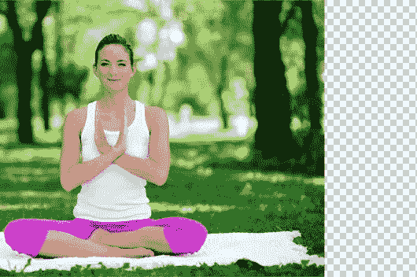
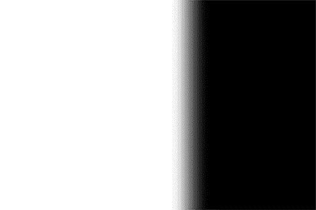

# 在 Photoshop 中使用图层蒙版淡化和混合图像

> 原文：<https://www.sitepoint.com/photoshop-fade-layer-mask/>

不管你是摄影师还是平面设计师，你都有可能在 Photoshop 中需要淡化或混合图像。有许多不同的方法和技术可以帮助你将图像融合在一起。其中一种叫做图层蒙版。即使使用图层蒙版，也有不同的技术将一个图层与另一个图层混合。

一种方法是在图层上创建图层蒙版，然后使用画笔工具在要蒙版或与黑色混合的区域上绘画。除了白色以外的任何正值都将允许您实现柔化蒙版。最浅的灰色将混合面具的边缘。

另一种方法是使用渐变工具以统一的方式混合图像。要记住的关键短语是:黑遮白露。这意味着你在图层蒙版上用黑色绘制的任何地方都会使该图层上的图像褪色。如果你已经淡化或混合图像太多，只需切换你的画笔颜色为白色。白色将带回该层的图像。

## 第一步:将你的图像导入 Photoshop

在 Photoshop 中打开你的图片。根据你想要的方向，你可以设置你的文件来遮盖图像的一部分。我下载了一张做瑜伽的女人的照片。你可以在这里下载[。](http://www.pixmac.com/picture/woman+practising+yoga/000002033181)

## 第二步:解锁你的背景层

双击[背景层](https://www.sitepoint.com/remove-background-photoshop/)解锁。这将允许你随意移动它。当图层被锁定时，您不能移动该图层上的图像。Photoshop 将显示一条弹出消息，提醒您图层已被锁定。

## 第三步:定位你的形象

根据需要在文档中放置图像层。这可能意味着你必须裁剪你的图像，或者移动它。如果你移动它，使它的一部分离开画布，这没问题。图像的这一部分不会被打印，也不会显示在拼合文件中。我把我们的瑜伽图像移到了左边，这样左边的大部分就不会出现在屏幕上了。这将在右侧留出放置文本的空间。

## 步骤 4:在你的图片下面添加一个新图层

在你的照片下面新建一个图层。我们将填充这一层纯色，并混合照片，以缓解照片和纯色之间的过渡。

## 步骤 5:从你的图像中取样一种颜色

使用这种技术时，从照片中选择一种颜色通常是个好主意。这种技术给你的作品增添了一种统一感。我从那个女人的裤子上取样了一种暗粉色。我用这种颜色填充了照片下面的空白层，方法是按住 option/alt 键，然后按 delete 键。

## 第六步:融合你的形象

在“图层”面板中，确保选择了带有照片的图层，然后单击图层蒙版图标。这将为您的照片创建一个空白遮罩。当图层蒙版图标周围出现黑色轮廓时，您就知道蒙版处于活动状态。选择渐变工具，从照片的右边向左画一个黑色到白色的渐变。不要超过照片右边的四分之一或五分之一。如果遮罩太多或不够，请按住 command/ctrl 键并按 Z 键撤销渐变，然后再试一次。

## 第七步:添加一些类型

选择您的文本工具并键入您的文本。我从背景中的树叶中选取了黄色，因为这将有助于进一步统一我们的设计，黄色非常适合粉红色/紫色。

## 第八步:创建一个清晰的阴影

复制文本层，对于底部的文本层，双击“T”图标选择该层中的所有文本。单击工具箱中的前景色样本，打开拾色器。当您将鼠标悬停在文件上时，会自动获得吸管工具。使用吸管工具，为底部文本层选择一种较暗的绿色。选择移动工具，使用箭头键时，按两次左箭头和两次下箭头。这给你的字体增加了一个很好的阴影效果，同时使用你照片中的颜色。

如果你喜欢读这篇文章，你会爱上[可学的](https://learnable.com?utm_source=sitepoint&utm_medium=link&utm_campaign=learnablelink)；向大师们学习新技能和技术的地方。会员可以即时访问 SitePoint 的所有电子书和互动在线课程，如[Photoshop](https://learnable.com/courses/foundations-of-photoshop-2712?utm_source=sitepoint&utm_medium=link&utm_campaign=learnablelink)基础。

对本文的评论已经关闭。对 Photoshop 有疑问？为什么不在我们的[论坛](https://www.sitepoint.com/forums/forumdisplay.php?8-Graphics?utm_source=sitepoint&utm_medium=link&utm_campaign=forumlink)上问呢？

## 分享这篇文章