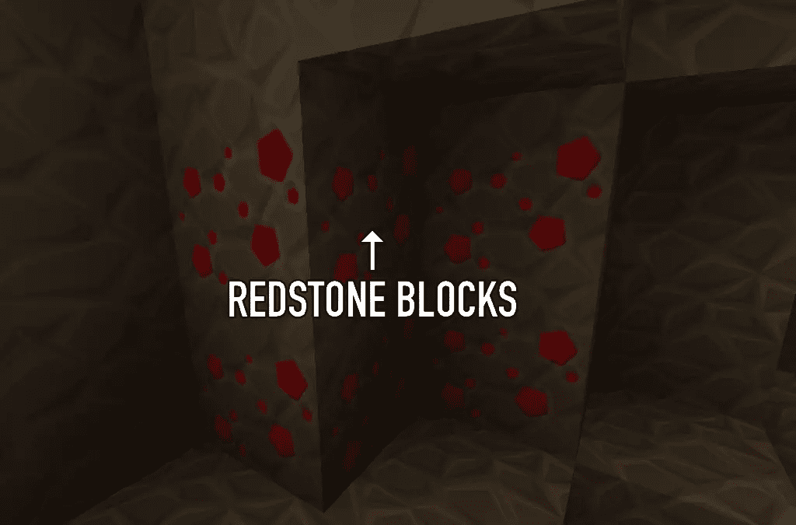
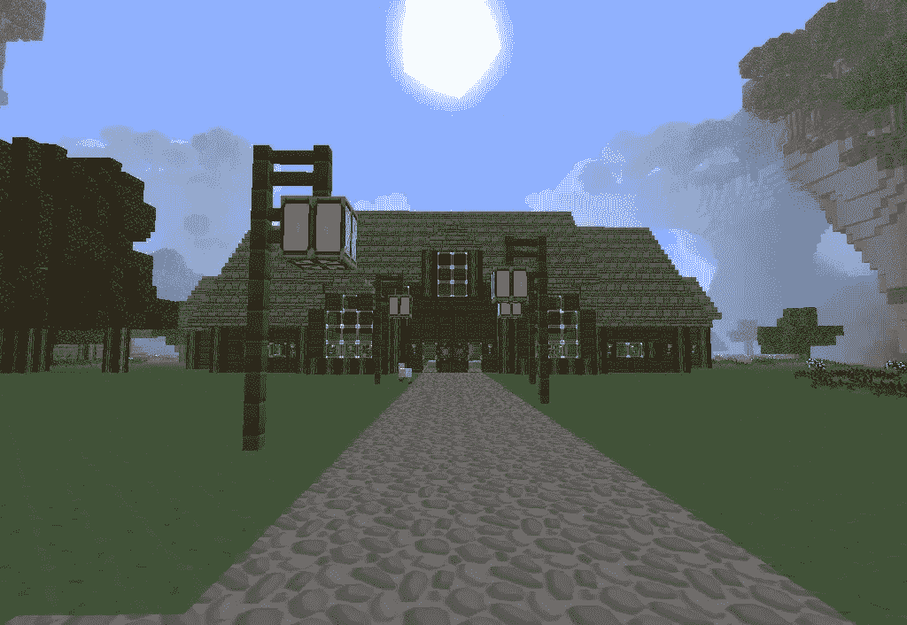
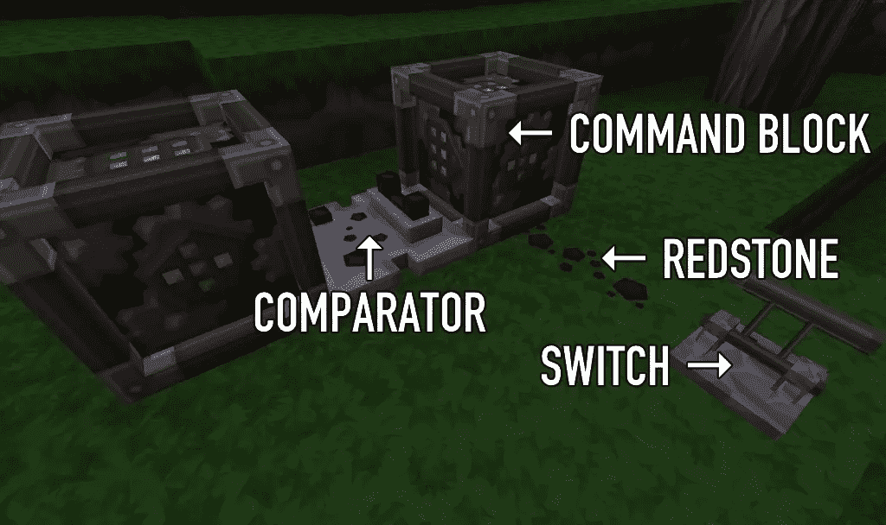
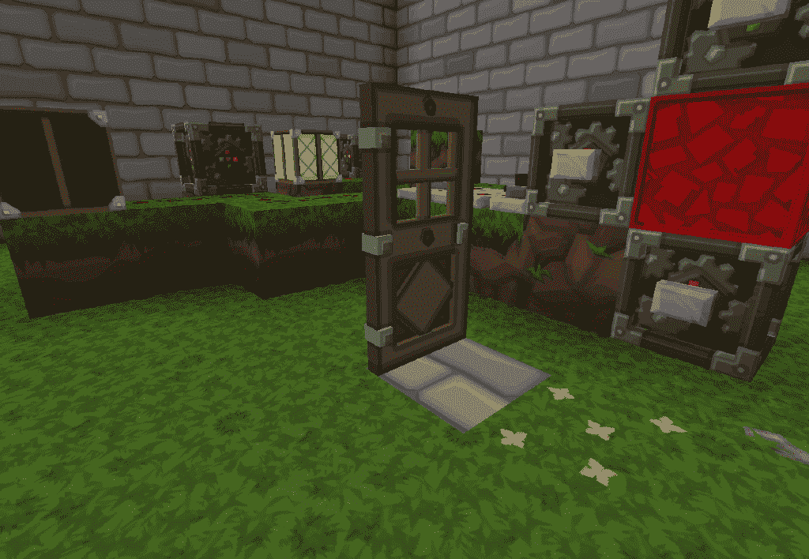
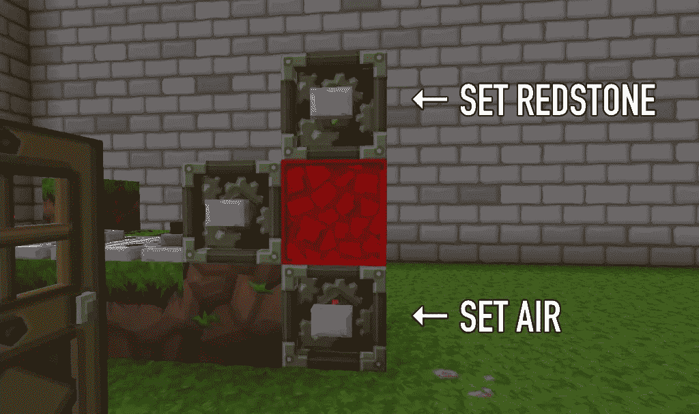
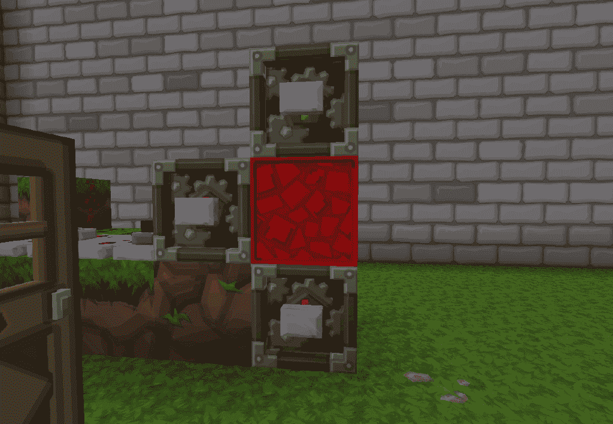
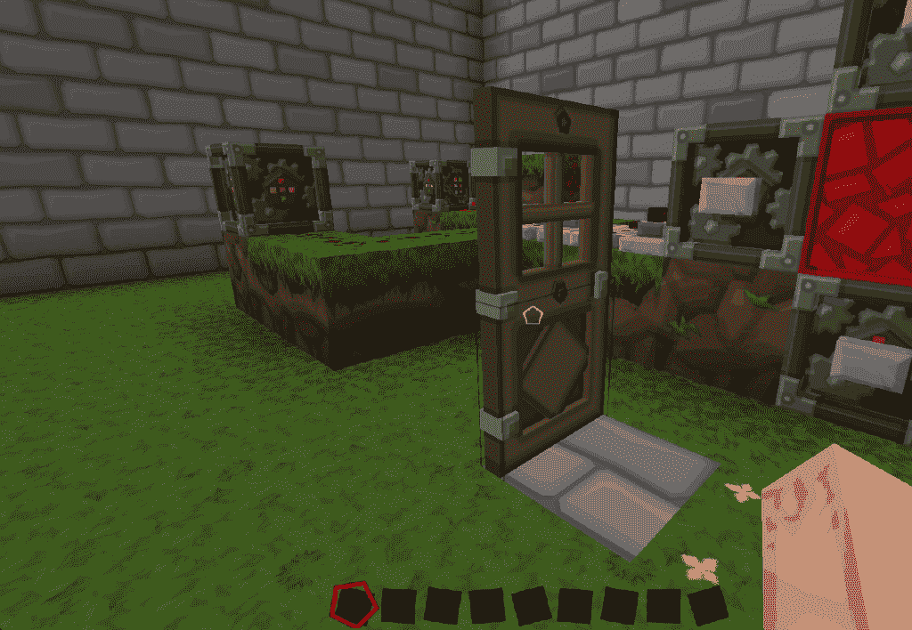
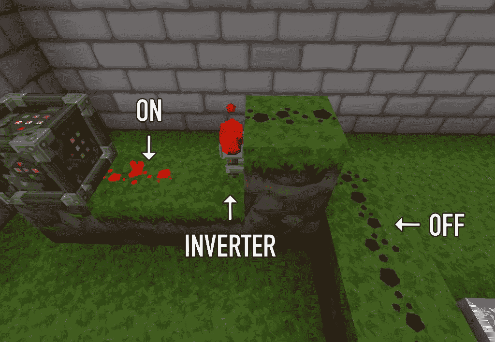
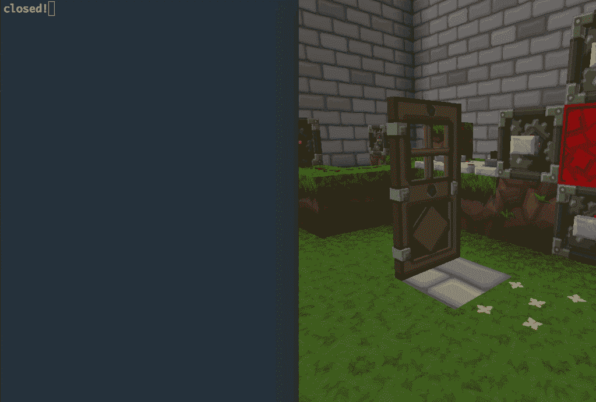

# PHP，Arduino 和…《我的世界》？将《我的世界》和 PHP 结合起来！

> 原文：<https://www.sitepoint.com/php-arduino-and-minecraft-combining-minecraft-with-php/>


*这是 SitePoint 的 IoT 周！整个星期，我们都在发布关于互联网和物理世界的交集的文章，所以请继续查看[物联网标签](https://www.sitepoint.com/blog/)的最新更新。*

我做过的一些最有趣的编程是在《我的世界》进行的。这是一款由 [Mojang](https://mojang.com/) (最近被微软收购)开发的开放世界沙盒游戏。《我的世界》最初是一幅创造性表达的画布，虽然这些天我在上面做了很多不同的事情，但对我来说仍然是这样。

我将带你踏上一段旅程，我们在《我的世界》建造一座大厦，然后用现实世界的报警系统来保护它。有相当多的内容要介绍，虽然我计划这是一个由两部分组成的系列，但我将不得不留下一些无关的细节供您发现！

*你可以在[https://github . com/site point-editors/tutorial-PHP-arduino-and-minecraft](https://github.com/sitepoint-editors/tutorial-php-arduino-and-minecraft)*找到本教程的代码

## 《我的世界》编程速成班

《我的世界》最初是两个简单想法的结合。第一个是玩家可以从他们找到自己的地图中收获资源。其中一些资源，如食物和木材，在地面上很常见。其他的，像黄金和石头，需要一点实际的努力。

这就是“矿”(在《我的世界》)的来源。其中一种资源叫做红石。它存在于地下深处，是一种导体。收获后放在地上，它就像电路板反面的银色线条。还有电源发射器，类似于电池或主电源，在游戏中有多种形式。



使用这些收获的资源，玩家可以建造住所，烹饪食物，甚至连接虚拟电路。这就是“手艺”的来源。

在我的会议“僵尸和二进制”中，我谈到了所有这些，以及基本电路和编程。我最近在 php[tek] 2016 上展示过，但是录音丢失了。下面是一个 JavaScript 主题的版本，来自 FluentConf 2016:[https://youtu.be/APJRBZUxADQ](https://youtu.be/APJRBZUxADQ)。

想象我们已经创建了一个庞大的《我的世界》大厦…



现在，假设我们想要保护所述大厦的前门……我们需要一种方法来检查前门是否已经被打开。为此，我们需要使用 Redstone，一种称为比较器的东西，以及另一种称为命令块的东西:


*你可能注意到了我连接到命令块的开关。开关是一种电源，这种电源将为命令块提供一些电源，以便它可以执行开门检查。我们一会儿就会自动启动这个电源……*

命令块是占位符，可以包含单个服务器命令。服务器命令是玩家可以做的任何事情(前提是你是服务器管理员或者处于单人模式)。它们就像亚马逊的 Dash 按钮一样，只需按下一个按钮，就可以给它们一个运行的命令。

我们将对打开的门进行命令块测试。《我的世界》地图是基于坐标的，这意味着测试需要包括放置门的坐标。为了便于讨论，我们假设门在`191 67 -194`处。测试(打开木门)的命令是:

```
/testforblock 191 67 -194 wooden_door 3 
```

*用 fn+alt+F3(Mac)和 F3(Windows)可以找到你当前的地图坐标。走到要放置门的街区，在命令中输入这些坐标。*

不同的《我的世界》块(无论是人造的还是天然的)都有独特的块名。`wooden_door`是橡木门的独特名称。`3`是对门的方向的引用，所以如果你把你的门放在不同的方向，它在你的地图中可能会不同。如果是这样，尝试`0`到`3`，直到你得到想要的结果。

我们将让第二个命令块悄悄地向我们返回一条消息，表明测试已经找到了一个匹配的块。当我们按下开关时，门还是关着的，我们应该什么也看不见。但是当我们打开门时(并且测试与打开的门的方向相匹配)，我们应该看到这一点的确认！



现在我们有一个方法来检查一个打开的门。我们不想站在这里，手动运行这个检查。让我们建立一个无限循环的编程等价物，或者一个晶体时钟的电子等价物。

为此，我们需要两个命令块，排列如下:


*注意我给每个命令块都附加了一个按钮，这样我就可以运行它们的命令了。这些按钮也充当电源，给它们所连接的模块提供短暂的能量峰值。*

地图坐标也可以相对定义。也就是说，如果你需要引用命令块附近的坐标，你可以使用`~-1 ~ ~+1`来表示命令块的 x 坐标减 1，同样是 y 坐标，它是 z 坐标加 1。

在这种安排中，我们希望顶部命令块在其正下方放置一个红石块:

```
/setblock ~ ~-1 ~ redstone_block 
```

…我们希望底部的命令块在其上方放置一块空气:

```
/setblock ~ ~+1 ~ air 
```

红石块也作为电源。这种安排有一个有趣的副作用。当顶部模块将红石模块置于其下方时，红石模块首先给底部命令模块供电。然后，它向顶部命令块供电。

与此同时，底部命令块已经移除了红石块。由于顶部命令块获得了新的功率信号(来自它放置的红石块),然后该块被底部命令块移除，它再次开始循环。

这导致了我所说的无限循环。这个循环会持续到服务器重启，如果你在创作模式下，你就可以打破红石块，看到新的红石块被立即创建。


*默认情况下，这些命令块动作会被记录并会在服务器上触发消息。你可以用几个命令来禁用它们(每个地图你只需要输入一次):`/gamerule logAdminCommands false`和`/gamerule commandBlockOutput false`。*

如果我们从时钟获取能量，并将其导入测试命令块，测试将在一秒钟内运行多次，并在门打开时立即给出反馈！

较新版本的《我的世界》允许命令块自我供电，甚至自我重复。这样，门检查可以在没有时钟的情况下重复进行。如果你使用的是旧版本的《我的世界》，尤其是在使用 mod 包的时候，你可能仍然需要自己制作时钟……


知道门什么时候关了也很有用，这样我们就可以关闭现实世界的警报。为此，我们可以使用一个反相器(把它想象成把关闭的门(假值)变成真值，就像我们在编程中使用的方法一样:`while (true) if (!$doorOpen) print...`。



## 用 PHP 查看日志文件

如果看不到 PHP 中的这些变化，所有这些都是美丽而无用的。我们需要一种方法来“听到”门何时被打开，并在 PHP 中做出反应。

还好，悄悄话都有记录。如果我们能弄清楚如何观察和解释日志文件，我们应该有我们需要的所有信息…

一个快速的 Packagist 搜索提供了一个[文件监视器库](https://github.com/yosymfony/Resource-watcher),看起来好像是由任务决定的。我们可以安装它:

```
composer require yosymfony/resource-watcher 
```

完成后，让我们创建一个脚本来查看日志文件。我们首先创建一个 [Symfony Finder](https://github.com/symfony/Finder) 实例，并将其指向存储《我的世界》日志的目录:

```
require __DIR__ . "/vendor/autoload.php";

use Symfony\Component\Finder\Finder;

$path = "/path/to/Application Support/minecraft/logs";

$finder = new Finder();

$finder->files()
    ->name("*.log")
    ->depth(0)
    ->in($path); 
```

*到`Application Support`的路径对您来说会有所不同——它通常在与您的帐户相关联的`Library`文件夹中。你也可以使用便携版的《我的世界》，所以你只需要四处搜索一下，直到找到`logs`文件夹。*

这个 Finder 实例将文件监视列表缩小到与我们指定的目录相同的目录中的`*.log`文件。这些方法都有明确的名称，因此您可以为其他应用程序扩展标准。

接下来，我们需要定义一个缓存文件和一个观察器实例:

```
use Yosymfony\ResourceWatcher\ResourceCacheFile;
use Yosymfony\ResourceWatcher\ResourceWatcher;

$cache = new ResourceCacheFile(__DIR__ . "/cache.php");

$watcher = new ResourceWatcher($cache);
$watcher->setFinder($finder);

while(true) {
    sleep(1);

    $watcher->findChanges();

    // ...respond to changes
} 
```

这个脚本充当一个长期运行的过程。也就是说，我们希望在不确定的时间内监视文件的更改。因此，我们创建了一个无限循环，并使用它不断探测文件的变化。

你可以睡或多或少的时间。我发现 1 秒钟对我来说已经足够了…

watcher 库提供了三种文件更改方法:创建、删除和更新。我们只关心更新:

```
while(true) {
    sleep(1);

    $watcher->findChanges();

    // ...respond to changes
    $changes = $watcher->getUpdatedResources();

    if (count($changes) > 0) {
        $first = $changes[0];

        $lines = file($first);

        for ($i = count($lines) - 1; $i > -1; $i--) {
            if (stristr($lines[$i], "CHAT")) {
                if (stristr($lines[$i], "closed")) {
                    print "closed!";
                }

                if (stristr($lines[$i], "open")) {
                    print "open!";
                }

                break;
            }
        }
    }
} 
```

新的聊天消息被附加到日志文件的底部，因此我们需要检查是否有任何日志文件被修改(我们期望只有一个日志文件)，将日志文件分成几行，并从文件的底部到顶部检查每一行。

如果我们看到包含`CHAT`的日志行，我们可以假设它是一条聊天消息。如果它还包含`open`或`closed`，我们可以假设它是由我们创建的电路引起的。


*欢迎使用更多“独特”的消息格式进行打开/关闭事件。我选择的方法很简单，但是容易被滥用和产生歧义(就像其他人小声对我说“打开”)。尽管基本原理是相同的。*

这只是实验的一半。在接下来的文章中，我们将看看如何构建一个基于 Arduino 的警报电路，并将其连接到这个脚本。最终的结果将是我们《我的世界》大厦的自动化、真实世界的警报。

如果你喜欢这个和/或有问题，请在评论中告诉我们！

## 分享这篇文章